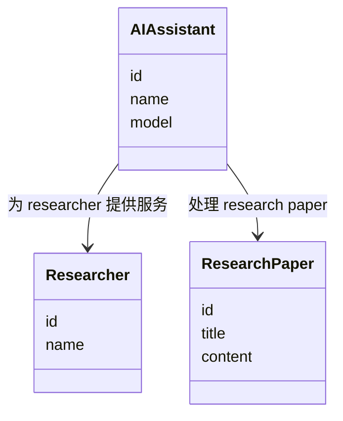
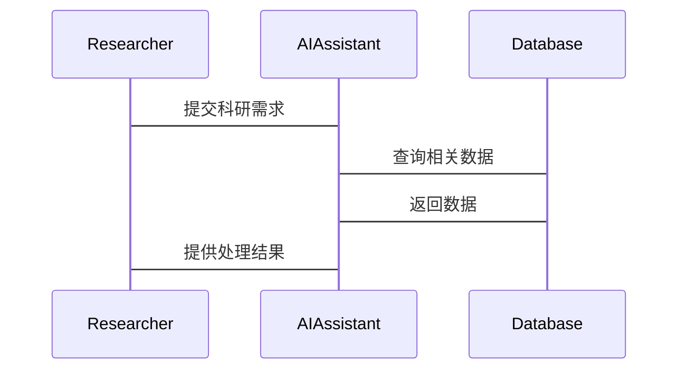

                 


# 研发助手 AI Agent：LLM 在科研过程中的辅助作用

> **关键词**：AI Agent, 大语言模型, 科研过程, 辅助工具, LLM 应用, 技术分析, 系统设计

> **摘要**：  
> 随着人工智能技术的迅速发展，AI Agent 作为大语言模型（LLM）在科研领域的应用日益广泛。本文深入分析了 AI Agent 在科研过程中的辅助作用，从背景介绍、核心概念、算法原理到系统架构设计、项目实战，全面探讨了其在文献检索、数据分析、论文写作等环节中的具体应用。通过详细的技术分析和系统设计，本文揭示了 AI Agent 如何利用自然语言处理和深度学习技术，帮助科研人员提高研发效率和成果质量。同时，本文还结合实际案例，展示了 AI Agent 在科研中的实际应用场景，并提出了最佳实践建议。

---

# 第一部分: 研发助手 AI Agent 的背景与概念

## 第1章: 研发助手 AI Agent 的背景介绍

### 1.1 问题背景与描述

#### 1.1.1 科研过程中的挑战与痛点
科研过程复杂且耗时，涉及文献检索、数据分析、论文写作等多个环节。科研人员需要在大量文献中寻找相关信息，处理复杂的数据集，并撰写高质量的论文。这些任务不仅耗时，还要求科研人员具备较高的专业素养和技能。

#### 1.1.2 大语言模型（LLM）的出现与作用
大语言模型（LLM）的出现为科研过程带来了新的可能性。LLM 能够通过自然语言处理技术理解上下文，并生成与任务相关的文本内容。例如，LLM 可以帮助科研人员快速检索相关文献，分析数据，并生成论文初稿。

#### 1.1.3 AI Agent 在科研中的定位与目标
AI Agent 在科研中的定位是作为科研人员的辅助工具，其目标是通过自动化处理和智能推荐，提高科研效率和质量。AI Agent 的核心目标是通过理解科研需求，提供个性化的支持，帮助科研人员专注于核心任务。

---

### 1.2 问题解决与边界

#### 1.2.1 AI Agent 如何辅助科研过程
AI Agent 可以通过以下方式辅助科研过程：
- **文献检索**：帮助科研人员快速找到相关领域的文献和研究成果。
- **数据分析**：辅助处理实验数据，生成数据分析报告。
- **论文写作**：根据科研内容自动生成论文初稿，并提供建议。

#### 1.2.2 核心概念的边界与外延
AI Agent 的能力受到模型训练数据和算法的限制。其外延包括与科研相关的工具链和平台，例如数据分析工具和文献管理软件。

#### 1.2.3 核心概念结构与组成要素
AI Agent 的核心结构包括：
- **自然语言处理引擎**：用于理解和生成文本。
- **知识库**：存储科研相关的知识和数据。
- **交互界面**：用户与 AI Agent 之间的接口。

---

# 第二部分: AI Agent 的核心概念与联系

## 第2章: AI Agent 的核心概念与联系

### 2.1 核心概念原理

#### 2.1.1 大语言模型（LLM）的工作原理
大语言模型通过预训练和微调两种方式进行训练：
- **预训练**：模型在大规模通用数据集上进行无监督学习，学习语言的规律和上下文关系。
- **微调**：在特定任务数据集上进行有监督学习，优化模型在特定任务上的表现。

#### 2.1.2 AI Agent 的任务处理流程
AI Agent 的任务处理流程包括：
1. **需求分析**：理解用户的科研需求。
2. **数据获取**：从知识库或网络获取相关信息。
3. **任务执行**：根据需求执行特定任务。
4. **结果生成**：生成满足需求的输出。

#### 2.1.3 人机交互的实现机制
AI Agent 通过自然语言理解和生成技术实现与用户的交互。用户通过文本或语音输入需求，AI Agent 解释需求并生成相应的输出。

---

### 2.2 核心概念属性对比

#### 2.2.1 LLM 与传统 AI 的对比分析
| 特性         | LLM                         | 传统 AI                  |
|--------------|------------------------------|--------------------------|
| 数据需求     | 需要大量标注数据             | 需要少量标注数据         |
| 任务通用性   | 能够处理多种任务             | 通常针对特定任务         |
| 模型复杂度   | 模型复杂，参数众多           | 模型相对简单             |

#### 2.2.2 AI Agent 与其他工具的对比
| 工具类型      | AI Agent                    | 文献管理软件             |
|---------------|------------------------------|--------------------------|
| 功能          | 多任务辅助，包括文献检索和数据分析 | 专注于文献管理和存储    |
| 灵活性        | 高度灵活，可定制            | 较低，功能固定            |

#### 2.2.3 核心概念的 ER 实体关系图

```mermaid
erd
    entity Researcher {
        id: int
        name: string
    }
    entity ResearchPaper {
        id: int
        title: string
        content: string
    }
    entity AIAssistant {
        id: int
        name: string
    }
    Researcher -[1..n]-> ResearchPaper
    AIAssistant -[1..n]-> ResearchPaper
```

---

# 第三部分: AI Agent 的算法原理

## 第3章: 算法原理与数学模型

### 3.1 算法原理

#### 3.1.1 大语言模型的训练过程
- **预训练**：使用大规模数据集（如 Wikipedia、书籍）进行无监督学习。
- **微调**：在特定领域数据上进行有监督学习，优化模型在特定任务上的表现。

#### 3.1.2 生成式模型的数学模型
生成式模型的输出概率分布可以表示为：

$$ P(y|x) = \text{softmax}(f(x; \theta)) $$

其中，$f(x; \theta)$ 是模型的输出，$\theta$ 是模型参数。

---

### 3.2 转换器架构

#### 3.2.1 自注意力机制
自注意力机制的计算公式为：

$$ \text{Attention}(Q, K, V) = \text{softmax}\left(\frac{QK^T}{\sqrt{d_k}}\right)V $$

其中，$Q$ 是查询向量，$K$ 是键向量，$V$ 是值向量。

#### 3.2.2 前馈网络
前馈网络的计算公式为：

$$ f(x) = \text{ReLU}(Wx + b) $$

---

# 第四部分: AI Agent 的系统分析与架构设计

## 第4章: 系统分析与架构设计

### 4.1 问题场景介绍

#### 4.1.1 研发场景
- **文献检索**：帮助科研人员快速找到相关文献。
- **数据分析**：辅助处理实验数据并生成报告。
- **论文写作**：自动生成论文初稿并提供建议。

---

### 4.2 系统功能设计

#### 4.2.1 系统功能模块


---

### 4.3 系统架构设计

#### 4.3.1 系统架构图
```mermaid
graph TD
    A[AI Assistant] --> B[Researcher]: 提供辅助
    B --> C[ResearchPaper]: 检索文献
    C --> D[Database]: 查询数据
    D --> A: 返回结果
```

---

### 4.4 系统接口设计

#### 4.4.1 系统接口
- **输入接口**：接收用户的科研需求。
- **输出接口**：返回处理结果或建议。

---

### 4.5 系统交互流程

#### 4.5.1 系统交互序列图


---

# 第五部分: 项目实战

## 第5章: 项目实战与实现

### 5.1 项目介绍

#### 5.1.1 项目背景
本项目旨在开发一个基于 LLM 的 AI Agent，用于辅助科研人员完成文献检索和数据分析。

---

### 5.2 环境搭建

#### 5.2.1 环境要求
- Python 3.8+
- PyTorch 或 TensorFlow
- Hugging Face Transformers 库

---

### 5.3 核心代码实现

#### 5.3.1 AI Agent 核心代码
```python
from transformers import pipeline

# 初始化 AI Agent
ai_agent = pipeline(
    "text-generation",
    model="gpt2",
    tokenizer="gpt2"
)

# 文献检索功能
def search Literature(query):
    return ai_agent(query, max_length=500, num_return_sequences=1)
```

---

### 5.4 代码解读与分析

#### 5.4.1 代码功能解读
- **文献检索**：通过输入查询关键词，AI Agent 生成相关文献的摘要。
- **数据分析**：AI Agent 根据输入的数据生成分析报告。
- **论文写作**：AI Agent 根据科研内容生成论文初稿。

---

### 5.5 实际案例分析

#### 5.5.1 案例分析
- **案例 1**：AI Agent 帮助科研人员快速检索相关文献，生成文献综述。
- **案例 2**：AI Agent 分析实验数据，生成数据分析报告。

---

## 第6章: 最佳实践与小结

### 6.1 最佳实践

#### 6.1.1 数据隐私保护
- 确保数据的隐私和安全，避免敏感信息泄露。

#### 6.1.2 模型选择与优化
- 根据具体任务选择合适的模型，并进行微调优化。

#### 6.1.3 持续学习与迭代
- 定期更新模型，使其适应新的科研需求。

---

### 6.2 小结

AI Agent 作为大语言模型在科研过程中的辅助工具，具有广阔的应用前景。通过本文的分析和实践，我们看到了 AI Agent 在文献检索、数据分析和论文写作中的巨大潜力。未来，随着技术的不断进步，AI Agent 将在科研领域发挥更大的作用。

---

### 6.3 注意事项

- **模型局限性**：AI Agent 的输出可能存在误差，需结合人工验证。
- **数据质量**：高质量的数据是 AI Agent 高效工作的基础。
- **伦理问题**：需注意数据的合法使用和模型的伦理问题。

---

### 6.4 拓展阅读

- 推荐阅读《大语言模型的原理与应用》。
- 参考 Hugging Face 的官方文档，了解更多关于 LLM 的使用方法。

---

# 结语

AI Agent 的出现为科研过程带来了新的可能性。通过本文的系统分析和项目实战，我们看到了 AI Agent 在科研中的巨大潜力。未来，随着技术的不断进步，AI Agent 将成为科研人员不可或缺的得力助手。

