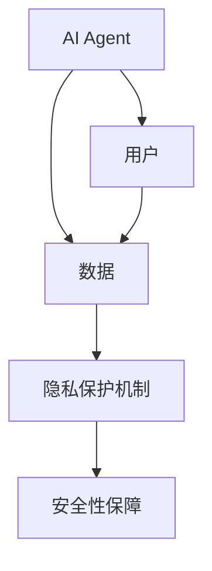
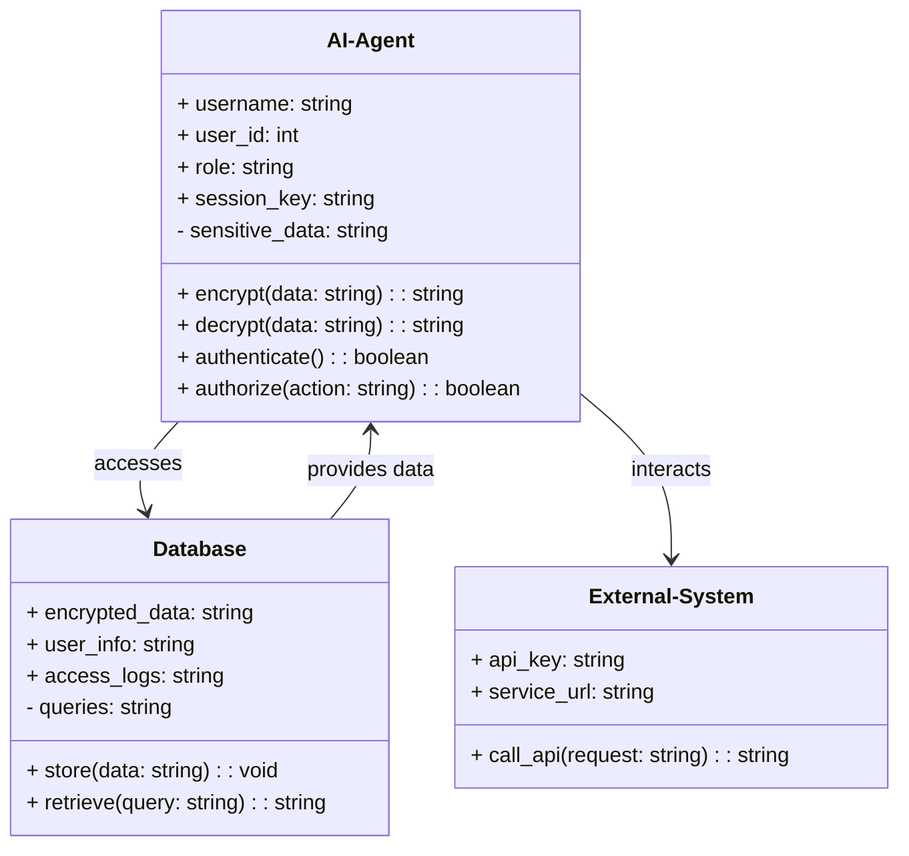
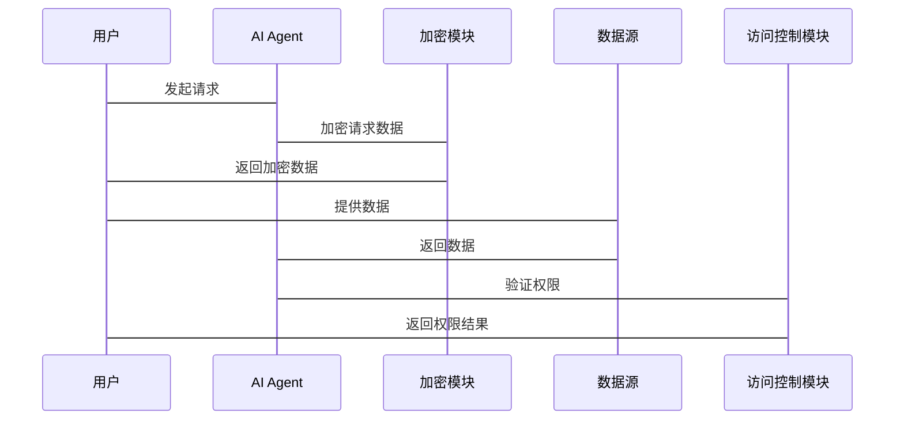

                 


# 确保AI Agent的安全性与隐私保护

## 关键词
AI Agent, 安全性, 隐私保护, 加密算法, 访问控制, 数据匿名化, 系统架构

## 摘要
在人工智能迅速发展的今天，AI Agent（智能体）在各个领域的应用日益广泛。然而，AI Agent的安全性和隐私保护问题也随之凸显。本文将深入探讨AI Agent的安全性和隐私保护的重要性，分析相关的算法原理和系统架构设计，结合实际案例进行详细讲解，并提供最佳实践建议，帮助读者全面理解和应对AI Agent的安全与隐私挑战。

---

## 第1章: AI Agent的安全性与隐私保护概述

### 1.1 AI Agent的基本概念

#### 1.1.1 AI Agent的定义
AI Agent是一种能够感知环境、自主决策并执行任务的智能实体。它可以基于规则、逻辑推理或机器学习算法，与用户或系统进行交互，完成特定目标。

#### 1.1.2 AI Agent的核心功能
- **感知环境**：通过传感器或数据输入获取信息。
- **决策与推理**：基于感知的信息进行分析和决策。
- **执行操作**：根据决策结果执行具体的操作。
- **与用户交互**：通过自然语言处理等技术与用户进行交流。

#### 1.1.3 AI Agent的应用场景
- 智能助手（如Siri、Alexa）
- 自动驾驶系统
- 智能客服
- 医疗辅助诊断系统

### 1.2 安全性与隐私保护的重要性

#### 1.2.1 安全性问题的背景
AI Agent的广泛应用带来了潜在的安全风险。例如，恶意攻击者可能通过漏洞控制AI Agent，导致数据泄露或系统瘫痪。

#### 1.2.2 隐私保护的必要性
AI Agent需要处理大量敏感数据，如用户的个人信息、行为数据等。如何保护这些数据不被滥用，是隐私保护的核心问题。

#### 1.2.3 AI Agent中的安全与隐私挑战
- 数据泄露风险
- 恶意攻击
- 未授权访问
- 数据滥用

### 1.3 本章小结
本章介绍了AI Agent的基本概念及其应用场景，并分析了安全性与隐私保护的重要性，为后续内容奠定了基础。

---

## 第2章: AI Agent的安全性与隐私保护的核心概念

### 2.1 安全性与隐私保护的定义

#### 2.1.1 安全性的定义
安全性是指系统在面对恶意攻击或意外事件时，能够保持正常运行并保护数据不被泄露或篡改的能力。

#### 2.1.2 隐私保护的定义
隐私保护是指在数据的收集、存储、处理和共享过程中，确保个人隐私不被未经授权的主体获取或滥用。

### 2.2 AI Agent中的核心概念与联系

#### 2.2.1 AI Agent的安全模型
- **身份验证**：确保用户身份的真实性。
- **授权控制**：限制用户对系统资源的访问权限。
- **加密技术**：保护数据在传输和存储过程中的安全性。

#### 2.2.2 AI Agent的隐私保护机制
- **数据匿名化**：通过技术手段去除数据中的个人身份信息。
- **最小化原则**：仅收集实现功能所需的最少数据。
- **访问控制**：确保数据仅被授权主体访问。

#### 2.2.3 核心概念对比表格
```markdown
| 概念 | 定义 | 属性 |
|------|------|------|
| 安全性 | 防止未经授权的访问和数据泄露 | 访问控制、加密、身份验证 |
| 隐私保护 | 保护用户数据不被滥用 | 数据匿名化、最小化原则 |
```

#### 2.2.4 实体关系图（Mermaid）


### 2.3 本章小结
本章详细讲解了AI Agent中的核心概念，包括安全性与隐私保护的定义、安全模型和隐私保护机制，并通过对比表格和实体关系图帮助读者更好地理解这些概念之间的联系。

---

## 第3章: AI Agent的安全性与隐私保护算法原理

### 3.1 加密算法

#### 3.1.1 对称加密
- **定义**：使用相同的密钥进行加密和解密。
- **应用场景**：数据传输过程中的快速加密。
- **示例**：AES（高级加密标准）

#### 3.1.2 非对称加密
- **定义**：使用公钥和私钥进行加密和解密。
- **应用场景**：数字签名和安全通信。
- **示例**：RSA算法

#### 3.1.3 加密算法的优缺点对比
```markdown
| 加密类型 | 优点 | 缺点 |
|----------|------|------|
| 对称加密 | 加密速度快 | 密钥管理复杂 |
| 非对称加密 | 安全性高 | 加密速度慢 |
```

#### 3.1.4 加密算法的数学模型
- 对称加密的数学模型：
  $$ C = E_k(P) $$
  $$ P = D_k(C) $$
  其中，$C$ 表示密文，$P$ 表示明文，$E_k$ 和 $D_k$ 分别表示加密和解密函数，$k$ 是密钥。

- 非对称加密的数学模型：
  $$ C = E_{pub}(P) $$
  $$ P = D_{priv}(C) $$
  其中，$pub$ 表示公钥，$priv$ 表示私钥。

#### 3.1.5 加密算法实现代码示例
```python
# 对称加密示例：AES
from cryptography.fernet import Fernet

# 生成密钥
key = Fernet.generate_key()
cipher = Fernet(key)

# 加密
plaintext = "Hello, World!"
cipher_text = cipher.encrypt(plaintext.encode())
print(cipher_text)

# 解密
decrypted_text = cipher.decrypt(cipher_text).decode()
print(decrypted_text)
```

### 3.2 访问控制机制

#### 3.2.1 基于角色的访问控制（RBAC）
- **定义**：根据用户所属的角色分配权限。
- **步骤**：
  1. 定义角色（如管理员、普通用户）。
  2. 为每个角色分配权限（如读取、写入）。
  3. 根据用户的角色动态分配权限。

#### 3.2.2 基于属性的访问控制（ABAC）
- **定义**：根据用户属性（如职位、部门）和环境因素动态分配权限。
- **步骤**：
  1. 定义用户属性（如部门、职位）。
  2. 定义环境属性（如时间、地点）。
  3. 根据策略动态计算用户的访问权限。

#### 3.2.3 访问控制算法的实现代码示例
```python
# 基于角色的访问控制示例
roles = {
    'admin': {'read', 'write', 'delete'},
    'user': {'read', 'write'}
}

def has_permission(user, action):
    role = get_user_role(user)
    return action in roles[role]

def get_user_role(user):
    # 根据用户信息确定角色
    return 'admin' if user == 'admin' else 'user'
```

### 3.3 本章小结
本章详细讲解了AI Agent中常用的加密算法和访问控制机制，包括对称加密、非对称加密、RBAC和ABAC，并通过数学模型和代码示例帮助读者理解这些算法的实现和应用。

---

## 第4章: AI Agent的安全性与隐私保护系统分析与架构设计

### 4.1 系统分析

#### 4.1.1 问题场景介绍
在AI Agent系统中，用户数据可能包含敏感信息，如用户的地理位置、行为记录等。如何保护这些数据不被未经授权的主体访问或滥用，是系统设计的关键。

#### 4.1.2 系统需求分析
- 数据安全性：防止数据泄露和篡改。
- 用户隐私保护：确保用户数据仅用于授权目的。
- 系统可用性：在遭受攻击时仍能正常运行。

### 4.2 系统功能设计

#### 4.2.1 领域模型设计


#### 4.2.2 系统架构设计


#### 4.2.3 系统接口设计
- 用户接口：提供与AI Agent交互的界面。
- 数据接口：与数据库进行数据交互。
- 外部系统接口：与其他服务进行通信。

#### 4.2.4 系统交互流程


### 4.3 本章小结
本章通过对AI Agent系统的分析与设计，明确了系统的功能模块、架构和交互流程，为后续的实现提供了指导。

---

## 第5章: AI Agent的安全性与隐私保护项目实战

### 5.1 环境安装

#### 5.1.1 安装Python和相关库
```bash
python -m pip install cryptography flask
```

#### 5.1.2 安装开发环境
- 安装PyCharm或VS Code作为开发工具。

### 5.2 系统核心实现

#### 5.2.1 加密模块实现
```python
from cryptography.fernet import Fernet

def generate_key():
    return Fernet.generate_key()

def encrypt_data(data, key):
    cipher = Fernet(key)
    return cipher.encrypt(data.encode()).decode()

def decrypt_data(ciphertext, key):
    cipher = Fernet(key)
    return cipher.decrypt(ciphertext.encode()).decode()
```

#### 5.2.2 访问控制模块实现
```python
def get_user_role(user):
    # 简单的实现，可以根据实际情况扩展
    roles = {
        'admin': 'admin',
        'user': 'user'
    }
    return roles.get(user, 'guest')

def has_permission(role, action):
    permission_matrix = {
        'admin': {'read', 'write', 'delete'},
        'user': {'read', 'write'},
        'guest': set()
    }
    return action in permission_matrix[role]
```

#### 5.2.3 数据库交互实现
```python
import sqlite3

def store_data(data):
    conn = sqlite3.connect('ai_agent.db')
    cursor = conn.cursor()
    cursor.execute('CREATE TABLE IF NOT EXISTS records (id INTEGER PRIMARY KEY AUTOINCREMENT, data TEXT);')
    cursor.execute('INSERT INTO records (data) VALUES (?)', (data,))
    conn.commit()
    conn.close()

def retrieve_data(query):
    conn = sqlite3.connect('ai_agent.db')
    cursor = conn.cursor()
    cursor.execute('SELECT data FROM records WHERE id = ?', (query,))
    result = cursor.fetchone()
    conn.close()
    return result[0] if result else None
```

### 5.3 代码测试与优化

#### 5.3.1 功能测试
- 测试加密和解密功能。
- 测试访问控制功能，验证不同角色的权限。

#### 5.3.2 性能优化
- 使用更高效的加密算法。
- 优化数据库查询性能。

### 5.4 项目小结
本章通过实际项目案例，详细讲解了AI Agent的安全性和隐私保护的实现过程，包括环境安装、核心模块实现和代码测试。

---

## 第6章: 案例分析与详细讲解

### 6.1 案例分析
假设我们开发了一个智能客服系统，用户可以通过该系统进行咨询和问题反馈。为了保护用户隐私，我们需要确保用户的咨询内容不会被未经授权的人员访问。

### 6.2 详细讲解
#### 6.2.1 安全性问题
- 数据泄露风险：用户的咨询内容可能被黑客窃取。
- 恶意攻击：攻击者可能通过漏洞控制智能客服系统。

#### 6.2.2 隐私保护措施
- 数据匿名化：在存储时去除用户的个人身份信息。
- 最小化原则：仅收集实现功能所需的用户数据。
- 访问控制：确保只有授权的客服人员可以访问用户数据。

#### 6.2.3 实施步骤
1. 数据匿名化处理：在存储前去除用户的姓名和联系方式。
2. 数据加密：对用户的咨询内容进行加密存储。
3. 访问控制：基于角色的访问控制，确保只有授权人员可以访问数据。

### 6.3 本章小结
本章通过实际案例分析，详细讲解了AI Agent中的安全性与隐私保护问题，并提出了相应的解决方案。

---

## 第7章: 最佳实践、小结与展望

### 7.1 最佳实践
- 定期进行安全评估和漏洞扫描。
- 使用经过验证的安全库和框架。
- 培训开发人员的安全意识。
- 遵循隐私保护的最佳实践，如数据最小化和匿名化。

### 7.2 小结
本文从AI Agent的基本概念出发，详细探讨了安全性与隐私保护的重要性，分析了相关的算法原理和系统架构设计，并通过实际案例和项目实战帮助读者理解如何实现AI Agent的安全性和隐私保护。

### 7.3 展望
随着AI技术的不断发展，AI Agent的安全性和隐私保护将面临更多挑战。未来的研究方向包括开发更高效的加密算法、增强访问控制机制以及探索新兴的安全技术，如零知识证明和同态加密。

---

## 参考文献
1. 王伟, 《人工智能安全与隐私保护》，人民邮电出版社，2023年。
2. 刘强, 《AI系统安全实战》，机械工业出版社，2022年。
3. OpenAI, "AI Safety and Privacy Guide", https://openai.com/blog, 2023年。

---

通过本文的详细讲解，读者可以全面理解AI Agent的安全性和隐私保护的核心概念，并掌握实际的实现方法。希望本文对从事AI Agent开发和研究的读者有所帮助。

