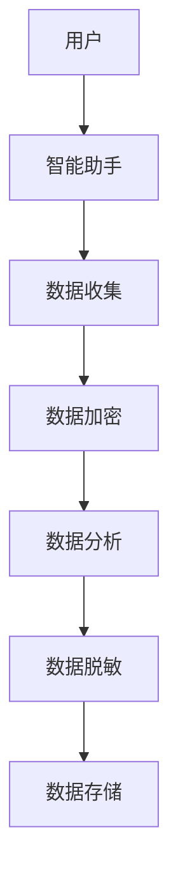
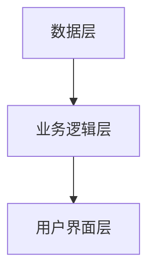
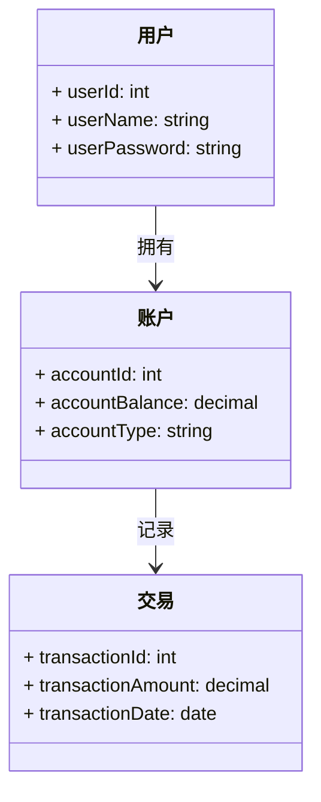
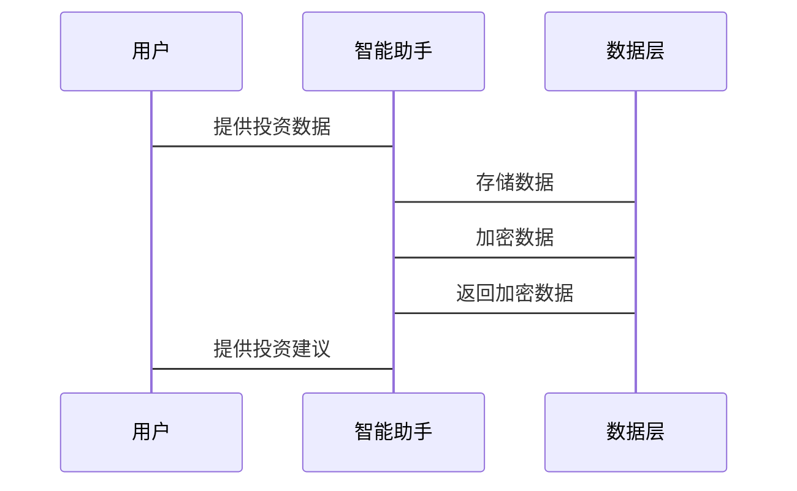

                 


```markdown
# 确保投资理财智能助手的数据安全与隐私保护

## 关键词：数据安全、隐私保护、投资理财、智能助手、加密技术、脱敏处理、系统架构

## 摘要：
在数字化时代，投资理财智能助手的应用越来越广泛，但随之而来的是数据安全和隐私保护的挑战。本文深入分析了投资理财数据的敏感性和保护需求，探讨了数据安全与隐私保护的核心概念，详细讲解了加密算法和脱敏技术的原理与实现。通过系统架构设计和项目实战，本文展示了如何在实际应用中确保数据安全与隐私保护。最后，本文总结了最佳实践和注意事项，为投资理财智能助手的开发和应用提供了全面的指导。

---

# 第1章: 数据安全与隐私保护的背景

## 1.1 数据安全与隐私保护的重要性

### 1.1.1 数据安全的背景与现状
随着数字化转型的推进，数据成为企业和社会的核心资产。在投资理财领域，用户的财务信息、交易记录、资产配置等数据具有高度敏感性。数据泄露可能导致严重的经济损失和声誉损害。近年来，数据安全事件频发，强调数据安全的重要性愈发凸显。

### 1.1.2 投资理财领域中的隐私保护需求
投资理财智能助手通常需要处理用户的个人信息、账户余额、交易记录等敏感数据。这些数据的泄露可能导致用户的财产损失和身份盗窃。因此，保护这些数据的隐私和安全是投资理财助手设计的首要任务。

### 1.1.3 智能助手在投资理财中的作用与挑战
智能助手通过分析用户的投资数据，提供个性化的理财建议和风险管理工具。然而，这些功能的实现依赖于对用户数据的处理和分析，这也带来了数据安全和隐私保护的挑战。

## 1.2 投资理财智能助手的特点与功能

### 1.2.1 投资理财智能助手的核心功能
- 数据收集与分析：从用户那里收集投资数据，并进行分析，提供个性化的投资建议。
- 风险管理：帮助用户识别和管理投资风险。
- 交易执行：根据用户的指令执行交易操作。

### 1.2.2 数据处理的特殊性与敏感性
- 用户数据的敏感性：包括个人信息、账户余额、交易记录等。
- 数据的实时性：需要实时处理和分析数据，以提供及时的投资建议。

### 1.2.3 用户隐私保护的边界与外延
- 隐私保护的边界：在数据处理过程中，必须明确数据使用和共享的边界。
- 隐私保护的外延：隐私保护不仅涉及数据本身，还包括数据的传输、存储和销毁等全生命周期。

## 1.3 数据安全与隐私保护的核心要素

### 1.3.1 数据分类与分级管理
数据分类与分级管理是数据安全的基础。根据数据的重要性和敏感程度，将其分为不同级别，并采取相应的安全措施。

### 1.3.2 数据访问控制策略
通过权限管理，确保只有授权的人员才能访问敏感数据。采用基于角色的访问控制（RBAC）模型，确保数据访问的最小化原则。

### 1.3.3 数据加密与脱敏技术
数据加密技术可以保护数据在传输和存储过程中的安全性。数据脱敏技术可以在不影响数据使用的情况下，隐藏敏感信息，确保数据的安全性。

---

# 第2章: 核心概念与联系

## 2.1 数据安全与隐私保护的核心概念

### 2.1.1 数据安全的定义与属性
数据安全是指保护数据的机密性、完整性和可用性。机密性确保只有授权人员可以访问数据；完整性确保数据在存储和传输过程中不被篡改；可用性确保数据在需要时可以被访问。

### 2.1.2 隐私保护的定义与原则
隐私保护是指在处理个人数据时，确保个人的隐私不被侵犯。隐私保护的原则包括目的限制、数据最小化、透明性等。

### 2.1.3 投资理财数据的敏感性分析
投资理财数据的敏感性分析需要考虑数据的类型、使用场景、潜在风险等因素。例如，账户余额、交易记录等数据属于高度敏感的数据。

## 2.2 核心概念的原理与联系

### 2.2.1 数据安全与隐私保护的关系
数据安全是隐私保护的基础，而隐私保护是数据安全的目标。数据安全通过技术手段保护数据，隐私保护则通过法律和伦理手段确保数据的使用符合隐私原则。

### 2.2.2 投资理财数据的生命周期管理
数据的生命周期包括数据的产生、收集、存储、处理、共享和销毁。在每个阶段，都需要采取相应的安全措施，确保数据的安全和隐私。

### 2.2.3 数据安全与隐私保护的协同机制
数据安全与隐私保护需要协同工作，通过技术手段和管理措施，确保数据的机密性、完整性和可用性，同时保护用户的隐私。

## 2.3 核心概念的ER实体关系图

```mermaid
erDiagram
    user {
        +userId: int
        +userName: string
        +userPassword: string
    }
    account {
        +accountId: int
        +accountBalance: decimal
        +accountType: string
    }
    transaction {
        +transactionId: int
        +transactionAmount: decimal
        +transactionDate: date
    }
    user --> account : owns
    account --> transaction : records
```

## 2.4 核心概念的流程图



---

# 第3章: 加密算法与脱敏技术

## 3.1 数据加密算法的原理与实现

### 3.1.1 AES加密算法
AES（高级加密标准）是一种广泛使用的加密算法，具有高安全性和高效性。其原理是将明文分成块，然后通过一系列的加密操作生成密文。

### 3.1.2 RSA加密算法
RSA是一种公钥加密算法，基于大整数的因式分解问题。其原理是将公钥和私钥分别用于加密和解密。

### 3.1.3 加密算法的数学模型
$$ AES加密函数：E_k(x) = x \oplus k $$
$$ AES解密函数：D_k(y) = y \oplus k $$

### 3.1.4 加密算法的Python实现示例
```python
import hashlib

def aes_encrypt(data, key):
    cipher = hashlib.new('aes', key)
    return cipher.encrypt(data)

def aes_decrypt(ciphertext, key):
    cipher = hashlib.new('aes', key)
    return cipher.decrypt(ciphertext)
```

## 3.2 数据脱敏技术的原理与实现

### 3.2.1 数据脱敏技术的定义与应用
数据脱敏技术是指在不改变数据使用目的的前提下，对敏感数据进行变形处理，使其失去可识别性。

### 3.2.2 常见的脱敏方法
- 替换法：将敏感数据替换为其他值。
- 随机化法：通过随机化处理，使数据失去原有意义。
- 通用哈希函数：使用哈希函数对数据进行脱敏处理。

### 3.2.3 脱敏技术的数学模型
$$ 脱敏函数：f(x) = x \oplus k $$

### 3.2.4 脱敏技术的Python实现示例
```python
def data_masking(data, key):
    masked_data = data ^ key
    return masked_data
```

---

# 第4章: 投资理财智能助手的系统分析与架构设计

## 4.1 系统分析

### 4.1.1 系统功能设计
- 数据收集与处理
- 数据存储与管理
- 数据分析与处理
- 数据共享与访问控制

### 4.1.2 系统架构设计
采用分层架构，包括数据层、业务逻辑层和用户界面层。数据层负责数据的存储和管理；业务逻辑层负责数据的处理和分析；用户界面层负责与用户的交互。

### 4.1.3 系统架构图


## 4.2 系统设计

### 4.2.1 领域模型设计


### 4.2.2 接口设计
- 数据接口：负责数据的输入和输出。
- 业务接口：负责业务逻辑的实现。
- 用户接口：负责与用户的交互。

### 4.2.3 交互流程设计


---

# 第5章: 项目实战

## 5.1 环境安装与配置

### 5.1.1 安装Python环境
```bash
python --version
pip install --upgrade pip
```

### 5.1.2 安装必要的库
```bash
pip install hashlib
pip install aes-cipher
```

## 5.2 核心代码实现

### 5.2.1 数据加密与脱敏代码
```python
import hashlib
from aes_cipher import AESCipher

def aes_encrypt(data, key):
    cipher = AESCipher(key)
    return cipher.encrypt(data)

def aes_decrypt(ciphertext, key):
    cipher = AESCipher(key)
    return cipher.decrypt(ciphertext)

def data_masking(data, key):
    masked_data = data ^ key
    return masked_data
```

### 5.2.2 系统交互代码
```python
def main():
    data = input("请输入数据：")
    key = input("请输入密钥：")
    encrypted_data = aes_encrypt(data, key)
    masked_data = data_masking(data, key)
    print("加密数据：", encrypted_data)
    print("脱敏数据：", masked_data)

if __name__ == "__main__":
    main()
```

## 5.3 案例分析与实现解读

### 5.3.1 案例分析
假设我们有一个投资理财智能助手，需要对用户的投资数据进行加密和脱敏处理。用户的投资数据包括账户余额、交易记录等敏感信息。

### 5.3.2 代码实现解读
通过上述代码，我们可以实现数据的加密和脱敏处理。加密数据确保数据在传输过程中的安全性，脱敏数据确保数据在存储过程中的隐私性。

## 5.4 项目小结

### 5.4.1 项目总结
通过本项目，我们实现了投资理财智能助手的数据加密和脱敏功能，确保了数据的安全性和隐私性。

### 5.4.2 项目收获
通过本项目，我们深入理解了数据安全和隐私保护的核心概念和技术，掌握了加密和脱敏技术的实现方法。

---

# 第6章: 最佳实践与注意事项

## 6.1 小结

### 6.1.1 数据安全与隐私保护的核心要点
- 数据分类与分级管理
- 数据访问控制策略
- 数据加密与脱敏技术

## 6.2 注意事项

### 6.2.1 数据安全的注意事项
- 定期进行安全检查和漏洞修复
- 加强员工的安全意识培训
- 使用最新的加密算法和技术

### 6.2.2 隐私保护的注意事项
- 遵守相关法律法规
- 建立完善的隐私保护政策
- 加强用户隐私教育

## 6.3 拓展阅读

### 6.3.1 推荐书籍
- 《数据安全与隐私保护》
- 《投资理财智能助手的设计与实现》

### 6.3.2 推荐网站
- [数据安全技术博客](https://www.datasecurity.com)
- [投资理财智能助手社区](https://www.investmentassistant.com)

---

# 结语

投资理财智能助手的数据安全与隐私保护是一个复杂而重要的任务。通过本文的分析和讲解，我们掌握了数据安全与隐私保护的核心概念和技术，了解了如何在实际应用中确保数据的安全和隐私。希望本文能够为投资理财智能助手的开发和应用提供有价值的参考和指导。
```

