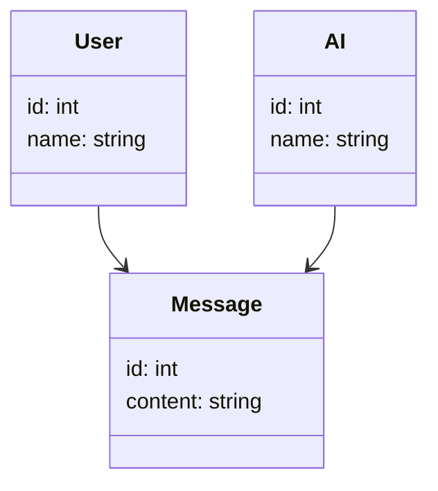
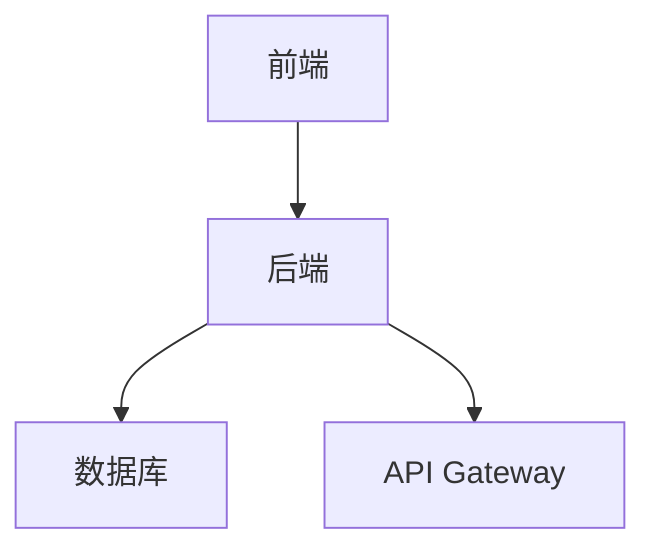
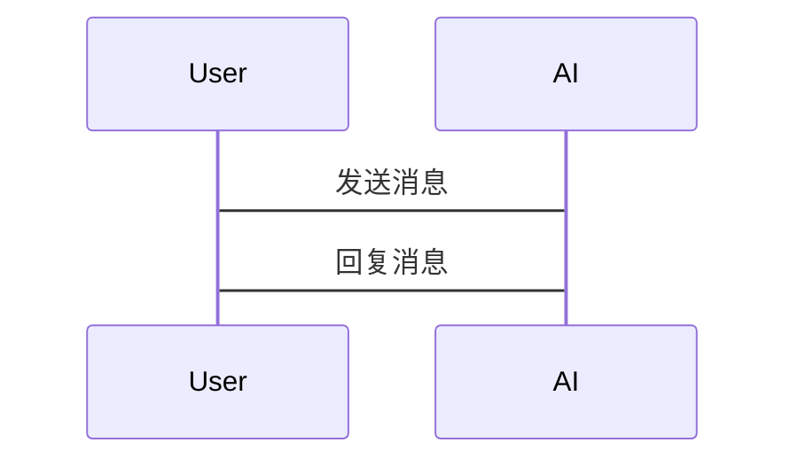

                 


# 《社交AI：提升AI Agent的人际交互能力》

## 关键词：社交AI，AI Agent，人际交互，自然语言处理，情感计算，对话系统

## 摘要：  
本文深入探讨了如何提升AI Agent的人际交互能力，从核心概念到算法原理，再到系统架构，结合实际案例，全面解析社交AI的技术实现与应用。

---

## 第一章：社交AI的背景与概念

### 1.1 社交AI的定义与核心概念

#### 1.1.1 什么是社交AI
社交AI（Social AI）是指能够理解和参与人类社交互动的智能系统。它通过自然语言处理、情感计算等技术，使AI能够进行有效的对话和社交活动。

#### 1.1.2 社交AI的核心要素
- **自然语言处理（NLP）**：理解和生成人类语言的能力。
- **情感计算**：识别和模拟人类情感。
- **对话系统**：构建能够自然对话的系统。

#### 1.1.3 社交AI的应用场景
- 电商客服
- 智能助手
- 社交机器人

#### 1.1.4 相关技术对比
| 技术 | 定义 | 应用 |
|------|------|------|
| NLP | 处理和理解文本 | 信息提取、机器翻译 |
| 情感计算 | 分析情感 | 情感分析、推荐系统 |
| 对话系统 | 自动生成对话 | 机器人对话、客服系统 |

### 1.2 社交AI的发展背景

#### 1.2.1 人工智能的演进历程
从专家系统到深度学习，AI技术不断进步，推动社交AI的发展。

#### 1.2.2 社交交互的智能化需求
随着社交媒体的普及，人们对智能交互的需求日益增长。

#### 1.2.3 当前社交AI的技术趋势
- 增强学习
- 多模态交互
- 个性化服务

### 1.3 社交AI的边界与外延

#### 1.3.1 社交AI的适用范围
- 人际沟通
- 信息传递
- 社交辅助

#### 1.3.2 社交AI的局限性
- 理解复杂情感
- 应对突发情况
- 道德伦理问题

---

## 第二章：社交AI的核心概念

### 2.1 对话系统

#### 2.1.1 对话系统的分类
- 基于规则
- 统计模型
- 深度学习模型

#### 2.1.2 对话系统的组成要素
- 理解模块
- 响应生成模块
- 状态管理模块

#### 2.1.3 对话系统的评价指标
| 指标 | 定义 |
|------|------|
| 响应准确性 | 系统回答的正确性 |
| 对话连贯性 | 对话的流畅程度 |

### 2.2 情感计算

#### 2.2.1 情感计算的定义
分析和模拟人类情感的技术。

#### 2.2.2 情感计算的关键技术
- 情感识别
- 情感分析
- 情感生成

#### 2.2.3 情感计算的应用案例
- 情感分析
- 情感推荐系统

### 2.3 社会规范建模

#### 2.3.1 社会规范的定义
社会中约定俗成的行为准则。

#### 2.3.2 社会规范的建模方法
- 基于规则
- 基于知识图谱

#### 2.3.3 社会规范在社交AI中的应用
- 对话中的礼貌用语
- 适应不同文化背景的交互

---

## 第三章：社交AI的核心原理

### 3.1 对话生成原理

#### 3.1.1 基于规则的对话生成
- 使用预定义规则生成回复。

#### 3.1.2 基于统计的对话生成
- 统计语言模型生成回复。

#### 3.1.3 基于深度学习的对话生成
- 使用神经网络生成回复。

#### 3.1.4 对话生成的挑战
- 上下文理解
- 多轮对话管理

### 3.2 情感分析原理

#### 3.2.1 情感分析的基本流程
1. 文本预处理
2. 特征提取
3. 模型训练
4. 情感分类

#### 3.2.2 基于传统机器学习的情感分析
- 使用SVM、随机森林等模型。

#### 3.2.3 基于深度学习的情感分析
- 使用LSTM、BERT等模型。

#### 3.2.4 情感分析的挑战
- 数据偏差
- 领域适应

### 3.3 社会规范推理原理

#### 3.3.1 社会规范推理的基本框架
1. 数据采集与预处理
2. 规范建模
3. 推理与应用

#### 3.3.2 基于知识图谱的社会规范推理
- 使用知识图谱存储和推理规范。

#### 3.3.3 基于深度学习的社会规范推理
- 使用神经网络进行规范推理。

#### 3.3.4 社会规范推理的挑战
- 数据稀疏性
- 跨文化适应

---

## 第四章：社交AI的算法与数学模型

### 4.1 情感分析算法

#### 4.1.1 情感分析的流程图
```mermaid
graph TD
A[开始] -> B[文本预处理]
B -> C[特征提取]
C -> D[模型训练]
D -> E[情感分类]
E -> F[结束]
```

#### 4.1.2 情感分析的数学模型
- 朴素贝叶斯模型：
$$ P(c|x) = \frac{P(x|c)P(c)}{P(x)} $$
- LSTM模型：
$$ f(x) = \text{LSTM}(x) $$

#### 4.1.3 情感分析的代码实现
```python
from sklearn.feature_extraction.text import TfidfVectorizer
from sklearn.svm import SVC

vectorizer = TfidfVectorizer()
model = SVC()
model.fit(vectorizer.fit_transform(X_train), y_train)
```

### 4.2 对话系统算法

#### 4.2.1 对话系统的流程图
```mermaid
graph TD
A[开始] -> B[输入处理]
B -> C[意图识别]
C -> D[响应生成]
D -> E[输出]
E -> F[结束]
```

#### 4.2.2 对话系统的数学模型
- 基于Transformer的模型：
$$ \text{Encoder}(x) = \text{Self-Attention}(x) + \text{FFN}(x) $$
- 基于LSTM的模型：
$$ f(x) = \text{LSTM}(x) $$

#### 4.2.3 对话系统的代码实现
```python
import torch
import torch.nn as nn

class ChatModel(nn.Module):
    def __init__(self):
        super(ChatModel, self).__init__()
        self.lstm = nn.LSTM(input_size=512, hidden_size=512, batch_first=True)
        self.fc = nn.Linear(512, 512)
    
    def forward(self, x):
        out, _ = self.lstm(x)
        out = self.fc(out[:, -1, :])
        return out
```

---

## 第五章：社交AI的系统分析与架构设计

### 5.1 系统功能设计

#### 5.1.1 领域模型设计


#### 5.1.2 系统架构设计


#### 5.1.3 接口设计
- API接口
- 数据格式

### 5.2 系统交互设计

#### 5.2.1 交互流程
1. 用户输入
2. 系统处理
3. 系统输出

#### 5.2.2 交互流程图


---

## 第六章：社交AI的项目实战

### 6.1 环境安装

#### 6.1.1 安装Python
- Python 3.8+

#### 6.1.2 安装依赖
- pip install transformers

### 6.2 核心代码实现

#### 6.2.1 情感分析代码
```python
from transformers import pipeline

classifier = pipeline("text-classification", model="bert-base-uncased")
result = classifier("I love this product!")
print(result)
```

#### 6.2.2 对话系统代码
```python
from transformers import pipeline

chatbot = pipeline("conversational", model="facebook/gpt2")
response = chatbot("What is your name?")
print(response)
```

### 6.3 案例分析

#### 6.3.1 应用场景
- 电商客服
- 智能助手

#### 6.3.2 案例代码
```python
def greet():
    print("Hello! How can I help you?")
```

### 6.4 项目总结

#### 6.4.1 项目成果
- 成功实现对话系统
- 提高了用户体验

#### 6.4.2 经验与教训
- 数据质量的重要性
- 系统优化的必要性

---

## 第七章：社交AI的最佳实践

### 7.1 最佳实践

#### 7.1.1 数据处理
- 数据清洗
- 数据标注

#### 7.1.2 模型优化
- 超参数调优
- 模型融合

### 7.2 小结

#### 7.2.1 重要性
- 提升人机交互体验
- 促进技术应用

### 7.3 注意事项

#### 7.3.1 道德伦理
- 避免偏见
- 保护隐私

### 7.4 拓展阅读

#### 7.4.1 推荐书籍
- 《深度学习》
- 《自然语言处理实战》

---

## 总结

本文从多个角度详细探讨了社交AI的核心概念、算法原理和系统设计，结合实际案例，为提升AI Agent的人际交互能力提供了全面的指导。通过不断优化技术和实践，社交AI将更好地服务于人类社会。

