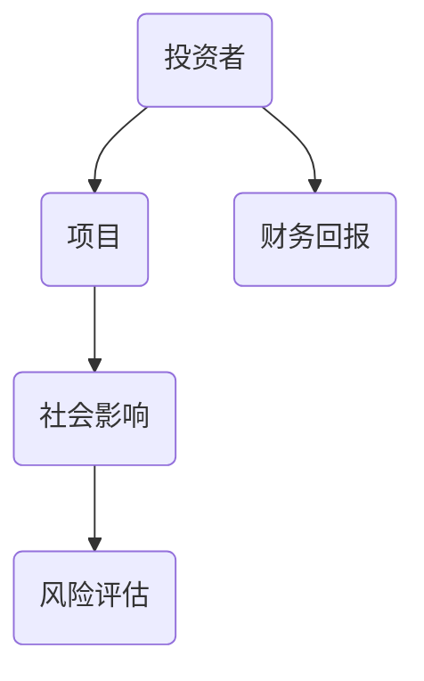
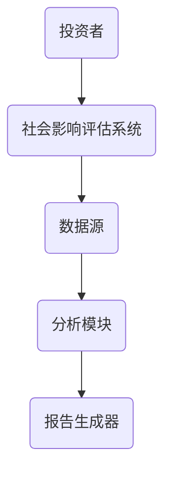

                 


# 社会影响力投资：追求双重回报的策略

> 关键词：社会影响力投资、双重回报、可持续发展、影响力评估、投资策略

> 摘要：社会影响力投资是一种结合社会责任和财务回报的投资方式，旨在通过投资解决社会问题并实现可持续发展。本文将深入探讨社会影响力投资的核心概念、策略、数学模型以及系统架构，并通过实际案例分析其应用场景，最后总结最佳实践和未来发展趋势。

---

## 第1章：社会影响力投资的背景与定义

### 1.1 社会影响力投资的起源与背景
社会影响力投资的概念起源于20世纪60年代的社会责任投资运动。随着全球对可持续发展的关注增加，社会影响力投资逐渐成为一种重要的投资策略。它不仅关注财务回报，还注重对社会的积极影响。

### 1.2 社会影响力投资的定义与特点
社会影响力投资是指投资者将资金投入到能够产生积极社会影响的项目或企业中，同时追求财务回报。其特点包括：
- **双重目标**：兼顾社会价值和财务回报。
- **多样性**：涵盖多个领域，如教育、环保、医疗等。
- **长期性**：注重长期的社会影响而非短期收益。

### 1.3 社会影响力投资的分类
社会影响力投资可以分为以下几类：
- **根据投资领域**：教育、医疗、环保等。
- **根据投资策略**：主动投资、被动投资、影响力投资。
- **根据投资期限**：短期、中期、长期。

### 1.4 社会影响力投资的重要性
社会影响力投资能够推动社会问题的解决，同时为投资者创造价值。它在促进可持续发展、缓解社会不平等方面发挥着重要作用。

---

## 第2章：社会影响力投资的核心概念与联系

### 2.1 核心概念原理
社会影响力投资的核心在于评估项目的社会影响，并将其与财务回报相结合。影响力评估模型通过量化社会影响，帮助投资者做出决策。

### 2.2 核心概念属性特征对比
以下是一个对比表格，展示了社会影响力投资与其他投资策略的区别：

| 属性 | 社会影响力投资 | 传统投资 | 可持续投资 |
|------|----------------|----------|------------|
| 目标 | 社会与财务回报 | 财务回报 | 可持续性 |
| 风险 | 中高 | 中低 | 中高 |
| 影响 | 高 | 低 | 中 |

### 2.3 ER实体关系图架构
以下是社会影响力投资的实体关系图：



---

## 第3章：社会影响力投资的策略与方法

### 3.1 影响力投资策略
社会影响力投资的策略包括：
- **资产配置策略**：将资金分配到不同领域的项目，以分散风险。
- **主题投资策略**：专注于特定社会问题，如气候变化或教育不平等等。
- **ESG投资策略**：基于环境、社会和治理因素进行投资。

### 3.2 投资组合构建方法
构建投资组合时，需要考虑：
- **股票筛选标准**：选择符合社会影响力的公司。
- **债券评级体系**：评估债券的社会影响和财务风险。
- **私募基金选择**：选择具有明确社会目标的私募基金。

### 3.3 风险管理与控制
社会影响力投资中的风险管理包括：
- **社会风险评估**：识别项目可能带来的社会风险。
- **财务风险防范**：通过 diversification 和风险对冲降低财务风险。
- **绩效跟踪与调整**：定期评估投资绩效并进行调整。

### 3.4 案例分析
以下是一个实际案例分析：
- **可再生能源投资案例**：投资者将资金投入太阳能项目，不仅获得财务回报，还推动了环保目标的实现。

---

## 第4章：社会影响力投资的数学模型与公式

### 4.1 影响力评估模型
影响力评估模型通过加权评分系统量化项目的社会影响：

$$ \text{总评分} = \sum (\text{权重} \times \text{评分}) $$

### 4.2 投资回报预测模型
投资回报预测模型基于项目的历史数据和未来预期：

$$ \text{预期回报} = \text{历史回报率} \times (1 + \text{增长率}) $$

---

## 第5章：社会影响力投资的系统架构与技术应用

### 5.1 系统架构设计
以下是社会影响力投资系统的架构图：



### 5.2 技术应用
- **大数据分析**：用于评估项目的社会影响。
- **区块链技术**：用于确保数据的透明性和不可篡改性。
- **人工智能**：用于预测投资回报和风险评估。

---

## 第6章：社会影响力投资的项目实战

### 6.1 项目需求分析
以一个教育项目为例，需求分析包括：
- 目标：提高教育水平。
- 范围：覆盖特定地区的学校。
- 时间：3年。

### 6.2 系统核心实现
以下是系统的核心实现代码示例：

```python
def calculate_impact(project_data):
    weights = {'教育': 0.4, '经济': 0.3, '社会': 0.3}
    impact = 0
    for category in weights:
        impact += weights[category] * project_data[category]
    return impact

project_data = {
    '教育': 0.8,
    '经济': 0.6,
    '社会': 0.7
}

impact_score = calculate_impact(project_data)
print(f"影响力得分为：{impact_score}")
```

### 6.3 测试与部署
测试包括功能测试和性能测试，确保系统能够高效运行。

---

## 第7章：社会影响力投资的最佳实践与未来展望

### 7.1 最佳实践
- **透明化**：确保投资者能够获取真实的信息。
- **长期视角**：关注长期的社会影响而非短期收益。
- **风险管理**：制定有效的风险控制策略。

### 7.2 未来展望
随着技术的进步和社会对可持续发展的需求增加，社会影响力投资将继续发展。未来，人工智能和大数据将在其中发挥更大的作用。

---

通过以上章节的详细讲解，我们全面探讨了社会影响力投资的核心概念、策略、数学模型和实际应用。希望本文能为读者提供有价值的见解，帮助他们在追求财务回报的同时，也为社会的可持续发展做出贡献。

