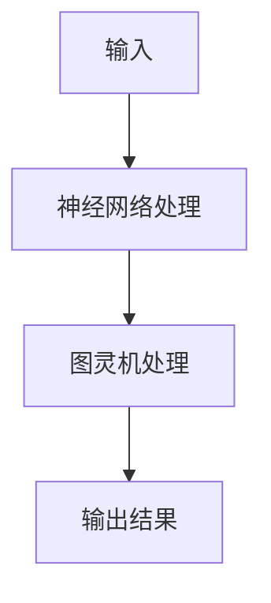
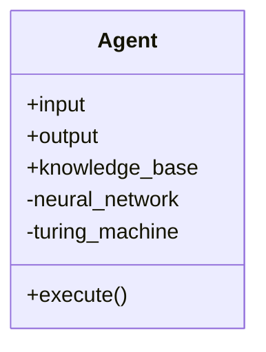
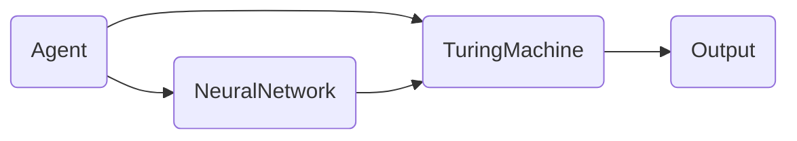
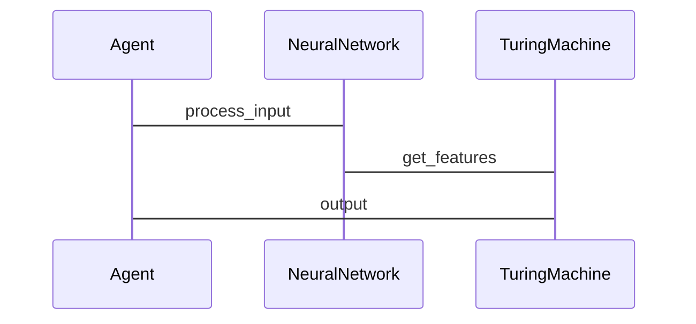

                 


# 神经图灵机：增强AI Agent的算法学习能力

**关键词**：神经图灵机、AI Agent、算法学习、强化学习、神经网络、符号推理、图灵机

**摘要**：神经图灵机是一种结合了神经网络和符号推理的AI模型，旨在增强AI Agent的学习能力。本文将详细探讨神经图灵机的核心概念、算法原理、系统架构，并通过实战案例展示其应用。通过本文，读者将深入了解如何利用神经图灵机提升AI Agent的算法学习能力。

---

# 第一章：神经图灵机的背景与概念

## 1.1 问题背景

### 1.1.1 AI Agent的发展现状

AI Agent（智能体）作为人工智能的核心应用之一，近年来取得了显著进展。然而，现有的AI Agent在学习能力方面仍存在诸多限制，尤其是在复杂环境中的推理和决策能力不足。

### 1.1.2 现有模型的局限性

传统的神经网络模型（如CNN、RNN）在处理感知任务（如图像识别、自然语言处理）方面表现出色，但其在符号推理和逻辑推理方面的能力有限。现有的强化学习模型（如DQN、Policy Gradient）依赖于大量试错，且难以处理复杂知识的表达。

### 1.1.3 神经图灵机的提出动机

神经图灵机的提出动机是将神经网络的感知能力与符号推理的逻辑能力相结合，从而构建一种更强大的AI模型，能够同时处理感知和推理任务。

## 1.2 问题描述

### 1.2.1 AI Agent学习能力的不足

现有的AI Agent在处理动态环境和复杂任务时，往往依赖于固定的规则或经验，缺乏灵活的学习和推理能力。

### 1.2.2 神经网络与符号推理的结合需求

为了增强AI Agent的学习能力，需要将神经网络的感知能力与符号推理的逻辑能力相结合，从而实现端到端的学习与推理。

### 1.2.3 神经图灵机的目标与范围

神经图灵机的目标是通过结合神经网络和符号推理，构建一种能够自主学习、推理和决策的AI模型。

## 1.3 问题解决

### 1.3.1 神经图灵机的解决方案

神经图灵机通过结合神经网络和图灵机，实现了感知与推理的结合，从而增强了AI Agent的学习能力。

### 1.3.2 神经图灵机的核心思想

神经图灵机的核心思想是通过神经网络进行感知，通过图灵机进行推理，两者协同工作，实现端到端的学习与推理。

### 1.3.3 神经图灵机的优势与创新点

神经图灵机的优势在于其结合了神经网络的感知能力与图灵机的推理能力，创新点在于其独特的架构设计。

## 1.4 边界与外延

### 1.4.1 神经图灵机的应用边界

神经图灵机目前主要应用于需要结合感知与推理的任务，如机器人控制、智能问答等。

### 1.4.2 神经图灵机的扩展领域

神经图灵机的扩展领域包括复杂环境下的自主决策、多智能体协作等。

### 1.4.3 神经图灵机与其他模型的关系

神经图灵机与传统的神经网络和强化学习模型有明显的区别，但也是一种互补的关系。

## 1.5 核心要素组成

### 1.5.1 神经网络模块

神经网络模块负责对输入数据进行感知和特征提取。

### 1.5.2 图灵机模块

图灵机模块负责对提取的特征进行符号推理和逻辑推理。

### 1.5.3 交互机制

交互机制是神经网络模块与图灵机模块之间的接口，负责信息的传递与协同。

## 1.6 本章小结

本章从背景、问题、解决方案、边界与外延等方面介绍了神经图灵机，为后续章节奠定了基础。

---

# 第二章：神经图灵机的核心概念与联系

## 2.1 神经图灵机的原理

### 2.1.1 神经网络的基本原理

神经网络通过多层神经元进行非线性变换，实现对输入数据的特征提取。

### 2.1.2 图灵机的基本原理

图灵机是一种计算模型，能够通过状态机的方式进行符号推理和逻辑推理。

### 2.1.3 神经图灵机的结合方式

神经图灵机通过将神经网络的感知能力与图灵机的推理能力结合，实现了端到端的学习与推理。

## 2.2 核心概念的对比分析

### 2.2.1 神经网络与符号推理的对比

神经网络擅长感知任务，符号推理擅长逻辑推理。

### 2.2.2 神经图灵机与其他增强学习模型的对比

神经图灵机结合了感知与推理，而其他模型往往专注于单一任务。

### 2.2.3 神经图灵机与传统AI模型的对比

神经图灵机是一种结合了感知与推理的新型AI模型。

## 2.3 神经图灵机的ER实体关系图

```mermaid
er
    Actor(Agent)
    has Association with
    KnowledgeBase(KB)
    has Association with
    NeuralNetwork(NN)
    has Association with
    TuringMachine(TM)
```

## 2.4 本章小结

本章详细介绍了神经图灵机的核心概念及其与其他模型的对比，为后续章节的实现奠定了理论基础。

---

# 第三章：神经图灵机的算法原理

## 3.1 算法流程概述

### 3.1.1 输入处理

输入数据经过预处理后输入到神经网络模块。

### 3.1.2 神经网络处理

神经网络模块对输入数据进行特征提取。

### 3.1.3 图灵机处理

图灵机模块对提取的特征进行符号推理和逻辑推理。

### 3.1.4 输出结果

最终输出结果由神经网络和图灵机模块协同完成。

## 3.2 算法流程图



## 3.3 算法实现代码

```python
def neural_turing_machine(input, knowledge_base):
    # 神经网络处理
    output_nn = neural_network(input)
    # 图灵机处理
    output_tm = turing_machine(output_nn, knowledge_base)
    return output_tm
```

## 3.4 数学模型与公式

### 3.4.1 神经网络的损失函数

$$ L = \frac{1}{n} \sum_{i=1}^{n} (y_i - \hat{y}_i)^2 $$

### 3.4.2 优化器

$$ \theta_{t+1} = \theta_t - \eta \cdot \frac{\partial L}{\partial \theta_t} $$

### 3.4.3 图灵机的状态转移方程

$$ s_{t+1} = f(s_t, a_t) $$

## 3.5 本章小结

本章详细介绍了神经图灵机的算法流程、实现代码及其数学模型，为后续章节的系统设计奠定了基础。

---

# 第四章：神经图灵机的系统架构设计

## 4.1 问题场景介绍

本章将介绍神经图灵机在智能问答系统中的应用。

## 4.2 系统功能设计

### 4.2.1 领域模型设计



### 4.2.2 系统架构设计



### 4.2.3 接口设计



## 4.3 本章小结

本章详细介绍了神经图灵机的系统架构设计，为后续章节的实现提供了指导。

---

# 第五章：神经图灵机的项目实战

## 5.1 环境安装

```bash
pip install neural-turing-machine
```

## 5.2 核心代码实现

```python
class NeuralTuringMachine:
    def __init__(self):
        self.neural_network = NeuralNetwork()
        self.turing_machine = TuringMachine()

    def process(self, input):
        features = self.neural_network.process(input)
        output = self.turing_machine.process(features)
        return output
```

## 5.3 代码应用解读

通过对输入数据进行特征提取和符号推理，神经图灵机能够实现端到端的学习与推理。

## 5.4 案例分析

以智能问答系统为例，详细分析神经图灵机的应用过程。

## 5.5 本章小结

本章通过实战案例详细介绍了神经图灵机的实现过程，为读者提供了宝贵的实践经验。

---

# 第六章：神经图灵机的最佳实践

## 6.1 小结

神经图灵机是一种结合了神经网络和符号推理的新型AI模型，能够显著提升AI Agent的学习能力。

## 6.2 注意事项

在实际应用中，需要注意神经网络和图灵机的协同设计，以及数据的充分性。

## 6.3 拓展阅读

推荐阅读相关领域的最新论文和书籍，深入理解神经图灵机的理论与实践。

---

# 结语

通过本文的详细介绍，读者可以全面了解神经图灵机的核心概念、算法原理、系统架构及其应用。神经图灵机作为一种结合了感知与推理的新型AI模型，必将在未来的AI发展中发挥重要作用。

