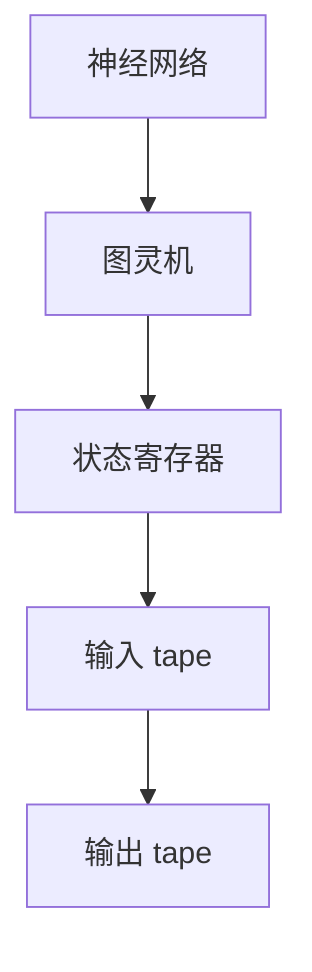
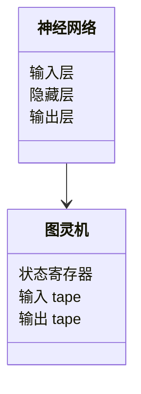
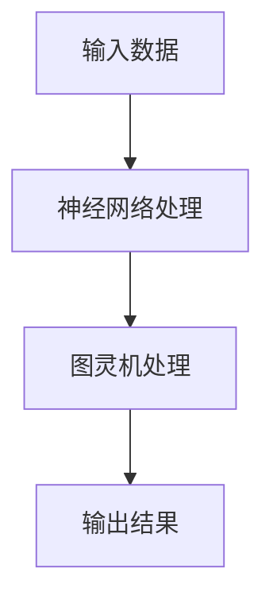
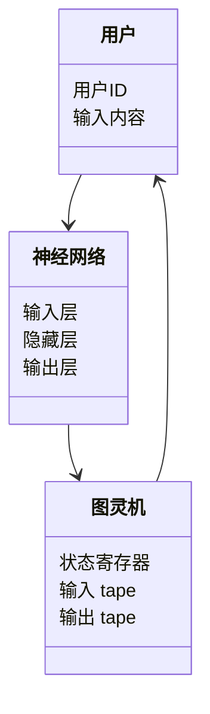
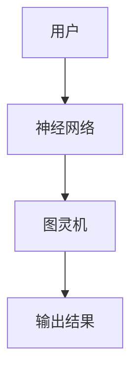

                 


# 神经图灵机：增强AI Agent的算法学习能力

> 关键词：神经图灵机，AI Agent，算法学习能力，神经网络，图灵机，增强学习

> 摘要：神经图灵机是一种结合了神经网络和图灵机概念的新型AI模型，旨在通过增强算法学习能力来提升AI Agent的智能水平。本文从背景、原理、算法实现、系统设计、项目实战等多个维度，详细探讨神经图灵机的核心概念、数学模型、优化策略和实际应用，为读者提供全面而深入的技术解读。

---

## 第1章: 神经图灵机的背景与概念

### 1.1 问题背景

#### 1.1.1 当前AI Agent的局限性
传统的AI Agent（智能体）主要依赖于规则引擎或基于统计的学习方法，存在以下问题：
- **规则引擎的局限性**：规则引擎难以处理动态变化的环境和复杂场景。
- **基于统计的学习方法**：依赖大量数据，且难以解释和调整。

#### 1.1.2 神经图灵机的提出动机
为了解决传统AI Agent的局限性，神经图灵机结合了神经网络的强大学习能力和图灵机的通用计算能力，提出了增强算法学习能力的新方法。

#### 1.1.3 神经图灵机的核心目标
神经图灵机的核心目标是通过神经网络和图灵机的结合，增强AI Agent的算法学习能力，使其能够更好地适应复杂动态环境。

### 1.2 核心概念与定义

#### 1.2.1 神经网络的基本概念
神经网络是一种由多个神经元组成的网络，能够通过学习数据中的特征来完成分类、回归等任务。其核心在于神经元之间的权重调整和激活函数的非线性变换。

#### 1.2.2 图灵机的基本概念
图灵机是一种理想化的计算模型，由输入 tape、操作头、状态寄存器和输出 tape 组成。图灵机能够模拟任何计算机算法的逻辑。

#### 1.2.3 神经图灵机的定义与特点
神经图灵机是一种结合神经网络和图灵机的模型，具有以下特点：
- 神经网络负责特征提取和非线性变换。
- 图灵机负责序列建模和状态管理。

### 1.3 神经图灵机与传统AI的区别

#### 1.3.1 传统AI的局限性
传统AI主要依赖规则引擎或统计学习方法，难以处理动态变化和复杂场景。

#### 1.3.2 神经图灵机的优势
神经图灵机结合了神经网络和图灵机的优势，能够更好地处理复杂动态环境中的任务。

#### 1.3.3 神经图灵机的创新点
神经图灵机通过神经网络和图灵机的结合，提出了增强算法学习能力的新方法。

### 1.4 神经图灵机的边界与外延

#### 1.4.1 神经图灵机的应用场景
- 自然语言处理
- 时间序列预测
- AI Agent的智能决策

#### 1.4.2 神经图灵机的适用范围
适用于需要结合特征学习和序列建模的复杂任务。

#### 1.4.3 神经图灵机的未来发展
神经图灵机的研究将朝着更高效、更通用的方向发展，进一步推动AI技术的进步。

### 1.5 本章小结
本章介绍了神经图灵机的背景、核心概念和与传统AI的区别，为后续章节的深入探讨奠定了基础。

---

## 第2章: 神经图灵机的核心原理

### 2.1 神经图灵机的数学模型

#### 2.1.1 神经图灵机的数学表达
神经图灵机的数学模型可以表示为：
$$
f(x) = \sigma(Wx + b)
$$
其中，$\sigma$ 是激活函数，$W$ 是权重矩阵，$b$ 是偏置向量。

#### 2.1.2 神经图灵机的参数化表示
神经图灵机的参数化表示通过神经网络和图灵机的结合，实现了动态权重调整。

#### 2.1.3 神经图灵机的优化算法
神经图灵机的优化算法包括前向传播和反向传播，具体如下：
- **前向传播**：输入数据通过神经网络和图灵机进行处理。
- **反向传播**：计算损失函数的梯度，并更新权重。

### 2.2 神经图灵机的实体关系图



### 2.3 神经图灵机的ER图



### 2.4 本章小结
本章详细探讨了神经图灵机的核心原理，包括数学模型、实体关系图和ER图的构建。

---

## 第3章: 神经图灵机的算法实现

### 3.1 神经图灵机的算法流程



#### 3.1.1 算法的输入与输出
- **输入**：输入数据和初始状态。
- **输出**：处理结果和更新后的状态。

#### 3.1.2 算法的步骤分解
1. 输入数据经过神经网络处理。
2. 神经网络输出结果经过图灵机处理。
3. 图灵机输出最终结果并更新状态。

#### 3.1.3 算法的优化策略
- 参数调整策略：动态调整权重。
- 激活函数选择：选择合适的激活函数。

### 3.2 神经图灵机的数学模型

#### 3.2.1 神经图灵机的数学公式
$$
L = \frac{1}{n}\sum_{i=1}^{n}(y_i - \hat{y}_i)^2
$$
其中，$L$ 是损失函数，$y_i$ 是真实值，$\hat{y}_i$ 是预测值。

#### 3.2.2 神经图灵机的损失函数
$$
L = -\sum_{i=1}^{n} y_i \log(\hat{y}_i)
$$

#### 3.2.3 神经图灵机的优化算法
- **梯度下降**：$$\theta = \theta - \eta \frac{\partial L}{\partial \theta}$$
- **Adam优化器**：结合动量和自适应学习率。

### 3.3 神经图灵机的算法实现

#### 3.3.1 环境安装与配置
- 安装Python和深度学习框架（如TensorFlow或PyTorch）。

#### 3.3.2 算法核心代码实现
```python
import tensorflow as tf

class NeuralTuringMachine:
    def __init__(self, input_dim, hidden_dim):
        self.input_dim = input_dim
        self.hidden_dim = hidden_dim
        self.W = tf.Variable(tf.random.truncated_normal([input_dim, hidden_dim]))
        self.b = tf.Variable(tf.zeros([hidden_dim]))
    
    def forward(self, x):
        output = tf.nn.relu(tf.matmul(x, self.W) + self.b)
        return output
    
    def backward(self, x, y):
        with tf.GradientTape() as tape:
            y_pred = self.forward(x)
            loss = tf.reduce_mean(tf.square(y - y_pred))
        gradients = tape.gradient(loss, [self.W, self.b])
        self.optimizer.apply_gradients(zip(gradients, [self.W, self.b]))
        return loss
```

### 3.4 本章小结
本章详细讲解了神经图灵机的算法实现，包括算法流程、数学模型和核心代码实现。

---

## 第4章: 神经图灵机的系统分析与架构设计

### 4.1 问题场景介绍

#### 4.1.1 项目介绍
我们以一个智能客服系统为例，介绍神经图灵机的应用场景。

#### 4.1.2 系统功能设计
- 用户输入处理
- 智能回复生成
- 状态管理

### 4.2 系统架构设计

#### 4.2.1 领域模型


#### 4.2.2 系统架构图


### 4.3 系统接口设计

#### 4.3.1 接口定义
- 输入接口：用户输入内容。
- 输出接口：系统输出结果。

#### 4.3.2 接口交互
- 用户输入内容，经过神经网络处理后，传递给图灵机。
- 图灵机处理后，输出结果给用户。

### 4.4 本章小结
本章通过智能客服系统的案例，介绍了神经图灵机的系统架构设计和接口设计。

---

## 第5章: 神经图灵机的项目实战

### 5.1 环境安装与配置

#### 5.1.1 环境安装
- Python 3.8+
- TensorFlow 2.0+

#### 5.1.2 环境配置
- 安装必要的库：
  ```bash
  pip install numpy tensorflow matplotlib
  ```

### 5.2 核心代码实现

#### 5.2.1 神经图灵机的实现
```python
class NeuralTuringMachine:
    def __init__(self, input_dim, hidden_dim):
        self.input_dim = input_dim
        self.hidden_dim = hidden_dim
        self.W = tf.Variable(tf.random.truncated_normal([input_dim, hidden_dim]))
        self.b = tf.Variable(tf.zeros([hidden_dim]))
    
    def forward(self, x):
        output = tf.nn.relu(tf.matmul(x, self.W) + self.b)
        return output
    
    def backward(self, x, y):
        with tf.GradientTape() as tape:
            y_pred = self.forward(x)
            loss = tf.reduce_mean(tf.square(y - y_pred))
        gradients = tape.gradient(loss, [self.W, self.b])
        self.optimizer.apply_gradients(zip(gradients, [self.W, self.b]))
        return loss
```

#### 5.2.2 系统实现
```python
class System:
    def __init__(self, ntm):
        self.ntm = ntm
    
    def process_input(self, input_data):
        output = self.ntm.forward(input_data)
        return output
    
    def update_state(self, state, output):
        # 更新状态逻辑
        pass
```

### 5.3 实际案例分析

#### 5.3.1 案例背景
以智能客服系统为例，用户输入“我的订单在哪里？”，系统需要生成合适的回复。

#### 5.3.2 案例分析
1. 用户输入“我的订单在哪里？”，经过神经网络处理。
2. 神经网络输出结果经过图灵机处理。
3. 图灵机输出“请提供订单号，我将为您查询订单状态。”

### 5.4 本章小结
本章通过实际案例，详细讲解了神经图灵机的项目实战，包括环境安装、核心代码实现和案例分析。

---

## 第6章: 总结与展望

### 6.1 总结

#### 6.1.1 核心内容回顾
神经图灵机结合了神经网络和图灵机的优势，能够增强AI Agent的算法学习能力。

#### 6.1.2 神经图灵机的优势
- 强大学习能力
- 动态状态管理

#### 6.1.3 神经图灵机的创新点
- 神经网络与图灵机的结合
- 动态权重调整

### 6.2 未来展望

#### 6.2.1 神经图灵机的未来发展
- 更高效的学习算法
- 更通用的计算模型

#### 6.2.2 神经图灵机的潜力
- 更广泛的应用场景
- 更智能的AI Agent

### 6.3 最佳实践 Tips

#### 6.3.1 数据质量的重要性
数据质量直接影响神经图灵机的学习效果。

#### 6.3.2 模型调优的注意事项
- 参数选择
- 激活函数选择
- 学习率调整

#### 6.3.3 拓展阅读
- 《神经网络与深度学习》
- 《图灵机与计算理论》

### 6.4 本章小结
本章总结了神经图灵机的核心内容，展望了其未来发展，并提供了最佳实践建议。

---

# 附录

## 附录A: 神经图灵机的数学公式汇总

- 损失函数：
  $$
  L = \frac{1}{n}\sum_{i=1}^{n}(y_i - \hat{y}_i)^2
  $$
- 优化算法：
  $$
  \theta = \theta - \eta \frac{\partial L}{\partial \theta}
  $$

## 附录B: 神经图灵机的代码片段

```python
class NeuralTuringMachine:
    def __init__(self, input_dim, hidden_dim):
        self.input_dim = input_dim
        self.hidden_dim = hidden_dim
        self.W = tf.Variable(tf.random.truncated_normal([input_dim, hidden_dim]))
        self.b = tf.Variable(tf.zeros([hidden_dim]))
    
    def forward(self, x):
        output = tf.nn.relu(tf.matmul(x, self.W) + self.b)
        return output
    
    def backward(self, x, y):
        with tf.GradientTape() as tape:
            y_pred = self.forward(x)
            loss = tf.reduce_mean(tf.square(y - y_pred))
        gradients = tape.gradient(loss, [self.W, self.b])
        self.optimizer.apply_gradients(zip(gradients, [self.W, self.b]))
        return loss
```

---

# 结束语

神经图灵机作为一种结合了神经网络和图灵机的新型AI模型，为AI Agent的算法学习能力提供了新的思路。未来，随着技术的不断发展，神经图灵机将在更多领域展现其强大的潜力和应用价值。

