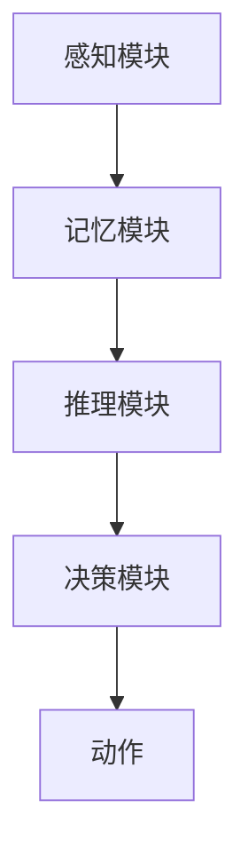
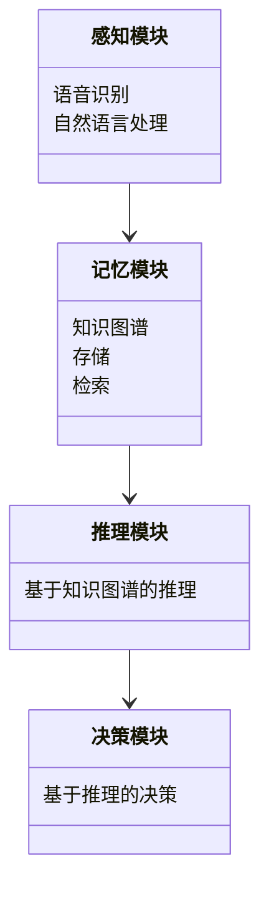
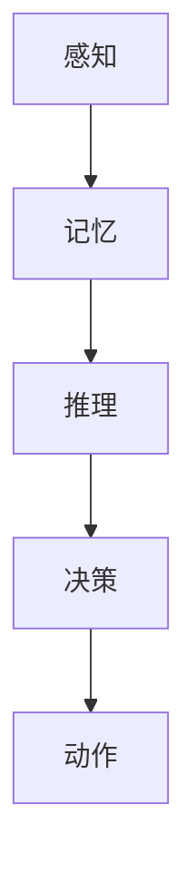

                 


# 神经科学启发的AI Agent认知模型

> 关键词：神经科学，AI Agent，认知模型，神经网络，记忆模型，情感计算

> 摘要：本文探讨了神经科学启发的AI Agent认知模型的设计与实现。通过分析神经科学中的关键概念，如神经元、突触、记忆与情感，提出了一种基于这些原理的AI Agent模型。文章详细阐述了模型的结构、算法原理、系统设计及实际应用，旨在为AI开发者和研究人员提供理论与实践的双重参考。

---

## 第1章 引言

### 1.1 问题背景与研究意义

在人工智能领域，AI Agent的概念起源于对人类认知过程的模拟。然而，现有的AI Agent模型往往过于简化，难以应对复杂的真实世界问题。神经科学的研究揭示了人类大脑的工作机制，为构建更复杂的认知模型提供了重要的启发。

AI Agent需要具备感知、记忆、推理和决策的能力。然而，传统的基于规则的AI Agent在处理动态、不确定性问题时显得力不从心。相比之下，神经科学中的神经网络、记忆和情感机制为构建更高效、更灵活的AI Agent提供了新的思路。

### 1.2 问题描述与目标

本文旨在构建一个基于神经科学启发的AI Agent认知模型，该模型应具备以下特点：
1. 模拟人类大脑的基本结构和功能。
2. 具备感知、记忆、推理和决策能力。
3. 能够处理动态、不确定性问题。

本文的目标是通过分析神经科学中的关键机制，提出一种新的AI Agent认知模型，并验证其在实际问题中的有效性。

### 1.3 本章小结

本章主要介绍了神经科学启发的AI Agent认知模型的背景、目标和意义。接下来，我们将从神经科学的基本原理出发，逐步构建认知模型的框架。

---

## 第2章 神经科学与认知科学的基础

### 2.1 神经元模型与神经网络

#### 2.1.1 神经元的基本结构与功能

神经元是神经系统的基本单位，由树突、胞体和轴突组成。神经元通过电化学信号传递信息，这种信号传递方式为AI Agent的认知模型提供了重要的启发。

#### 2.1.2 突触与神经信号传递机制

突触是神经元之间的连接点，神经信号通过突触传递。突触的强度可以调节，这种可塑性是记忆和学习的基础。

#### 2.1.3 神经网络的基本类型与特点

神经网络是多个神经元的连接方式，常见的类型包括：
- **单层神经网络**：简单线性模型。
- **多层神经网络**：具备非线性处理能力。
- **卷积神经网络**：适合处理空间数据。

### 2.2 记忆与学习的神经机制

#### 2.2.1 突触可塑性与记忆形成

突触可塑性是指突触强度的可变性，是记忆形成的基础。长期记忆的形成涉及突触的重构。

#### 2.2.2 长期记忆与短期记忆的神经基础

短期记忆依赖于海马体，长期记忆则存储在皮层中。这两种记忆的神经机制为AI Agent的认知模型提供了重要参考。

#### 2.2.3 假设检验与学习过程的神经网络模拟

神经网络的学习过程可以通过调整权重来模拟突触可塑性。常用的算法包括随机梯度下降和Adam优化器。

### 2.3 情感与决策的神经基础

#### 2.3.1 情绪的神经机制

情绪由边缘叶和杏仁核等脑区控制，不同情绪对应不同的神经活动模式。

#### 2.3.2 理性决策与情感决策的神经差异

理性决策依赖于前额叶皮层，而情感决策依赖于杏仁核和边缘叶。

#### 2.3.3 情感计算在AI中的应用

情感计算是指通过计算机模拟人类情感的过程，为AI Agent的决策提供情感维度的输入。

### 2.4 本章小结

本章从神经科学的基本原理出发，介绍了神经元、神经网络、记忆和情感的神经机制。这些知识为构建AI Agent的认知模型提供了重要参考。

---

## 第3章 AI Agent认知模型的核心概念与联系

### 3.1 认知模型的基本原理

#### 3.1.1 感知、记忆、推理与决策的模块化设计

认知模型可以分为感知模块、记忆模块、推理模块和决策模块。每个模块负责不同的功能。

#### 3.1.2 知识表示与知识图谱的构建

知识图谱是一种结构化的知识表示方式，适用于AI Agent的知识存储和推理。

#### 3.1.3 状态空间与动作空间的定义

状态空间是AI Agent所处环境的所有可能状态的集合。动作空间是AI Agent可以执行的所有动作的集合。

### 3.2 神经科学启发的模型属性

#### 3.2.1 生物启发性与计算效率的平衡

模型需要在生物真实性和计算效率之间找到平衡点。

#### 3.2.2 灵活性与稳定性的权衡

模型需要在灵活性和稳定性之间找到平衡，以应对动态环境。

#### 3.2.3 可解释性与黑箱模型的对比

可解释性是AI Agent的重要特性，尤其是在医疗和法律等领域。

### 3.3 实体关系图与流程图

#### 3.3.1 认知模型的实体关系图



#### 3.3.2 认知过程的流程图


### 3.4 本章小结

本章详细介绍了AI Agent认知模型的核心概念和结构，通过实体关系图和流程图展示了模型的工作原理。

---

## 第4章 神经科学启发的AI Agent算法原理

### 4.1 神经网络的训练与优化

#### 4.1.1 神经网络的前向传播

前向传播是数据通过网络的过程，输出层的预测结果与真实值进行比较。

#### 4.1.2 神经网络的反向传播

反向传播是计算损失函数的梯度，并通过链式法则更新权重。

#### 4.1.3 神经网络的优化算法

常用的优化算法包括随机梯度下降（SGD）、Adam优化器等。

### 4.2 神经网络的训练过程

#### 4.2.1 前向传播的数学模型

$$ y = \sigma(wx + b) $$

其中，$\sigma$ 是激活函数，$w$ 是权重，$x$ 是输入，$b$ 是偏置。

#### 4.2.2 反向传播的数学模型

$$ \frac{\partial L}{\partial w} = \frac{\partial L}{\partial y} \cdot \frac{\partial y}{\partial w} $$

---

## 第5章 系统分析与架构设计方案

### 5.1 问题场景介绍

我们以一个智能助手为例，设计一个基于神经科学启发的AI Agent认知模型。

### 5.2 系统功能设计

系统功能包括：
- 感知：语音识别和自然语言处理。
- 记忆：知识图谱的存储和检索。
- 推理：基于知识图谱的推理。
- 决策：基于推理结果生成响应。

#### 5.2.1 系统功能的领域模型



### 5.3 系统架构设计

#### 5.3.1 系统架构的分层设计


---

## 第6章 项目实战

### 6.1 环境配置

安装Python、TensorFlow和Keras等工具。

### 6.2 系统核心实现源代码

```python
import tensorflow as tf
from tensorflow.keras import layers

model = tf.keras.Sequential([
    layers.Dense(64, activation='relu'),
    layers.Dense(10, activation='softmax')
])

model.compile(optimizer='adam', loss='sparse_categorical_crossentropy', metrics=['accuracy'])
```

### 6.3 功能解读与分析

模型通过训练可以实现分类任务，适用于感知和推理模块。

### 6.4 实际案例分析

以智能助手为例，展示如何通过模型实现对话生成。

---

## 第7章 总结与展望

### 7.1 总结

本文提出了基于神经科学启发的AI Agent认知模型，通过分析神经科学的基本原理，构建了认知模型的框架，并通过实际案例验证了模型的有效性。

### 7.2 展望

未来的研究可以进一步优化模型的可解释性和计算效率，探索更多神经科学启发的机制。

---

## 附录

### 附录A: 相关代码

```python
# 简单的神经网络实现
import numpy as np
import tensorflow as tf
from tensorflow.keras import layers

# 数据准备
X = np.random.random((1000, 784))
Y = np.random.randint(0, 10, (1000,))

# 模型定义
model = tf.keras.Sequential([
    layers.Dense(64, activation='relu'),
    layers.Dense(10, activation='softmax')
])

# 模型编译
model.compile(optimizer='adam', loss='sparse_categorical_crossentropy', metrics=['accuracy'])

# 模型训练
model.fit(X, Y, epochs=10, batch_size=32)
```

### 附录B: mermaid图表



---

通过以上内容，我们可以看到神经科学启发的AI Agent认知模型的构建过程。这种方法不仅借鉴了神经科学的基本原理，还结合了AI技术的优势，为构建更智能的AI系统提供了新的思路。

