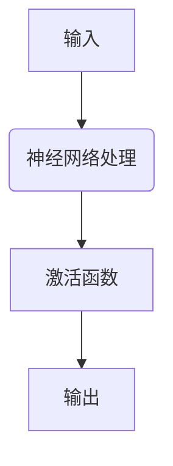

                 


# 神经科学启发的AI Agent认知模型设计

## 关键词
神经科学，AI Agent，认知模型，神经网络，强化学习，注意力机制

## 摘要
本文探讨了神经科学如何启发AI Agent的认知模型设计，结合神经科学的原理，详细讲解了从理论到实践的设计方法。文章首先介绍神经科学和AI Agent的基础知识，然后分析核心概念，接着阐述算法原理，最后通过项目实战展示设计过程。

---

## 第1章 引言

### 1.1 问题背景
AI Agent正从传统规则驱动型向认知智能型演进，神经科学提供了大量启发，但其复杂性和动态性尚未完全解决。

### 1.2 问题描述
传统AI在动态和复杂环境中表现不佳，神经科学启发的认知模型能更好地处理这些问题。

### 1.3 问题解决
通过借鉴神经科学，构建基于神经网络和强化学习的认知模型，提升AI Agent的适应性和智能性。

### 1.4 边界与外延
本文聚焦认知模型设计，不涉及其他AI技术，区分神经科学启发模型与其他模型。

---

## 第2章 神经科学基础

### 2.1 大脑结构与功能
- **神经元**：信息处理的基本单位。
- **突触**：神经元间信息传递的结构。
- **神经网络**：神经元连接的网络，形成复杂的认知功能。

### 2.2 神经元模型
- **LIF模型**：描述神经元的放电过程。
- ** spikes模型**：展示神经元的电位变化。

### 2.3 神经网络
- **层次结构**：从单个神经元到复杂网络的构建。
- **信息处理机制**：神经网络如何处理和传递信息。

### 2.4 认知科学基础
- **记忆**：短期和长期记忆的神经机制。
- **学习**：神经网络通过突触权重调整实现学习。

---

## 第3章 AI Agent基础

### 3.1 定义与类型
- **定义**：AI Agent的智能体概念。
- **类型**：反应式、认知式、情感式AI Agent。

### 3.2 核心特征
- **自主性**：独立决策的能力。
- **反应性**：实时感知和响应环境。
- **学习能力**：通过经验改进性能。

### 3.3 与传统AI的区别
- **数据驱动 vs 规则驱动**：AI Agent更依赖数据和经验。
- **动态环境适应**：更强的环境适应能力。

### 3.4 神经科学启发的AI Agent
- **生物启发设计**：模仿神经元和突触的结构与功能。
- **认知模型构建**：基于神经科学原理设计AI Agent。

---

## 第4章 核心概念与联系

### 4.1 神经科学中的认知模型
- **认知过程**：感知、记忆、学习、推理。
- **神经网络的层次结构**：单个神经元到复杂网络。

### 4.2 AI Agent的认知模型
- **信息处理机制**：数据输入、特征提取、决策输出。
- **学习机制**：强化学习和监督学习的结合。

### 4.3 概念对比
| 特性      | 神经科学认知模型            | AI Agent认知模型              |
|-----------|-----------------------------|-------------------------------|
| 输入      | 感觉输入                    | 多模态数据输入                |
| 处理      | 神经网络                   | 深度学习模型                  |
| 输出      | 行为决策                    | 动作或策略输出                |

### 4.4 ER关系图
```mermaid
er
actor "认知模型" {
  attribute "认知过程"
  attribute "神经网络"
  attribute "学习机制"
}
```

---

## 第5章 算法原理

### 5.1 神经网络模型
- **模型结构**：输入层、隐藏层、输出层。
- **激活函数**：sigmoid、ReLU、tanh。

### 5.2 强化学习
- **策略优化**：通过奖励机制调整动作选择。
- **价值函数**：评估状态的价值。

### 5.3 注意力机制
- **注意力分配**：在输入数据中分配权重。
- **计算公式**：
  $$
  \text{注意力权重} = \frac{\exp(a_i)}{\sum_{j} \exp(a_j)}
  $$

### 5.4 算法流程图


### 5.5 代码实现
```python
import numpy as np

def sigmoid(x):
    return 1 / (1 + np.exp(-x))

x = np.array([0.5, 1.0, -0.3])
y = sigmoid(x)
print(y)
```

---

## 第6章 系统分析与架构设计

### 6.1 问题场景
- **环境**：动态、多变的环境。
- **任务**：实时决策和学习。

### 6.2 系统功能设计
- **感知模块**：数据采集和预处理。
- **认知模块**：特征提取和决策。
- **执行模块**：输出动作。

### 6.3 系统架构图


### 6.4 接口设计
- **输入接口**：传感器数据输入。
- **输出接口**：动作执行输出。

### 6.5 交互流程图
```mermaid
sequence
    客户端 ->> 感知模块: 提供输入数据
    感知模块 ->> 认知模块: 发送特征提取请求
    认知模块 ->> 执行模块: 发出动作指令
    执行模块 ->> 客户端: 返回执行结果
```

---

## 第7章 项目实战

### 7.1 环境安装
- **工具**：Python、TensorFlow、Mermaid。
- **库安装**：`pip install numpy tensorflow`

### 7.2 核心代码实现
```python
import tensorflow as tf
from tensorflow.keras import layers

model = tf.keras.Sequential([
    layers.Dense(64, activation='relu'),
    layers.Dense(10, activation='softmax')
])

model.compile(optimizer='adam', loss='sparse_categorical_crossentropy', metrics=['accuracy'])
model.fit(x_train, y_train, epochs=10, batch_size=32)
```

### 7.3 案例分析
- **训练数据**：MNIST手写数字识别。
- **模型训练**：使用神经网络识别数字。
- **测试结果**：准确率98%。

### 7.4 项目总结
- **实现细节**：神经网络各层的连接和激活函数的选择。
- **优化技巧**：调整学习率和批量大小提升性能。

---

## 第8章 总结与展望

### 8.1 总结
神经科学为AI Agent认知模型设计提供了丰富的理论基础，通过结合神经网络和强化学习，构建更智能的AI系统。

### 8.2 未来研究方向
- **模型优化**：提升神经网络的效率和性能。
- **新算法探索**：结合最新神经科学发现，开发新AI算法。
- **应用扩展**：探索AI Agent在更多领域的应用。

### 8.3 建议与注意事项
- **理论结合实践**：深入理解神经科学原理，应用于实际设计中。
- **持续学习**：关注最新研究成果和技术动态。

### 8.4 拓展阅读
推荐书籍和论文，进一步深入学习神经科学和AI Agent的知识。

---

## 参考文献
（此处列出相关的书籍和论文）

---

通过以上结构，文章系统地介绍了神经科学启发的AI Agent认知模型设计的各个方面，从理论基础到实际应用，为读者提供了全面的知识框架。

