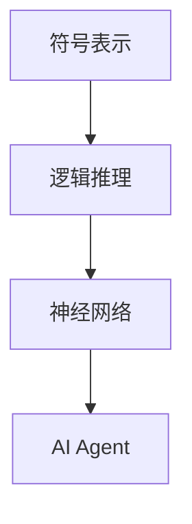
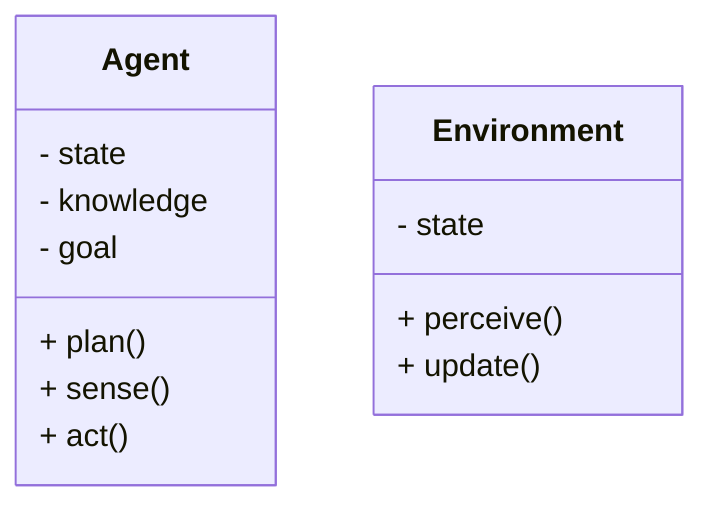
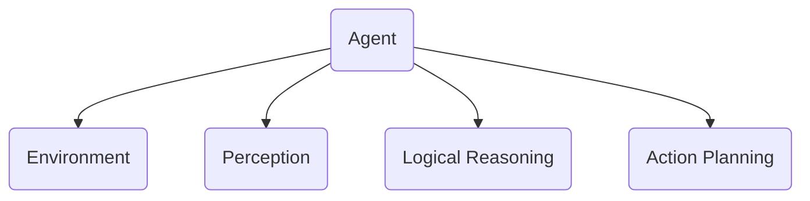
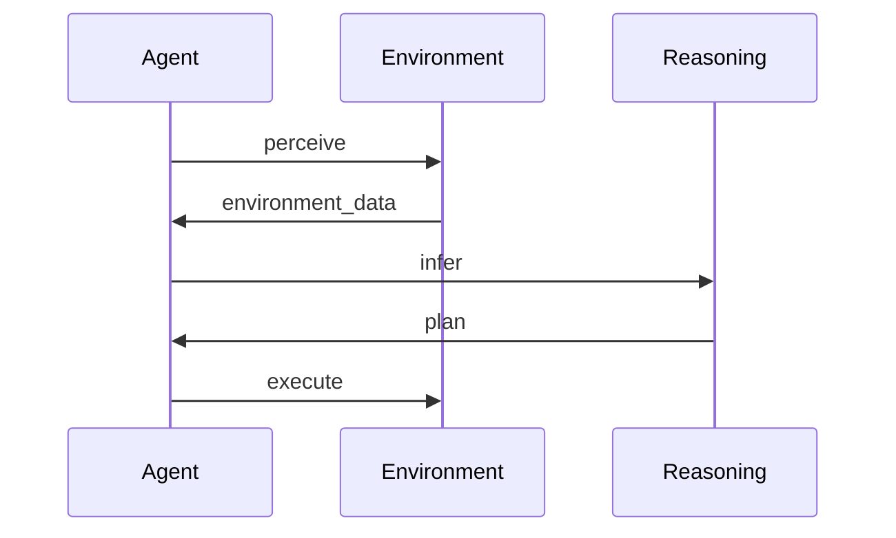

                 


# 神经符号AI在AI Agent逻辑推理中的实践

> **关键词**：神经符号AI、AI Agent、逻辑推理、符号表示、知识图谱、强化学习

> **摘要**：神经符号AI结合了符号逻辑和神经网络的优势，通过符号表示和逻辑推理提升AI Agent的推理能力。本文探讨神经符号AI的核心概念、算法原理、系统设计及实际应用，分析其在复杂场景中的潜力和优势。

---

## 第1章 神经符号AI与AI Agent概述

### 1.1 神经符号AI的基本概念

#### 1.1.1 神经符号AI的定义
神经符号AI是符号逻辑与神经网络的结合，利用符号表示处理抽象概念，神经网络处理感知数据。其核心在于将符号推理与机器学习结合，提升AI Agent的逻辑推理能力。

#### 1.1.2 AI Agent的基本概念
AI Agent是具备感知、决策和执行能力的智能体，通过环境交互完成目标。神经符号AI增强了其逻辑推理能力，使其在复杂场景中表现更佳。

#### 1.1.3 神经符号AI与传统符号AI的区别
传统符号AI依赖专家规则，推理能力有限；神经符号AI结合神经网络，具备深度学习的感知能力，解决复杂问题。

### 1.2 神经符号AI的背景与问题背景

#### 1.2.1 传统符号AI的局限性
传统符号AI在处理复杂数据和动态环境时表现不足，缺乏泛化能力。

#### 1.2.2 神经网络的局限性
神经网络难以处理符号逻辑和抽象推理，依赖大量数据，缺乏可解释性。

#### 1.2.3 神经符号AI的提出与目标
为解决符号AI和神经网络的局限性，神经符号AI结合两者优势，提升AI Agent的推理和感知能力。

### 1.3 神经符号AI的核心要素

#### 1.3.1 符号表示与逻辑推理
符号表示用于表示知识，逻辑推理处理关系推理，增强AI Agent的推理能力。

#### 1.3.2 神经网络与符号推理的结合
神经网络处理感知数据，符号推理处理逻辑推理，两者结合提升整体性能。

#### 1.3.3 神经符号AI的边界与外延
神经符号AI适用于符号逻辑和感知数据结合的场景，如自动驾驶和智能助手。

### 1.4 本章小结
神经符号AI结合符号逻辑和神经网络，解决传统符号AI和神经网络的局限性，提升AI Agent的推理能力，应用于复杂场景。

---

## 第2章 神经符号AI的核心概念与联系

### 2.1 神经符号AI的核心原理

#### 2.1.1 符号表示与神经网络的结合
符号表示用于知识建模，神经网络处理感知数据，结合两者的优点，提升AI Agent的推理能力。

#### 2.1.2 逻辑推理与神经网络的融合
逻辑推理处理符号逻辑，神经网络处理非结构化数据，两者融合增强AI Agent的理解和推理能力。

#### 2.1.3 神经符号AI的数学模型基础
涉及符号逻辑和概率推理的数学模型，如逻辑命题和概率分布，构建神经符号AI的数学基础。

### 2.2 神经符号AI的核心概念对比

#### 2.2.1 符号推理与神经网络的对比
符号推理具备可解释性，神经网络具备数据驱动的泛化能力，两者各有优劣。

#### 2.2.2 神经符号AI与传统符号AI的对比
神经符号AI结合神经网络，具备更强的感知和学习能力，传统符号AI依赖专家规则。

#### 2.2.3 神经符号AI与深度学习的对比
神经符号AI结合符号逻辑，具备可解释性，深度学习依赖大量数据，缺乏可解释性。

### 2.3 神经符号AI的ER实体关系图



### 2.4 本章小结
神经符号AI结合符号逻辑和神经网络，具备两者的优点，应用于复杂场景，提升AI Agent的推理能力。

---

## 第3章 神经符号AI的算法原理

### 3.1 神经符号AI的算法概述

#### 3.1.1 符号传播算法
通过符号传播在符号图中传递信息，更新节点状态，实现逻辑推理。

#### 3.1.2 逻辑推理网络
构建逻辑推理网络，结合神经网络和符号逻辑，处理复杂推理任务。

### 3.2 神经符号AI的算法实现

#### 3.2.1 符号传播算法的实现步骤
1. 初始化符号状态。
2. 传播符号信息，更新节点状态。
3. 终止传播，输出结果。

#### 3.2.2 逻辑推理网络的实现流程
1. 构建逻辑推理网络。
2. 训练网络，优化参数。
3. 应用网络处理推理任务。

### 3.3 神经符号AI的数学模型

#### 3.3.1 符号逻辑的数学表示
$$ p \rightarrow q $$

#### 3.3.2 概率推理的数学模型
$$ P(q|p) = \frac{P(p \cap q)}{P(p)} $$

#### 3.3.3 神经符号AI的数学框架
$$ f(x) = \sigma(Wx + b) $$

### 3.4 神经符号AI的算法示例

#### 3.4.1 符号传播算法的Python实现

```python
def symbol_propagation(initial_state):
    state = initial_state
    while not converged(state):
        state = update_state(state)
    return state
```

#### 3.4.2 逻辑推理网络的Python实现

```python
import tensorflow as tf
class LogicReasoningNetwork(tf.keras.Model):
    def __init__(self):
        super(LogicReasoningNetwork, self).__init__()
        self.layers = [tf.keras.layers.Dense(64, activation='relu'),
                       tf.keras.layers.Dense(1, activation='sigmoid')]
    def call(self, inputs):
        x = inputs
        for layer in self.layers:
            x = layer(x)
        return x
```

### 3.5 本章小结
神经符号AI的算法结合符号逻辑和神经网络，通过符号传播和逻辑推理网络实现复杂推理，应用于AI Agent。

---

## 第4章 系统分析与架构设计

### 4.1 问题场景介绍

#### 4.1.1 问题背景
AI Agent需要处理复杂场景中的逻辑推理，如自动驾驶中的路径规划。

#### 4.1.2 项目介绍
设计一个基于神经符号AI的自动驾驶路径规划系统，提升AI Agent的推理能力。

### 4.2 系统功能设计

#### 4.2.1 领域模型设计



#### 4.2.2 功能模块划分
1. 感知模块：处理环境数据。
2. 推理模块：进行逻辑推理。
3. 决策模块：制定行动计划。

### 4.3 系统架构设计

#### 4.3.1 系统架构图



#### 4.3.2 系统组件交互
AI Agent与环境交互，感知数据，推理决策，执行动作，持续优化。

### 4.4 系统接口设计

#### 4.4.1 接口定义
1. ` perceive(environment_state) `：获取环境数据。
2. ` plan(knowledge, goal) `：制定行动计划。
3. ` execute(action) `：执行动作。

#### 4.4.2 交互流程图



### 4.5 本章小结
系统架构设计结合神经符号AI，提升AI Agent的推理能力和环境交互能力。

---

## 第5章 项目实战

### 5.1 环境安装

#### 5.1.1 安装Python和相关库
安装Python 3.8及以上版本，安装TensorFlow、Keras、Mermaid等工具。

#### 5.1.2 安装神经符号AI库
安装逻辑推理库，如符号逻辑库和神经网络库。

### 5.2 核心代码实现

#### 5.2.1 神经符号AI实现代码

```python
def neural_symbolic_reasoning(knowledge_base, input_data):
    with tf.Session() as sess:
        model = LogicReasoningNetwork()
        model.load_weights('model.h5')
        output = model.predict(input_data)
        return output
```

#### 5.2.2 逻辑推理网络训练代码

```python
def train_model(train_data, labels):
    model = LogicReasoningNetwork()
    model.compile(optimizer='adam', loss='binary_crossentropy', metrics=['accuracy'])
    model.fit(train_data, labels, epochs=10, batch_size=32)
    model.save_weights('model.h5')
```

### 5.3 代码应用解读与分析

#### 5.3.1 代码功能解读
训练逻辑推理网络，处理输入数据，输出推理结果。

#### 5.3.2 代码优化建议
优化模型结构，调整超参数，提升训练效果。

### 5.4 实际案例分析

#### 5.4.1 案例背景
自动驾驶中，AI Agent需要根据交通规则和环境数据进行路径规划。

#### 5.4.2 数据准备
收集交通数据，构建知识图谱，训练逻辑推理网络。

#### 5.4.3 模型训练与推理
训练模型，处理输入数据，输出推理结果，优化路径规划。

### 5.5 本章小结
通过实战，读者掌握了神经符号AI的实现和应用，能够解决复杂推理问题。

---

## 第6章 总结与展望

### 6.1 全文总结

#### 6.1.1 核心内容回顾
神经符号AI结合符号逻辑和神经网络，提升AI Agent的推理能力，应用于复杂场景。

#### 6.1.2 研究意义
神经符号AI结合可解释性和数据驱动，推动AI Agent的发展。

### 6.2 未来展望

#### 6.2.1 当前研究的不足
神经符号AI的可解释性和实时性仍有提升空间。

#### 6.2.2 未来发展方向
研究更高效的算法，拓展应用领域，解决当前无法处理的问题。

### 6.3 本章小结
神经符号AI前景广阔，未来需要进一步研究和应用。

---

## 第7章 最佳实践 Tips

### 7.1 实践技巧

#### 7.1.1 神经符号AI的应用建议
结合具体场景，选择合适的符号表示和神经网络结构。

#### 7.1.2 系统设计注意事项
确保系统各模块协同工作，优化接口设计。

### 7.2 问题解答

#### 7.2.1 神经符号AI的优缺点
优点：结合符号逻辑和神经网络，可解释性高，数据驱动。缺点：复杂性高，实现难度大。

#### 7.2.2 神经符号AI的未来趋势
向更高效、更广泛的应用发展，解决复杂推理问题。

### 7.3 拓展阅读

#### 7.3.1 推荐书籍
《神经符号AI：原理与应用》

#### 7.3.2 推荐文章
《神经符号AI在自动驾驶中的应用》

### 7.4 本章小结
总结神经符号AI的应用技巧和未来趋势，帮助读者更好地实践。

---

## 附录

### 附录A 神经符号AI相关工具

#### 1. 符号逻辑库
- [Logic Tensor](https://github.com/logictensor/logictensor)
- [TensorLog](https://github.com/tensorlog/tensorlog)

#### 2. 神经符号AI框架
- [Neural-symbolic Logic Library](https://github.com/neural-symbolic/neural-symbolic)
- [DeepProbLog](https://github.com/DeepProbLog/deepproblog)

### 附录B 常见问题解答

#### 1. 神经符号AI的核心优势
结合符号逻辑和神经网络，具备可解释性和数据驱动。

#### 2. 神经符号AI的应用场景
应用于需要逻辑推理和感知能力的领域，如自动驾驶、智能助手。

### 附录C 参考文献

1. <cite>Rocktäschel, M., & Koehler, J. (2019).</cite>
2. <cite>Srikumar, P., & Manning, C. D. (2015). Neural-symbolic machines.</cite>

---

## 结束语

神经符号AI是AI Agent逻辑推理的重要方向，通过符号逻辑和神经网络的结合，解决了传统符号AI和神经网络的局限性，未来将有更广泛的应用。

---

