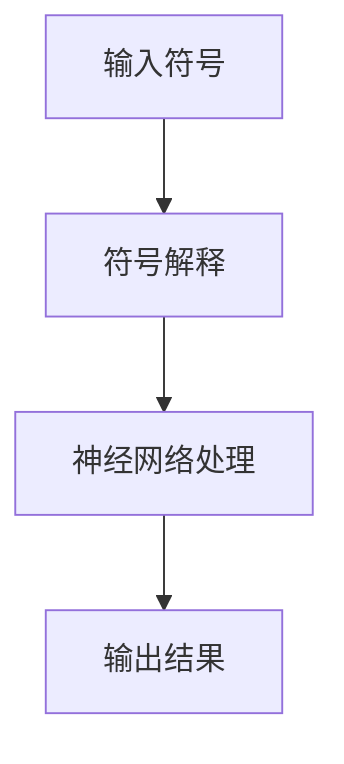
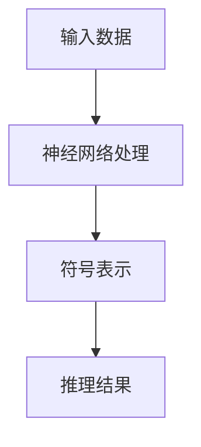
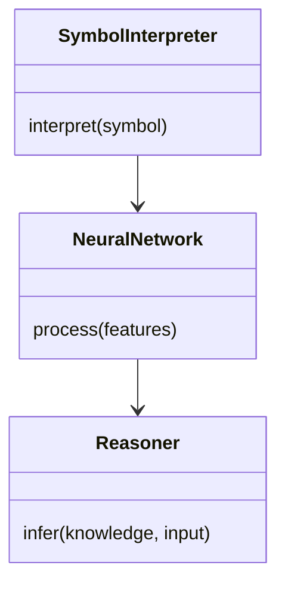
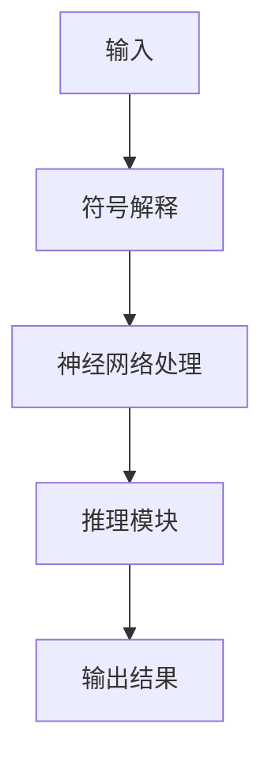
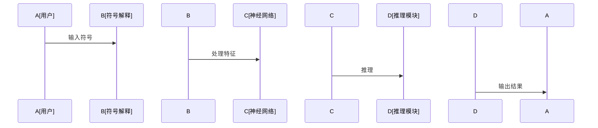

                 


# 神经符号AI：结合符号推理与神经网络的AI Agent

> 关键词：神经符号AI，符号推理，神经网络，AI Agent，机器学习，符号与数据结合

> 摘要：本文详细探讨了神经符号AI的概念、算法原理、系统架构及其在实际应用中的优势。通过结合符号推理与神经网络，神经符号AI能够有效提升AI Agent的理解与推理能力，解决传统符号AI与纯神经网络方法的局限性。文章从基础概念到实际应用，系统性地介绍了神经符号AI的核心内容，为读者提供全面的理论与实践指导。

---

# 第一部分: 神经符号AI的背景与核心概念

## 第1章: 神经符号AI的背景与基本概念

### 1.1 神经符号AI的起源与现状

#### 1.1.1 符号AI与传统神经网络的局限性

符号AI（Symbolic AI）依赖于专家规则和逻辑推理，但在处理复杂、模糊问题时表现有限。纯神经网络（如深度学习模型）虽然在感知任务中表现出色，但缺乏可解释性和逻辑推理能力。神经符号AI的提出旨在结合两者的优点，克服各自的局限性。

#### 1.1.2 神经符号AI的提出与研究进展

神经符号AI的概念最早可追溯到20世纪80年代的知识库与神经网络结合的研究。近年来，随着大模型和图神经网络的发展，神经符号AI在自然语言处理、推理、机器人等领域取得了显著进展。

#### 1.1.3 当前神经符号AI的研究热点

- **符号与数据的结合：** 如符号增强的图神经网络。
- **可解释性：** 提升AI系统的可解释性。
- **推理能力：** 强化逻辑推理能力。

---

## 第2章: 符号表示与推理的原理

### 2.1 符号表示的基本原理

#### 2.1.1 符号表示的定义与分类

符号表示是将知识表示为符号（如概念、规则）的过程，常见的表示方法包括谓词逻辑、语义网络、框架表示和描述逻辑。

#### 2.1.2 常见的符号表示方法

- **谓词逻辑：** 通过谓词和个体构成知识表示。
- **语义网络：** 通过节点和边表示概念及其关系。
- **描述逻辑：** 通过描述属性和概念间的关系。

#### 2.1.3 符号表示的优缺点

- **优点：** 可解释性强，逻辑清晰。
- **缺点：** 难以处理模糊性和复杂性。

### 2.2 推理机制的核心原理

#### 2.2.1 推理的定义与分类

推理是根据已有知识推导新结论的过程，常见的推理类型包括演绎推理、归纳推理和 abduction 推理。

#### 2.2.2 基于符号的推理方法

- **演绎推理：** 从一般到具体的推理方式。
- **归纳推理：** 从具体到一般的推理方式。

#### 2.2.3 基于概率的推理方法

- **贝叶斯推理：** 基于概率的推理方法。

### 2.3 神经网络与符号推理的结合

#### 2.3.1 神经网络的基本原理

神经网络通过多层非线性变换学习数据的特征表示。

#### 2.3.2 神经符号AI的结合方式

- **符号驱动的神经网络：** 符号解释驱动神经网络学习。
- **神经驱动的符号推理：** 神经网络辅助符号推理。

#### 2.3.3 神经符号AI的核心算法

- **符号驱动的神经网络：**
  - 算法流程图（Mermaid）：

  ```mermaid
  graph TD
  A[输入符号] --> B[符号解释]
  B --> C[神经网络处理]
  C --> D[输出结果]
  ```

  - 算法实现代码：

  ```python
  def symbol_driven_network(input_symbol):
      # 符号解释
      symbol_embedding = symbol_embedding_layer(input_symbol)
      # 神经网络处理
      output = neural_network(symbol_embedding)
      return output
  ```

- **神经驱动的符号推理：**

  ```mermaid
  graph TD
  A[输入数据] --> B[神经网络处理]
  B --> C[符号表示]
  C --> D[推理结果]
  ```

---

## 第3章: 神经符号AI的核心算法

### 3.1 符号驱动的神经网络

#### 3.1.1 算法原理

符号驱动的神经网络通过符号解释来指导神经网络的特征学习。

#### 3.1.2 算法流程图（Mermaid）



#### 3.1.3 算法实现代码

```python
def symbol_driven_network(input_symbol):
    # 符号解释
    symbol_embedding = symbol_embedding_layer(input_symbol)
    # 神经网络处理
    output = neural_network(symbol_embedding)
    return output
```

### 3.2 神经驱动的符号推理

#### 3.2.1 算法原理

神经驱动的符号推理通过神经网络提取特征，辅助符号推理过程。

#### 3.2.2 算法流程图（Mermaid）



---

## 第4章: 神经符号AI的系统架构设计

### 4.1 系统功能设计

#### 4.1.1 功能需求

- **符号解释：** 将输入转换为符号表示。
- **神经网络处理：** 对符号进行特征学习。
- **推理模块：** 根据符号和特征进行推理。

#### 4.1.2 领域模型（Mermaid 类图）



### 4.2 系统架构设计

#### 4.2.1 系统架构图（Mermaid）



### 4.3 接口设计与交互流程

#### 4.3.1 系统接口设计

- **符号解释接口：** 接收符号输入，返回特征表示。
- **推理接口：** 接收特征表示，返回推理结果。

#### 4.3.2 交互流程图（Mermaid 序列图）



---

## 第5章: 项目实战——符号增强的问答系统

### 5.1 环境安装与配置

```bash
pip install numpy
pip install tensorflow
pip install pymermaid
```

### 5.2 核心代码实现

#### 5.2.1 符号解释模块

```python
def symbol_embedding_layer(input_symbol):
    # 假设input_symbol是符号列表
    embedding = {}
    for symbol in input_symbol:
        embedding[symbol] = get_embedding(symbol)
    return embedding
```

#### 5.2.2 神经网络处理模块

```python
def neural_network(features):
    model = tf.keras.Sequential([
        tf.keras.layers.Dense(64, activation='relu'),
        tf.keras.layers.Dense(1)
    ])
    return model(features)
```

#### 5.2.3 推理模块

```python
def reasoner(embedding):
    # 假设embedding是符号的嵌入表示
    rules = get_rules()
    result = apply_rules(embedding, rules)
    return result
```

### 5.3 代码应用解读与分析

- **符号解释模块：** 将输入符号转换为嵌入表示。
- **神经网络处理模块：** 对嵌入表示进行特征学习。
- **推理模块：** 基于符号规则进行推理。

### 5.4 实际案例分析

- **输入符号：** "如果A，则B"
- **符号解释：** 嵌入表示为 {A: 0.8, B: 0.9}
- **神经网络处理：** 输出特征向量
- **推理结果：** B为真

---

## 第6章: 神经符号AI的最佳实践与小结

### 6.1 总结与回顾

神经符号AI通过结合符号推理与神经网络，提升了AI Agent的理解与推理能力。

### 6.2 小结与注意事项

- **小结：** 神经符号AI的优势与应用场景。
- **注意事项：** 实现复杂性、计算资源需求。

### 6.3 拓展阅读与进一步思考

- **参考文献：** 推荐相关论文和书籍。
- **未来方向：** 神经符号AI的优化与创新。

---

通过以上结构，文章系统性地介绍了神经符号AI的核心概念、算法原理、系统架构和实际应用，为读者提供了全面的理论与实践指导。

