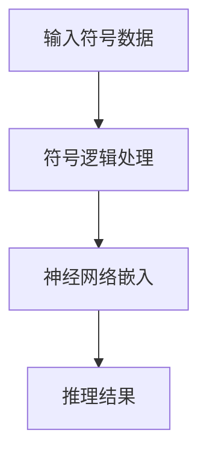
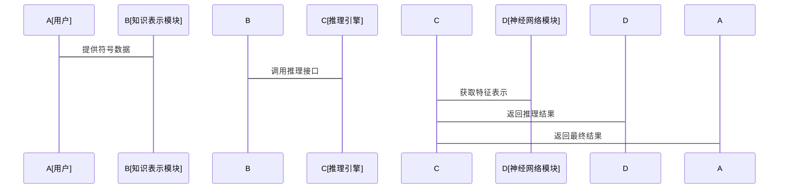

                 


# 神经符号推理：增强AI Agent的逻辑分析能力

> 关键词：神经符号推理、符号逻辑、神经网络、AI Agent、逻辑推理、知识表示

> 摘要：神经符号推理是一种结合了符号逻辑和神经网络的技术，旨在增强AI Agent的逻辑分析能力。本文将从背景、核心概念、算法原理、系统架构到项目实战，全面解析神经符号推理的理论与实践。

---

## 第一部分: 神经符号推理基础

### 第1章: 神经符号推理概述

#### 1.1 神经符号推理的背景与意义
- **问题背景**: 传统符号推理在处理复杂问题时灵活性不足，而神经网络在非结构化数据处理上表现优异，但缺乏逻辑推理能力。
- **定义**: 神经符号推理是通过将符号逻辑嵌入神经网络，结合两者的优点，实现更强大的推理能力。
- **目标**: 提升AI Agent在复杂场景中的逻辑分析和决策能力。

#### 1.2 神经符号推理的特点
- **符号与神经的结合**: 利用符号逻辑的可解释性和神经网络的泛化能力。
- **端到端学习**: 神经网络通过端到端训练，符号逻辑提供推理框架。
- **跨领域应用**: 适用于自然语言处理、机器人控制等领域。

#### 1.3 应用场景
- **AI Agent**: 需要逻辑推理能力的智能体，如自动驾驶、智能助手。
- **自然语言处理**: 结合符号逻辑进行语义理解。
- **机器人控制**: 增强机器人的逻辑推理能力。

#### 1.4 边界与外延
- **适用范围**: 适用于需要符号逻辑和神经网络结合的任务。
- **局限性**: 神经符号推理目前仍面临训练数据依赖性强、推理速度慢等问题。
- **与其他技术的结合**: 可与强化学习、知识图谱等技术结合，拓展应用范围。

---

### 第2章: 神经符号推理的核心概念与联系

#### 2.1 符号逻辑与神经网络的结合
- **符号逻辑**: 通过规则和逻辑推理解决问题。
- **神经网络**: 通过数据学习模式和特征。
- **结合**: 神经网络处理输入数据，符号逻辑提供推理框架。

#### 2.2 实体关系图


#### 2.3 算法流程图


---

## 第3章: 神经符号推理的算法原理

### 3.1 数学模型
- **符号逻辑的表示**: 使用一阶逻辑（FOL）表示符号知识。
- **神经网络的表示**: 使用深度神经网络（DNN）处理符号和非符号数据。
- **联合优化**: 通过端到端训练，优化符号逻辑和神经网络的结合。

### 3.2 算法流程
1. **符号逻辑预处理**: 将符号逻辑转化为神经网络可处理的形式。
2. **神经网络训练**: 使用标注数据训练神经网络。
3. **推理过程**: 神经网络生成中间表示，符号逻辑引擎进行推理。

### 3.3 代码实现
```python
def neural_symbolic_reasoning(input_symbols):
    # 符号逻辑处理
    symbols = process_symbols(input_symbols)
    # 神经网络嵌入
    embeddings = neural_network(symbols)
    # 推理结果
    result = inference(embeddings)
    return result
```

### 3.4 数学模型
- **符号逻辑**: 使用谓词逻辑表示知识。
- **神经网络**: 使用深度网络处理输入数据。
- **联合优化**: 通过优化器（如Adam）优化目标函数。

---

## 第4章: 神经符号推理的系统分析与架构设计

### 4.1 系统功能设计
- **知识表示模块**: 负责符号逻辑的表示和转换。
- **推理引擎模块**: 负责符号逻辑的推理。
- **神经网络模块**: 负责数据的特征提取和预测。

### 4.2 系统架构


### 4.3 系统接口与交互


---

## 第5章: 项目实战

### 5.1 环境安装
```bash
pip install neural-symbolic
```

### 5.2 核心功能实现
```python
class NeuralSymbolic:
    def __init__(self):
        self.neural_network = NeuralNetwork()
        self.symbolic_logic = SymbolicLogic()

    def process(self, input):
        symbols = self.symbolic_logic.preprocess(input)
        embeddings = self.neural_network.embed(symbols)
        result = self.symbolic_logic.inference(embeddings)
        return result
```

### 5.3 案例分析
- **输入**: 符号逻辑问题。
- **输出**: 推理结果。
- **分析**: 神经符号推理如何结合符号逻辑和神经网络解决问题。

---

## 第6章: 总结与展望

### 6.1 总结
神经符号推理结合了符号逻辑的可解释性和神经网络的泛化能力，能够显著提升AI Agent的逻辑分析能力。

### 6.2 展望
未来，神经符号推理将在更多领域得到应用，并与强化学习、知识图谱等技术结合，进一步增强AI的能力。

---

通过以上结构，您可以逐步展开每一部分的内容，详细阐述神经符号推理的各个方面，确保文章的深度和可读性。

