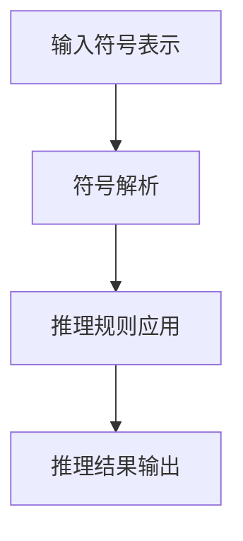
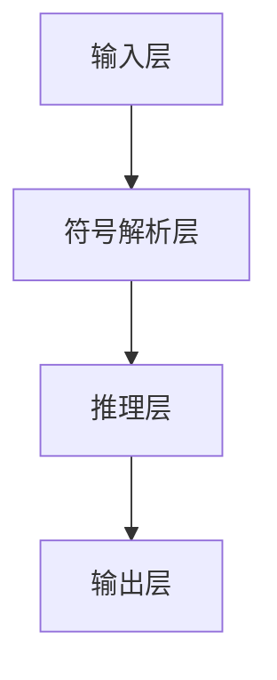
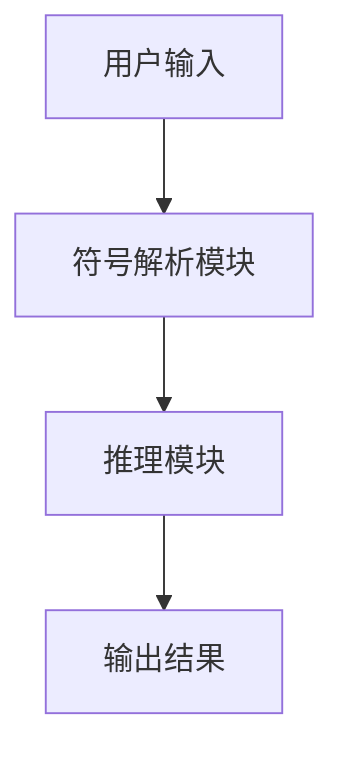

                 


# 神经符号推理：增强AI Agent的逻辑能力

## 关键词：
神经符号推理，AI Agent，符号推理，神经网络，逻辑能力，机器学习，深度学习

## 摘要：
神经符号推理是一种结合了符号推理和神经网络的新兴技术，旨在提升AI Agent的逻辑推理能力。本文将从背景、核心概念、算法原理、系统架构、项目实战等方面详细讲解神经符号推理，帮助读者全面理解其工作原理和应用价值。

---

# 第一部分: 神经符号推理的背景与概念

## 第1章: 神经符号推理的背景与概念

### 1.1 神经符号推理的背景
神经符号推理是人工智能领域的一个重要研究方向，旨在结合符号推理的逻辑性与神经网络的感知能力，解决传统符号推理在灵活性和泛化能力上的不足。随着深度学习的快速发展，神经符号推理逐渐成为提升AI Agent智能水平的关键技术。

### 1.2 神经符号推理的核心概念
神经符号推理是一种结合符号逻辑和神经网络的推理方法，通过将符号表示与神经网络的特征学习相结合，实现更强大的逻辑推理能力。

---

# 第二部分: 神经符号推理的核心概念与联系

## 第2章: 神经符号推理的核心概念与联系

### 2.1 符号推理与神经网络的结合
符号推理通过逻辑规则进行推理，而神经网络擅长从数据中学习特征。神经符号推理将两者结合，利用符号逻辑指导神经网络的学习，同时利用神经网络的感知能力增强符号推理的灵活性。

### 2.2 神经符号推理的核心属性特征对比
| 特性         | 符号推理                 | 神经网络                 |
|--------------|--------------------------|--------------------------|
| 表达方式     | 基于逻辑规则和符号       | 基于向量表示和神经网络     |
| 可解释性     | 高                     | 较低                   |
| 灵活性       | 低                     | 高                     |
| 学习方式     | 需要手动定义规则         | 可以从数据中自动学习       |

### 2.3 ER实体关系图架构
```mermaid
graph LR
A[符号推理] --> B[神经网络]
B --> C[神经符号推理]
D[符号表示] --> C
E[推理规则] --> C
F[推理结果] <-- C
```

---

# 第三部分: 神经符号推理的算法原理

## 第3章: 神经符号推理的算法原理

### 3.1 神经符号推理的基本算法
神经符号推理的基本算法包括符号表示、注意力机制和推理规则的应用。通过将符号表示转换为向量形式，利用神经网络进行特征学习，并结合推理规则进行最终推理。

### 3.2 神经符号推理的数学模型
符号表示的向量形式：
$$ s \in \mathbb{R}^d $$
推理过程：
$$ r = f(s_1, s_2, ..., s_n) $$
其中，$s_i$ 是符号表示，$f$ 是推理函数。

### 3.3 算法流程图


---

# 第四部分: 神经符号推理的系统架构设计

## 第4章: 神经符号推理的系统架构设计

### 4.1 系统架构概述
神经符号推理系统通常包括输入层、符号解析层、推理层和输出层。输入层接收符号表示，符号解析层将其转换为向量形式，推理层结合推理规则进行推理，输出层生成最终结果。

### 4.2 系统架构图


### 4.3 系统交互流程图


---

# 第五部分: 神经符号推理的项目实战

## 第5章: 神经符号推理的项目实战

### 5.1 环境安装与配置
安装必要的依赖库，如TensorFlow、Keras等，并配置开发工具。

### 5.2 核心模块实现
实现符号解析模块、推理模块和输出模块。例如，符号解析模块将符号表示转换为向量形式。

### 5.3 项目实战代码
```python
import tensorflow as tf
from tensorflow import keras

# 符号表示
symbols = ['A', 'B', 'C']

# 符号解析模块
def symbol_to_vector(symbol):
    return tf.keras.utils.to_categorical(symbol, len(symbols))

# 推理模块
def infer(symbols):
    vectors = [symbol_to_vector(s) for s in symbols]
    # 推理过程
    model = tf.keras.Sequential([
        tf.keras.layers.Dense(16, activation='relu'),
        tf.keras.layers.Dense(1, activation='sigmoid')
    ])
    result = model.predict(tf.stack(vectors))
    return result

# 输出模块
def output_result(result):
    print("推理结果为：", result)
```

### 5.4 实际案例分析
以推理任务为例，展示如何使用上述代码进行符号解析、推理和输出。

---

# 第六部分: 总结与扩展阅读

## 第6章: 总结与扩展阅读

### 6.1 总结
神经符号推理通过结合符号推理和神经网络，显著提升了AI Agent的逻辑推理能力。本文详细介绍了其背景、核心概念、算法原理、系统架构和项目实战。

### 6.2 扩展阅读
- 推荐阅读相关论文和书籍，深入了解神经符号推理的最新研究成果。
- 参加相关技术交流会，与同行探讨技术细节和应用案例。

---

通过以上目录结构，读者可以系统地学习神经符号推理的基本概念、算法原理和实际应用，全面掌握如何增强AI Agent的逻辑能力。

