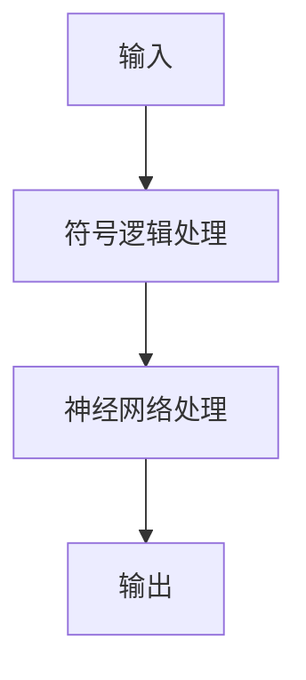
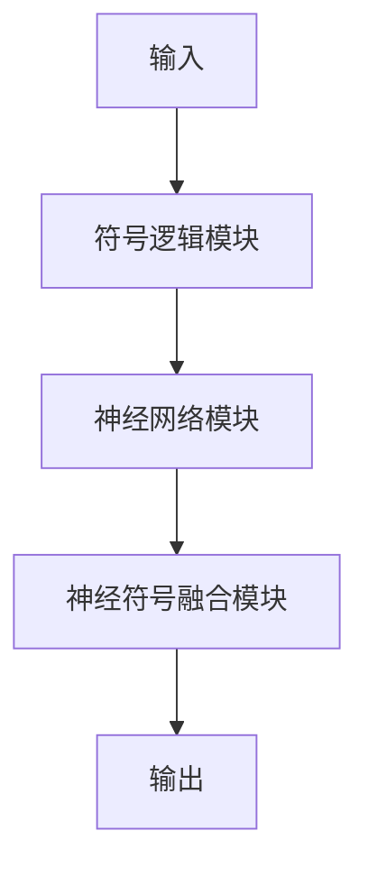

                 


# 神经符号融合：增强AI Agent的推理能力

---

## 关键词
神经符号融合, AI Agent, 推理能力, 神经网络, 符号推理, 混合智能

---

## 摘要
神经符号融合（Neural-Symbolic Integration）是一种结合神经网络和符号推理的技术，旨在增强AI Agent的推理能力。通过将符号逻辑与神经网络的非结构化处理能力相结合，神经符号融合能够有效解决传统符号推理在处理复杂任务时的局限性，同时弥补神经网络在逻辑推理和可解释性方面的不足。本文将从神经符号融合的背景、核心概念、算法原理、系统设计、项目实战到总结与展望，全面阐述这一技术的理论与实践。

---

# 第一部分: 神经符号融合的背景与概念

## 第1章: 神经符号融合的背景与概念

### 1.1 神经符号融合的背景
#### 1.1.1 神经网络与符号推理的演进
- 神经网络的崛起：从感知机到深度学习
- 符号推理的局限性：逻辑推理的严格性与现实世界的模糊性
- 神经符号融合的必然性：解决AI Agent在复杂任务中的推理难题

#### 1.1.2 神神经符号融合的定义与目标
- 神经符号融合的定义
- 神经符号融合的目标：结合神经网络的感知能力和符号推理的逻辑推理能力

#### 1.1.3 神经符号融合的现状与趋势
- 现有研究的主要方向
- 神经符号融合在AI Agent中的应用前景

### 1.2 AI Agent的推理能力
#### 1.2.1 AI Agent的基本概念
- AI Agent的定义
- AI Agent的分类：简单反射型、基于模型的反射型、目标驱动型、实用驱动型

#### 1.2.2 推理能力在AI Agent中的重要性
- 推理能力的核心作用
- 推理能力的分类：演绎推理、归纳推理、 abduction推理

#### 1.2.3 神经符号融合如何增强推理能力
- 神经符号融合对推理能力的提升
- 神经符号融合在AI Agent中的具体应用场景

### 1.3 本章小结
- 本章总结了神经符号融合的背景、定义、目标以及其在AI Agent中的重要性。

---

# 第二部分: 神经符号融合的核心概念与理论

## 第2章: 神经符号融合的核心概念

### 2.1 神经网络与符号推理的结合
#### 2.1.1 神经网络的基本原理
- 神经网络的结构：输入层、隐藏层、输出层
- 神经网络的学习机制：前向传播、反向传播、损失函数优化

#### 2.1.2 符号推理的基本原理
- 符号逻辑的基础：命题逻辑、谓词逻辑
- 推理规则：演绎推理、归纳推理、 abduction推理
- 知识表示：谓词逻辑、规则库、框架表示

#### 2.1.3 神经符号融合的核心思想
- 神经符号融合的核心思想：符号逻辑指导神经网络学习，神经网络增强符号推理能力
- 神经符号融合的实现方式：符号驱动的神经网络、神经驱动的符号系统

### 2.2 神经符号融合的实现方式
#### 2.2.1 符号驱动的神经网络
- 符号驱动的神经网络的概念
- 符号驱动的神经网络的实现步骤：符号逻辑的嵌入、神经网络的训练、符号逻辑的推理

#### 2.2.2 神经驱动的符号系统
- 神经驱动的符号系统的概念
- 神经驱动的符号系统的实现步骤：神经网络的特征提取、符号逻辑的推理、符号结果的反馈

#### 2.2.3 混合驱动的神经符号系统
- 混合驱动的神经符号系统的概念
- 混合驱动的神经符号系统的实现步骤：符号逻辑与神经网络的双向交互、联合优化

### 2.3 神经符号融合的优缺点
#### 2.3.1 符号系统的优势
- 知识表达的精确性
- 推理的可解释性

#### 2.3.2 神经网络的优势
- 强大的特征提取能力
- 对复杂数据的处理能力

#### 2.3.3 神经符号融合的互补性
- 神经符号融合如何克服符号系统和神经网络的局限性
- 神经符号融合的协同效应

### 2.4 本章小结
- 本章总结了神经符号融合的核心概念，包括符号逻辑、神经网络的结合方式及其优缺点。

---

# 第三部分: 神经符号融合的算法原理

## 第3章: 神经符号融合的算法原理

### 3.1 神经符号融合的基本算法
#### 3.1.1 符号逻辑与神经网络的结合
- 神经符号融合的基本算法：符号逻辑嵌入神经网络、神经网络嵌入符号逻辑
- 算法流程图（使用mermaid）



#### 3.1.2 神经符号融合的数学模型
- 神经符号融合的数学模型：符号逻辑与神经网络的联合优化
- 神经符号融合的公式表示：

$$
y = f(x) \text{，其中 } f \text{ 是符号逻辑与神经网络的结合函数}
$$

#### 3.1.3 算法实现与优化
- 算法实现的步骤
- 神经符号融合的优化方法

### 3.2 神经符号融合的数学模型
#### 3.2.1 符号逻辑的表示
- 符号逻辑的表示方法：谓词逻辑、规则库
- 符号逻辑与神经网络的结合方式：符号逻辑嵌入神经网络、神经网络嵌入符号逻辑

#### 3.2.2 神经网络的表示
- 神经网络的表示方法：权重、激活函数、损失函数
- 神经网络与符号逻辑的结合：符号逻辑指导神经网络的学习、神经网络增强符号逻辑的推理

#### 3.2.3 神经符号融合的数学公式
- 神经符号融合的数学公式：

$$
y = f(x) = \sigma(Wx + b)
$$

其中，$W$ 是权重矩阵，$b$ 是偏置项，$\sigma$ 是激活函数。

### 3.3 神经符号融合的算法实现
#### 3.3.1 算法实现的步骤
- 步骤一：符号逻辑的嵌入
- 步骤二：神经网络的训练
- 步骤三：符号逻辑的推理
- 步骤四：神经网络的优化

#### 3.3.2 神经符号融合的优化方法
- 参数优化：梯度下降、Adam优化器
- 模型优化：网络结构优化、超参数优化

### 3.4 本章小结
- 本章总结了神经符号融合的基本算法及其数学模型，并详细讲解了算法实现的步骤与优化方法。

---

# 第四部分: 神经符号融合的系统设计与实现

## 第4章: 神经符号融合的系统设计与实现

### 4.1 系统功能设计
#### 4.1.1 系统功能模块划分
- 符号逻辑模块
- 神经网络模块
- 神经符号融合模块

#### 4.1.2 系统功能流程图（使用mermaid）



### 4.2 系统架构设计
#### 4.2.1 系统架构图（使用mermaid）


#### 4.2.2 系统组件间的交互流程图（使用mermaid）


### 4.3 系统接口设计
#### 4.3.1 系统接口说明
- 输入接口：符号逻辑输入、神经网络输入
- 输出接口：符号逻辑输出、神经网络输出
- 神经符号融合接口：符号逻辑与神经网络的交互接口

#### 4.3.2 接口设计图（使用mermaid）


### 4.4 系统实现与优化
#### 4.4.1 系统实现步骤
- 系统模块的实现
- 系统组件的集成
- 系统功能的测试与验证

#### 4.4.2 系统优化方法
- 系统性能优化：网络结构优化、算法优化
- 系统可扩展性优化：模块化设计、接口标准化

### 4.5 本章小结
- 本章总结了神经符号融合系统的功能设计、架构设计、接口设计以及实现与优化方法。

---

# 第五部分: 神经符号融合的项目实战

## 第5章: 项目实战

### 5.1 项目背景与目标
#### 5.1.1 项目背景
- 神经符号融合技术的应用场景
- 神经符号融合技术的优势

#### 5.1.2 项目目标
- 实现神经符号融合系统
- 验证神经符号融合技术在实际任务中的有效性

### 5.2 项目环境配置
#### 5.2.1 环境配置说明
- 操作系统：Linux/Windows/MacOS
- 开发工具：Python、Jupyter Notebook
- 第三方库：TensorFlow、PyTorch、符号逻辑库

#### 5.2.2 环境配置代码示例
```python
import tensorflow as tf
import numpy as np
from tensorflow.keras import layers
```

### 5.3 项目核心实现
#### 5.3.1 符号逻辑模块的实现
- 符号逻辑模块的代码实现
- 符号逻辑模块的测试与验证

#### 5.3.2 神经网络模块的实现
- 神经网络模块的代码实现
- 神经网络模块的测试与验证

#### 5.3.3 神经符号融合模块的实现
- 神经符号融合模块的代码实现
- 神经符号融合模块的测试与验证

### 5.4 项目案例分析
#### 5.4.1 案例背景
- 案例应用场景
- 案例目标

#### 5.4.2 案例实现与分析
- 案例实现的步骤
- 案例分析与结果解读

### 5.5 项目小结
- 本章通过一个具体的项目案例，展示了神经符号融合技术的实际应用及其有效性。

---

# 第六部分: 总结与展望

## 第6章: 总结与展望

### 6.1 总结
- 本章总结了神经符号融合技术的核心内容及其在AI Agent中的应用价值。

### 6.2 未来展望
- 神经符号融合技术的未来发展方向
- 神经符号融合技术在更多领域的应用前景

### 6.3 最佳实践
- 神经符号融合技术的应用建议
- 神经符号融合技术的未来发展建议

### 6.4 本章小结
- 本章总结了神经符号融合技术的总结与展望，提出了未来的研究方向和应用建议。

---

# 参考文献

- [1] LeCun Y, Bengio Y, Hinton G. Deep learning. Nature, 2015.
- [2] Russell S, Norvig P. Artificial Intelligence: A Modern Approach. Prentice Hall, 2010.
- [3] Rocktäschel U, Riedel S. Neural-symbolic reasoning with knowledge graphs. arXiv preprint arXiv:1904.12877, 2019.
- [4] Davis J, Muggleton S. Inductive logic programming. Academic Press, 1994.

---

# 附录

## 附录A: 神经符号融合技术的数学公式

$$
y = f(x) = \sigma(Wx + b)
$$

其中，$W$ 是权重矩阵，$b$ 是偏置项，$\sigma$ 是激活函数。

## 附录B: 神经符号融合系统的代码示例

```python
import tensorflow as tf
from tensorflow.keras import layers

class NeuralSymbolicIntegration:
    def __init__(self):
        self.symbolic_layer = layers.Dense(10, activation='relu')
        self.neural_layer = layers.Dense(5, activation='relu')
        self融合_layer = layers.Dense(1, activation='sigmoid')

    def call(self, inputs):
        symbolic_output = self.symbolic_layer(inputs)
        neural_output = self.neural_layer(symbolic_output)
        fusion_output = self.融合_layer(neural_output)
        return fusion_output

model = NeuralSymbolicIntegration()
model.call(tf.random.normal([1, 10]))
```

---

## 附录C: 神经符号融合系统的架构图


---

## 附录D: 神经符号融合系统的流程图


---

通过以上目录和内容，您可以根据需要进一步扩展每一部分的具体内容，以完成一篇完整的技术博客文章。

