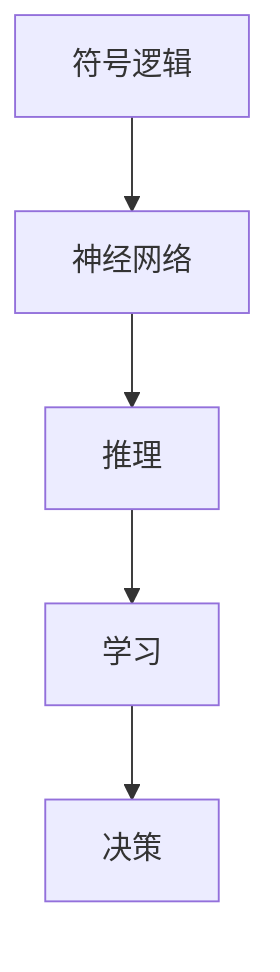
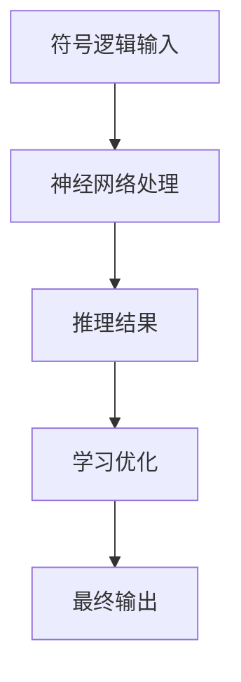
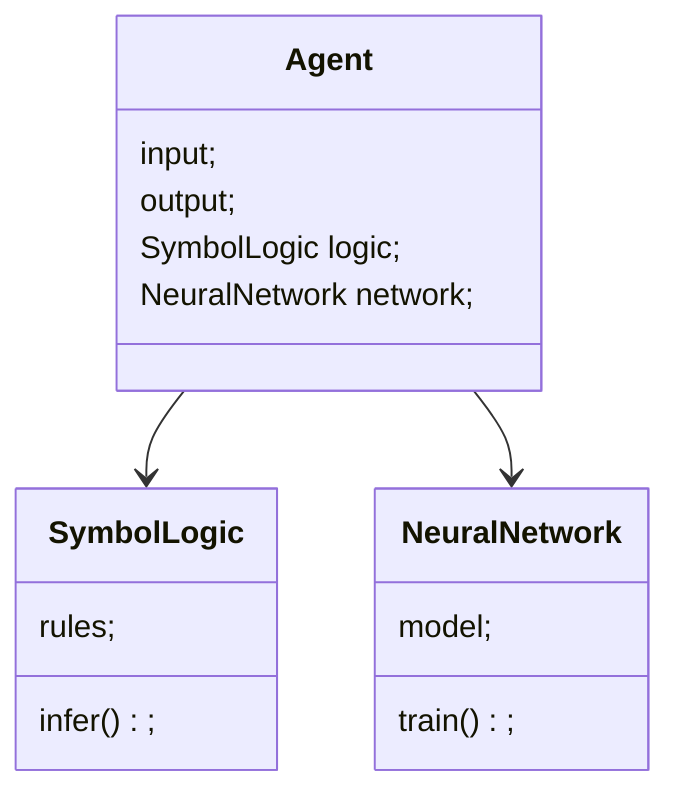
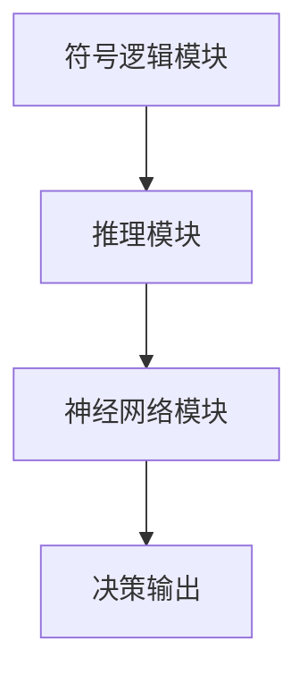

                 


# 神经符号融合：结合规则与学习的AI Agent

## 关键词：神经符号融合，AI Agent，符号推理，神经网络，规则学习，人工智能

## 摘要：神经符号融合是一种结合符号推理和神经网络学习的创新方法，旨在构建更智能的AI代理。本文详细介绍了神经符号融合的核心概念、算法原理、系统架构设计，以及实际项目案例，展示了如何将符号规则与机器学习相结合，推动AI技术的进步。

---

# 神经符号融合：结合规则与学习的AI Agent

## 第1章 神经符号融合的背景与问题背景

### 1.1 神经符号融合的背景介绍

人工智能（AI）技术的快速发展推动了各个领域的进步，但现有的AI系统通常面临两个极端：要么过于依赖规则，缺乏灵活性；要么依赖大量数据，缺乏推理能力。神经符号融合（Neural-Symbolic Integration）正是为了解决这些问题而诞生的一种创新方法。它结合了符号逻辑的精确性和神经网络的学习能力，旨在构建更智能、更灵活的AI代理。

#### 1.1.1 人工智能的发展历程

人工智能经历了多个阶段，从早期的专家系统到现在的深度学习，每一步都在推动技术的进步。专家系统基于符号逻辑，但在处理复杂问题时显得力不从心；而深度学习依赖大量数据，但在可解释性和推理能力上存在缺陷。神经符号融合试图将两者的优势结合起来，形成一种更强大的AI范式。

#### 1.1.2 神经符号融合的起源与现状

神经符号融合的概念最早可以追溯到20世纪80年代，但当时的计算能力和数据量有限，难以实现复杂的结合。近年来，随着深度学习的崛起和符号逻辑研究的深入，神经符号融合逐渐成为研究热点。目前，它已经在自然语言处理、机器人控制等领域展现出巨大的潜力。

#### 1.1.3 神经符号融合的必要性与优势

传统的AI方法各有局限，神经符号融合通过结合符号推理和机器学习，弥补了两者的不足。它能够处理符号逻辑的复杂推理，同时具备神经网络强大的学习能力，使AI系统更加灵活和智能。

### 1.2 神经符号融合的核心概念

神经符号融合的核心在于将符号逻辑与神经网络相结合，实现规则与学习的统一。它不仅能够处理结构化数据，还能在非结构化数据上进行推理，为AI代理提供了更强大的能力。

#### 1.2.1 神经符号融合的定义与特征

神经符号融合是一种将符号逻辑和神经网络结合的方法，其核心特征包括：

1. **可解释性**：符号逻辑的引入提高了系统的可解释性。
2. **学习能力**：神经网络的学习能力使系统能够适应新数据。
3. **推理能力**：结合符号推理和学习，系统能够进行复杂推理。

#### 1.2.2 神经符号融合的关键问题

神经符号融合涉及多个关键问题，包括符号表示、神经网络的可微分性、规则的可学习性等。解决这些问题需要在算法设计上进行创新，找到符号逻辑与神经网络的最佳结合点。

#### 1.2.3 神经符号融合的应用场景

神经符号融合在多个领域有广泛的应用，如智能问答系统、自动驾驶、机器人控制等。它尤其适用于需要结合规则和学习的复杂任务，能够在处理不确定性问题时表现出色。

---

## 第2章 神经符号融合的核心原理

神经符号融合的核心在于如何将符号逻辑融入神经网络中，使其能够进行推理和学习。本章将详细探讨神经符号融合的核心原理，包括符号逻辑与神经网络的结合方式，以及它们如何共同工作。

### 2.1 符号逻辑与神经网络的结合

符号逻辑通过规则和逻辑推理提供明确的语义信息，而神经网络通过学习数据模式提供强大的模式识别能力。将两者结合，可以实现符号规则的可解释性和神经网络的学习能力。

#### 2.1.1 符号逻辑的基本概念

符号逻辑通过符号和规则表示知识，如命题逻辑和谓词逻辑。符号逻辑的可解释性使其在需要明确规则的场景中非常有用。

#### 2.1.2 神经网络的基本原理

神经网络通过多层结构学习数据的特征，能够处理复杂的模式识别任务。但其缺乏可解释性，难以处理需要明确推理的任务。

#### 2.1.3 两者的结合方式与优势

神经符号融合通过将符号逻辑嵌入神经网络中，使其能够进行推理。常见的结合方式包括符号到神经网络的映射、神经网络到符号的解释等。

### 2.2 神经符号融合的概念属性对比

为了更好地理解神经符号融合，我们需要对比符号方法和神经网络的特点。

#### 2.2.1 符号方法与神经网络的对比表格

| 属性          | 符号方法                      | 神经网络                      |
|---------------|------------------------------|-------------------------------|
| 可解释性       | 高                           | 低                           |
| 学习能力       | 低                           | 高                           |
| 处理任务类型   | 结构化、规则性任务            | 非结构化、模式识别任务        |
| 适应性         | 低                           | 高                           |

#### 2.2.2 神经符号融合的实体关系图（Mermaid）



---

## 第3章 神经符号融合的算法原理

本章将详细讲解神经符号融合的算法原理，包括算法流程、数学模型和公式。

### 3.1 神经符号融合的算法流程

#### 3.1.1 算法的总体流程（Mermaid流程图）



#### 3.1.2 算法的具体步骤解析

1. **符号逻辑输入**：将符号逻辑规则输入神经网络。
2. **神经网络处理**：神经网络对输入进行处理，提取特征。
3. **推理结果**：神经网络输出推理结果。
4. **学习优化**：根据反馈进行学习优化，调整网络参数。

#### 3.1.3 算法的Python代码实现

```python
def neural_symbolic_inference(symbol_rules, neural_network):
    for rule in symbol_rules:
        input = rule.to_neural_input()
        output = neural_network.predict(input)
        return output
```

### 3.2 神经符号融合的数学模型

神经符号融合的数学模型结合了符号逻辑和神经网络的表达式。

#### 3.2.1 符号逻辑的数学表示

符号逻辑可以通过谓词逻辑表示，例如：

$$ P(x) \land Q(x) \rightarrow R(x) $$

#### 3.2.2 神经网络的数学模型

神经网络的输出可以表示为：

$$ y = f(x) $$

其中，\( f \) 是神经网络的非线性变换函数。

#### 3.2.3 神经符号融合的联合优化模型

联合优化模型将符号逻辑嵌入神经网络的损失函数中：

$$ L = \lambda_1 L_{neural} + \lambda_2 L_{symbol} $$

其中，\( \lambda_1 \) 和 \( \lambda_2 \) 是平衡参数。

---

## 第4章 神经符号融合的系统分析与架构设计

### 4.1 系统功能设计

#### 4.1.1 领域模型的类图设计（Mermaid）



#### 4.1.2 系统功能模块划分

系统主要功能模块包括符号逻辑模块、神经网络模块和推理模块。

### 4.2 系统架构设计

#### 4.2.1 系统架构的Mermaid图



---

## 第5章 项目实战

### 5.1 项目介绍与环境安装

#### 5.1.1 项目介绍

本项目旨在实现一个简单的神经符号融合AI Agent，用于智能问答系统。

#### 5.1.2 环境安装

需要安装Python、TensorFlow、符号逻辑库等。

### 5.2 核心代码实现

#### 5.2.1 神经符号融合的核心代码

```python
class NeuralSymbolicAgent:
    def __init__(self, symbol_rules, neural_model):
        self.symbol_rules = symbol_rules
        self.neural_model = neural_model

    def infer(self, input_data):
        for rule in self.symbol_rules:
            input = rule.apply(input_data)
            output = self.neural_model.predict(input)
            return output
```

---

## 第6章 总结与展望

神经符号融合是一种极具潜力的AI技术，它结合了符号推理和神经网络的优势，为AI代理提供了更强大的能力。未来，随着技术的发展，神经符号融合将在更多领域得到应用，推动人工智能的进一步进步。

---

以上是《神经符号融合：结合规则与学习的AI Agent》的完整目录大纲，涵盖从背景介绍到项目实战的各个方面，内容丰富，结构清晰，适合对神经符号融合感兴趣的技术人员阅读。

