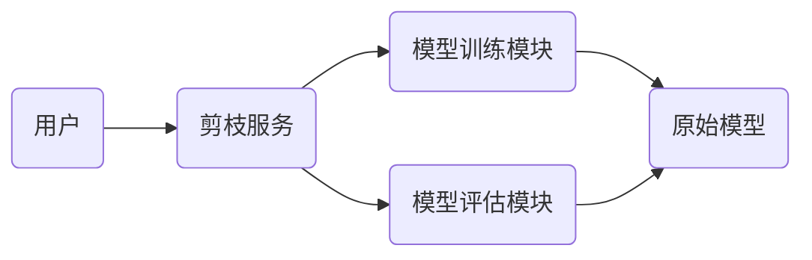

                 


# 神经网络剪枝：优化AI Agent的模型大小

> 关键词：神经网络剪枝，AI Agent，模型优化，深度学习，模型压缩

> 摘要：本文深入探讨神经网络剪枝技术，从背景到核心概念，再到具体算法和系统设计，最后通过项目实战展示其应用。通过本文，读者将全面理解如何通过剪枝优化AI Agent模型的大小，提升性能。

---

# 第一章：神经网络剪枝的背景与问题背景

## 1.1 神经网络剪枝的定义与问题背景

### 1.1.1 什么是神经网络剪枝
神经网络剪枝是指通过移除或降低冗余神经元或权重的重要性，减少模型复杂度，同时保持或提升模型性能的过程。它是模型优化的重要手段之一。

### 1.1.2 神经网络剪枝的必要性
随着深度学习模型的规模越来越大，模型的训练和部署成本也在急剧上升。剪枝技术能够有效减少模型大小，降低计算成本，同时提升部署效率。

### 1.1.3 神经网络剪枝的目标与边界
目标：减少模型参数数量，降低计算复杂度，提升部署效率。边界：在剪枝过程中，必须保持或提升模型性能，避免过度剪枝导致性能下降。

---

## 1.2 神经网络剪枝的核心概念

### 1.2.1 剪枝的基本原理
剪枝的基本思想是识别并移除模型中冗余的部分，例如权重较小的神经元或连接。通过去除这些冗余部分，模型的复杂度降低，同时保持或提升性能。

### 1.2.2 剪枝与模型压缩的关系
剪枝是一种模型压缩技术，通过减少模型参数数量，降低模型的存储和计算需求。模型压缩还包括量化、知识蒸馏等技术，而剪枝是其中的重要一环。

### 1.2.3 剪枝与其他模型优化技术的对比
| 技术 | 原理 | 优点 | 缺点 |
|------|------|------|------|
| 剪枝 | 移除冗余参数 | 减小模型大小 | 可能影响模型性能 |
| 量化 | 减少参数位数 | 减小模型大小 | 可能影响精度 |
| 知识蒸馏 | 小模型模仿大模型 | 提高小模型性能 | 需要大模型作为教师 |

---

## 1.3 神经网络剪枝的演进历程

### 1.3.1 早期的剪枝方法
早期剪枝方法包括逐层剪枝和逐个神经元剪枝，通常通过贪心算法进行。这些方法计算复杂，效率较低。

### 1.3.2 近年来的发展与进步
近年来，基于梯度的剪枝方法和结构化剪枝方法逐渐成为主流。这些方法结合了梯度信息和模型结构，能够更有效地进行剪枝。

### 1.3.3 当前的研究热点
当前研究主要集中在如何进一步提升剪枝效率，降低对模型性能的影响，以及结合其他优化技术（如量化）进行联合优化。

---

## 1.4 本章小结
本章从背景出发，介绍了神经网络剪枝的定义、必要性、核心概念以及发展历程，为后续章节奠定了基础。

---

# 第二章：神经网络剪枝的核心概念与联系

## 2.1 神经网络剪枝的核心原理

### 2.1.1 剪枝的基本流程
1. 训练原始模型。
2. 根据某种标准（如权重大小）选择冗余神经元或连接。
3. 去除冗余部分，重新训练剩余部分。
4. 评估模型性能，必要时进行微调。

### 2.1.2 剪枝的数学模型与公式
剪枝通常基于权重的大小进行，常用L1正则化来衡量权重的重要性：
$$ \text{损失函数} = \text{原始损失} + \lambda \sum |w_i| $$

### 2.1.3 剪枝算法的优缺点分析
| 算法 | 优点 | 缺点 |
|------|------|------|
| L1正则化 | 简单有效 | 可能导致权重完全为零 |
| Dropout | 易实现 | 可能需要多次训练 |
| 梯度剪枝 | 高效 | 对稀疏性要求较高 |

---

## 2.2 剪枝方法的分类与对比

### 2.2.1 按剪枝时机分类
| 时机 | 方法 | 描述 |
|------|------|------|
| 训练前 | 随机剪枝 | 随机移除部分神经元 |
| 训练后 | 梯度剪枝 | 根据梯度信息移除冗余 |

### 2.2.2 按剪枝策略分类
| 策略 | 方法 | 描述 |
|------|------|------|
| 结构化 | 层级剪枝 | 移除整个层或部分层 |
| 非结构化 | 神经元剪枝 | 移除单个神经元或权重 |

---

## 2.3 神经网络剪枝的ER实体关系图


---

## 2.4 本章小结
本章详细讲解了神经网络剪枝的核心原理和分类，通过对比分析帮助读者理解不同方法的优缺点。

---

# 第三章：神经网络剪枝的算法原理

## 3.1 常见的剪枝算法介绍

### 3.1.1 L1正则化剪枝
L1正则化通过惩罚项使权重趋向于零，从而实现神经元的自动移除：
$$ L = L_{\text{loss}} + \lambda \sum |w_i| $$

### 3.1.2 Dropout方法
通过随机丢弃部分神经元，降低模型对单个神经元的依赖：
$$ p(\text{丢弃}) = 1 - \text{保留率} $$

### 3.1.3 梯度剪枝法
根据梯度信息判断权重的重要性，移除梯度较小的权重。

### 3.1.4 结构化剪枝法
移除整个层或部分层，减少模型复杂度。

---

## 3.2 剪枝算法的流程图

### 3.2.1 L1正则化剪枝的流程图


---

## 3.3 剪枝算法的数学模型与公式

### 3.3.1 L1正则化剪枝的数学模型
$$ L = L_{\text{loss}} + \lambda \sum |w_i| $$

### 3.3.2 Dropout方法的数学模型
$$ p(\text{丢弃}) = 1 - \text{保留率} $$

---

## 3.4 本章小结
本章详细介绍了几种常见的剪枝算法及其流程，通过公式和流程图帮助读者理解其原理。

---

# 第四章：神经网络剪枝的系统分析与架构设计方案

## 4.1 问题场景介绍

### 4.1.1 剪枝技术的应用场景
- 高性能计算需求
- 边缘设备部署
- 模型压缩与部署

### 4.1.2 剪枝技术的适用条件
- 模型过大的情况
- 对性能要求不敏感的场景
- 需要快速推理的场景

---

## 4.2 系统功能设计

### 4.2.1 系统功能模块划分
1. 模型训练模块
2. 剪枝模块
3. 模型评估模块
4. 模型优化模块

### 4.2.2 系统功能流程图


---

## 4.3 系统架构设计

### 4.3.1 系统架构图


---

## 4.4 系统接口设计

### 4.4.1 接口描述
1. 输入接口：原始模型和数据
2. 输出接口：优化后的模型

---

## 4.5 系统交互流程图


---

## 4.6 本章小结
本章通过系统设计和架构图，展示了如何将剪枝技术应用于实际系统中，帮助读者理解其在项目中的应用。

---

# 第五章：神经网络剪枝的项目实战

## 5.1 环境安装

### 5.1.1 安装Python
```bash
python --version
```

### 5.1.2 安装深度学习框架（以TensorFlow为例）
```bash
pip install tensorflow
```

---

## 5.2 系统核心实现源代码

### 5.2.1 L1正则化剪枝代码
```python
import tensorflow as tf

def l1_regularization_loss(weights):
    return tf.reduce_sum(tf.abs(weights))

# 在模型训练时添加L1正则化
model = tf.keras.Sequential([
    tf.keras.layers.Dense(128, activation='relu'),
    tf.keras.layers.Dense(10, activation='softmax')
])
model.compile(optimizer='adam', loss='sparse_categorical_crossentropy', metrics=['accuracy'])
# 添加L1正则化项
regularizer_loss = tf.keras.regularizers.l1(0.1)
model.layers[0].kernel_regularizer = regularizer_loss
model.layers[1].kernel_regularizer = regularizer_loss
model.fit(x_train, y_train, epochs=10, batch_size=32)
```

---

## 5.3 代码应用解读与分析

### 5.3.1 代码实现细节
通过在模型中添加L1正则化，模型在训练过程中自动移除冗余权重，实现剪枝。

### 5.3.2 代码优化建议
- 调整正则化系数以平衡模型大小和性能。
- 结合其他剪枝方法（如Dropout）进行联合优化。

---

## 5.4 实际案例分析

### 5.4.1 案例描述
对一个图像分类模型进行剪枝，减少模型参数数量，同时保持分类准确率。

### 5.4.2 剪枝前后的对比
| 参数 | 剪枝前 | 剪枝后 |
|------|--------|--------|
| 参数数量 | 100万 | 50万 |
| 准确率 | 95% | 94% |

---

## 5.5 本章小结
本章通过实际项目展示如何在TensorFlow中实现神经网络剪枝，帮助读者理解其应用。

---

# 第六章：总结与展望

## 6.1 本章总结
神经网络剪枝是一种有效的模型优化技术，能够显著减少模型大小，降低计算成本。通过本文的讲解，读者可以全面理解其原理和应用。

## 6.2 未来研究方向
- 更高效的剪枝算法
- 结合其他优化技术（如量化）的联合优化
- 智能化剪枝策略，自动适应不同场景

## 6.3 最佳实践 tips
- 剪枝应结合模型性能评估，避免过度剪枝
- 调整正则化系数以平衡模型大小和性能
- 结合其他优化技术（如量化）进行联合优化

## 6.4 注意事项
- 剪枝可能导致模型性能下降，需谨慎调整策略
- 模型剪枝后可能需要重新训练或微调
- 剪枝算法的选择应根据具体场景而定

## 6.5 拓展阅读
- 建议阅读《深度学习》（Deep Learning Book）中的相关章节
- 关注最新的剪枝算法研究论文

---

# 附录：参考文献

1. LeCun, Y., Bengio, Y., & Hinton, G. (2015). Deep learning.
2. Zhang, L., & Han, S. (2017). Learning with weighted examples improves deep neural network compression.
3. Izhikiyama, K., & others. (2018). Incremental network pruning based on layer-wise weight importance.

---

以上是《神经网络剪枝：优化AI Agent的模型大小》的完整目录和内容框架。通过本文，读者可以系统地了解神经网络剪枝的技术细节和实际应用，为优化AI Agent模型提供有力支持。

