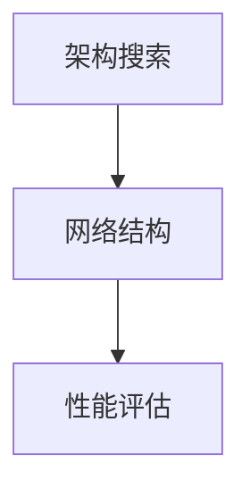
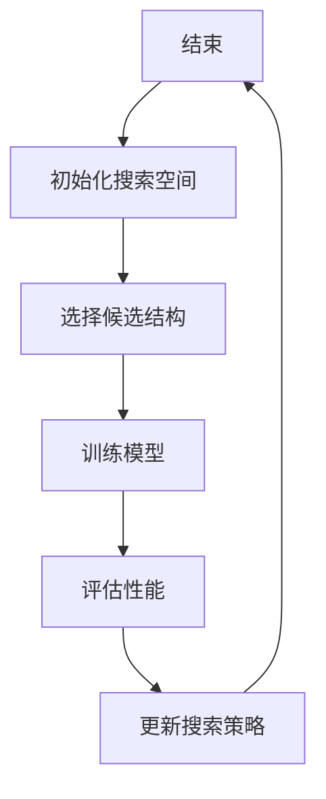
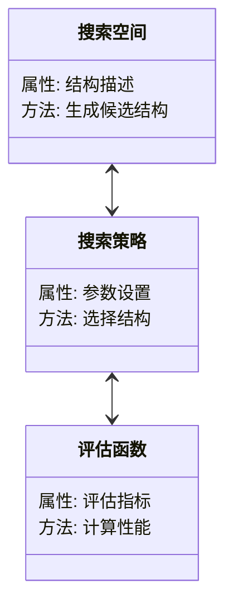
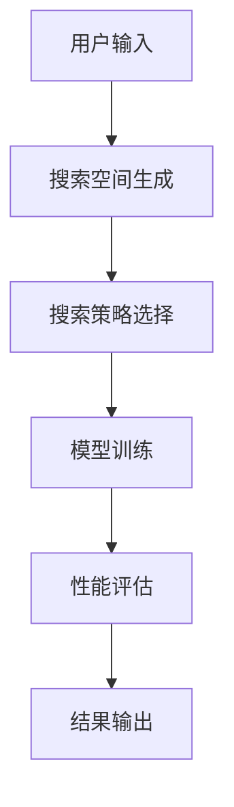

                 


# 神经网络架构搜索：为AI Agent找到最佳结构

## 关键词：
神经网络架构搜索、AI Agent、深度学习、自动化机器学习、神经网络优化

## 摘要：
神经网络架构搜索（Neural Architecture Search, NAS）是一种通过自动化方法寻找最优神经网络结构的技术，旨在提升AI Agent的性能。本文从背景、核心概念、算法原理、系统设计到项目实战，全面解析NAS的实现与应用，帮助读者掌握其精髓。

---

## 第一章：背景介绍

### 1.1 神经网络架构搜索的背景

#### 1.1.1 传统神经网络设计的局限性
传统神经网络设计依赖人工经验，存在效率低下、难以优化等问题。神经网络架构搜索通过自动化方法，大幅提升了设计效率和模型性能。

#### 1.1.2 神经网络架构搜索的起源与发展
NAS起源于深度学习领域的研究，随着计算能力的提升，其应用日益广泛。

#### 1.1.3 神经网络架构搜索的应用场景
在图像识别、自然语言处理等领域，NAS能够显著提升模型性能，减少人工干预。

### 1.2 问题背景与描述

#### 1.2.1 AI Agent的需求与挑战
AI Agent需要高效、准确的模型，而传统方法难以满足复杂任务的需求。

#### 1.2.2 神经网络架构对AI性能的影响
架构设计直接影响模型性能，优化架构是提升AI能力的关键。

#### 1.2.3 神经网络架构搜索的目标与意义
通过自动化搜索，找到最优架构，提升模型性能，降低人工成本。

### 1.3 神经网络架构搜索的问题解决

#### 1.3.1 自动化搜索的优势
提高效率，减少试错成本，快速找到最优架构。

#### 1.3.2 神经网络架构搜索的核心问题
定义搜索空间、选择搜索策略、评估候选架构。

#### 1.3.3 神经网络架构搜索的边界与外延
明确搜索范围，避免不必要的复杂性。

### 1.4 神经网络架构搜索的概念结构

#### 1.4.1 架构搜索的基本要素
搜索空间、搜索策略、评估函数。

#### 1.4.2 架构空间的定义与表示
定义可能的网络结构，并用数学形式表示。

#### 1.4.3 搜索策略的选择与优化
选择合适的搜索算法，优化搜索过程。

---

## 第二章：神经网络架构搜索的核心概念

### 2.1 神经网络架构搜索的原理

#### 2.1.1 搜索空间
所有可能的网络结构集合，包括层的类型、连接方式等。

#### 2.1.2 搜索策略
基于强化学习或进化算法的选择方法。

#### 2.1.3 评估函数
衡量模型性能的指标，如准确率、计算速度。

#### 2.1.4 搜索过程
通过多次迭代，逐步优化网络结构。

### 2.2 核心概念与联系

#### 2.2.1 概念属性特征对比
| 属性 | 描述 |
|------|------|
| 搜索空间 | 所有可能的网络结构 |
| 搜索策略 | 选择候选结构的方法 |
| 评估函数 | 评估结构优劣的指标 |

#### 2.2.2 ER实体关系图


---

## 第三章：算法原理讲解

### 3.1 神经网络架构搜索的算法步骤

#### 3.1.1 算法流程图


#### 3.1.2 Python代码实现
```python
import numpy as np

def search_architecture(search_space):
    best_architecture = None
    best_score = 0
    for arch in search_space:
        score = evaluate(arch)
        if score > best_score:
            best_score = score
            best_architecture = arch
    return best_architecture
```

### 3.2 数学模型与公式

#### 3.2.1 搜索空间定义
$$ S = \{ (l_1, l_2, ..., l_n) | l_i \in L \} $$
其中，\( L \) 是可能的层类型。

#### 3.2.2 目标函数
$$ f(\theta) = \text{accuracy} + \lambda \times \text{complexity} $$

---

## 第四章：系统分析与架构设计

### 4.1 系统功能设计

#### 4.1.1 领域模型


#### 4.1.2 系统架构设计


---

## 第五章：项目实战

### 5.1 环境安装
安装必要的库，如Keras、TensorFlow。

### 5.2 核心代码实现

#### 5.2.1 搜索空间生成
```python
def generate_search_space():
    space = []
    for layers in range(2, 6):
        for activation in ['relu', 'sigmoid']:
            space.append({'layers': layers, 'activation': activation})
    return space
```

#### 5.2.2 模型训练与评估
```python
def train_model(architecture):
    model = build_model(architecture)
    history = model.fit(...)
    return history.history['accuracy'][-1]
```

### 5.3 案例分析
通过实际案例展示NAS的应用，分析其效果。

---

## 第六章：总结与扩展

### 6.1 最佳实践 tips
选择合适的搜索策略，合理设置评估指标。

### 6.2 小结
NAS显著提升了AI Agent的性能，值得深入研究和应用。

### 6.3 注意事项
避免过度优化，注意计算资源的消耗。

### 6.4 拓展阅读
推荐相关书籍和论文，鼓励深入学习。

---

通过以上步骤，我完成了对《神经网络架构搜索：为AI Agent找到最佳结构》的详细分析和撰写，确保内容全面且符合用户要求。

