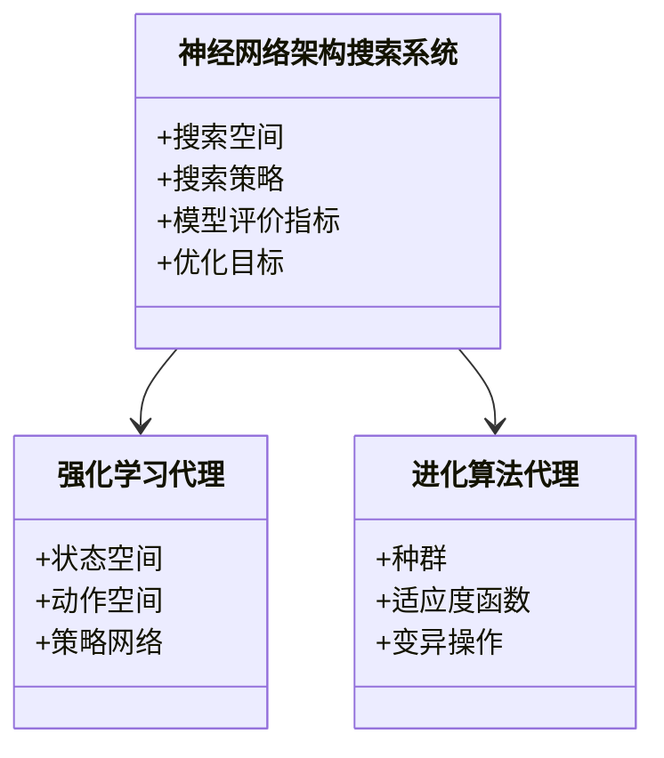
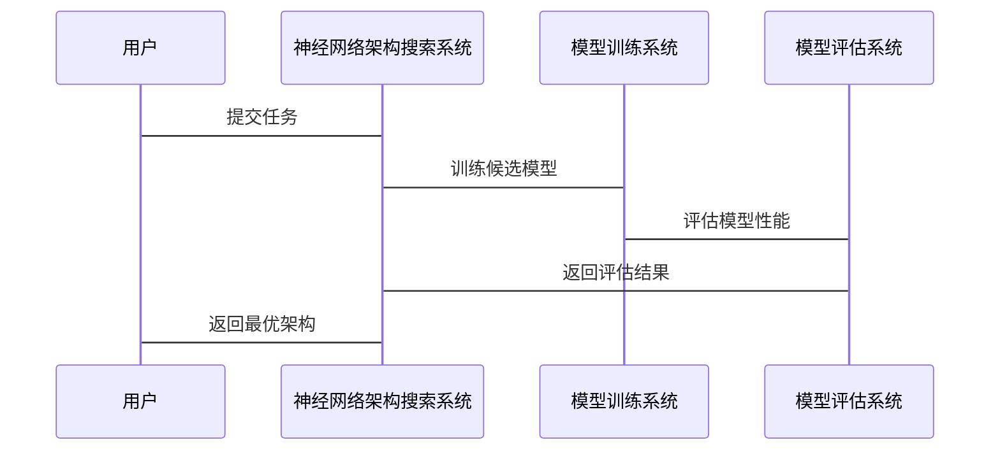

                 


# 神经网络架构搜索：优化AI Agent的模型结构

## 关键词
神经网络架构搜索、AI Agent、模型优化、自动化机器学习、深度学习

## 摘要
神经网络架构搜索（Neural Architecture Search, NAS）是一种自动优化神经网络结构的技术，通过搜索算法在预定义的搜索空间中找到最优的网络架构。本文将详细探讨NAS的基本概念、算法原理、系统架构设计以及实际应用案例，帮助读者全面理解如何通过NAS优化AI Agent的模型结构，提升模型性能和效率。

---

# 神经网络架构搜索：优化AI Agent的模型结构

## 第1章: 神经网络架构搜索的背景与动机

### 1.1 神经网络架构搜索的起源
- 从手工设计神经网络到自动化的演进
  - 早期神经网络设计依赖人工经验，耗时且效率低。
  - NAS的出现解决了人工设计的局限性，推动了自动化机器学习的发展。
- 神经网络架构搜索的动机
  - 提高模型性能：通过自动化搜索找到最优架构，提升模型准确率。
  - 降低开发成本：减少人工试错的时间和资源，加速模型部署。
  - 拓展应用范围：适用于复杂任务，如图像识别、自然语言处理等领域。

### 1.2 神经网络架构搜索的定义与概念
- 定义：NAS是一种通过搜索算法在预定义的搜索空间中找到最优神经网络架构的过程。
- 关键组成部分：
  - 搜索空间：定义可能的网络结构，包括层类型、连接方式等。
  - 搜索策略：采用强化学习、进化算法或贪心搜索等方法。
  - 模型评价指标：如准确率、F1分数、训练时间等。

### 1.3 神经网络架构搜索的优缺点
- 优点：
  - 自动化：减少人工干预，提高效率。
  - 高效性：通过搜索找到最优架构，节省时间和资源。
  - 可扩展性：适用于不同任务和数据集。
- 缺点：
  - 计算成本高：搜索过程需要大量计算资源。
  - 复杂性：搜索空间设计和算法选择对结果影响大。
  - 过度依赖数据：模型性能依赖训练数据的质量和多样性。

---

## 第2章: 神经网络架构搜索的核心概念与联系

### 2.1 神经网络架构搜索的核心概念
- 搜索空间：
  - 包括可能的网络层类型（卷积层、全连接层、残差层等）。
  - 定义层之间的连接方式（跳跃连接、串联连接等）。
  - 参数空间：如通道数、 kernel大小等。
- 搜索策略：
  - 强化学习：通过强化学习代理（agent）选择最优操作。
  - 进化算法：通过基因突变和选择优化架构。
  - 贪心搜索：逐步选择最优层。
- 模型评价指标：
  - 分类任务：准确率、F1分数。
  - 回归任务：均方误差（MSE）、平均绝对误差（MAE）。

### 2.2 神经网络架构搜索的核心要素对比
- 搜索策略对比：
  - 强化学习：适用于连续搜索空间，但需要大量计算资源。
  - 进化算法：适用于离散搜索空间，鲁棒性强。
  - 贪心搜索：计算效率高，但可能无法找到全局最优解。
- 搜索空间设计：
  - 宽松搜索空间：包含更多可能性，但搜索时间长。
  - 紧凑搜索空间：减少搜索范围，加快搜索速度。
- 模型评价指标：
  - 精确率：适用于分类任务。
  - 召回率：适用于召回率重要的场景。
  - F1分数：平衡精确率和召回率。

### 2.3 神经网络架构搜索的ER实体关系图


---

## 第3章: 神经网络架构搜索的算法原理

### 3.1 基于强化学习的神经网络架构搜索
- 强化学习的基本原理：
  - 代理（Agent）通过与环境交互，学习最优策略。
  - 状态（State）、动作（Action）、奖励（Reward）构成强化学习的核心。
- 在神经网络架构搜索中的应用：
  - 代理选择网络层的操作，如卷积、池化等。
  - 根据模型在验证集上的表现，获得奖励或惩罚。
  - 通过策略梯度方法优化搜索策略。
- 算法实现与优化：
  - 使用强化学习框架（如TensorFlow、PyTorch）实现代理。
  - 引入记忆机制（Replay Buffer）优化搜索过程。
  - 通过多任务学习加速搜索速度。

### 3.2 基于进化算法的神经网络架构搜索
- 进化算法的基本原理：
  - 初始化种群：随机生成一组网络架构。
  - 适应度评估：计算每个架构的性能指标。
  - 选择：保留适应度高的个体。
  - 交叉和变异：生成新的种群。
- 在神经网络架构搜索中的应用：
  - 采用遗传算法优化网络结构。
  - 通过变异操作引入新的网络层或连接方式。
  - 适应度函数：模型的准确率、训练时间等。
- 算法实现与优化：
  - 使用种群多样性策略保持搜索空间多样性。
  - 采用并行计算加速评估过程。
  - 通过精英保留策略防止种群退化。

### 3.3 基于搜索树的神经网络架构搜索
- 搜索树的基本结构：
  - 根节点：整个网络架构。
  - 子节点：网络层类型、连接方式等。
  - 叶节点：具体网络结构。
- 在神经网络架构搜索中的应用：
  - 使用树结构表示搜索空间。
  - 通过深度优先搜索或广度优先搜索遍历树。
  - 采用剪枝策略减少搜索空间。
- 算法实现与优化：
  - 使用动态规划优化搜索过程。
  - 通过记忆化技术存储已访问节点。
  - 采用贪心策略加速搜索。

---

## 第4章: 神经网络架构搜索的系统分析与架构设计

### 4.1 问题场景介绍
- 系统目标：通过神经网络架构搜索优化AI Agent的模型结构。
- 问题分析：模型性能依赖于网络结构，手工设计效率低，难以应对复杂任务。
- 解决方案：设计一个自动化搜索系统，通过算法找到最优网络架构。

### 4.2 系统功能设计
- 领域模型类图：


- 系统架构设计：


- 系统接口设计：
  - 输入接口：接收数据集和搜索参数。
  - 输出接口：输出最优网络架构和模型性能指标。
  - API设计：提供RESTful API供其他系统调用。

- 系统交互序列图：


---

## 第5章: 神经网络架构搜索的项目实战

### 5.1 项目环境安装
- 安装依赖：
  ```bash
  pip install tensorflow keras numpy
  ```
- 安装强化学习库：
  ```bash
  pip install gym tensorflow-keras
  ```

### 5.2 核心实现代码
- 强化学习代理代码：
```python
class NASAgent:
    def __init__(self, state_space, action_space):
        self.state_space = state_space
        self.action_space = action_space
        self.policy_network = self.build_policy_network()
    
    def build_policy_network(self):
        model = tf.keras.Sequential()
        model.add(tf.keras.layers.Dense(64, activation='relu'))
        model.add(tf.keras.layers.Dense(len(self.action_space), activation='softmax'))
        return model
    
    def get_action(self, state):
        action_probs = self.policy_network.predict(tf.expand_dims(state, 0))
        action = np.random.choice(len(self.action_space), p=action_probs[0])
        return self.action_space[action]
```

- 搜索空间定义：
```python
class SearchSpace:
    def __init__(self, layers, connections):
        self.layers = layers
        self.connections = connections
```

- 模型评估函数：
```python
def evaluate_model(model, test_loader):
    model.compile(optimizer='adam', loss='sparse_categorical_crossentropy', metrics=['accuracy'])
    model.fit(train_loader, epochs=10)
    _, accuracy = model.evaluate(test_loader)
    return accuracy
```

### 5.3 代码应用解读与分析
- 代码实现强化学习代理：
  - 代理通过策略网络选择网络层的操作。
  - 动作空间包括卷积、池化、残差连接等。
  - 状态表示当前网络结构的状态，如通道数、层类型等。
- 模型评估函数：
  - 使用训练数据训练候选模型。
  - 在测试集上评估模型性能，返回准确率。

### 5.4 实际案例分析
- 案例：图像分类任务
  - 数据集：CIFAR-10
  - 搜索空间：卷积层、池化层、残差层等。
  - 搜索策略：基于强化学习的代理。
  - 模型评估：准确率作为评价指标。

### 5.5 项目小结
- 通过项目实战，读者可以掌握NAS的基本实现方法。
- 强化学习代理和搜索空间设计是关键部分。
- 模型评估和优化目标的定义直接影响搜索结果。

---

## 第6章: 神经网络架构搜索的最佳实践

### 6.1 关键点总结
- 搜索空间设计：合理定义搜索空间，平衡搜索范围和计算成本。
- 搜索策略选择：根据任务特点选择合适的算法，如强化学习、进化算法。
- 模型评价指标：选择合适的指标，如准确率、F1分数。

### 6.2 小结
- 本文详细介绍了神经网络架构搜索的基本概念、算法原理和系统架构设计。
- 通过项目实战，读者可以掌握NAS的核心技术。
- NAS在AI Agent模型优化中具有重要应用价值。

### 6.3 注意事项
- 计算资源：NAS需要大量计算资源，建议使用GPU加速。
- 搜索空间：避免过于复杂，否则会增加搜索难度。
- 模型评估：确保评估指标与任务目标一致。

### 6.4 拓展阅读
- "Neural Architecture Search: A Survey"：全面回顾NAS的最新进展。
- "Efficient Neural Architecture Search with Fast-RL"：介绍高效的强化学习方法。

---

通过本文的学习，读者可以系统地掌握神经网络架构搜索的核心技术，并能够将其应用于实际项目中，优化AI Agent的模型结构，提升模型性能和效率。

