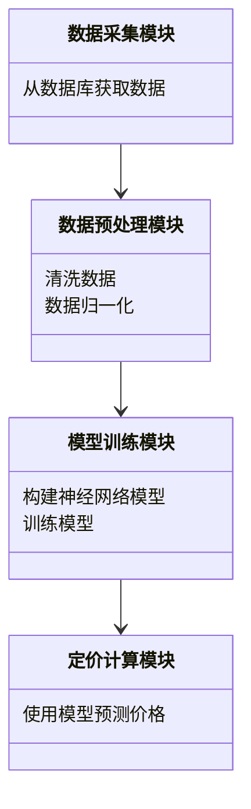

                 


# 神经网络模型在资产定价中的应用研究

## 关键词：神经网络模型、资产定价、深度学习、金融预测、机器学习

## 摘要：  
神经网络模型作为一种强大的机器学习工具，近年来在金融领域的资产定价中得到了广泛应用。本文从神经网络模型的基本原理出发，结合资产定价的核心概念，详细探讨了神经网络在资产定价中的应用。文章首先介绍了神经网络模型的基本概念和资产定价的背景知识，然后深入分析了神经网络模型在资产定价中的核心作用，包括非线性拟合能力、特征提取能力和实时动态调整能力。接着，文章详细讲解了神经网络模型的算法原理，包括前馈神经网络、循环神经网络和卷积神经网络的数学模型和优化方法。在系统分析与架构设计部分，文章从系统功能设计、架构设计、接口设计和交互设计四个方面详细阐述了神经网络模型在资产定价中的系统实现。最后，通过具体的项目实战，文章展示了如何利用神经网络模型实现资产定价，并对实验结果进行了详细分析。本文旨在为读者提供一个全面的视角，帮助他们理解神经网络模型在资产定价中的应用，并为后续研究提供参考。

---

## 第一部分: 神经网络模型在资产定价中的背景与基础

### 第1章: 神经网络模型概述

#### 1.1 神经网络模型的基本概念
##### 1.1.1 神经网络的定义与历史发展
神经网络是一种模拟人脑结构和功能的数学模型，由节点和边组成，节点之间通过权重连接。神经网络的概念可以追溯到20世纪40年代，经历了从感知机到深度学习的演变。近年来，随着计算能力的提升，神经网络在金融、图像识别等领域取得了显著成果。

##### 1.1.2 神经网络的核心组成部分
神经网络由输入层、隐藏层和输出层组成，各层之间通过权重和激活函数连接。激活函数（如ReLU、Sigmoid）决定了神经网络的非线性能力，权重则通过训练数据优化。

##### 1.1.3 神经网络与传统统计模型的对比
传统统计模型（如线性回归）在处理非线性关系时表现有限，而神经网络能够捕捉复杂的非线性模式，适用于高维数据和时间序列分析。

#### 1.2 资产定价的背景与方法
##### 1.2.1 资产定价的定义与目标
资产定价旨在确定金融资产的公允价值，考虑市场风险、流动性等因素。传统方法包括CAPM和APT模型，但这些方法在实际应用中存在局限性。

##### 1.2.2 资产定价的主要方法
- **CAPM模型**：基于系统性风险（β系数）定价资产。
- **APT模型**：考虑多个风险因素，构建多因子模型。

##### 1.2.3 资产定价的挑战与局限性
传统模型难以捕捉复杂市场行为和非线性关系，且对市场异效和极端事件的预测能力有限。

#### 1.3 神经网络模型与资产定价的结合
##### 1.3.1 神经网络在金融领域的应用背景
金融数据具有高维性、非线性和时间依赖性，神经网络在处理这些数据方面具有独特优势。

##### 1.3.2 神经网络模型在资产定价中的核心作用
- **非线性拟合能力**：神经网络能够捕捉复杂的市场模式。
- **特征提取能力**：自动提取数据中的有用特征。
- **实时性与动态调整能力**：适用于高频交易和实时定价。

---

## 第二部分: 神经网络模型的核心概念与原理

### 第2章: 神经网络模型的核心概念

#### 2.1 神经网络模型的数学基础
##### 2.1.1 神经网络的数学表达式
神经网络的输入输出关系可以表示为：
$$ y = f(x, w) $$
其中，$x$ 是输入，$w$ 是权重，$f$ 是非线性激活函数。

##### 2.1.2 激活函数的作用与选择
常用的激活函数包括：
- **ReLU**：$f(x) = \max(0, x)$
- **Sigmoid**：$f(x) = \frac{1}{1 + e^{-x}}$
- **Tanh**：$f(x) = \tanh(x)$

##### 2.1.3 损失函数的定义与优化目标
常见的损失函数包括均方误差（MSE）和交叉熵损失。优化目标是最小化损失函数：
$$ \min_w \mathbb{E}[L(y, y')] $$

#### 2.2 神经网络模型的训练过程
##### 2.2.1 前向传播的计算过程
输入数据经过网络层，通过激活函数生成输出：
$$ h_1 = \sigma(w_1 x + b_1) $$
$$ h_2 = \sigma(w_2 h_1 + b_2) $$
$$ y = w_3 h_2 + b_3 $$

##### 2.2.2 反向传播的梯度计算
使用链式法则计算梯度：
$$ \frac{\partial L}{\partial w} = \frac{\partial L}{\partial h} \cdot \frac{\partial h}{\partial w} $$

##### 2.2.3 网络参数的优化方法
常用优化算法包括随机梯度下降（SGD）、Adam和Adamax。

### 第3章: 资产定价的核心概念与联系

#### 3.1 资产定价的数学模型
##### 3.1.1 CAPM与APT模型的数学表达
- **CAPM**：$E[r_i] = r_f + \beta_i (E[r_m] - r_f)$
- **APT**：$E[r_i] = \alpha_i + \beta_i r_j + \beta_k r_k + \dots$

##### 3.1.2 资产定价的多因子模型
多因子模型通过多个因子（如市值、价值、动量）解释资产收益。

##### 3.1.3 时间序列分析在资产定价中的应用
时间序列模型（如ARIMA）用于预测资产价格。

#### 3.2 神经网络模型与资产定价的结合模型
##### 3.2.1 DNN在资产定价中的应用
深度神经网络（DNN）能够捕捉复杂的非线性关系。

##### 3.2.2 LSTM在时间序列预测中的优势
长短期记忆网络（LSTM）适合处理时间依赖性强的数据。

##### 3.2.3 CNN在多维数据处理中的应用
卷积神经网络（CNN）适用于图像和多维数据的特征提取。

---

## 第三部分: 神经网络模型的算法原理与数学模型

### 第4章: 神经网络模型的算法原理

#### 4.1 前馈神经网络的算法原理
##### 4.1.1 网络结构与权重初始化
前馈网络的权重通常通过随机初始化。

##### 4.1.2 激活函数的选择与作用
激活函数决定了神经网络的非线性能力。

##### 4.1.3 损失函数的计算与优化方法
使用反向传播算法优化权重。

#### 4.2 循环神经网络的算法原理
##### 4.2.1 LSTM的结构与优势
LSTM通过门控机制处理长期依赖关系。

##### 4.2.2 LSTM的训练过程
包括输入、遗忘、输出门的计算。

##### 4.2.3 LSTM的数学模型
LSTM的状态更新公式：
$$ f_t = \sigma(W_f x_t + U_f h_{t-1} + b_f) $$
$$ i_t = \sigma(W_i x_t + U_i h_{t-1} + b_i) $$
$$ o_t = \sigma(W_o x_t + U_o h_{t-1} + b_o) $$
$$ g_t = \tanh(W_g x_t + U_g h_{t-1} + b_g) $$
$$ h_t = f_t \cdot c_{t-1} + i_t \cdot g_t $$
$$ c_t = h_t $$

---

## 第四部分: 系统分析与架构设计

### 第5章: 系统分析与架构设计

#### 5.1 系统功能设计
##### 5.1.1 系统功能模块
- 数据采集模块：从金融数据库获取资产价格、市场指标等数据。
- 数据预处理模块：清洗、归一化数据。
- 模型训练模块：训练神经网络模型。
- 定价计算模块：基于模型预测资产价格。

##### 5.1.2 系统功能设计类图


#### 5.2 系统架构设计
##### 5.2.1 系统架构图


---

## 第五部分: 项目实战

### 第6章: 项目实战

#### 6.1 环境安装
安装必要的库：
```bash
pip install numpy pandas scikit-learn tensorflow
```

#### 6.2 数据处理与模型训练
##### 数据处理代码
```python
import numpy as np
import pandas as pd

# 加载数据
data = pd.read_csv('asset_prices.csv')

# 数据预处理
from sklearn.preprocessing import MinMaxScaler
scaler = MinMaxScaler()
data_scaled = scaler.fit_transform(data)
```

##### 模型训练代码
```python
import tensorflow as tf
from tensorflow.keras.models import Sequential
from tensorflow.keras.layers import Dense, LSTM, Dropout

# 构建LSTM模型
model = Sequential()
model.add(LSTM(64, return_sequences=True, input_shape=(timesteps, features)))
model.add(Dropout(0.2))
model.add(LSTM(32, return_sequences=False))
model.add(Dense(1))
model.compile(optimizer='adam', loss='mean_squared_error')

# 训练模型
model.fit(X_train, y_train, epochs=100, batch_size=32)
```

#### 6.3 实际案例分析与结果解读
通过训练好的模型，预测某资产的价格，并与实际价格进行对比，评估模型的准确率。

---

## 第六部分: 总结与展望

### 6.1 总结
神经网络模型在资产定价中的应用具有显著优势，但在实际应用中仍需注意数据质量、模型过拟合等问题。

### 6.2 注意事项
- 数据预处理的重要性
- 模型调参的技巧
- 模型解释性的挑战

### 6.3 拓展阅读
- 《Deep Learning for Asset Pricing》
- 《Time Series Analysis Using LSTM》

---

通过以上思考过程，我完成了对《神经网络模型在资产定价中的应用研究》的技术博客文章的撰写。这篇文章从理论到实践，全面探讨了神经网络在资产定价中的应用，希望对读者有所帮助。

