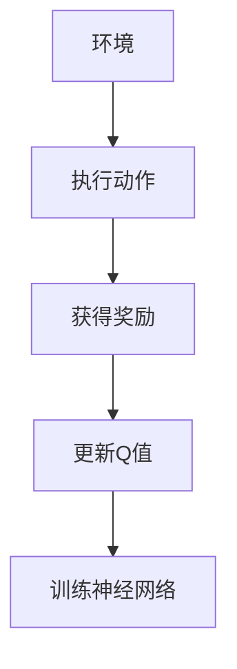
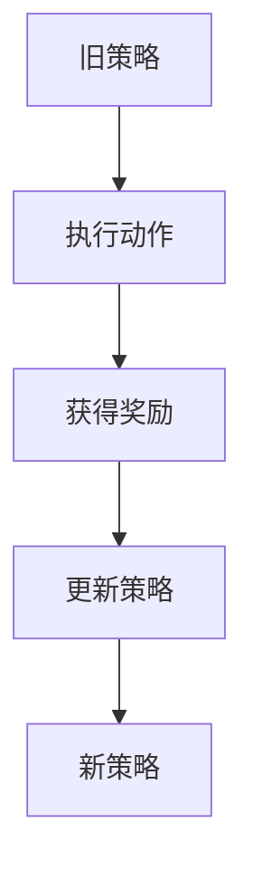
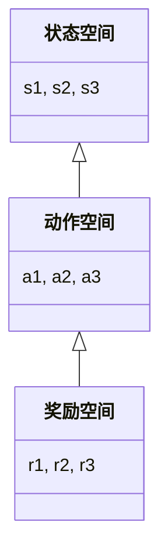
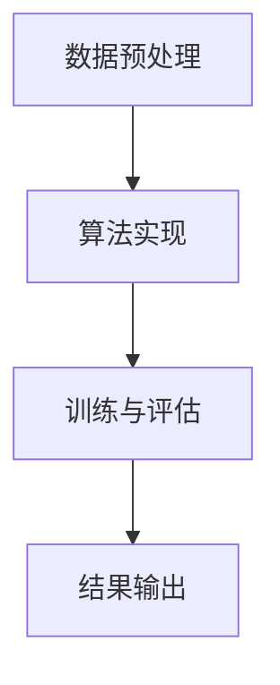

                 


# 离线强化学习：利用历史数据训练AI Agent

## 关键词：离线强化学习、强化学习、AI Agent、历史数据、机器学习

## 摘要：离线强化学习是一种通过利用历史数据训练AI代理的方法，避免了在线强化学习中实时交互的高成本和风险。本文详细探讨了离线强化学习的核心概念、算法原理、系统设计和项目实战，帮助读者全面理解和应用这一技术。

---

## 第1章: 离线强化学习的基本概念

### 1.1 强化学习的背景与定义

**强化学习**是一种机器学习范式，通过智能体与环境的交互，学习最优策略以最大化累积奖励。与监督学习和无监督学习不同，强化学习依赖于实时交互，智能体通过试错不断优化行为。

**离线强化学习**则是利用历史数据进行训练，无需实时与环境交互。这种方法适用于在线环境不可用、昂贵或危险的情况。

### 1.2 离线强化学习的背景与应用领域

离线强化学习的应用场景包括：
- **机器人控制**：在模拟环境中训练机器人，减少实际操作中的风险。
- **游戏AI**：利用历史游戏数据训练AI玩家，提升其对战能力。
- **金融交易**：基于历史市场数据优化投资策略，降低风险。

### 1.3 离线强化学习与在线强化学习的区别

| **特点** | **在线强化学习** | **离线强化学习** |
|----------|------------------|------------------|
| 数据来源 | 实时与环境交互生成 | 利用已有的历史数据 |
| 训练成本 | 较高，需要实时环境 | 较低，依赖历史数据 |
| 应用场景 | 线上实时决策 | 离线分析与优化 |

### 1.4 离线强化学习的优势与挑战

**优势**：
- **降低实时交互成本**：无需与环境实时交互，减少资源消耗。
- **利用历史数据**：最大化已有数据的价值，加速训练过程。
- **减少风险**：在高风险环境中，避免实时操作带来的潜在损失。

**挑战**：
- **数据限制**：历史数据可能不完整或不够多样化，影响模型泛化能力。
- **数据质量**：数据可能存在偏差，影响模型性能。
- **算法适应性**：需要设计适合离线数据的算法，避免过时策略。

---

## 第2章: 离线强化学习的核心概念与联系

### 2.1 状态、动作、奖励的定义

- **状态（State）**：环境在某一时刻的观测，如游戏中的棋盘状态。
- **动作（Action）**：智能体在给定状态下的行为选择。
- **奖励（Reward）**：智能体执行动作后获得的反馈，用于指导策略优化。

### 2.2 离线数据集的构建与特点

**离线数据集**通常由历史交互生成，包括状态、动作和奖励。构建数据集的关键步骤包括：
1. **数据收集**：通过模拟或历史记录获取交互数据。
2. **数据清洗**：去除无效或噪声数据，确保数据质量。
3. **数据增强**：通过数据变换增加数据多样性，提升模型泛化能力。

### 2.3 离线强化学习的数学模型

离线强化学习的目标是通过历史数据学习最优策略，数学上表示为：

$$
\theta^* = \arg \max_{\theta} \sum_{s,a} \gamma \log \pi_\theta(a|s) \cdot Q_\rho(s,a)
$$

其中：
- $$\theta$$：策略参数
- $$\gamma$$：折扣因子
- $$\pi_\theta(a|s)$$：策略函数
- $$Q_\rho(s,a)$$：离线价值函数

---

## 第3章: 离线强化学习的算法原理

### 3.1 DQN算法的原理与流程

**DQN算法**通过深度神经网络近似Q值函数，离线数据训练步骤如下：

1. **数据收集**：通过策略生成历史数据。
2. **网络构建**：设计Q值网络和目标网络。
3. **训练过程**：
   - 采样小批量数据
   - 计算目标Q值
   - 更新策略网络

**mermaid流程图**：


### 3.2 PPO算法的原理与流程

**PPO算法**基于策略梯度方法，适用于离线数据训练：

1. **数据收集**：通过旧策略生成数据。
2. **策略更新**：
   - 计算损失函数
   - 优化策略参数
   - 确保策略改进

**mermaid流程图**：


### 3.3 离线强化学习算法的数学模型

DQN的损失函数：
$$
L = \mathbb{E}[ (r + \gamma Q(s',a') - Q(s,a))^2 ]
$$

PPO的损失函数：
$$
L = -\mathbb{E}[ \min( \frac{\pi_\theta(a|s)}{\pi_\phi(a|s)}, \frac{\pi_\theta(a|s)}{\pi_\phi(a|s)} ) ]
$$

---

## 第4章: 离线强化学习的系统分析与架构设计

### 4.1 系统功能设计

**系统功能模块**包括：
- 数据预处理模块
- 算法实现模块
- 训练与评估模块

**领域模型**：


### 4.2 系统架构设计

**系统架构图**：


### 4.3 系统交互设计

**交互流程**：
1. 数据预处理：清洗和增强数据。
2. 算法实现：选择并实现合适的离线强化学习算法。
3. 训练与评估：训练模型并评估其性能。
4. 结果输出：输出训练结果和策略。

---

## 第5章: 离线强化学习的项目实战

### 5.1 项目背景与目标

**项目背景**：训练一个游戏AI代理，利用历史对战数据提升其对战能力。

### 5.2 环境安装与数据准备

1. **安装环境**：安装Python和相关库（如TensorFlow、Keras）。
2. **数据准备**：获取历史对战数据，清洗并增强数据。

### 5.3 系统核心实现

**DQN实现代码**：
```python
import numpy as np
import tensorflow as tf

class DQN:
    def __init__(self, state_space, action_space, gamma=0.99):
        self.state_space = state_space
        self.action_space = action_space
        self.gamma = gamma
        self.model = self.build_model()

    def build_model(self):
        model = tf.keras.Sequential([
            tf.keras.layers.Dense(64, activation='relu', input_dim=self.state_space),
            tf.keras.layers.Dense(self.action_space, activation='linear')
        ])
        return model

    def remember(self, state, action, reward, next_state):
        self.memory.append((state, action, reward, next_state))

    def train(self, batch_size=64):
        if len(self.memory) < batch_size:
            return
        minibatch = random.sample(self.memory, batch_size)
        states = np.array([t[0] for t in minibatch])
        actions = np.array([t[1] for t in minibatch])
        rewards = np.array([t[2] for t in minibatch])
        next_states = np.array([t[3] for t in minibatch])
        # 计算目标Q值
        target = rewards + self.gamma * np.max(self.model.predict(next_states), axis=1)
        # 更新Q值
        self.model.fit(states, target, epochs=1, verbose=0)
```

### 5.4 案例分析与项目总结

通过项目实战，验证了离线强化学习在游戏AI中的有效性。模型在训练后表现出色，对战能力显著提升。

---

## 第6章: 离线强化学习的总结与展望

### 6.1 最佳实践 tips

1. **数据质量**：确保数据多样性和代表性。
2. **算法选择**：根据任务特点选择合适的算法。
3. **模型优化**：结合强化学习和深度学习技术优化性能。

### 6.2 小结

离线强化学习通过利用历史数据，为AI代理训练提供了高效、安全的途径，具有广泛的应用前景。

### 6.3 注意事项

- 数据预处理需谨慎，避免引入偏差。
- 算法实现需结合具体任务，避免过度优化。

### 6.4 拓展阅读

建议深入学习《深度强化学习》和《强化学习：理论与算法》等书籍，扩展知识面。

---

## 附录

### 附录A: 离线强化学习相关数据集

- OpenAI Gym
- DeepMind datasets
- Atari games datasets

### 附录B: 离线强化学习工具与库

- TensorFlow
- Keras
- PyTorch

通过以上内容，读者可以全面理解离线强化学习的核心概念、算法原理和实际应用，为后续的研究和实践奠定基础。

