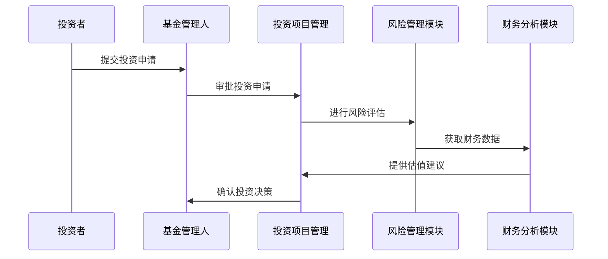

                 


# 私募股权投资：非上市公司的投资机会

> 关键词：私募股权投资，非上市公司，投资机会，内部收益率(IRR)，净现值(NPV)，尽职调查，估值方法

> 摘要：本文深入探讨私募股权投资在非上市公司中的投资机会，分析其核心概念、运作机制、数学模型以及实际案例。通过系统架构设计和项目实战，揭示如何通过私募股权投资实现价值增长，帮助读者掌握非上市公司投资的关键策略和方法。

---

## 第1章: 私募股权投资的定义与特点

### 1.1 私募股权投资的定义

私募股权投资（Private Equity Investment）是指通过私募基金投资于非上市公司，以获取资本增值的投资方式。私募股权基金通常由专业管理人运作，通过收购、重组或参与管理等方式，帮助被投企业实现增长，最终通过退出实现收益。

- **私募股权基金的类型**：包括风险投资基金（Venture Capital）、成长型基金（Growth Equity）、收购基金（Buyout Funds）等。
- **私募股权的特点**：
  - 投资对象：未上市公司。
  - 投资期限：通常较长，5-10年。
  - 投资回报：通过资本增值和股息收益实现。

### 1.2 非上市公司的特点

非上市公司相较于上市公司具有以下特点：

- **灵活性**：非上市公司管理更灵活，能够快速调整战略。
- **增长潜力**：许多非上市公司处于成长期，具有较高的增值空间。
- **风险较高**：非上市公司面临更多不确定性，但潜在回报也更高。

---

## 第2章: 私募股权投资的背景与现状

### 2.1 私募股权投资的历史发展

- **起源**：20世纪50年代，美国的风险投资开始兴起。
- **发展**：80年代后，全球范围内的并购基金和成长基金迅速发展。
- **现状**：当前，私募股权投资已成为全球重要的投资方式，尤其在科技、医疗和绿色能源等领域表现活跃。

### 2.2 非上市公司投资的现状

- **市场规模**：非上市公司私募股权投资市场占比逐年增加。
- **主要领域**：科技、医疗、消费品等领域成为主要投资方向。
- **主要参与者**：包括主权基金、保险公司、私人投资者等。

---

## 第3章: 私募股权投资的运作机制

### 3.1 私募股权基金的募集与管理

- **资金募集**：通过向机构投资者和高净值个人募集资本。
- **基金管理**：由专业团队管理，包括投资决策、监控和退出策略。
- **投资策略**：根据市场情况调整投资策略，如价值投资、成长投资等。

### 3.2 投资决策的关键因素

- **项目筛选**：通过行业分析、财务指标、管理团队等多维度筛选项目。
- **财务分析**：包括盈利能力、成长性、现金流等指标的评估。
- **管理团队**：团队的经验、能力和战略规划是关键因素。

---

## 第4章: 非上市公司投资的尽职调查

### 4.1 尽职调查的目的与方法

- **目的**：评估投资风险，确保投资决策的准确性。
- **方法**：包括财务、法律、管理等多方面的调查。

### 4.2 非上市公司财务分析

- **财务报表分析**：通过利润表、资产负债表、现金流量表等分析公司财务状况。
- **财务健康评估**：评估公司的偿债能力、盈利能力和发展潜力。

---

## 第5章: 估值与退出策略

### 5.1 企业估值的方法

- **市盈率法**：通过公司市盈率与行业平均水平对比估值。
- **贴现现金流法**：通过未来现金流的现值评估公司价值。
- **相对估值法**：通过与可比公司估值对比进行估算。

### 5.2 退出策略的选择与实施

- **股权转让**：将股权出售给第三方或上市公司。
- **并购重组**：通过并购实现退出，获得现金或资产回报。
- **上市**：帮助被投公司上市，通过股票公开发行退出。

---

## 第6章: 私募股权投资的数学模型与算法

### 6.1 内部收益率(IRR)模型

- **定义**：IRR是使投资项目的净现值为零的折现率。
- **公式**：
  $$
  NPV = \sum_{t=0}^{n} \frac{C_t}{(1+IRR)^t} = 0
  $$
- **应用**：用于评估投资项目的回报率，帮助决策是否进行投资。

### 6.2 净现值(NPV)模型

- **定义**：NPV是投资项目的未来现金流按贴现率折现后的总和与初始投资的差额。
- **公式**：
  $$
  NPV = \sum_{t=0}^{n} \frac{C_t}{(1+r)^t} - 初始投资
  $$
- **应用**：用于评估投资项目的经济可行性。

---

## 第7章: 系统架构设计

### 7.1 问题场景介绍

- **项目介绍**：设计一个私募基金管理系统，用于管理和监控私募股权投资。

### 7.2 系统功能设计

- **领域模型类图**：
  ```mermaid
  graph LR
  A[投资者] --> B[私募基金]
  B --> C[投资项目]
  C --> D[被投企业]
  C --> E[风险管理]
  C --> F[财务分析]
  ```

- **系统架构图**：
  ```mermaid
  graph LR
  A[投资者] --> B[基金管理人]
  B --> C[投资项目管理]
  C --> D[风险管理模块]
  C --> E[财务分析模块]
  ```

### 7.3 系统接口设计

- **投资者界面**：显示投资组合、收益报告等。
- **基金管理人界面**：显示投资进度、风险评估等。

### 7.4 系统交互序列图



---

## 第8章: 项目实战

### 8.1 环境安装

- **工具安装**：安装Python、Jupyter Notebook、Mermaid工具等。
- **数据准备**：收集目标公司的财务数据和行业信息。

### 8.2 核心实现源代码

```python
import numpy as np
import pandas as pd

def calculate_irr(cash_flows):
    try:
        irr = np.irr(cash_flows)
        return irr
    except:
        return None

cash_flows = [-1000, 500, 600, 300]
irr = calculate_irr(cash_flows)
print(f"内部收益率(IRR): {irr:.2%}")
```

### 8.3 案例分析

- **案例**：评估一家创业公司的投资价值。
- **步骤**：数据收集、财务分析、估值模型、风险评估、制定退出策略。

---

## 第9章: 最佳实践与总结

### 9.1 最佳实践

- **风险管理**：建立完善的风险评估机制。
- **团队建设**：培养专业投资团队。
- **法律合规**：确保投资活动符合法律法规。

### 9.2 小结

私募股权投资是非上市公司的重要投资方式，通过科学的估值和风险控制，可以实现较高的投资回报。

### 9.3 注意事项

- **分散投资**：避免过度集中风险。
- **长期视角**：私募股权投资需要耐心和长期持有。

### 9.4 拓展阅读

- 推荐书籍：《私募股权基金》、《投资学原理》。
- 推荐课程：Coursera上的“私募股权与创业投资”课程。

---

通过以上章节的详细讲解，读者可以全面了解私募股权投资的核心概念、运作机制、数学模型以及实际应用。希望本文能为读者在非上市公司投资领域提供有价值的参考和指导。

