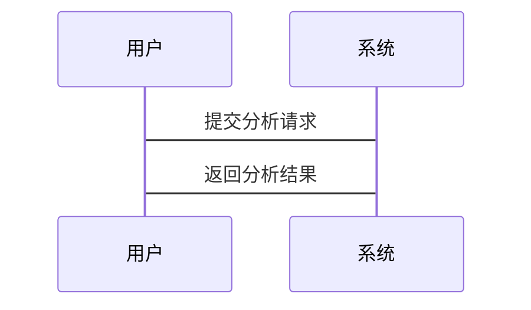

                 


# 《竞争对手分析》目录大纲

## 第一部分: 竞争对手分析的背景与概述

### 第1章: 竞争对手分析的定义与重要性

#### 1.1 竞争对手分析的定义
- 1.1.1 什么是竞争对手分析
- 1.1.2 竞争对手分析的目的
- 1.1.3 竞争对手分析的范围

#### 1.2 竞争对手分析的重要性
- 1.2.1 企业战略制定的基石
- 1.2.2 市场定位与竞争优势
- 1.2.3 创新与改进的驱动

#### 1.3 竞争对手分析的应用领域
- 1.3.1 企业战略管理
- 1.3.2 市场营销
- 1.3.3 技术研发
- 1.3.4 投资决策

#### 1.4 竞争对手分析的工具与方法
- 1.4.1 传统工具：SWOT分析、PEST分析
- 1.4.2 数据驱动工具：爬虫、NLP、机器学习
- 1.4.3 其他辅助工具：竞争情报平台

## 第二部分: 竞争对手分析的核心概念与方法论

### 第2章: 竞争对手分析的框架与流程

#### 2.1 竞争对手分析的框架
- 2.1.1 竞争环境分析
- 2.1.2 竞争对手画像
- 2.1.3 竞争态势评估

#### 2.2 竞争对手分析的流程
- 2.2.1 确定分析目标
- 2.2.2 数据收集与整理
- 2.2.3 数据分析与建模
- 2.2.4 结果解读与策略制定

### 第3章: 竞争对手分析的核心概念

#### 3.1 竞争对手分析的核心概念
- 3.1.1 竞争对手的核心竞争力
- 3.1.2 竞争对手的市场定位
- 3.1.3 竞争对手的产品策略

#### 3.2 竞争对手分析的属性特征对比
- 3.2.1 产品对比表
- 3.2.2 市场份额对比图
- 3.2.3 用户反馈对比

#### 3.3 竞争对手分析的ER实体关系图
```mermaid
er
  competitor {
    id
    name
    industry
    market_share
    product_list
    competitive_advantages
  }
  product {
    id
    name
    description
    competitor_id
    market_position
  }
  advantage {
    id
    name
    description
    competitor_id
  }
```

## 第三部分: 竞争对手分析的算法与技术实现

### 第4章: 竞争对手分析的算法原理

#### 4.1 竞争对手分析的算法选择
- 4.1.1 常见算法对比
- 4.1.2 算法选择的依据

#### 4.2 竞争对手分析的流程
```mermaid
graph TD
    A[开始] -> B[数据预处理]
    B -> C[选择算法]
    C -> D[模型训练]
    D -> E[结果分析]
    E -> F[结束]
```

#### 4.3 竞争对手分析的数学模型
- 4.3.1 机器学习模型的数学公式
- 4.3.2 示例代码实现

## 第四部分: 竞争对手分析的系统架构与设计方案

### 第5章: 竞争对手分析系统设计

#### 5.1 系统功能设计
- 5.1.1 功能模块划分
- 5.1.2 系统架构设计
- 5.1.3 接口设计

#### 5.2 系统交互流程


## 第五部分: 项目实战

### 第6章: 竞争对手分析的项目实施

#### 6.1 项目环境安装
- 6.1.1 安装Python
- 6.1.2 安装依赖库

#### 6.2 数据收集与处理
- 6.2.1 数据爬取
- 6.2.2 数据清洗

#### 6.3 模型训练与结果展示
- 6.3.1 模型训练
- 6.3.2 结果可视化

## 第六部分: 最佳实践、小结与注意事项

### 第7章: 总结与建议

#### 7.1 最佳实践
- 7.1.1 数据质量的重要性
- 7.1.2 算法选择的策略

#### 7.2 小结
- 7.2.1 竞争对手分析的关键点
- 7.2.2 未来趋势

#### 7.3 注意事项
- 7.3.1 数据隐私
- 7.3.2 结果解释的准确性

通过以上目录大纲，我们可以系统地了解竞争对手分析的各个方面，从基础概念到高级技术，再到实际应用，确保全面且深入地掌握这一主题。

