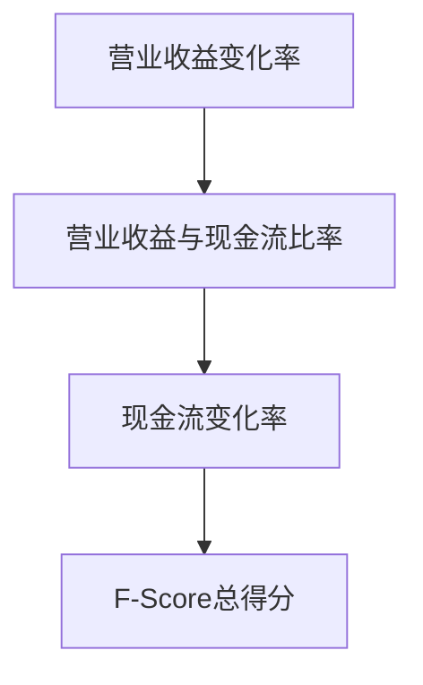
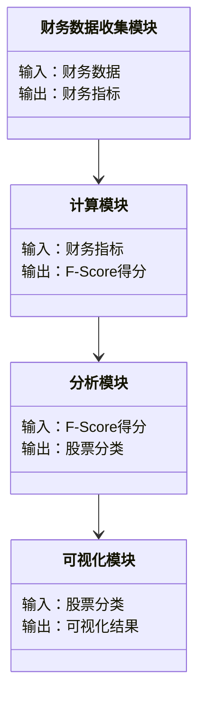
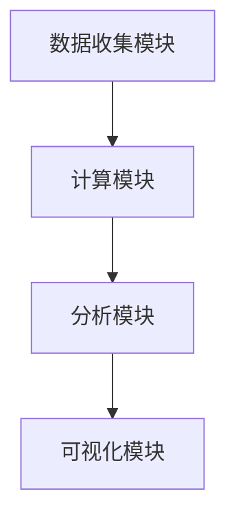

                 


# 约瑟夫·皮奥特罗斯基的F-Score选股模型

> 关键词：F-Score选股模型，约瑟夫·皮奥特罗斯基，股票筛选，投资策略，财务指标分析，人工智能在金融中的应用

> 摘要：本文深入分析了约瑟夫·皮奥特罗斯基提出的F-Score选股模型，从其核心概念、算法原理到实际应用进行了全面探讨。文章首先介绍了F-Score模型的背景及其在投资中的应用价值，接着详细解析了其三个核心指标及其相互关系，随后通过Mermaid流程图和Python代码展示了模型的计算流程和数学模型。最后，文章结合实际案例，通过系统架构设计和项目实战，展示了如何利用F-Score模型进行股票筛选，并提出了最佳实践建议。

---

## 第一部分: F-Score选股模型的背景与核心概念

### 第1章: F-Score选股模型的背景

#### 1.1 传统选股模型的局限性
传统选股模型主要依赖于市盈率、市净率等简单指标，这些指标在某些情况下无法准确反映公司的财务健康状况。例如，市盈率仅考虑了股价与盈利的关系，而忽略了现金流和收益变化的趋势。

#### 1.2 F-Score模型的提出与目标
F-Score模型由约瑟夫·皮奥特罗斯基提出，旨在通过分析公司的财务指标，识别那些可能扭亏为盈的公司。该模型的核心目标是帮助投资者筛选出具有潜在价值的股票，降低投资风险。

#### 1.3 F-Score模型在投资中的应用价值
F-Score模型通过分析公司的营业收益变化率、营业收益与现金流比率以及现金流变化率，能够更准确地预测公司的财务状况，帮助投资者做出更明智的投资决策。

---

### 第2章: F-Score选股模型的核心概念

#### 2.1 F-Score模型的核心定义
F-Score模型是一种基于财务指标的选股模型，通过计算三个关键指标来评估公司的财务健康状况，并根据得分对股票进行分类。

#### 2.2 F-Score模型的三个核心指标
1. **营业收益变化率**：衡量公司营业收益的增长或下降趋势。
2. **营业收益与现金流比率**：反映公司盈利能力和现金流的健康状况。
3. **现金流变化率**：衡量公司现金流的变化趋势。

#### 2.3 F-Score模型的评分标准与分类
F-Score模型通过将上述三个指标加总，得到一个总得分。得分越高，表示公司财务状况越好，投资价值越大。

---

## 第二部分: F-Score选股模型的核心概念与联系

### 第3章: F-Score模型的核心原理

#### 3.1 F-Score模型的理论基础
F-Score模型基于财务指标分析，通过量化公司的财务健康状况，帮助投资者识别潜在的价值股。

#### 3.2 F-Score模型的逻辑框架
F-Score模型通过分析公司的营业收益变化率、营业收益与现金流比率以及现金流变化率，评估公司的财务状况。得分越高，表示公司财务状况越好。

#### 3.3 F-Score模型的数学模型与公式
F-Score模型的总得分计算公式如下：
$$ F\text{-Score} = \text{营业收益变化率} + \text{营业收益与现金流比率} + \text{现金流变化率} $$

---

### 第4章: F-Score模型的核心指标分析

#### 4.1 营业收益变化率
营业收益变化率是衡量公司营业收益增长或下降趋势的重要指标。计算公式为：
$$ \text{营业收益变化率} = \frac{\text{当年营业收益} - \text{上年营业收益}}{\text{上年营业收益}} \times 100\% $$

#### 4.2 营业收益与现金流比率
营业收益与现金流比率反映公司盈利能力和现金流的健康状况。计算公式为：
$$ \text{营业收益与现金流比率} = \frac{\text{营业收益}}{\text{现金流}} $$

#### 4.3 现金流变化率
现金流变化率衡量公司现金流的变化趋势。计算公式为：
$$ \text{现金流变化率} = \frac{\text{当年现金流} - \text{上年现金流}}{\text{上年现金流}} \times 100\% $$

---

### 第5章: F-Score模型的指标关系与实体图

#### 5.1 F-Score模型的指标关系
F-Score模型的三个指标相互关联，共同构成公司的财务健康状况。以下是三个指标的Mermaid流程图：



---

## 第三部分: F-Score选股模型的算法原理

### 第6章: F-Score模型的计算流程

#### 6.1 F-Score模型的计算步骤
F-Score模型的计算流程如下：
1. 收集公司最近几年的财务数据。
2. 计算营业收益变化率、营业收益与现金流比率以及现金流变化率。
3. 将三个指标加总，得到F-Score总得分。
4. 根据得分对股票进行分类，得分越高，投资价值越大。

#### 6.2 F-Score模型的Python代码实现

```python
import pandas as pd

# 假设我们有一个包含财务数据的DataFrame df
# 包含以下列：'營業收入', '營業收益', '現金流'

def calculate_f_score(df):
    # 计算营业收益变化率
    revenue_growth = ((df['營業收益'] - df['營業收益'].shift(1)) / df['營業收益'].shift(1)) * 100
    # 计算营业收益与现金流比率
    revenue_cash_ratio = df['營業收益'] / df['現金流']
    # 计算现金流变化率
    cash_flow_growth = ((df['現金流'] - df['現金流'].shift(1)) / df['現金流'].shift(1)) * 100
    # 计算F-Score总得分
    f_score = revenue_growth + revenue_cash_ratio + cash_flow_growth
    return f_score

# 示例数据
data = {
    '營業收入': [100, 120, 150],
    '營業收益': [50, 60, 75],
    '現金流': [20, 30, 45]
}
df = pd.DataFrame(data)
f_score = calculate_f_score(df)
print(f_score)
```

---

### 第7章: F-Score模型的数学模型与公式

#### 7.1 F-Score模型的数学公式
F-Score模型的总得分计算公式为：
$$ F\text{-Score} = \text{营业收益变化率} + \text{营业收益与现金流比率} + \text{现金流变化率} $$

---

## 第四部分: F-Score选股模型的系统架构

### 第8章: F-Score模型的系统架构设计

#### 8.1 系统功能设计
F-Score模型的系统功能包括数据收集、计算、分析和可视化模块。以下是系统的领域模型：



---

### 第9章: F-Score模型的系统架构

#### 9.1 系统架构设计
以下是F-Score模型的系统架构图：



---

## 第五部分: F-Score选股模型的项目实战

### 第10章: F-Score模型的项目实战

#### 10.1 环境安装与配置
首先，需要安装以下Python库：
- pandas
- numpy
- matplotlib

#### 10.2 F-Score模型的代码实现
以下是F-Score模型的Python代码实现：

```python
import pandas as pd
import numpy as np
import matplotlib.pyplot as plt

# 示例数据
data = {
    '營業收入': [100, 120, 150],
    '營業收益': [50, 60, 75],
    '現金流': [20, 30, 45]
}
df = pd.DataFrame(data)

def calculate_f_score(df):
    # 计算营业收益变化率
    revenue_growth = ((df['營業收益'] - df['營業收益'].shift(1)) / df['營业收益'].shift(1)) * 100
    # 计算营业收益与现金流比率
    revenue_cash_ratio = df['營业收益'] / df['現金流']
    # 计算现金流变化率
    cash_flow_growth = ((df['現金流'] - df['現金流'].shift(1)) / df['現金流'].shift(1)) * 100
    # 计算F-Score总得分
    f_score = revenue_growth + revenue_cash_ratio + cash_flow_growth
    return f_score

f_score = calculate_f_score(df)
print(f_score)

# 可视化结果
plt.bar(df.index, f_score)
plt.title('F-Score得分')
plt.xlabel('年份')
plt.ylabel('F-Score得分')
plt.show()
```

---

### 第11章: F-Score模型的案例分析

#### 11.1 案例分析
假设我们有三家公司，数据如下：

| 公司 | 营业收入 | 营业收益 | 现金流 |
|------|----------|----------|--------|
| A    | 100      | 50       | 20     |
| B    | 120      | 60       | 30     |
| C    | 150      | 75       | 45     |

计算F-Score得分如下：

- 公司A：营业收益变化率 = 0%，营业收益与现金流比率 = 2.5，现金流变化率 = 0%；F-Score = 2.5
- 公司B：营业收益变化率 = 20%，营业收益与现金流比率 = 2，现金流变化率 = 50%；F-Score = 70%
- 公司C：营业收益变化率 = 25%，营业收益与现金流比率 = 1.6667，现金流变化率 = 50%；F-Score = 81.6667

---

## 第六部分: F-Score选股模型的最佳实践

### 第12章: F-Score模型的最佳实践

#### 12.1 小结
F-Score模型是一种有效的选股模型，通过分析公司的财务指标，帮助投资者识别潜在的价值股。

#### 12.2 注意事项
在使用F-Score模型时，需要注意以下几点：
1. 数据的准确性和完整性
2. 模型的适用性
3. 结合其他选股模型进行综合分析

#### 12.3 拓展阅读
建议进一步阅读以下内容：
- 约瑟夫·皮奥特罗斯基的其他研究成果
- 其他选股模型的对比分析
- 机器学习在股票筛选中的应用

---

通过以上内容，我们可以看到，F-Score选股模型是一种简单而有效的投资工具，通过分析公司的财务指标，帮助投资者做出更明智的投资决策。

