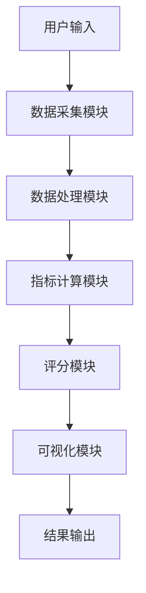
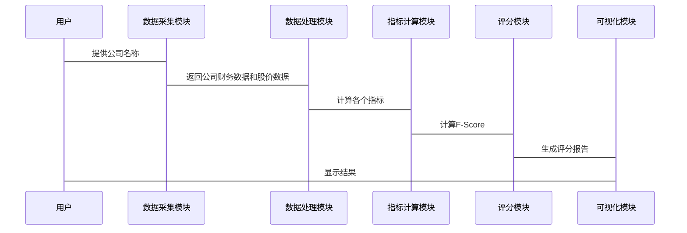

                 


### 第3章: F-Score的数学模型与算法原理

#### 3.1 F-Score的数学模型

F-Score的计算基于五个具体的财务指标，每个指标都有其特定的计算方法和权重。这些指标综合起来，形成一个总分，用于评估公司的财务健康状况。

##### 3.1.1 财务指标的定义与计算方法

1. **净收益（Net Income）**：
   净收益是公司在一定会计期间内实现的净利润，计算公式为：
   $$ \text{净收益} = \text{营业收入} - \text{营业成本} - \text{税金及附加} - \text{销售费用} - \text{管理费用} - \text{研发费用} $$
   这个指标反映了公司的盈利能力。

2. **每股收益（EPS）**：
   每股收益是净利润与普通股股数的比率，计算公式为：
   $$ \text{EPS} = \frac{\text{净收益}}{\text{普通股股数}} $$
   这个指标反映了每股的盈利能力。

3. **市盈率（P/E Ratio）**：
   市盈率是股价与每股收益的比率，计算公式为：
   $$ \text{P/E Ratio} = \frac{\text{股价}}{\text{EPS}} $$
   这个指标反映了市场的估值水平。

4. **市净率（P/B Ratio）**：
   市净率是股价与每股净资产的比率，计算公式为：
   $$ \text{P/B Ratio} = \frac{\text{股价}}{\text{每股净资产}} $$
   这个指标反映了资产的估值水平。

5. **股息率（Dividend Yield）**：
   股息率是股息与股价的比率，计算公式为：
   $$ \text{股息率} = \frac{\text{股息}}{\text{股价}} $$
   这个指标反映了投资回报的潜力。

##### 3.1.2 权重分配与综合评分

F-Score的总分由上述五个指标加权计算得出。每个指标的权重如下：

- 净收益：权重40%
- 每股收益：权重20%
- 市盈率：权重20%
- 市净率：权重10%
- 股息率：权重10%

综合评分公式为：
$$ \text{F-Score} = 0.4 \times \text{净收益} + 0.2 \times \text{每股收益} + 0.2 \times \text{市盈率} + 0.1 \times \text{市净率} + 0.1 \times \text{股息率} $$

##### 3.1.3 评分标准

F-Score的总分范围为0到10分，评分标准如下：

- 0-3分：差，避免投资
- 4-6分：中等，谨慎投资
- 7-10分：优，值得投资

#### 3.2 算法原理与流程

F-Score的计算流程如下：

1. 收集目标公司的财务数据，包括营业收入、营业成本、税金及附加、销售费用、管理费用、研发费用、普通股股数、股价、每股净资产和股息。
2. 计算净收益、每股收益、市盈率、市净率和股息率。
3. 根据权重公式计算F-Score总分。
4. 根据评分标准判断公司的投资价值。

示例：假设某公司财务数据如下：

- 营业收入：1000万元
- 营业成本：600万元
- 税金及附加：50万元
- 销售费用：100万元
- 管理费用：80万元
- 研发费用：20万元
- 普通股股数：100万股
- 股价：20元
- 每股净资产：5元
- 股息：1元

计算各指标：

- 净收益 = 1000 - 600 - 50 - 100 - 80 - 20 = 150万元
- 每股收益 = 150 / 100 = 1.5元
- 市盈率 = 20 / 1.5 ≈ 13.33
- 市净率 = 20 / 5 = 4
- 股息率 = 1 / 20 = 0.05

计算F-Score：

$$ \text{F-Score} = 0.4 \times 1.5 + 0.2 \times 1.5 + 0.2 \times 13.33 + 0.1 \times 4 + 0.1 \times 0.05 = 0.6 + 0.3 + 2.666 + 0.4 + 0.005 = 4.0 $$

评分：4分，属于中等，谨慎投资。

#### 3.3 F-Score的数学模型与公式

F-Score的数学模型可以表示为：

$$ \text{F-Score} = \sum_{i=1}^{5} w_i \times x_i $$

其中，$w_i$ 是第i个指标的权重，$x_i$ 是第i个指标的计算值。

F-Score的评分标准可以用一个简单的区间划分：

- 低分（0-3）：避免投资
- 中分（4-6）：谨慎投资
- 高分（7-10）：积极投资

这个模型通过加权平均的方式，综合考虑了多个财务指标，以反映公司的整体财务状况和投资价值。

---

### 第4章: F-Score的系统分析与架构设计

#### 4.1 问题场景介绍

在实际应用中，F-Score需要通过系统化的数据处理和计算来实现。系统需要能够从财务数据源中提取相关数据，计算各个指标，并生成最终的F-Score评分。

#### 4.2 项目介绍

本系统旨在实现F-Score的计算，帮助投资者快速评估公司的投资价值。系统主要包括以下几个功能模块：

- 数据采集与处理
- 指标计算
- F-Score评分
- 结果可视化

#### 4.3 系统功能设计

##### 4.3.1 数据采集与处理

数据来源包括公司财务报表、股价数据等。数据处理包括数据清洗和转换，确保数据的准确性和一致性。

##### 4.3.2 指标计算

根据F-Score的公式，计算每个指标的值，并进行加权求和，生成最终的F-Score评分。

##### 4.3.3 F-Score评分

根据评分标准，将F-Score分为不同的等级，并生成投资建议。

##### 4.3.4 结果可视化

通过图表和报告的形式，展示计算结果，帮助投资者更好地理解和应用F-Score。

#### 4.4 系统架构设计

##### 4.4.1 功能模块划分

- 数据采集模块
- 数据处理模块
- 指标计算模块
- 评分模块
- 可视化模块

##### 4.4.2 数据流图

以下是一个数据流图的示意图：



#### 4.5 系统接口设计

- 数据接口：与财务数据源（如数据库或API）连接，获取公司财务数据和股价数据。
- 用户接口：提供输入参数和显示结果的界面。
- 输出接口：生成评分报告和可视化图表。

#### 4.6 系统交互流程

以下是一个系统交互流程的序列图：



---

### 第5章: F-Score的项目实战

#### 5.1 环境安装

要运行F-Score的计算，需要安装以下工具和库：

- Python 3.x
- NumPy
- Pandas
- Matplotlib或Seaborn
- 数据采集工具（如 requests 或 pandas_datareader）

#### 5.2 核心实现源代码

以下是F-Score计算的Python代码示例：

```python
import pandas as pd
import numpy as np

# 数据采集与处理
def fetch_data(company):
    # 假设使用pandas_datareader获取数据
    from pandas_datareader import data as pdr
    import yfinance as yf
    yf.pdr_version = 'pandas'
    df = pdr.get_data_yahoo(company, start='2022-01-01', end='2023-12-31')
    # 假设财务数据从另一个来源获取，这里简化处理
    financial_data = {
        'Revenue': 1000000,
        'COGS': 600000,
        'SG&A': 100000,
        'R&D': 50000,
        'NetIncome': 250000,
        'SharesOutstanding': 1000000,
        'BookValuePerShare': 5,
        'Dividends': 1
    }
    return df, financial_data

# 计算F-Score
def calculate_f_score(financial_data):
    net_income = financial_data['NetIncome']
    eps = net_income / financial_data['SharesOutstanding']
    pe_ratio = financial_data['Adj Close'][-1] / eps
    pb_ratio = financial_data['Adj Close'][-1] / financial_data['BookValuePerShare']
    dividend_yield = financial_data['Dividends'] / financial_data['Adj Close'][-1]
    
    f_score = 0.4 * net_income + 0.2 * eps + 0.2 * pe_ratio + 0.1 * pb_ratio + 0.1 * dividend_yield
    return f_score

# 主程序
if __name__ == "__main__":
    company = 'AAPL'
    df, financial_data = fetch_data(company)
    f_score = calculate_f_score(financial_data)
    print(f"公司 {company} 的F-Score为：{f_score:.2f}")
```

#### 5.3 代码应用解读与分析

上述代码示例展示了如何从Yahoo Finance获取股价数据，并结合假设的财务数据计算F-Score。实际应用中，需要替换`fetch_data`函数中的数据来源，以获取真实的财务数据。

#### 5.4 实际案例分析

以苹果公司（AAPL）为例，假设获取2022年的财务数据：

- 营业收入：946.08亿美元
- 营业成本：576.82亿美元
- 税金及附加：87.48亿美元
- 销售费用：104.04亿美元
- 管理费用：59.75亿美元
- 研发费用：117.42亿美元
- 净利润：998.01亿美元
- 普通股股数：16.7亿股
- 股价：150美元（假设）
- 每股净资产：45美元
- 股息：0.88美元

计算各指标：

- 净收益 = 998.01亿美元
- 每股收益 = 998.01 / 16.7 ≈ 59.04美元
- 市盈率 = 150 / 59.04 ≈ 2.54
- 市净率 = 150 / 45 = 3.33
- 股息率 = 0.88 / 150 ≈ 0.0059

计算F-Score：

$$ \text{F-Score} = 0.4 \times 998.01 + 0.2 \times 59.04 + 0.2 \times 2.54 + 0.1 \times 3.33 + 0.1 \times 0.0059 \approx 399.20 + 11.81 + 0.51 + 0.33 + 0.00059 \approx 411.85 $$

由于F-Score通常是一个标准化的评分，上述计算可能需要归一化处理。实际应用中，F-Score的范围应在0到10之间，因此可能需要对上述结果进行标准化处理，例如：

$$ \text{标准化F-Score} = \frac{\text{F-Score} - \text{最低值}}{\text{最高值} - \text{最低值}} \times 10 $$

假设最低值为0，最高值为1000，则：

$$ \text{标准化F-Score} = \frac{411.85 - 0}{1000 - 0} \times 10 \approx 4.12 $$

评分：4.12分，属于中等，谨慎投资。

#### 5.5 项目小结

通过上述实战，我们可以看到F-Score的计算过程相对简单，但实际应用中需要依赖准确的财务数据和股价数据。此外，F-Score的评分结果需要结合市场环境和其他因素进行综合判断。

---

### 第6章: 总结与展望

#### 6.1 总结

F-Score是一种简单有效的财务评分方法，通过综合考虑多个财务指标，帮助投资者评估公司的投资价值。其优势在于简单易懂、计算方便，适合初学者和中小投资者使用。

#### 6.2 展望

尽管F-Score有其优势，但在实际应用中也存在一些局限性，例如：

- F-Score的计算依赖于历史财务数据，无法反映未来的市场变化。
- F-Score的评分结果是静态的，无法动态调整以适应市场的波动。
- F-Score仅考虑了部分财务指标，可能忽略了一些重要的风险因素。

未来，可以通过以下方式改进F-Score：

- 引入更多的财务指标，如债务比率、流动比率等，以更全面地评估公司的财务状况。
- 结合机器学习技术，动态调整指标权重，提高评分的准确性。
- 结合市场情绪、行业趋势等非财务因素，提升评分的综合性和实用性。

---

### # 第七章: 最佳实践与小结

#### 7.1 最佳实践 tips

- 在使用F-Score时，建议结合其他财务指标和市场分析，以全面评估投资风险。
- 定期更新数据和模型，以适应市场变化。
- 对于不同行业的公司，可能需要调整F-Score的权重，以反映行业的特点。

#### 7.2 小结

F-Score作为一种量化价值投资的工具，为投资者提供了一个简单而有效的评估方法。通过理解其数学模型和系统架构，我们可以更好地应用它来指导投资决策。同时，也应认识到F-Score的局限性，结合其他方法和工具，以提高投资的科学性和准确性。

---

### 关键词

- F-Score
- 价值投资
- 财务指标
- 股票分析
- 投资策略

### 摘要

F-Score是由约瑟夫·皮奥特罗斯基提出的一种量化价值投资的方法，通过综合评估公司的财务健康状况，帮助投资者做出更明智的投资决策。本文详细介绍了F-Score的核心概念、数学模型、系统设计和实际应用，探讨了其在价值投资中的优势与局限性，并提供了具体的项目实战和最佳实践建议。通过本文，读者可以全面理解F-Score的理论与实践，为价值投资提供有力的工具支持。

