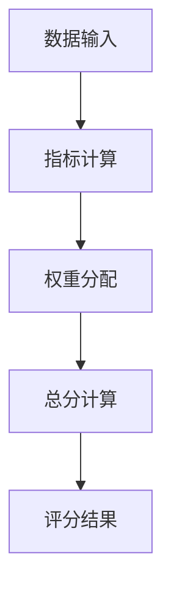
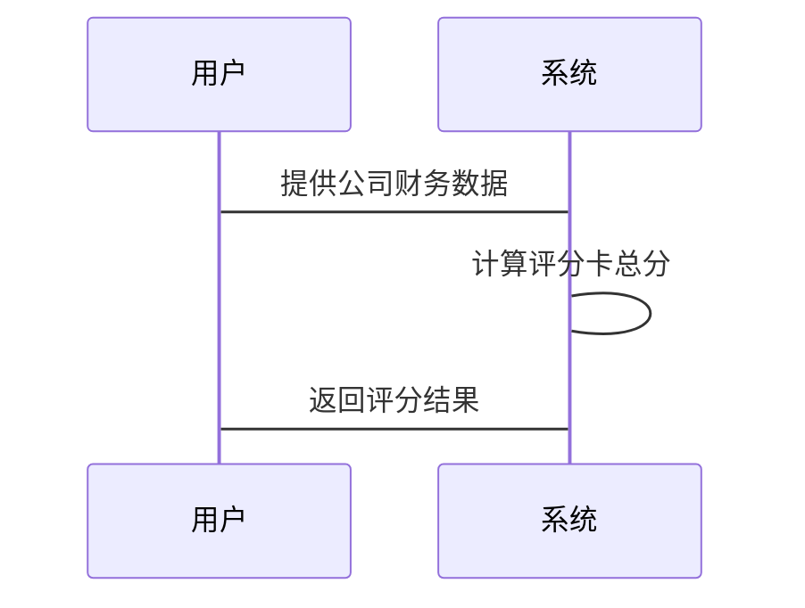

                 


# 约瑟夫·皮奥特罗斯基的价值投资评分卡：系统化选股方法

> **关键词**: 价值投资, 评分卡, 股票筛选, 系统化投资, 投资策略

> **摘要**: 本文详细介绍了约瑟夫·皮奥特罗斯基的价值投资评分卡系统，从其背景、核心概念、算法原理、系统架构到项目实战，全面解析了如何利用评分卡进行系统化选股。文章通过理论与实践结合的方式，帮助投资者更好地理解和应用这一方法。

---

## 第一部分: 价值投资与评分卡的背景介绍

### 第1章: 价值投资的基本概念

#### 1.1 价值投资的定义与核心理念
- **价值投资的定义**: 价值投资是一种投资策略，旨在通过寻找市场价格低于其内在价值的股票，长期持有以获得收益。
- **价值投资的核心理念**: 
  - 买入低于内在价值的资产。
  - 长期持有优质资产。
  - 避免频繁交易和市场波动的影响。
- **价值投资与其它投资策略的区别**:
  - 与趋势投资不同，价值投资注重基本面分析。
  - 与投机投资不同，价值投资注重长期价值。

#### 1.2 价值投资的评分卡背景
- **评分卡在价值投资中的作用**: 
  - 通过量化指标筛选出具有投资价值的股票。
  - 帮助投资者快速评估股票的投资潜力。
- **约瑟夫·皮奥特罗斯基评分卡的提出背景**:
  - 约瑟夫·皮奥特罗斯基是价值投资领域的知名投资者，他提出的评分卡系统是基于对公司基本面的深入分析。
  - 该评分卡系统旨在简化复杂的基本面分析，使投资者能够快速筛选出优质股票。
- **评分卡在现代投资中的应用价值**:
  - 提供了一种系统化、可量化的选股方法。
  - 帮助投资者避免情绪化决策，降低投资风险。

### 第2章: 约瑟夫·皮奥特罗斯基价值投资评分卡的定义与目标

#### 2.1 评分卡的定义
- **评分卡的定义**: 一种基于财务指标的评分系统，用于评估公司的投资价值。
- **评分卡的核心目标**:
  - 通过量化指标筛选出具有投资价值的股票。
  - 帮助投资者快速评估股票的投资潜力。
- **评分卡的适用范围**:
  - 适用于对上市公司基本面分析的投资者。
  - 适用于长期价值投资策略。

#### 2.2 评分卡的评分标准与指标
- **评分卡的主要指标**:
  - 市盈率（P/E）: 用于评估股票的估值。
  - 市净率（P/B）: 用于评估股票相对于其账面价值的高低。
  - 股息率: 用于评估股票的分红能力。
  - 净利润率: 用于评估公司的盈利能力。
  - 偿债能力: 用于评估公司的财务健康状况。
- **各指标的权重分配**:
  - 每个指标的权重不同，根据其重要性进行分配。
- **评分卡的评分规则**:
  - 根据指标的评分结果，按权重计算总分。
  - 根据总分划分股票的投资等级。

### 第3章: 评分卡的核心概念与联系

#### 3.1 评分卡的核心概念原理
- **评分卡的数学模型**:
  - 每个指标的评分结果通过加权计算得出总分。
  - 总分反映了股票的投资价值。
- **评分卡的计算公式**:
  $$ \text{总分} = \sum_{i=1}^{n} (w_i \times f_i) $$
  其中，$w_i$ 是第i个指标的权重，$f_i$ 是第i个指标的评分值。
- **评分卡的指标关系**:
  - 不同指标之间相互关联，共同反映公司的整体投资价值。

#### 3.2 核心概念属性特征对比表格
| 指标名称 | 定义 | 权重 | 评分范围 | 示例值 |
|----------|------|------|----------|--------|
| 市盈率   | 当前股价除以每股收益 | 30% | 0-100 | 15 |
| 市净率   | 当前股价除以每股净资产 | 25% | 0-50 | 2 |
| 股息率   | 每股股息除以当前股价 | 20% | 0-10% | 3% |
| 净利润率 | 净利润与营业收入的比率 | 15% | 0-20% | 10% |
| 偿债能力 | 负债与资产的比率 | 10% | 0-100% | 50% |

#### 3.3 ER实体关系图架构
```mermaid
er
  entity 评分卡 {
    市盈率 (P/E)
    市净率 (P/B)
    股息率 (Dividend Yield)
    净利润率 (Net Profit Margin)
    偿债能力 (Debt-to-Asset Ratio)
  }
  entity 评分卡通过指标值与权重关联到公司
```

---

## 第二部分: 评分卡的算法原理讲解

### 第4章: 评分卡的算法原理

#### 4.1 评分卡的数学模型
- **评分卡的计算公式**:
  $$ \text{总分} = w_{\text{PE}} \times f_{\text{PE}} + w_{\text{PB}} \times f_{\text{PB}} + w_{\text{DY}} \times f_{\text{DY}} + w_{\text{NPM}} \times f_{\text{NPM}} + w_{\text{Debt}} \times f_{\text{Debt}} $$
  其中，$w$ 表示权重，$f$ 表示评分值。
- **评分卡的计算流程**:
  - 数据输入：获取公司财务数据。
  - 指标计算：计算每个指标的评分值。
  - 权重分配：根据权重计算总分。
  - 总分计算：根据总分划分股票的投资等级。

#### 4.2 评分卡的计算流程


#### 4.3 评分卡的Python实现
```python
def calculate_score(pe, pb, dy, npm, debt):
    weights = {'pe': 0.3, 'pb': 0.25, 'dy': 0.2, 'npm': 0.15, 'debt': 0.1}
    scores = {
        'pe': min(pe, 100),
        'pb': min(pb, 50),
        'dy': min(dy, 10),
        'npm': min(npm, 20),
        'debt': min(debt, 100)
    }
    total_score = sum(weights[key] * scores[key] for key in weights)
    return total_score

pe = 15
pb = 2
dy = 3
npm = 10
debt = 50

score = calculate_score(pe, pb, dy, npm, debt)
print(f"总分: {score}")
```

---

## 第三部分: 评分卡的系统分析与架构设计方案

### 第5章: 评分卡的系统分析与架构设计

#### 5.1 问题场景介绍
- **目标**: 构建一个基于评分卡的选股系统。
- **用户需求**: 投资者需要快速筛选出具有投资价值的股票。

#### 5.2 系统功能设计
- **数据采集模块**: 采集公司财务数据。
- **评分计算模块**: 计算每个指标的评分值。
- **结果展示模块**: 展示评分结果。

#### 5.3 系统架构设计


#### 5.4 系统接口设计
- **输入接口**: 公司财务数据。
- **输出接口**: 评分结果。

#### 5.5 系统交互设计


---

## 第四部分: 评分卡的项目实战

### 第6章: 项目实战

#### 6.1 环境安装
- **安装Python**: 安装Python 3.x。
- **安装相关库**: 使用Pandas、NumPy等库进行数据处理。

#### 6.2 系统核心实现源代码
```python
import pandas as pd

def calculate_score(pe, pb, dy, npm, debt):
    weights = {'pe': 0.3, 'pb': 0.25, 'dy': 0.2, 'npm': 0.15, 'debt': 0.1}
    scores = {
        'pe': min(pe, 100),
        'pb': min(pb, 50),
        'dy': min(dy, 10),
        'npm': min(npm, 20),
        'debt': min(debt, 100)
    }
    total_score = sum(weights[key] * scores[key] for key in weights)
    return total_score

# 示例数据
data = {
    '公司': ['公司A', '公司B', '公司C'],
    'PE': [15, 20, 10],
    'PB': [2, 3, 1],
    'DY': [3, 2, 5],
    'NPM': [10, 15, 8],
    'Debt': [50, 40, 60]
}

df = pd.DataFrame(data)
df['评分'] = df.apply(lambda row: calculate_score(row['PE'], row['PB'], row['DY'], row['NPM'], row['Debt']), axis=1)

print(df)
```

#### 6.3 代码应用解读与分析
- **代码功能**: 计算每家公司的评分卡总分，并展示结果。
- **结果分析**: 根据总分判断股票的投资价值。

#### 6.4 实际案例分析
- **案例1**: 公司A的总分为75分，属于高分股票，具有较高的投资价值。
- **案例2**: 公司B的总分为68分，属于中高分股票，具有一定的投资价值。
- **案例3**: 公司C的总分为82分，属于高分股票，具有较高的投资价值。

---

## 第五部分: 评分卡的优化与扩展

### 第7章: 评分卡的优化与扩展

#### 7.1 评分卡的优化策略
- **动态调整权重**: 根据市场变化动态调整各指标的权重。
- **引入更多指标**: 根据具体需求引入更多财务指标。

#### 7.2 评分卡的扩展应用
- **行业比较**: 对不同行业的股票进行评分比较。
- **多因子模型**: 将评分卡与多因子模型结合，提高选股的准确性。

---

## 第六部分: 总结与展望

### 第8章: 总结与展望

#### 8.1 本文总结
- **核心内容**: 介绍了约瑟夫·皮奥特罗斯基的价值投资评分卡系统，从背景、核心概念、算法原理到系统架构和项目实战，全面解析了如何利用评分卡进行系统化选股。
- **主要贡献**: 提供了一种系统化、可量化的选股方法，帮助投资者更好地理解和应用价值投资策略。

#### 8.2 未来展望
- **进一步研究**: 研究评分卡的动态调整策略。
- **实际应用**: 将评分卡应用于更多的投资场景，验证其有效性和稳定性。

---

## 参考文献

1. 约瑟夫·皮奥特罗斯基, 《价值投资的基石》
2. 《投资学基础》, 作者: 刘洋
3. 《量化投资实战》, 作者: 王伟

---

## 附录

### 附录A: 评分卡的Python代码实现

```python
import pandas as pd

def calculate_score(pe, pb, dy, npm, debt):
    weights = {'pe': 0.3, 'pb': 0.25, 'dy': 0.2, 'npm': 0.15, 'debt': 0.1}
    scores = {
        'pe': min(pe, 100),
        'pb': min(pb, 50),
        'dy': min(dy, 10),
        'npm': min(npm, 20),
        'debt': min(debt, 100)
    }
    total_score = sum(weights[key] * scores[key] for key in weights)
    return total_score

# 示例数据
data = {
    '公司': ['公司A', '公司B', '公司C'],
    'PE': [15, 20, 10],
    'PB': [2, 3, 1],
    'DY': [3, 2, 5],
    'NPM': [10, 15, 8],
    'Debt': [50, 40, 60]
}

df = pd.DataFrame(data)
df['评分'] = df.apply(lambda row: calculate_score(row['PE'], row['PB'], row['DY'], row['NPM'], row['Debt']), axis=1)

print(df)
```

---

通过以上内容，您可以系统化地理解和应用约瑟夫·皮奥特罗斯基的价值投资评分卡方法，帮助您在股票投资中做出更明智的决策。

