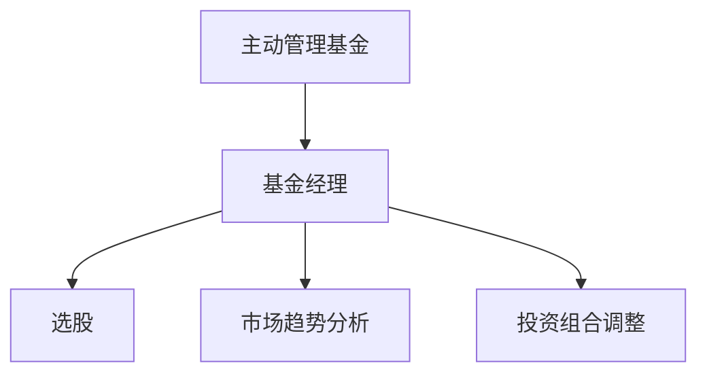
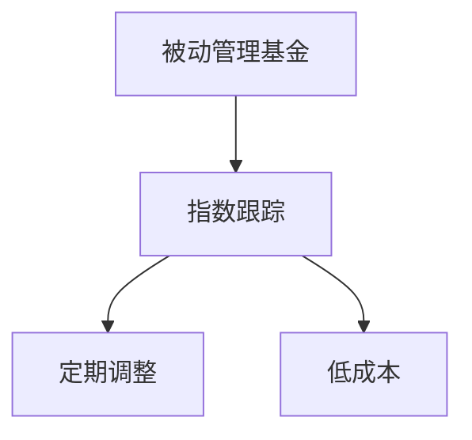
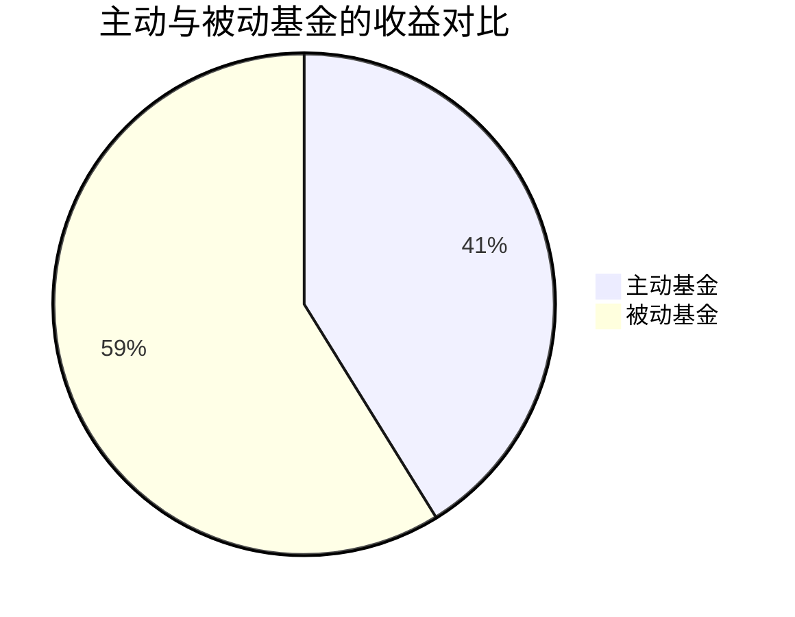

                 

# 《约翰·伯格对主动管理基金的批评》

## 关键词：主动管理基金，被动管理基金，约翰·伯格，投资策略，费用比率，投资绩效

## 摘要：  
约翰·伯格是投资领域的重要人物，他以其对指数基金的推崇而闻名，并对主动管理基金提出了深刻的批评。本文将详细探讨伯格的观点，分析主动管理基金的运作机制、优缺点，以及被动管理基金的优势。通过案例分析和数据支持，本文将展示伯格批评的核心逻辑，并为投资者提供实用的建议。

---

## 第一章：引言

### 1.1 主动管理基金的现状与争议  
主动管理基金在投资领域占据重要地位，但其高额费用和表现不稳定的问题引发了广泛争议。本文将从伯格的视角出发，分析主动管理基金的局限性。

---

## 第二章：主动管理基金的背景与运作

### 2.1 主动管理基金的定义与运作机制  
- **定义**：主动管理基金由基金经理主动选股，目标超越市场指数表现。  
- **运作机制**：基金经理通过分析市场趋势和公司基本面，构建投资组合，并频繁调整以追求超额收益。  

### 2.2 被动管理基金的定义与运作机制  
- **定义**：被动管理基金跟踪市场指数，如标普500，费用低，投资策略稳定。  
- **运作机制**：定期调整投资组合，以维持与指数一致的权重，避免频繁交易。  

---

## 第三章：约翰·伯格对主动管理基金的批评

### 3.1 主动管理基金的高费用问题  
- **费用比率**：主动基金的管理费通常高于被动基金，长期累积影响收益。  
- **数据对比**：通过表格展示主动与被动基金的费用比率差异。  

| 基金类型 | 平均费用比率（%） |
|----------|--------------------|
| 主动管理基金 | 1.5-2.5           |
| 被动管理基金 | 0.1-0.5           |

### 3.2 主动管理基金的收益不确定性  
- **收益波动**：主动基金难以持续跑赢指数，尤其在市场波动时表现不佳。  
- **伯格的观点**：市场预测的难度和人性的贪婪与恐惧导致主动管理难以长期稳定收益。  

### 3.3 对被动管理基金的推崇  
- **低成本优势**：被动基金的低费用使其在长期投资中更具竞争力。  
- **长期表现**：通过数据分析展示被动基金在长期中的超额收益。  

---

## 第四章：案例分析与数据支持

### 4.1 长期表现对比  
- **案例数据**：选取10年数据，对比主动与被动基金的年化回报率。  
- **图表分析**：使用柱状图展示主动与被动基金的收益差异。  

### 4.2 费用对收益的影响  
- **数学模型**：费用比率对投资收益的长期影响计算。  
- **公式**：假设年化收益为r，费用为c，则实际收益为 \( r - c \)。  

---

## 第五章：解决方案与投资策略

### 5.1 投资者如何选择基金  
- **费用优先**：选择低费用的被动基金，减少长期损失。  
- **长期投资**：避免频繁交易，降低费用对收益的影响。  

### 5.2 构建投资组合的步骤  
1. 确定投资目标与风险承受能力。  
2. 选择合适的被动指数基金。  
3. 定期审视投资组合，调整权重以维持目标配置。  

---

## 第六章：结论与展望

### 6.1 主要结论  
- 主动管理基金的高费用和收益不确定性使其长期表现不如被动基金。  
- 投资者应优先考虑低成本、稳定的被动管理基金。  

### 6.2 未来展望  
- 被动投资的趋势将继续增长，技术进步将进一步降低投资门槛。  
- 可能出现的新投资策略和工具将为投资者提供更多选择。  

---

## 结语  
约翰·伯格的批评揭示了主动管理基金的局限性，也为投资者提供了更明智的投资选择。通过被动管理基金，投资者可以在长期中获得更稳定的收益，实现财富的稳健增长。

