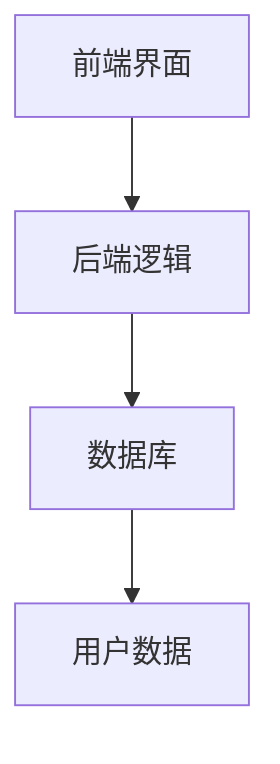
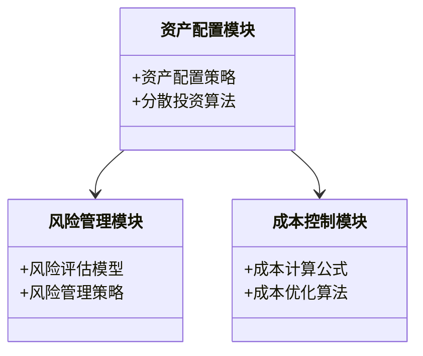

                 


# 《约翰·伯格的低成本投资策略》

## 关键词：低成本投资，约翰·伯格，价值投资，风险管理，系统架构，项目实战

## 摘要：约翰·伯格是低成本投资领域的先驱者，其策略强调长期投资、分散投资和低成本运作。本文详细阐述了伯格的投资理念，分析了低成本投资的数学模型和系统架构，结合实际案例，为投资者提供实用的指导和建议。

---

# 第一章：引言

## 1.1 约翰·伯格与低成本投资概述

### 1.1.1 约翰·伯格的生平简介
约翰·伯格（John Bogle）是低成本投资领域的先驱，被誉为“指数基金之父”。他于1940年出生于美国宾夕法尼亚州，毕业于宾夕法尼亚大学。伯格的职业生涯始于1965年，当时他创立了华安达信（Vanguard）公司，致力于为投资者提供低成本、透明的指数基金。

### 1.1.2 低成本投资的核心理念
低成本投资的核心理念是通过降低投资成本和减少交易频率来最大化长期收益。伯格认为，长期来看，市场波动和短期交易成本会侵蚀投资者的收益，因此低成本投资策略更注重长期持有和分散投资。

### 1.1.3 本书的目标与读者群体
本书旨在深入分析约翰·伯格的低成本投资策略，帮助投资者理解其背后的原理和实际操作方法。目标读者包括个人投资者、金融从业者以及对低成本投资感兴趣的研究者。

---

# 第二章：低成本投资的基本概念

## 2.1 投资的基本原理

### 2.1.1 投资的定义与分类
投资是指将资金投入到资产中，以期获得未来收益的行为。常见的投资方式包括股票、债券、房地产和黄金等。投资的目标是通过资产增值和收入最大化收益。

### 2.1.2 资产配置的基本原则
资产配置是指将资金分配到不同类型的资产中，以分散风险并优化收益。伯格认为，合理的资产配置是投资成功的关键，投资者应根据自身的风险承受能力和投资目标进行配置。

### 2.1.3 投资风险与收益的平衡
投资风险与收益成正比，高风险意味着潜在的高收益，而低风险则意味着较低的收益。伯格强调，投资者应根据自身的风险承受能力选择合适的投资策略。

## 2.2 低成本投资的核心要素

### 2.2.1 低成本投资的定义
低成本投资是指通过降低管理费、托管费等成本，以及减少交易频率来提高投资收益的投资策略。伯格认为，低成本是实现长期投资收益的关键因素。

### 2.2.2 成本在投资中的影响
投资成本包括管理费、托管费、交易佣金等，这些成本会直接影响投资收益。伯格的研究表明，低成本投资组合的长期表现通常优于高成本投资组合。

### 2.2.3 低成本投资与传统投资的对比
传统投资策略通常依赖于主动管理，追求超越市场的收益，但其高昂的管理费用和频繁的交易成本会显著侵蚀投资者的收益。而低成本投资策略则强调被动投资和长期持有，通过降低成本和减少交易次数来实现稳健的收益。

---

# 第三章：约翰·伯格的投资策略详解

## 3.1 价值投资的核心理念

### 3.1.1 价值投资的定义与特点
价值投资是一种投资策略，旨在通过寻找市场价格低于其内在价值的资产来实现收益。伯格认为，价值投资强调长期持有和分散投资，以降低风险并捕捉长期收益。

### 3.1.2 约翰·伯格的价值投资方法
伯格的价值投资方法强调长期持有和分散投资，他建议投资者选择那些具有稳定增长潜力的公司，并长期持有这些资产，避免频繁的买卖操作。

### 3.1.3 价值投资与成长投资的对比
价值投资注重资产的内在价值，而成长投资则注重资产的未来增长潜力。伯格认为，价值投资更注重长期稳健的收益，而成长投资则存在较高的风险。

## 3.2 长期投资与分散投资策略

### 3.2.1 长期投资的优势与风险
长期投资的优势在于能够避免短期市场波动的影响，实现资产的长期增值。然而，长期投资也存在一定的风险，如市场崩盘和通货膨胀等因素可能影响投资收益。

### 3.2.2 分散投资的原理与实践
分散投资是指将资金分配到不同的资产类别和行业中，以降低投资风险。伯格认为，分散投资是实现稳健收益的重要手段，投资者应避免过度集中于某一资产或行业。

### 3.2.3 约翰·伯格的分散投资策略
伯格建议投资者将资金分配到不同的指数基金中，以实现资产的分散投资。他认为，指数基金是一种低成本、透明的投资工具，能够有效地分散投资风险。

---

# 第四章：风险管理与低成本投资

## 4.1 风险管理的核心原则

### 4.1.1 投资风险的分类与特征
投资风险可以分为系统性风险和非系统性风险。系统性风险是整个市场的风险，如经济衰退和通货膨胀等。非系统性风险是特定资产或行业的风险，如公司财务状况不佳等。

### 4.1.2 风险管理的目标与方法
风险管理的目标是通过降低风险来提高投资收益。伯格认为，分散投资和长期持有是有效的风险管理方法，能够降低非系统性风险的影响。

### 4.1.3 约翰·伯格的风险管理策略
伯格强调，投资者应注重长期持有和分散投资，避免过度关注短期市场波动。他认为，通过分散投资可以有效降低风险，同时实现稳健的长期收益。

## 4.2 成本控制与投资收益

### 4.2.1 成本在投资收益中的影响
投资成本包括管理费、托管费和交易佣金等，这些成本会直接影响投资收益。伯格认为，低成本是实现长期投资收益的关键因素。

### 4.2.2 降低投资成本的方法
伯格建议投资者选择低成本的指数基金，避免频繁的交易操作，从而降低投资成本。他认为，低成本投资策略能够显著提高投资收益。

### 4.2.3 成本与收益的平衡
投资者在追求高收益的同时，也应注重成本控制。伯格认为，低成本投资策略能够在长期实现稳健的收益，同时降低投资风险。

---

# 第五章：系统分析与架构设计

## 5.1 低成本投资系统的总体架构

### 5.1.1 系统功能需求分析
低成本投资系统需要具备资产配置、风险评估、成本控制等功能。投资者可以通过该系统实现资产的分散投资和长期持有。

### 5.1.2 系统架构设计
低成本投资系统的架构包括前端界面、后端逻辑和数据存储三个部分。前端界面用于用户交互，后端逻辑负责处理投资策略和风险管理，数据存储用于保存投资数据。

### 5.1.3 系统功能模块设计
系统功能模块包括资产配置模块、风险管理模块和成本控制模块。资产配置模块用于实现资产的分散投资，风险管理模块用于评估和控制投资风险，成本控制模块用于降低投资成本。

## 5.2 系统架构设计

### 5.2.1 系统架构图


### 5.2.2 系统功能模块设计


---

# 第六章：项目实战

## 6.1 环境安装与配置

### 6.1.1 系统环境要求
投资者需要安装Python编程语言和相关库，如Pandas、Matplotlib等。

### 6.1.2 系统安装步骤
1. 安装Python。
2. 安装Pandas和Matplotlib库。
3. 下载相关数据集。

## 6.2 系统核心实现

### 6.2.1 资产配置算法实现
```python
import pandas as pd

def asset_allocation(portfolio, risk_level):
    # 计算资产配置比例
    pass
```

### 6.2.2 风险管理算法实现
```python
import numpy as np

def risk_management(portfolio, risk_level):
    # 计算风险价值
    pass
```

### 6.2.3 成本控制算法实现
```python
def cost_control(portfolio):
    # 计算投资成本
    pass
```

## 6.3 实际案例分析

### 6.3.1 投资组合分析
假设投资者有100万元，选择分散投资于股票、债券和房地产。

### 6.3.2 投资组合优化
通过优化算法，调整资产配置比例，以实现风险可控下的最大收益。

---

# 第七章：总结与展望

## 7.1 约翰·伯格投资策略的核心要点

### 7.1.1 长期投资的重要性
长期投资能够避免短期市场波动的影响，实现资产的长期增值。

### 7.1.2 分散投资的优势
分散投资能够降低投资风险，避免因个别资产或行业波动而造成的损失。

### 7.1.3 低成本的重要性
低成本投资策略能够显著提高投资收益，降低投资成本。

## 7.2 小结与最佳实践

### 7.2.1 投资者的注意事项
投资者应根据自身的风险承受能力和投资目标选择合适的投资策略。

### 7.2.2 投资策略的未来发展
随着技术的进步和市场的变化，低成本投资策略将不断创新和完善，为投资者提供更多的选择和机会。

---

通过以上内容，读者可以全面了解约翰·伯格的低成本投资策略，并能够在实际投资中应用这些策略，实现稳健的长期收益。

