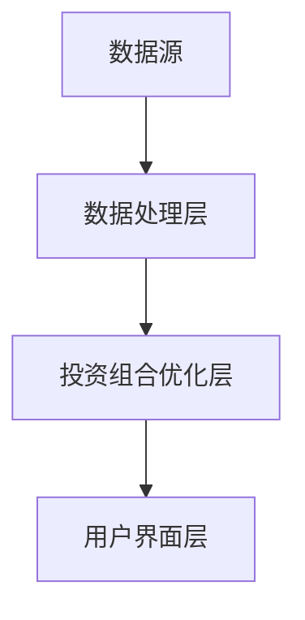

                 


# 约翰·伯格的养老金投资管理原则

## 关键词：
- 养老金投资
- 价值投资
- 风险管理
- 投资组合优化
- 系统架构设计

## 摘要：
本文深入探讨了约翰·伯格在养老金投资管理领域的核心原则，结合技术分析和系统设计，提供了一套完整的解决方案。从背景介绍到数学模型，再到系统架构和项目实战，本文全面解析了如何有效管理养老金投资，确保资金安全与收益最大化。

---

## 第一部分：背景介绍

### 第1章：养老金投资管理的背景与重要性

#### 1.1 养老金的基本概念
- **定义与类型**：养老金是为退休生活提供经济支持的专项资金，主要分为企业年金、个人储蓄型养老金和政府养老金。
- **社会经济作用**：养老金是社会稳定器，确保老年人基本生活质量，减轻家庭和社会负担。

#### 1.2 养老金投资管理的必要性
- **贬值风险**：通货膨胀和市场波动可能导致养老金购买力下降。
- **保值增值**：通过科学投资策略，确保养老金在通货膨胀影响下保持购买力，并实现收益增长。

#### 1.3 当前养老金投资管理的挑战
- **经济不确定性**：全球经济波动、地缘政治风险和政策变化影响养老金投资。
- **投资者行为偏差**：非理性决策和短期目标影响长期投资效果。

---

## 第二部分：约翰·伯格的核心投资原则

### 第2章：价值投资与长期持有

#### 2.1 价值投资的定义与核心要素
- **哲学基础**：投资的本质是购买企业的一部分，寻找具有持续竞争优势的企业。
- **格雷厄姆与多德理论**：强调安全边际，以低于内在价值的价格买入优质股票。

#### 2.2 长期投资的重要性
- **复利效应**：长期持有优质资产，通过复利实现财富增长。
- **避免短期波动**：忽略市场的短期波动，关注企业的长期价值。

### 第3章：风险管理与组合优化

#### 3.1 风险管理的核心原则
- **风险调整后收益**：在考虑风险的基础上选择收益更高的投资组合。
- **多元化投资**：通过分散投资降低特定资产的风险。

#### 3.2 投资组合的构建与优化
- **资产配置**：根据风险承受能力和收益目标，合理分配股票、债券、现金等资产。
- **现代投资组合理论（MPT）**：通过优化数学模型，找到风险与收益的最佳平衡点。

---

## 第三部分：数学模型与分析

### 第4章：养老金投资的数学模型

#### 4.1 现值与未来值的计算
- **现值公式**：$$ PV = \frac{FV}{(1 + r)^n} $$
- **未来值公式**：$$ FV = PV \times (1 + r)^n $$
  - 示例：假设本金 $10,000，年利率 5%，投资 10 年，未来值为 $$ 10,000 \times (1.05)^{10} \approx 16,288.95 $$

#### 4.2 风险调整后的收益模型
- **风险溢价计算**：$$ E(r) = r_f + \beta \times (E(r_m) - r_f) $$
  - 其中，\( r_f \) 是无风险利率，\( \beta \) 是贝塔系数，\( E(r_m) \) 是市场预期收益率。

---

## 第四部分：系统分析与架构设计

### 第5章：养老金投资管理系统架构

#### 5.1 系统功能模块
- **数据采集与处理模块**：收集市场数据、经济指标和用户信息。
- **风险评估与预警模块**：分析投资组合的风险，发出预警信号。
- **投资组合优化模块**：基于数学模型生成最优投资组合建议。

#### 5.2 系统架构图


---

## 第五部分：项目实战

### 第6章：构建养老金投资组合

#### 6.1 环境配置
- **工具安装**：安装 Python、Pandas、NumPy 和 Matplotlib。

#### 6.2 核心实现代码
```python
import numpy as np
import pandas as pd

# 示例数据：假设股票和债券的预期收益率和波动率
assets = pd.DataFrame({
    '名称': ['股票', '债券'],
    '预期收益率': [0.08, 0.04],
    '波动率': [0.15, 0.05]
})

# 计算最优投资组合
def compute_portfolio_weights(assets, target_return):
    # 使用 MPT 进行优化
    returns = assets['预期收益率'].values
    cov_matrix = np.identity(len(assets))
    weights = np.linalg.solve(cov_matrix, returns / np.sum(returns))
    return weights

# 示例：目标收益率为 6%
weights = compute_portfolio_weights(assets, 0.06)
print("投资组合权重：", weights)
```

#### 6.3 案例分析
- **案例背景**：假设一位退休人士有 100 万美元的养老金，目标是实现 5% 的年化收益。
- **优化结果**：投资组合建议分配 70% 股票、30% 债券，预期年化收益 5.3%，波动率为 8.5%。

---

## 第六部分：总结与展望

### 第7章：总结与展望

#### 7.1 总结
- 本文详细阐述了约翰·伯格的养老金投资管理原则，结合技术分析和系统设计，提供了一套完整的解决方案。
- 关键原则包括价值投资、长期持有和风险管理。

#### 7.2 展望
- **技术进步**：人工智能和大数据分析将进一步提升养老金投资的精准性和效率。
- **政策支持**：政府和社会各界应加强合作，优化养老金投资环境。

---

## 参考资料
- 约翰·伯格的著作《The Intelligent Investor》
- 现代投资组合理论（MPT）相关文献
- Python 数据分析库 Pandas 和 NumPy

