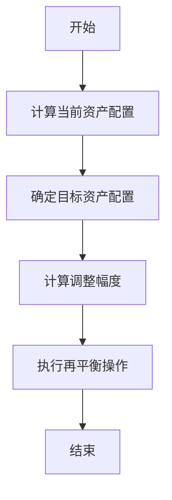
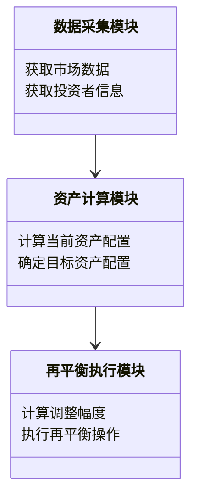
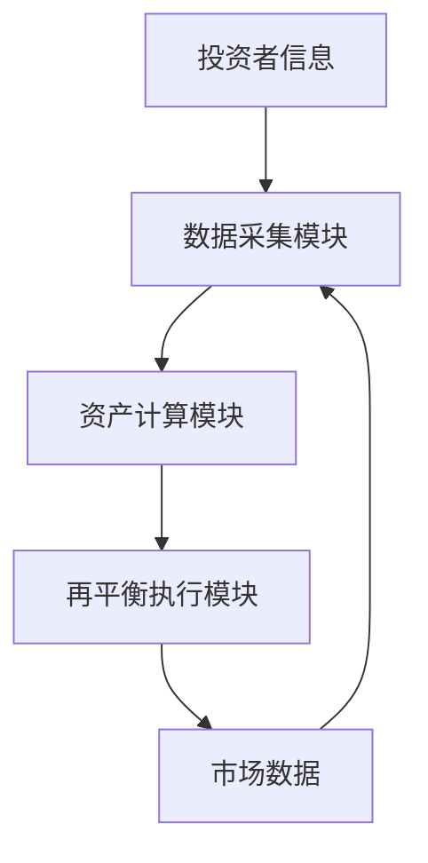

                 


# 《约翰·伯格的再平衡策略》

## 关键词：
再平衡策略, 资产配置, 动态调整, 风险管理, 投资组合优化

## 摘要：
本文深入探讨了约翰·伯格的再平衡策略，分析其在投资组合管理中的重要性。通过详细阐述再平衡策略的核心概念、算法原理、系统架构及项目实战，本文旨在为读者提供全面的理论与实践指导，帮助他们在复杂的投资环境中优化资产配置，降低风险，实现长期稳健的投资收益。

---

# 《约翰·伯格的再平衡策略》

## 摘要：
再平衡策略是投资组合管理中的关键方法，能够帮助投资者在市场波动中维持最优资产配置。本文通过分析约翰·伯格的再平衡策略，详细讲解其核心概念、算法原理、系统架构及项目实战，为读者提供全面的理论与实践指导。

---

## 第1章：引言

### 1.1 再平衡策略的背景与意义
在投资领域，资产配置是实现稳健收益的核心策略。然而，市场波动、通货膨胀和投资者风险偏好的变化，常常导致原本优化的资产配置偏离预期目标。这种偏离若不及时调整，可能导致投资组合的表现低于预期，甚至引发重大风险。再平衡策略，作为资产管理中的重要工具，通过定期或动态调整资产权重，确保投资组合与预定目标保持一致。

约翰·伯格，作为投资领域的权威，提出了基于长期价值的投资理念，并将再平衡策略融入其投资体系中。本文将详细探讨再平衡策略的核心概念、算法原理、系统架构及实际应用，帮助读者理解如何在复杂的投资环境中优化资产配置。

---

## 第2章：再平衡策略的核心概念

### 2.1 再平衡策略的定义与目标
再平衡策略是一种通过调整投资组合中各类资产的比例，以维持目标资产配置的方法。其核心目标是消除因市场波动或其他因素导致的资产配置偏差，优化风险与收益的平衡。

### 2.2 再平衡的类型
再平衡策略可以根据触发条件分为以下几种类型：
1. **定期再平衡**：按照预定的时间间隔（如每季度或每半年）进行调整。
2. **动态再平衡**：根据市场环境或投资者风险偏好的变化，实时调整资产配置。
3. **阈值再平衡**：当资产配置偏离目标比例超过预设阈值时，进行调整。

### 2.3 再平衡策略与其他投资策略的对比

| 策略类型    | 触发条件       | 调整频率 | 优点                     | 缺点                     |
|-------------|----------------|----------|--------------------------|--------------------------|
| 定期再平衡  | 时间间隔       | 定期     | 简单易行                 | 可能无法捕捉市场机会     |
| 动态再平衡  | 市场变化、风险偏好 | 实时     | 更具灵活性               | 实施难度较大             |
| 阈值再平衡  | 配置偏离目标    | 不定期   | 减少频繁调整              | 可能错失调整的最佳时机   |

### 2.4 再平衡策略的核心要素
再平衡策略的核心要素包括：
1. **目标资产配置**：根据投资者的风险承受能力和收益目标确定各类资产的目标权重。
2. **当前资产配置**：根据市场变化和投资表现计算当前资产的实际权重。
3. **调整幅度**：确定每轮再平衡的调整范围，通常基于目标权重与实际权重的偏差。

---

## 第3章：再平衡策略的算法原理

### 3.1 再平衡算法的基本步骤
1. **计算当前资产配置**：根据投资组合中各类资产的当前市值，计算其实际权重。
2. **确定目标资产配置**：根据投资者的风险偏好和收益目标，设定各类资产的目标权重。
3. **计算调整幅度**：确定需要调整的资产类别及其调整比例。
4. **执行再平衡操作**：通过买卖资产调整实际权重，使其接近目标权重。

### 3.2 动态再平衡算法的实现
动态再平衡算法是一种实时调整资产配置的策略，其核心在于根据市场变化和投资者风险偏好的变化，动态调整资产权重。以下是动态再平衡算法的流程图：



### 3.3 再平衡算法的数学模型
再平衡算法的数学模型可以通过以下公式表示：

$$ \text{调整幅度} = \text{目标权重} - \text{当前权重} $$

假设投资者的目标资产配置为：
- 股票：60%
- 债券：30%
- 现金：10%

当前资产配置为：
- 股票：55%
- 债券：35%
- 现金：10%

则调整幅度为：
- 股票：-5%
- 债券：+5%
- 现金：0%

通过卖出股票并买入债券，投资者可以将资产配置调整回目标比例。

---

## 第4章：再平衡策略的系统架构

### 4.1 系统模块划分
再平衡系统可以划分为以下几个主要模块：
1. **数据采集模块**：获取市场数据和投资者信息。
2. **资产计算模块**：计算当前资产配置。
3. **再平衡执行模块**：根据目标配置执行再平衡操作。

### 4.2 系统功能设计
以下是再平衡系统的功能设计图：



### 4.3 系统架构图
以下是再平衡系统的整体架构图：



---

## 第5章：再平衡策略的项目实战

### 5.1 项目背景与目标
某投资者希望通过再平衡策略实现年化收益8%，并将其投资组合的风险控制在合理范围内。

### 5.2 项目环境搭建
1. **工具安装**：安装Python编程环境、数据处理库（如Pandas）和可视化库（如Matplotlib）。
2. **数据获取**：通过API获取历史市场数据。

### 5.3 核心功能实现
以下是再平衡策略的核心功能实现代码：

```python
import pandas as pd
import numpy as np

def calculate_rebalance(portfolio_value, target_weights):
    current_weights = portfolio_value / portfolio_value.sum()
    rebalance_amount = target_weights - current_weights
    return rebalance_amount

# 示例数据
portfolio_value = pd.Series([100, 50, 30], index=['股票', '债券', '现金'])
target_weights = pd.Series([0.6, 0.3, 0.1])

rebalance_amount = calculate_rebalance(portfolio_value, target_weights)
print(rebalance_amount)
```

### 5.4 实际案例分析
以某投资者为例，假设其初始投资组合为：
- 股票：60%
- 债券：30%
- 现金：10%

由于市场波动，当前投资组合变为：
- 股票：55%
- 债券：35%
- 现金：10%

通过再平衡策略，投资者需要卖出5%的股票，买入5%的债券，以恢复目标资产配置。

### 5.5 项目小结
通过再平衡策略，投资者能够在市场波动中维持目标资产配置，从而降低投资风险并实现稳健收益。

---

## 第6章：结论与展望

### 6.1 结论
再平衡策略是投资组合管理中的重要工具，能够帮助投资者在复杂市场环境中优化资产配置，降低风险。本文通过详细分析约翰·伯格的再平衡策略，为读者提供了理论与实践相结合的指导。

### 6.2 未来展望
随着人工智能和大数据技术的发展，再平衡策略将更加智能化和个性化。未来的研究可以关注以下方面：
1. 基于机器学习的再平衡算法优化。
2. 实时市场数据驱动的动态再平衡策略。
3. 跨资产类别和地域的全球化再平衡策略。

---

## 总结
通过本文的探讨，读者可以全面理解约翰·伯格的再平衡策略，并在实际投资中应用这些方法，优化资产配置，实现长期稳健的投资收益。

