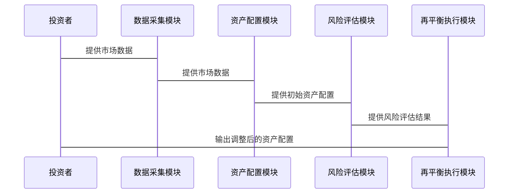

                 


# 约翰·伯格的再平衡策略：维持投资组合平衡

> **关键词**：再平衡策略、投资组合、资产配置、风险管理、动态调整、组合优化  
> **摘要**：本文深入探讨了约翰·伯格提出的再平衡策略，分析其在维持投资组合平衡中的作用。通过数学建模、系统架构设计和实战案例，详细解读了再平衡策略的原理、实现方法及应用场景。文章最后总结了最佳实践，为投资者提供实用的建议。

---

## 第1章: 投资组合再平衡的背景与意义

### 1.1 投资组合再平衡的背景

#### 1.1.1 投资组合管理的基本概念
投资组合管理是通过科学配置资产，以实现既定投资目标的过程。投资者需要在风险与收益之间找到平衡点，确保资产在不同市场环境下的稳定性。

#### 1.1.2 再平衡策略的定义与目的
再平衡策略是一种动态调整投资组合资产配置的方法，旨在应对市场波动、资金流入或流出等情况，保持投资组合的风险收益特性不变。

#### 1.1.3 再平衡策略在投资中的重要性
随着市场环境的变化，单一资产的表现会出现波动，导致投资组合的权重偏离初始设定。再平衡策略通过定期调整，确保资产配置符合投资目标。

### 1.2 投资组合再平衡的核心概念

#### 1.2.1 资产配置的基本原理
资产配置是将资金分配到不同资产类别（如股票、债券、现金等）中，以分散风险并优化收益。再平衡策略通过调整各资产的权重，维持配置的合理性。

#### 1.2.2 投资组合的波动性与风险
投资组合的波动性反映了资产价格的短期变化，而风险则体现在长期收益的不确定性。再平衡策略通过调整资产权重，降低波动性对投资目标的影响。

#### 1.2.3 再平衡策略的分类与特点
再平衡策略可分为定期再平衡和事件驱动再平衡。定期再平衡按固定时间间隔调整，而事件驱动再平衡则根据特定事件（如资产权重偏离目标）触发调整。

### 1.3 再平衡策略的应用场景

#### 1.3.1 市场波动对投资组合的影响
市场波动会导致资产价格的剧烈波动，使得投资组合的权重偏离预期。再平衡策略通过调整资产配置，减少波动性对投资组合的影响。

#### 1.3.2 不同投资目标的再平衡需求
不同投资目标（如保守型、平衡型、激进型）对再平衡的需求不同。激进型投资组合需要更频繁的再平衡，以应对高风险和高收益的双重挑战。

#### 1.3.3 机构投资者与个人投资者的差异
机构投资者通常拥有更多的资源和数据支持，能够更精准地实施再平衡策略。而个人投资者可能需要借助工具或咨询来实现有效的再平衡。

---

## 第2章: 投资组合再平衡的数学模型与算法原理

### 2.1 投资组合再平衡的基本公式

#### 2.1.1 资产权重的计算公式
$$ w_i = \frac{a_i}{\sum_{j=1}^{n} a_j} $$
其中，\( w_i \) 表示第 \( i \) 个资产的权重，\( a_i \) 表示第 \( i \) 个资产的金额，\( n \) 表示资产总数。

#### 2.1.2 资产调整的数学模型
再平衡策略的目标是使投资组合的权重与目标配置一致。假设目标权重为 \( w_i^* \)，当前权重为 \( w_i \)，则调整金额为：
$$ \Delta a_i = a_i^* - a_i $$
其中，\( a_i^* = w_i^* \times \sum_{j=1}^{n} a_j \)。

#### 2.1.3 再平衡策略的优化算法
再平衡策略可以通过优化模型实现：
$$ \min \sum_{i=1}^{n} (w_i - w_i^*)^2 $$
约束条件：
$$ \sum_{i=1}^{n} w_i = 1 $$

### 2.2 再平衡策略的数学推导

#### 2.2.1 投资组合波动性的数学表达
投资组合的波动性由各资产的波动性和它们的权重决定：
$$ \sigma_p^2 = \sum_{i=1}^{n} \sum_{j=1}^{n} w_i w_j \sigma_{ij} $$
其中，\( \sigma_{ij} \) 表示资产 \( i \) 和 \( j \) 的协方差。

#### 2.2.2 资产权重调整的优化问题
再平衡的目标是最小化权重偏离目标配置的平方和：
$$ \min \sum_{i=1}^{n} (w_i - w_i^*)^2 $$
约束条件：
$$ \sum_{i=1}^{n} w_i = 1 $$

#### 2.2.3 再平衡策略的数学证明
通过优化模型，可以证明再平衡策略能够有效降低投资组合的波动性，同时提高收益的稳定性。

### 2.3 再平衡策略的算法实现

#### 2.3.1 动态再平衡算法
动态再平衡算法根据市场环境的变化，定期调整资产配置。例如，每季度调整一次，确保权重与目标配置一致。

#### 2.3.2 被动再平衡算法
被动再平衡算法根据资产价格的变化，按固定比例调整资产权重。这种方法适用于市场波动较小的情况。

#### 2.3.3 基于机器学习的再平衡算法
基于机器学习的再平衡算法通过分析市场数据，预测未来市场的走势，动态调整资产配置。

---

## 第3章: 投资组合再平衡的系统架构与实现

### 3.1 系统架构设计

#### 3.1.1 系统模块划分
系统分为数据采集模块、资产配置模块、风险评估模块和再平衡执行模块。

#### 3.1.2 系统功能设计
- 数据采集模块：获取市场数据和投资者需求。
- 资产配置模块：计算初始资产配置。
- 风险评估模块：评估投资组合的风险。
- 再平衡执行模块：根据风险评估结果，执行再平衡操作。

#### 3.1.3 系统架构图（Mermaid）


### 3.2 系统功能实现

#### 3.2.1 资产配置模块
资产配置模块根据投资者的风险偏好和投资目标，计算初始资产配置。

#### 3.2.2 风险评估模块
风险评估模块通过分析市场数据，评估投资组合的波动性和风险。

#### 3.2.3 再平衡执行模块
再平衡执行模块根据风险评估结果，调整资产权重，确保投资组合符合目标配置。

### 3.3 系统接口设计

#### 3.3.1 系统输入接口
- 市场数据接口：提供实时市场数据。
- 投资者需求接口：获取投资者的风险偏好和投资目标。

#### 3.3.2 系统输出接口
- 资产配置结果接口：输出初始资产配置。
- 再平衡结果接口：输出调整后的资产配置。

#### 3.3.3 系统交互流程图（Mermaid）



---

## 第4章: 投资组合再平衡的实战与案例分析

### 4.1 实战环境搭建

#### 4.1.1 环境配置
- 操作系统：Windows 10 或 macOS 12
- 开发工具：Python 3.8 或更高版本
- 库：Pandas、NumPy、Scikit-learn

#### 4.1.2 工具安装
安装必要的库：
```bash
pip install pandas numpy scikit-learn
```

#### 4.1.3 数据准备
准备历史市场数据和投资者需求。

### 4.2 核心代码实现

#### 4.2.1 资产权重计算代码
```python
import pandas as pd
import numpy as np

# 假设 df 是包含资产价格的 DataFrame
def calculate_weights(df):
    total = df.sum().sum()
    weights = df.div(df.sum(axis=1), axis=0)
    return weights
```

#### 4.2.2 再平衡策略实现代码
```python
def rebalance(weights, target_weights):
    # 计算权重偏差
    rebalance_amount = weights - target_weights
    # 调整权重
    new_weights = weights + rebalance_amount
    return new_weights
```

#### 4.2.3 系统功能测试代码
```python
import pandas as pd
import numpy as np

# 示例数据
assets = ['股票', '债券', '现金']
prices = pd.DataFrame({
    '股票': [100, 105, 110],
    '债券': [100, 95, 90],
    '现金': [0, 5, 10]
})

# 计算初始权重
initial_weights = calculate_weights(prices)
print("初始权重：", initial_weights)

# 设定目标权重
target_weights = {'股票': 0.5, '债券': 0.3, '现金': 0.2}

# 执行再平衡
rebalanced_weights = rebalance(initial_weights, target_weights)
print("调整后权重：", rebalanced_weights)
```

### 4.3 实战案例分析

#### 4.3.1 案例背景介绍
假设投资者的目标是平衡型投资组合，初始资产配置为股票50%、债券30%、现金20%。市场波动导致股票权重上升至60%，债券权重下降至25%，现金权重上升至15%。

#### 4.3.2 案例分析与解读
通过再平衡策略，调整资产配置，使股票权重回到50%，债券权重增加到35%，现金权重调整到15%。

#### 4.3.3 案例总结与启示
再平衡策略能够有效应对市场波动，维持投资组合的稳定性。

---

## 第5章: 再平衡策略的最佳实践与总结

### 5.1 再平衡策略的实施要点

#### 5.1.1 确定投资目标与风险偏好
投资者需要明确自己的投资目标和风险承受能力，这是制定再平衡策略的基础。

#### 5.1.2 选择合适的再平衡频率
再平衡频率取决于市场波动性和投资目标的稳定性。通常，季度性再平衡适合大多数投资者。

#### 5.1.3 设定合理的再平衡阈值
再平衡阈值是触发再平衡的条件，通常设定为资产权重偏离目标配置的一定比例（如5%）。

### 5.2 最佳实践 tips

#### 5.2.1 定期审查投资组合
定期审查投资组合的权重和风险敞口，确保再平衡策略的有效性。

#### 5.2.2 结合市场环境调整策略
根据市场环境的变化，灵活调整再平衡策略，优化投资组合的表现。

#### 5.2.3 使用工具辅助实现
利用专业的投资组合管理工具或软件，简化再平衡策略的实施过程。

### 5.3 总结

再平衡策略是维持投资组合平衡的重要工具。通过科学的数学建模和系统的架构设计，投资者可以有效地应对市场波动，实现投资目标。

### 5.4 注意事项

- 再平衡策略需要结合市场环境和投资者需求灵活调整。
- 在实施再平衡策略时，需注意交易成本和税收影响。

### 5.5 拓展阅读

- 约翰·伯格的《投资组合管理》
- 《风险管理与投资组合优化》

---

通过本文的详细分析，读者可以全面理解约翰·伯格的再平衡策略，并将其应用于实际投资中。

