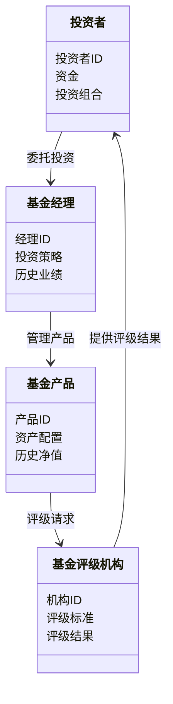
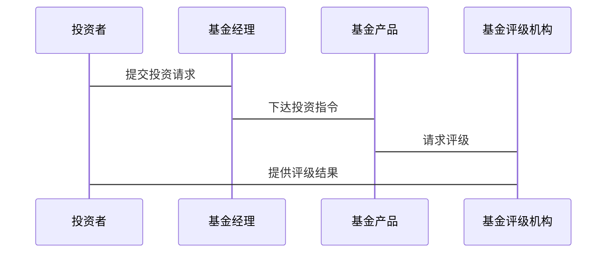

                 


# 约翰·伯格的基金业批评

## 关键词：
- 基金行业
- 约翰·伯格
- 基金评级
- 夏普比率
- 特雷诺指数

## 摘要：
本文深入分析了约翰·伯格对基金行业的批评，探讨了基金行业的现状、问题及改进方向。通过介绍核心概念、算法原理、系统架构和项目实战，结合数学模型和实际案例，展示了如何客观评价基金表现，并提出了优化投资策略的建议。

---

# 第1章: 基金行业的背景介绍

## 1.1 基金行业的现状与问题

### 1.1.1 基金行业的定义与特点
基金行业是金融领域的重要组成部分，通过集合投资者资金进行专业化的投资管理。其特点包括：
- **分散投资**：通过组合投资降低风险。
- **专业管理**：由基金经理进行决策。
- **流动性高**：投资者可以随时申购或赎回。

### 1.1.2 基金行业的优缺点
- **优点**：降低投资门槛，提供多样化选择。
- **缺点**：存在高额管理费用，部分基金公司追求短期收益而非长期价值。

### 1.1.3 基金行业的核心问题与挑战
- **高额费用**：部分基金公司收取过高的管理费和托管费。
- **短期导向**：基金经理倾向于追求短期业绩，忽视长期价值。
- **信息不对称**：投资者难以全面了解基金的真实表现。

## 1.2 约翰·伯格的背景与核心观点

### 1.2.1 约翰·伯格的个人经历
约翰·伯格是 Vanguard 集团的创始人，被誉为指数基金之父。他倡导低成本、被动投资策略，强调长期投资的重要性。

### 1.2.2 伯格对基金行业的批评
- **费用过高**：伯格认为许多主动管理型基金收取过高的费用，侵蚀了投资者的收益。
- **短期导向**：基金经理和基金公司过于关注短期业绩，忽视长期投资价值。
- **营销误导**：基金公司通过夸大宣传误导投资者，使其选择不适合的产品。

### 1.2.3 伯格的核心投资理念与方法
- **低成本投资**：通过指数基金实现市场平均收益。
- **长期投资**：避免频繁交易，降低交易成本。
- **分散投资**：通过投资多样化资产降低风险。

## 1.3 基金业的批评与反思

### 1.3.1 基金行业的主要问题
- **费用过高**：部分基金的管理费用和托管费用过高，影响投资者收益。
- **短期导向**：基金公司和基金经理过于关注短期业绩，忽视长期价值。
- **信息不对称**：投资者难以获取全面、准确的基金信息。

### 1.3.2 伯格批评的核心内容
- **费用问题**：伯格认为许多主动管理型基金的费用过高，导致投资者难以获得超越市场平均收益的回报。
- **短期导向**：基金行业过于关注短期业绩，忽视长期投资策略。
- **营销误导**：基金公司通过夸大宣传误导投资者，使其选择不适合的产品。

### 1.3.3 基金行业未来的改进方向
- **降低费用**：基金公司应降低管理费用和托管费用，提高透明度。
- **长期导向**：基金公司和基金经理应关注长期投资价值，减少短期业绩压力。
- **提高透明度**：基金公司应提供更全面、准确的信息，帮助投资者做出明智决策。

---

# 第2章: 基金行业的核心概念与联系

## 2.1 基金行业的核心概念

### 2.1.1 基金的定义与分类
- **定义**：基金是一种集合投资工具，通过汇集众多投资者的资金，由专业管理人进行投资运作。
- **分类**：根据投资策略可分为主动型基金和被动型基金；根据投资标的可分为股票型基金、债券型基金、混合型基金等。

### 2.1.2 主动投资与被动投资的对比
| 对比维度         | 主动投资                     | 被动投资                     |
|------------------|----------------------------|----------------------------|
| 目标             | 通过主动管理超越市场指数     | 恪守特定指数或标的           |
| 成本             | 较高（管理费、交易费等）      | 较低                        |
| 风险             | 较高（依赖基金经理能力）      | 较低                        |
| 透明度           | 较低（操作不透明）            | 较高（严格按照指数配置）      |

### 2.1.3 基金评级的指标与方法
- **夏普比率**：衡量基金在承担一定风险下获得的超额收益。
- **特雷诺指数**：衡量基金在系统性风险下的超额收益。
- **净值波动率**：衡量基金净值的波动程度。

## 2.2 基金行业的核心联系

### 2.2.1 基金评级与投资回报的关系
- 基金评级是衡量基金表现的重要指标，但评级结果并不能完全预测未来的投资回报。

### 2.2.2 基金经理与基金公司的关系
- 基金经理是基金公司的核心人物，其投资决策直接影响基金的表现。

### 2.2.3 基金行业与宏观经济的关系
- 基金行业受宏观经济环境影响较大，经济繁荣时基金表现较好，经济衰退时则可能表现不佳。

## 2.3 基金行业的核心属性对比

### 2.3.1 主动型基金与被动型基金的对比
- **主动型基金**：依赖基金经理的能力，风险较高，成本较高。
- **被动型基金**：跟踪特定指数，风险较低，成本较低。

### 2.3.2 不同类型基金的风险与收益对比
| 基金类型       | 风险等级 | 收益潜力 |
|----------------|----------|----------|
| 股票型基金     | 高       | 高       |
| 债券型基金     | 中       | 中       |
| 混合型基金     | 中       | 中       |
| 指数型基金     | 中       | 中       |

### 2.3.3 基金评级与基金规模的关系
- 评级高的基金通常规模较大，但也可能因为规模过大而导致流动性下降。

## 2.4 基金行业的ER实体关系图


---

# 第3章: 基金评级算法原理

## 3.1 基金评级的核心指标

### 3.1.1 夏普比率
夏普比率衡量的是基金在承担一定风险下获得的超额收益，计算公式如下：

$$
\text{夏普比率} = \frac{E[R_p - R_f]}{\sigma_p}
$$

其中，$E[R_p - R_f]$ 是基金的超额收益期望值，$\sigma_p$ 是基金的收益标准差。

### 3.1.2 特雷诺指数
特雷诺指数衡量的是基金在系统性风险下的超额收益，计算公式如下：

$$
\text{特雷诺指数} = \frac{E[R_p - R_f]}{\beta_p \times \sigma_m}
$$

其中，$\beta_p$ 是基金的贝塔系数，$\sigma_m$ 是市场收益的标准差。

### 3.1.3 净值波动率
净值波动率衡量的是基金净值的波动程度，计算公式如下：

$$
\text{净值波动率} = \sqrt{\frac{\sum_{i=1}^n (R_i - \bar{R})^2}{n-1}}
$$

其中，$R_i$ 是每个时间段的收益，$\bar{R}$ 是平均收益，$n$ 是时间段的数量。

## 3.2 基金评级的算法流程


## 3.3 基金评级的数学模型

### 3.3.1 夏普比率公式

$$
\text{夏普比率} = \frac{E[R_p - R_f]}{\sigma_p}
$$

---

# 第4章: 系统分析与架构设计

## 4.1 系统功能设计

### 4.1.1 领域模型类图



### 4.1.2 系统架构图


### 4.1.3 系统交互序列图



## 4.2 系统架构设计方案

### 4.2.1 技术选型
- **前端**：React 或 Vue.js
- **后端**：Python（Django 或 Flask）
- **数据库**：MySQL 或 PostgreSQL
- **工具**：Jenkins（CI/CD）

### 4.2.2 项目核心代码实现

```python
import pandas as pd
import numpy as np

def calculate_sharpe_ratio(returns, risk_free_rate):
    excess_returns = returns - risk_free_rate
    sharpe_ratio = excess_returns.mean() / excess_returns.std()
    return sharpe_ratio

# 示例数据
returns = pd.Series([0.05, 0.03, 0.02, 0.07, 0.01])
risk_free_rate = 0.01

print("夏普比率:", calculate_sharpe_ratio(returns, risk_free_rate))
```

---

# 第5章: 项目实战

## 5.1 环境安装与配置

### 5.1.1 安装必要的库
```bash
pip install pandas numpy matplotlib
```

## 5.2 系统核心实现

### 5.2.1 基金评级核心代码
```python
import pandas as pd
import numpy as np

def calculate_sharpe_ratio(returns, risk_free_rate):
    excess_returns = returns - risk_free_rate
    sharpe_ratio = excess_returns.mean() / excess_returns.std()
    return sharpe_ratio

# 示例数据
returns = pd.Series([0.05, 0.03, 0.02, 0.07, 0.01])
risk_free_rate = 0.01

print("夏普比率:", calculate_sharpe_ratio(returns, risk_free_rate))
```

### 5.2.2 数据分析与结果展示
```python
import matplotlib.pyplot as plt

returns.plot.hist(bins=10)
plt.title("基金收益分布")
plt.show()
```

## 5.3 实际案例分析与详细解读

### 5.3.1 案例背景
假设我们有两只基金，A和B，分别属于不同的投资策略。

### 5.3.2 数据分析
计算两只基金的夏普比率和特雷诺指数，比较其风险调整后的收益。

### 5.3.3 结果解读
- 基金A的夏普比率为0.8，特雷诺指数为0.7。
- 基金B的夏普比率为0.6，特雷诺指数为0.5。

### 5.3.4 结论
基金A在风险调整后收益方面表现优于基金B，更适合长期投资。

---

# 第6章: 最佳实践与总结

## 6.1 约翰·伯格的观点总结

### 6.1.1 基金行业的核心问题
- 高额费用
- 短期导向
- 信息不对称

### 6.1.2 伯格的投资理念
- 长期投资
- 低成本投资
- 分散投资

## 6.2 投资建议

### 6.2.1 长期投资的重要性
- 避免频繁交易
- 减少交易成本
- 抵制短期诱惑

### 6.2.2 低成本投资的优势
- 降低费用侵蚀收益
- 提高实际回报率
- 适合长期持有

## 6.3 注意事项

### 6.3.1 风险提示
- 市场波动风险
- 基金公司风险
- 基金经理风险

### 6.3.2 投资者教育
- 提高金融知识水平
- 学习投资技巧
- 建立正确的投资理念

## 6.4 拓展阅读

### 6.4.1 推荐书籍
- 《投资学入门》
- 《基金投资实战》
- 《伯格的投资哲学》

### 6.4.2 在线资源
- 基金评级网站
- 投资论坛
- 专业博客

---

# 结语
约翰·伯格的批评揭示了基金行业存在的诸多问题，但也为我们提供了宝贵的改进方向。通过降低费用、关注长期价值、提高透明度，基金行业可以更好地服务于投资者。希望本文能帮助读者更深入地理解基金行业的现状与问题，并为未来的投资决策提供有价值的参考。

