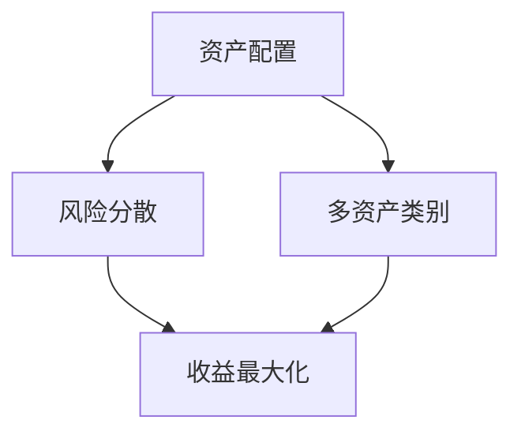
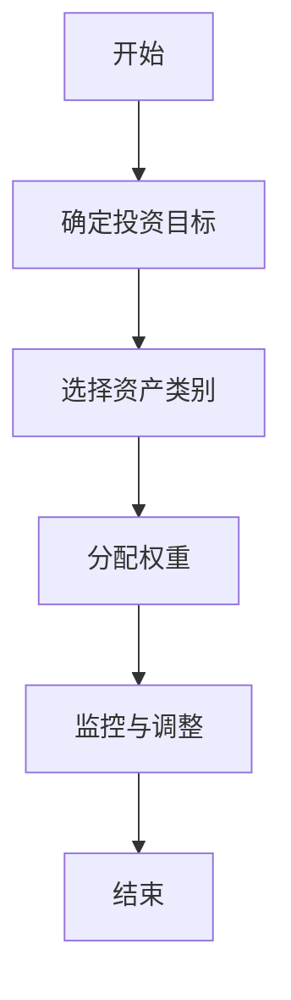
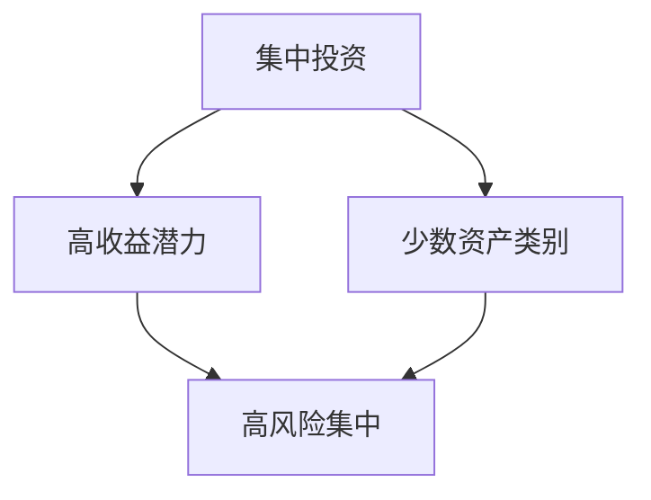
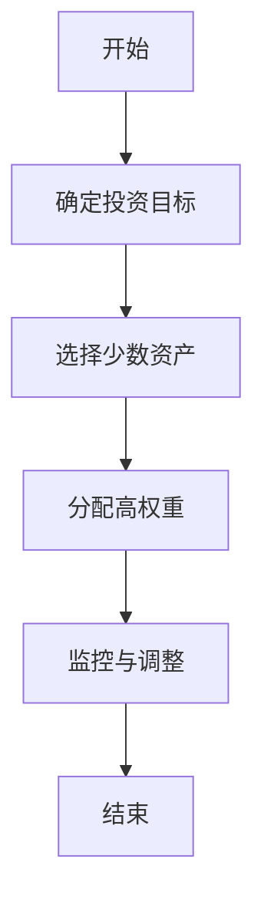
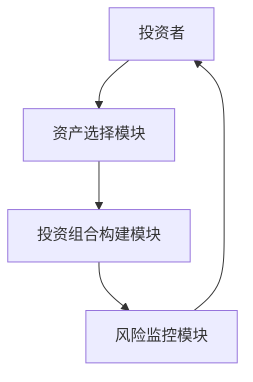

                 


# 约翰·伯格的广泛多元化 vs 聚焦投资

> 关键词：投资策略、约翰·伯格、多元化、聚焦投资、风险控制、资产配置

> 摘要：本文深入探讨了约翰·伯格的广泛多元化投资策略与聚焦投资策略的核心理念、数学模型、系统架构、实际应用以及对比分析。通过详细讲解两种策略的优缺点，结合数学公式、mermaid流程图和实际案例，为读者提供了全面的投资策略选择指南。

---

## 第一章：引言

### 1.1 背景介绍

- **问题背景**  
  在现代金融投资中，投资者面临着多种选择，包括广泛多元化投资和聚焦投资。这两种策略各有优劣，适用于不同的市场环境和投资者需求。

- **问题描述**  
  约翰·伯格作为投资领域的权威，提出了广泛多元化的理念，而聚焦投资则是另一种极端的投资策略。本文旨在对比这两种策略，帮助投资者选择最适合自己的方法。

- **问题解决**  
  通过分析两种策略的原理、模型和实际应用，本文为读者提供清晰的投资决策框架。

- **边界与外延**  
  本文主要讨论股票和债券的投资策略，不涉及外汇和加密货币。

- **概念结构与核心要素**  
  本文的核心要素包括：资产配置、风险分散、投资组合优化、市场波动性等。

---

## 第二章：广泛多元化投资策略

### 2.1 核心概念与联系

- **概念结构**  
  使用mermaid图展示广泛多元化投资的核心要素：



- **属性特征对比**  
  下表对比了广泛多元化与聚焦投资的核心属性：

| 属性       | 广泛多元化             | 聚焦投资               |
|------------|-----------------------|------------------------|
| 风险分散    | 高                   | 低                     |
| 收益波动    | 较低                 | 较高                   |
| 管理复杂度  | 低                   | 高                     |

### 2.2 数学模型

- **数学公式**  
  投资组合的期望收益与风险的计算公式：

  $$E(R_p) = \sum_{i=1}^n w_i E(R_i)$$  
  $$\sigma_p = \sqrt{\sum_{i=1}^n \sum_{j=1}^n w_i w_j \sigma_i \sigma_j \rho_{ij}}$$

  其中，$w_i$ 是资产$i$的权重，$\sigma_i$ 是资产$i$的风险，$\rho_{ij}$ 是资产$i$和$j$的相关性。

- **算法原理**  
  使用mermaid图展示广泛多元化投资的算法流程：



---

## 第三章：聚焦投资策略

### 3.1 核心概念与联系

- **概念结构**  
  使用mermaid图展示聚焦投资的核心要素：



- **属性特征对比**  
  下表对比了聚焦投资与广泛多元化的优缺点：

| 属性       | 聚焦投资              | 广泛多元化            |
|------------|----------------------|-----------------------|
| 风险分散    | 低                   | 高                     |
| 收益波动    | 高                   | 较低                   |
| 管理复杂度  | 高                   | 低                     |

### 3.2 数学模型

- **数学公式**  
  聚焦投资的收益与风险计算公式：

  $$E(R_p) = \sum_{i=1}^m w_i E(R_i)$$  
  $$\sigma_p = \sqrt{\sum_{i=1}^m \sum_{j=1}^m w_i w_j \sigma_i \sigma_j \rho_{ij}}$$

  其中，$m$ 是聚焦的资产数量。

- **算法原理**  
  使用mermaid图展示聚焦投资的算法流程：



---

## 第四章：广泛多元化与聚焦投资的对比分析

### 4.1 对比分析

- **风险与收益**  
  广泛多元化在风险控制方面更优，而聚焦投资在收益潜力方面更具优势。

- **市场环境**  
  在市场波动大时，广泛多元化更稳定；在市场趋势明显时，聚焦投资可能表现更好。

- **投资者类型**  
  广泛多元化适合风险厌恶型投资者，而聚焦投资适合风险承受能力强的投资者。

### 4.2 数学模型对比

- **公式对比**  
  通过公式可以看出，广泛多元化投资的风险分散能力更强，而聚焦投资的风险集中化更高。

---

## 第五章：系统设计与架构

### 5.1 系统功能设计

- **领域模型**  
  使用mermaid类图展示投资系统的领域模型：


- **系统架构**  
  使用mermaid架构图展示投资系统的架构：



---

## 第六章：项目实战

### 6.1 环境安装

- **工具安装**  
  需要安装Python、Pandas、NumPy等工具。

### 6.2 核心实现

- **代码实现**  
  ```python
  import numpy as np
  import pandas as pd

  # 示例：广泛多元化投资组合
  assets = ['股票', '债券', '黄金']
  weights = [0.4, 0.3, 0.3]
  returns = [0.1, 0.05, 0.03]
  covariance_matrix = np.array([[0.05, 0.02, 0.01],
                                [0.02, 0.03, 0.01],
                                [0.01, 0.01, 0.02]])

  expected_return = np.sum(weights * returns)
  portfolio_variance = np.dot(weights.T, np.dot(covariance_matrix, weights))
  portfolio_volatility = np.sqrt(portfolio_variance)
  ```

### 6.3 实际案例分析

- **案例分析**  
  通过具体数据展示两种策略在不同市场环境下的表现。

---

## 第七章：最佳实践与小结

### 7.1 最佳实践

- **选择策略的建议**  
  根据市场环境和个人风险偏好选择策略。

- **注意事项**  
  定期监控和调整投资组合，避免单一策略的风险。

### 7.2 小结

本文通过详细分析广泛多元化与聚焦投资的原理、模型和实际应用，为投资者提供了清晰的投资策略选择指南。

---

## 参考文献

- 伯格，约翰. *投资最重要的事情*.
- 马科维茨，哈里. *投资组合理论与资本市场*.

---

通过以上目录和内容安排，您可以根据需要进一步扩展每个部分的具体内容，确保文章逻辑清晰、内容详实。

