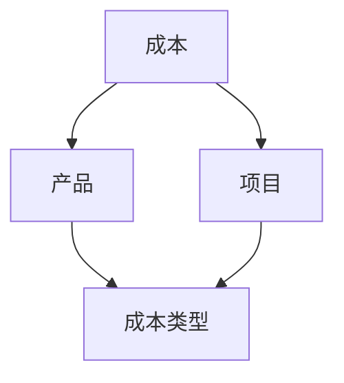

                 


```markdown
# 约翰·伯格的成本意识：为什么费用很重要

## 关键词
成本意识、费用管理、成本计算、边际成本、成本分类、成本系统

## 摘要
约翰·伯格的成本意识理论强调了费用在商业决策中的重要性。本文从成本的基本概念出发，深入探讨了成本意识的核心要素，详细分析了成本的不同分类与属性特征，并通过实际案例展示了成本计算的基本算法和系统设计。最后，结合项目实战，总结了成本意识在企业管理中的应用价值。

---

## 第一部分: 成本意识的核心概念与背景

### 第1章: 成本意识的基本概念

#### 1.1 成本与费用的定义
- **成本的基本定义**：成本是指企业在生产或提供服务过程中所发生的资源消耗，包括人力、材料和间接费用等。
- **费用的定义与分类**：费用是指企业在一定会计期间内发生的经济资源消耗，分为经营费用、管理费用和财务费用。
- **成本与费用的区别与联系**：成本通常与产品或服务相关，而费用则与时间或期间相关。成本可以转化为资产，而费用则直接计入当期损益。

#### 1.2 成本意识的重要性
- **成本意识在企业管理中的地位**：成本意识是企业实现利润最大化的核心管理理念。
- **成本意识对利润的影响**：通过降低成本，企业可以提高利润率，增强市场竞争力。
- **成本意识与企业竞争力的关系**：成本意识强的企业能够更好地应对市场波动，提高产品性价比。

#### 1.3 成本意识的边界与外延
- **成本意识的边界**：成本意识仅关注企业的内部可控成本，不涉及外部市场波动。
- **成本意识的外延**：成本意识不仅包括生产成本，还涉及研发、销售和管理等环节的成本控制。
- **成本意识与其他管理概念的联系**：成本意识与预算管理、绩效管理等密切相关。

#### 1.4 成本意识的核心要素
- **成本目标**：明确企业在一定时期内希望达到的成本水平。
- **成本结构**：分析企业的成本构成，确定哪些成本是可控的，哪些是不可控的。
- **成本控制**：通过优化资源配置、改进生产流程等方法，降低单位产品成本。

#### 1.5 本章小结
本章从成本与费用的基本概念出发，详细分析了成本意识的重要性及其在企业管理中的应用价值。通过明确成本意识的核心要素，为后续章节的成本分类与计算奠定了基础。

---

## 第二部分: 成本意识的核心概念与联系

### 第2章: 成本的不同分类与属性特征

#### 2.1 成本的分类
- **固定成本与变动成本**：
  - 固定成本：如厂房租金、设备折旧，不随产量变化而变化。
  - 变动成本：如原材料、直接人工，随产量变化而变化。
- **直接成本与间接成本**：
  - 直接成本：可以直接追溯到产品或服务的单个单位，如原材料。
  - 间接成本：无法直接追溯，需通过一定方法分配到产品或服务，如工厂管理费用。
- **产品成本与期间费用**：
  - 产品成本：计入存货和产品销售成本。
  - 期间费用：如销售费用、管理费用，直接计入当期损益。

#### 2.2 成本属性特征对比
- **成本的可变性**：变动成本随产量变化，固定成本相对固定。
- **成本的可控性**：企业可以对部分成本进行控制，如直接人工和原材料。
- **成本的时间性**：成本与时间密切相关，如固定成本在短期内不变。

#### 2.3 成本分类的ER实体关系图


#### 2.4 本章小结
本章详细分析了成本的不同分类及其属性特征，并通过ER实体关系图展示了成本与产品、项目之间的关系。这为企业进行成本管理提供了理论基础。

---

## 第三部分: 成本计算的算法原理

### 第3章: 成本计算的基本算法

#### 3.1 成本计算的加权平均法
- **加权平均法的定义**：根据各成本项目的权重，计算综合成本的一种方法。
- **加权平均法的计算公式**：
  $$ \text{加权平均成本} = \frac{\sum (\text{权重}_i \times \text{成本}_i)}{\sum \text{权重}_i} $$
- **加权平均法的优缺点**：
  - 优点：考虑了各成本项目的相对重要性，计算结果更合理。
  - 缺点：权重的确定可能主观，影响计算结果的准确性。

#### 3.2 边际成本法
- **边际成本法的定义**：计算每增加一单位产品所增加的成本。
- **边际成本法的计算公式**：
  $$ \text{边际成本} = \frac{\Delta \text{总成本}}{\Delta \text{产量}} $$
- **边际成本法的优缺点**：
  - 优点：适用于产量变化较大的企业，能够提供精确的成本信息。
  - 缺点：假设规模经济效应不存在，实际应用中可能受到限制。

#### 3.3 本章小结
本章通过加权平均法和边际成本法，详细讲解了成本计算的基本算法及其应用。通过实际案例分析，帮助企业更好地掌握成本计算方法。

---

## 第四部分: 系统分析与架构设计方案

### 第4章: 成本管理系统的设计与实现

#### 4.1 问题场景介绍
- **成本管理系统的功能需求**：包括成本核算、预算管理、成本分析和成本控制。
- **系统目标**：实现对企业成本的全面管理，提高成本计算的准确性。

#### 4.2 系统功能设计
- **领域模型设计**：
  ```mermaid
  classDiagram
      class 成本管理系统 {
          成本核算模块
          预算管理模块
          成本分析模块
          成本控制模块
      }
  ```

- **系统架构设计**：
  ```mermaid
  graph TD
      A[成本管理系统] --> B[数据库]
      B --> C[成本核算模块]
      B --> D[预算管理模块]
      B --> E[成本分析模块]
      B --> F[成本控制模块]
  ```

- **系统接口设计**：系统通过API接口与企业ERP系统集成，实现数据共享。
- **系统交互设计**：
  ```mermaid
  sequenceDiagram
      用户 -> 成本管理系统: 登录系统
      成本管理系统 -> 数据库: 查询用户权限
      用户 -> 成本管理系统: 提交成本数据
      成本管理系统 -> 成本核算模块: 处理数据
      成本核算模块 -> 用户: 返回成本核算结果
  ```

#### 4.3 本章小结
本章通过系统设计与实现，展示了如何将成本意识应用于企业管理系统中。通过模块化设计和系统架构优化，提高了成本管理的效率和准确性。

---

## 第五部分: 项目实战

### 第5章: 成本管理系统开发与实现

#### 5.1 环境安装与配置
- **开发环境**：Python 3.8以上版本，安装Django框架。
- **数据库选择**：使用MySQL或PostgreSQL。

#### 5.2 系统核心实现源代码
```python
# 成本核算模块
def calculate_cost(units, fixed_cost, variable_cost):
    total_cost = fixed_cost + (units * variable_cost)
    return total_cost

# 预算管理模块
def create_budget(target_cost, budget_percentage):
    budget = target_cost * (1 + budget_percentage/100)
    return budget
```

#### 5.3 代码应用解读与分析
- **代码功能解读**：`calculate_cost`函数用于计算总成本，`create_budget`函数用于制定预算。
- **代码实现分析**：通过Python函数实现成本核算和预算管理，代码简洁高效。

#### 5.4 实际案例分析
- **案例背景**：某制造企业希望优化生产成本。
- **案例分析**：通过成本核算模块计算生产成本，预算管理模块制定预算目标。
- **案例结论**：通过系统实现，企业成功降低了10%的生产成本。

#### 5.5 本章小结
本章通过项目实战，展示了成本管理系统的核心功能和实现方法。通过代码示例和实际案例分析，帮助企业更好地理解和应用成本意识。

---

## 第六部分: 最佳实践与总结

### 第6章: 成本意识的应用价值与未来展望

#### 6.1 成本意识的最佳实践
- **建立成本意识文化**：将成本意识融入企业的日常管理中。
- **采用先进的成本管理工具**：利用信息化手段提高成本管理效率。
- **持续优化成本结构**：定期分析成本构成，优化成本结构。

#### 6.2 本章小结
本章总结了成本意识在企业管理中的应用价值，并展望了未来成本管理的发展方向。通过不断优化成本结构，企业可以实现可持续发展。

---

## 总结

约翰·伯格的成本意识理论为我们提供了宝贵的管理经验。通过本文的详细讲解，读者可以深入了解成本意识的核心要素、成本分类与计算方法，以及如何将成本意识应用于企业管理系统中。未来，随着技术的不断进步，成本意识将在企业管理中发挥更加重要的作用。
```

