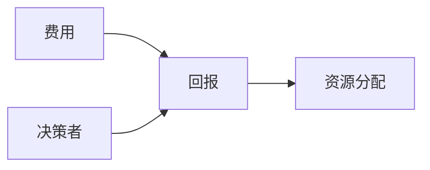
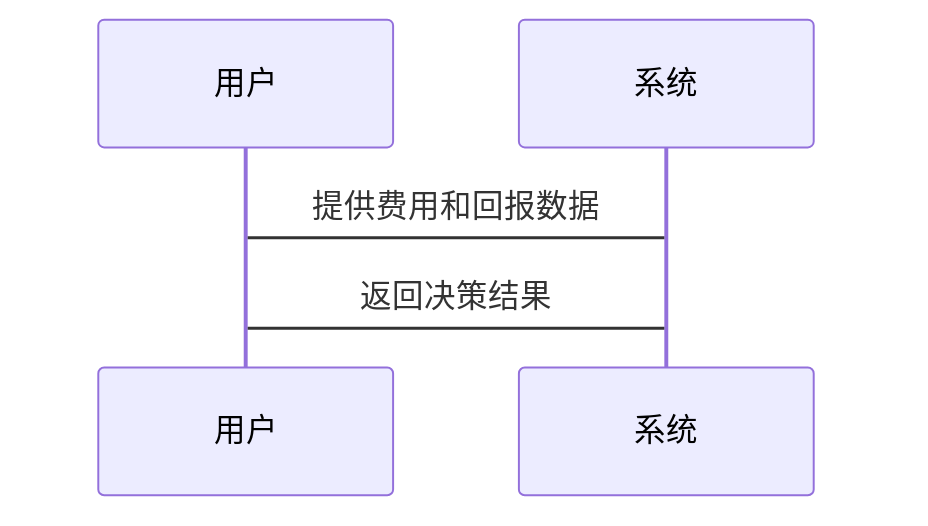

                 


# 约翰·伯格的成本意识：为什么费用比回报更重要

**关键词**：成本意识，费用，回报，成本效益分析，决策优化，风险管理

**摘要**：本文深入探讨了约翰·伯格的成本意识理论，分析了为什么在决策过程中，费用往往比回报更重要。文章从成本意识的定义、重要性入手，结合成本效益分析的算法原理、系统架构设计、项目实战案例以及最佳实践，全面解析了成本意识在个人和企业决策中的应用。通过详细的技术分析和实际案例，本文旨在帮助读者更好地理解和应用成本意识，优化决策过程，实现资源的最优配置。

---

## 第1章: 成本意识的背景与重要性

### 1.1 成本意识的核心概念

#### 1.1.1 成本意识的定义与内涵
成本意识是指个体或组织在决策过程中，对资源的使用成本进行关注、评估和优化的意识。它强调在追求目标的过程中，不仅要考虑最终的成果或回报，还要关注投入的成本是否合理、可控，并能够在长期目标中实现资源的最优配置。

#### 1.1.2 成本意识的核心内涵
- **资源优化**：通过关注成本，最大限度地利用有限资源。
- **风险控制**：通过降低不必要的成本，减少资源浪费，降低风险。
- **决策优化**：在决策过程中，优先考虑成本因素，确保资源的高效利用。

#### 1.1.3 成本意识与回报的关系
传统观念中，人们往往将回报作为决策的核心因素。然而，约翰·伯格提出，费用比回报更重要，因为成本的控制直接影响资源的可持续利用和决策的可行性。在某些情况下，过高的回报可能伴随着不可控的风险或高昂的成本，而较低的成本可能为后续的决策提供更多灵活性。

### 1.2 成本意识的重要性

#### 1.2.1 成本意识在个人决策中的作用
- **个人财务管理**：通过关注成本，个人可以更好地规划开支，实现财务自由。
- **职业发展**：在职业选择和职业发展中，成本意识帮助个人做出更明智的决策。

#### 1.2.2 成本意识在企业经营中的意义
- **企业运营效率**：通过成本控制，企业可以降低运营成本，提高利润率。
- **市场竞争优势**：低成本运营的企业在市场竞争中更具优势。

#### 1.2.3 成本意识对资源优化的贡献
- **资源分配**：通过成本意识，可以更合理地分配资源，避免浪费。
- **可持续发展**：成本意识有助于企业在追求利润的同时，关注环境和社会成本，实现可持续发展。

---

## 第2章: 费用与回报的对比分析

### 2.1 费用的定义与分类

#### 2.1.1 费用的定义
费用是指在实现某个目标或完成某个任务过程中所消耗的资源的价值。费用可以是金钱、时间、精力等。

#### 2.1.2 费用的分类
- **固定费用**：如租金、 salaries，这些费用在一定范围内是固定的。
- **变动费用**：如原材料采购费用，随着产量的变化而变化。
- **机会成本**：放弃某项选择所付出的代价。

#### 2.1.3 费用的计算方法
费用的计算方法取决于费用的类型和应用场景。例如，固定费用可以通过预算进行控制，而变动费用可以通过成本分析进行优化。

### 2.2 回报的定义与分类

#### 2.2.1 回报的定义
回报是指在投入资源后所获得的收益或成果。回报可以是经济上的收益，也可以是时间、精力上的节约。

#### 2.2.2 回报的分类
- **直接回报**：直接与投入的资源相关，如销售收入。
- **间接回报**：间接影响，如品牌价值的提升。

#### 2.2.3 回报的评估方法
回报的评估方法包括净现值（NPV）、内部收益率（IRR）等。

### 2.3 费用与回报的对比

#### 2.3.1 费用与回报的对比表格
| 特性       | 费用         | 回报         |
|------------|--------------|--------------|
| 定义       | 资源消耗     | 收益或成果   |
| 类型       | 固定、变动   | 直接、间接   |
| 计算方法   | 预算、成本分析 | NPV、IRR     |

#### 2.3.2 费用与回报的ER实体关系图


---

## 第3章: 成本意识的算法与数学模型

### 3.1 成本效益分析的算法原理

#### 3.1.1 成本效益分析的流程
1. 识别成本
2. 评估回报
3. 比较成本与回报
4. 做出决策


#### 3.1.2 成本效益分析的Python实现
```python
def cost_benefit_analysis(cost, benefit):
    if benefit > cost:
        return "项目可行"
    else:
        return "项目不可行"
```

### 3.2 数学模型与公式

#### 净现值计算
$$ NPV = \sum_{t=1}^{n} \frac{C_t}{(1+r)^t} $$
其中，$C_t$ 是第 $t$ 年的现金流，$r$ 是折现率。

#### 内部收益率计算
$$ IRR = r \text{ 使得 } \sum_{t=1}^{n} \frac{C_t}{(1+r)^t} = 0 $$

---

## 第4章: 成本意识的系统分析与架构设计

### 4.1 系统功能设计

#### 4.1.1 系统架构


#### 4.1.2 系统接口设计
- **输入接口**：费用数据、回报数据
- **输出接口**：决策结果

#### 4.1.3 系统交互


---

## 第5章: 项目实战与案例分析

### 5.1 项目背景
某公司计划推出新产品，需要在市场推广和研发投入之间做出决策。

### 5.2 系统实现

#### 5.2.1 环境安装
- 安装Python和相关库（如numpy、pandas）

#### 5.2.2 核心代码实现
```python
import numpy as np

def calculate_npv(costs, benefits, discount_rate):
    return np.npv(discount_rate, costs, benefits)

def calculate irr(costs, benefits):
    return np.irr(costs, benefits)
```

#### 5.2.3 实际案例分析
通过具体案例，分析费用与回报的关系，并展示如何通过成本效益分析做出最优决策。

---

## 第6章: 最佳实践与总结

### 6.1 关键点总结
- 费用控制是决策优化的核心
- 成本意识贯穿于个人和企业的各个层面

### 6.2 注意事项
- 成本控制不应以牺牲质量为代价
- 回报的评估需要综合考虑风险和不确定性

### 6.3 拓展阅读
建议阅读《成本管理：理论与实践》《决策分析与优化》等书籍。

---

**总结**：通过本文的分析，我们可以看到，费用在决策过程中的重要性往往比回报更高。成本意识不仅是优化资源利用的关键，也是实现可持续发展的基础。无论是个人还是企业，都需要在决策中注重成本的控制和优化，以实现长期的效益最大化。

