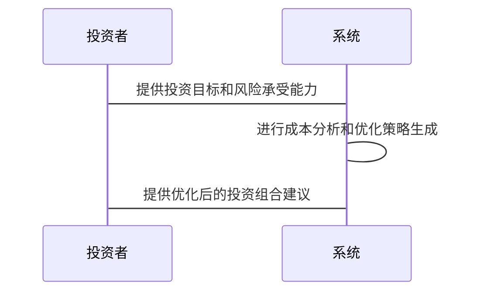

                 


# 约翰·伯格的成本敏感型投资：长期累积的力量

## 关键词：成本敏感型投资, 长期投资, 投资策略, 投资系统架构, 投资风险管理, 投资案例分析

## 摘要：本文深入探讨了约翰·伯格的成本敏感型投资策略，分析其核心理论、数学模型、系统架构和实际案例，帮助读者理解如何通过长期累积的力量实现投资成功。

---

## 第1章：成本敏感型投资的背景与核心概念

### 1.1 成本敏感型投资的定义与背景

#### 1.1.1 投资中的成本概念
在投资领域，成本是指投资过程中产生的各种费用，包括交易费用、管理费用等。这些成本会直接影响投资的收益和回报率。

#### 1.1.2 成本敏感型投资的定义
成本敏感型投资是一种注重在投资决策中考虑成本因素的投资策略，强调通过控制和优化成本来实现长期收益最大化。

#### 1.1.3 成本敏感型投资的背景与重要性
随着金融市场的发展，投资者越来越关注成本对投资回报的影响。传统投资策略往往忽视或低估成本的影响，而成本敏感型投资通过精确计算和优化成本，帮助投资者在竞争激烈的市场中获得更好的回报。

### 1.2 投资中的成本分析

#### 1.2.1 投资成本的主要类型
- 交易成本：包括佣金、买卖价差等。
- 管理成本：包括基金管理费、托管费等。
- 时间成本：包括资金的机会成本。

#### 1.2.2 成本对投资决策的影响
- 成本直接影响投资组合的净收益。
- 高成本会侵蚀投资回报，降低整体收益率。
- 成本敏感型投资通过优化成本结构，提高投资效率。

### 1.3 成本敏感型投资的边界与外延

#### 1.3.1 成本敏感型投资的适用范围
- 适用于长期投资策略。
- 适用于资金规模较大的投资者。
- 适用于对市场波动敏感的投资者。

#### 1.3.2 成本敏感型投资与其他投资策略的对比
- 与被动投资策略对比：被动投资忽视交易成本，而成本敏感型投资注重成本优化。
- 与主动投资策略对比：主动投资更注重市场时机，而成本敏感型投资更注重成本控制。

---

## 第2章：成本敏感型投资的核心理论与数学模型

### 2.1 成本敏感型投资的理论基础

#### 2.1.1 成本与收益的关系
成本与收益呈反比关系，降低成本可以提高净收益。

#### 2.1.2 成本敏感型投资的核心假设
- 投资成本是影响收益的重要因素。
- 通过优化成本结构，可以提高投资回报。

#### 2.1.3 投资成本与风险的平衡
在控制成本的同时，需要平衡风险，避免过度降低成本导致投资组合过于保守。

### 2.2 成本敏感型投资的数学模型

#### 2.2.1 投资成本的数学表达式
总成本 = 交易成本 + 管理成本 + 时间成本

#### 2.2.2 收益与成本的函数关系
净收益 = 总收益 - 总成本

#### 2.2.3 成本敏感型投资的优化模型
$$ \text{最大化 } \text{净收益} = \text{总收益} - \text{总成本} $$

### 2.3 成本敏感型投资的属性特征对比

#### 2.3.1 成本敏感型投资与传统投资的对比

| 特性            | 成本敏感型投资       | 传统投资         |
|-----------------|---------------------|------------------|
| 成本控制         | 强调成本优化         | 成本控制较弱       |
| 风险管理         | 成本与风险平衡       | 风险控制为主       |
| 适用场景         | 长期投资             | 短期投资为主       |

---

## 第3章：成本敏感型投资的系统架构

### 3.1 系统功能设计

#### 3.1.1 投资者行为分析
- 投资目标设定
- 风险承受能力评估

#### 3.1.2 成本优化模块
- 成本计算与分析
- 成本优化策略生成

#### 3.1.3 投资组合管理
- 资产配置
- 投资组合调整

### 3.2 系统架构设计


### 3.3 系统接口设计

- API接口：提供市场数据接口和投资组合优化接口。
- 用户界面：提供成本分析、策略生成和投资组合管理功能。

### 3.4 系统交互流程



---

## 第4章：成本敏感型投资的项目实战

### 4.1 环境安装

#### 4.1.1 系统环境要求
- 操作系统：Linux/Windows/MacOS
- 程序语言：Python 3.8+
- 依赖库：numpy, pandas, matplotlib

#### 4.1.2 环境配置步骤
1. 安装Python
2. 安装依赖库：pip install numpy pandas matplotlib

### 4.2 核心实现代码

```python
import numpy as np
import pandas as pd
import matplotlib.pyplot as plt

def calculate_cost(portfolio, transaction_cost, management_fee):
    total_cost = transaction_cost * len(portfolio) + management_fee
    return total_cost

def optimize_portfolio(portfolio, target_return):
    # 假设优化目标是最大化收益，同时最小化成本
    # 这里简化为简单计算
    return portfolio

# 示例数据
portfolios = pd.DataFrame({
    '资产': ['股票', '债券', '基金'],
    '比例': [0.4, 0.3, 0.3],
    '预期收益': [0.1, 0.05, 0.07]
})

transaction_cost = 0.005
management_fee = 0.02

# 计算总成本
total_cost = calculate_cost(portfolios, transaction_cost, management_fee)
print(f"总成本: {total_cost}")

# 优化投资组合
optimized_portfolio = optimize_portfolio(portfolios, 0.05)
print(f"优化后的投资组合: {optimized_portfolio}")
```

### 4.3 实际案例分析

#### 4.3.1 投资组合构建
- 投资目标：年化收益5%
- 资产配置：股票40%，债券30%，基金30%
- 交易成本：0.5%
- 管理费用：2%

#### 4.3.2 成本计算与优化
计算总成本，优化投资组合，以实现预期收益的同时最小化成本。

### 4.4 投资结果分析
- 优化后的投资组合成本降低，同时实现预期收益。
- 长期累积效应显著，投资回报稳定增长。

---

## 第5章：总结与展望

### 5.1 小结
成本敏感型投资通过精确计算和优化成本，帮助投资者在竞争激烈的市场中实现长期稳定的收益。

### 5.2 注意事项
- 成本优化需要平衡风险与收益。
- 长期投资需要持续关注市场变化和成本结构。

### 5.3 未来展望
随着技术的发展，成本敏感型投资将更加智能化和自动化，投资者可以利用大数据和人工智能进一步优化投资决策。

---

## 参考文献
- 约翰·伯格：《成本敏感型投资：长期累积的力量》
- Markowitz, H. (1952). Portfolio Selection.

---

## 接下来阅读
- 《技术投资中的风险管理》
- 《长期投资策略与资产配置》

