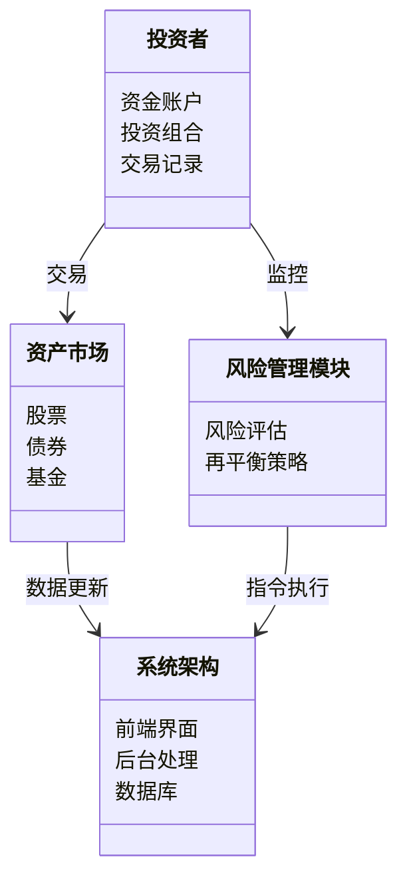

                 

# 《约翰·伯格的投资常识：简单胜于复杂》

## 关键词：  
投资策略，简单策略，风险管理，长期投资，约翰·伯格，价值投资，被动投资

## 摘要：  
本文深入探讨了约翰·伯格的简单投资策略，强调通过避免复杂性来实现长期稳健的投资回报。文章从投资基础、策略选择、风险管理、心理因素、长期投资、案例分析、系统设计等多个维度展开，结合理论与实践，详细阐述了如何在复杂多变的市场环境中，通过简单有效的策略实现财富增值。

---

## 第一部分：投资基础

### 第1章：投资的基本概念

#### 1.1 资产、风险与回报

- **1.1.1 资产的定义与分类**  
  资产是投资者拥有的任何有价值的资源，包括金融资产（如股票、债券、基金）和实物资产（如房地产、黄金）。资产的分类主要基于其流动性、收益性和风险性。

- **1.1.2 风险的来源与类型**  
  风险可以分为系统性风险（如市场波动、经济周期）和非系统性风险（如公司特定风险）。系统性风险影响整个市场，而非系统性风险仅影响个别资产。

- **1.1.3 投资回报的计算与衡量**  
  投资回报可以通过复利公式计算：  
  $$\text{最终收益} = P \times (1 + r)^t$$  
  其中，\( P \) 是初始本金，\( r \) 是年化收益率，\( t \) 是投资时间（年）。

#### 1.2 投资的基本原理

- **1.2.1 投资的三要素：时间、风险与收益**  
  时间是投资中最重要的因素，复利效应使得长期投资能够产生指数级增长。

- **1.2.2 资本资产定价模型（CAPM）的简单介绍**  
  CAPM公式：  
  $$E(r_i) = r_f + \beta_i (E(r_m) - r_f)$$  
  其中，\( E(r_i) \) 是资产 \( i \) 的期望回报率，\( r_f \) 是无风险利率，\( \beta_i \) 是资产 \( i \) 的贝塔系数，\( E(r_m) \) 是市场期望回报率。

- **1.2.3 现金流的时间价值与复利**  
  复利计算公式：  
  $$A = P \times (1 + \frac{r}{n})^{nt}$$  
  其中，\( A \) 是终值，\( P \) 是本金，\( r \) 是年利率，\( n \) 是每年的计息次数，\( t \) 是投资时间（年）。

#### 1.3 投资市场的基本结构

- **1.3.1 一级市场与二级市场的区别**  
  一级市场是发行新证券的市场，二级市场是交易现有证券的市场。

- **1.3.2 股票、债券与基金的区别**  
  股票代表所有权，债券代表债权，基金是集合投资工具。

- **1.3.3 投资者与市场的互动关系**  
  投资者的需求影响市场价格，而市场价格又反过来影响投资者的决策。

---

## 第二部分：投资策略与方法

### 第2章：简单投资策略的核心理念

#### 2.1 价值投资与成长投资

- **2.1.1 价值投资的定义与特点**  
  价值投资强调以低于内在价值的价格买入优质资产，长期持有，等待市场回归理性。

- **2.1.2 成长投资的定义与特点**  
  成长投资关注那些具有高增长潜力的公司，适合长期投资者。

- **2.1.3 两者的优缺点对比**  
  | 策略 | 优点 | 缺点 |  
  |------|------|------|  
  | 价值投资 | 稳定性高，风险低 | 需要深度研究，周期长 |  
  | 成长投资 | 收益潜力大 | 风险高，波动大 |

#### 2.2 被动投资与主动投资

- **2.2.1 被动投资的定义与代表形式（如指数基金）**  
  被动投资通过跟踪指数（如标普500）来实现收益，成本低，风险分散。

- **2.2.2 主动投资的定义与代表形式（如主动管理型基金）**  
  主动投资依赖基金经理的选股能力，但成本高，收益不稳定。

- **2.2.3 两者的成本与风险对比**  
  被动投资成本低，风险分散；主动投资成本高，风险集中。

#### 2.3 简单投资策略的优势

- **2.3.1 简单策略的可操作性**  
  简单策略易于理解和执行，适合大多数投资者。

- **2.3.2 简单策略的长期稳定性**  
  长期来看，简单策略能够实现稳定的收益。

- **2.3.3 简单策略的心理优势**  
  简单策略减少情绪干扰，避免过度交易。

---

## 第三部分：风险管理与心理因素

### 第3章：投资中的风险管理

#### 3.1 风险的识别与评估

- **3.1.1 风险的分类与识别方法**  
  系统性风险和非系统性风险的识别方法。

- **3.1.2 风险评估的常用指标（如VaR、夏普比率）**  
  - VaR（在险价值）：衡量在特定置信水平下的最大损失。  
  - 夏普比率：衡量投资收益与风险的比值，公式：  
    $$\text{夏普比率} = \frac{\text{超额收益}}{\text{收益的标准差}}$$

#### 3.2 风险管理的简单策略

- **3.2.1 分散投资的基本原理**  
  通过投资不同资产类别和行业分散风险。

- **3.2.2 定期再平衡的策略**  
  定期调整投资组合，保持目标比例。

- **3.2.3 保险策略的应用**  
  使用期权或保险产品对冲特定风险。

#### 3.3 心理因素对投资决策的影响

- **3.3.1 情绪波动与决策偏差**  
  投资者常见的心理偏差包括贪婪、恐惧、过度自信等。

- **3.3.2 心理账户的构建与管理**  
  通过心理账户管理不同投资的资金，减少情绪干扰。

- **3.3.3 投资纪律的重要性**  
  遵循既定策略，避免随意变动。

---

## 第四部分：长期投资与复利的力量

### 第4章：长期投资的核心优势

#### 4.1 复利效应的数学模型

- **复利计算公式**  
  $$A = P \times (1 + r)^t$$  
  复利效应在长期投资中表现尤为显著。

#### 4.2 简单策略在长期投资中的优势

- **分散投资与时间的结合**  
  长期分散投资能够有效降低风险，同时利用复利效应。

- **简单策略的稳定性与可持续性**  
  简单策略在长期中能够保持稳定的收益。

#### 4.3 长期投资中的风险管理

- **定期再平衡的重要性**  
  定期调整投资组合，适应市场变化。

- **避免过度交易的技巧**  
  长期投资需要耐心，避免频繁交易。

---

## 第五部分：案例分析与实战应用

### 第5章：简单策略的实践案例

#### 5.1 简单策略的实际应用

- **指数基金投资案例**  
  通过投资标普500指数基金，实现长期稳健的回报。

- **定期定额投资的案例**  
  每月定额投资，分散风险，降低择时风险。

#### 5.2 风险管理的实战技巧

- **分散投资的具体实施**  
  将资金分配到不同资产类别和行业。

- **定期再平衡的操作步骤**  
  每季度调整投资组合，保持目标比例。

#### 5.3 心理因素的应对策略

- **避免情绪化决策的方法**  
  通过制定投资计划和纪律约束来减少情绪干扰。

- **保持长期视角的技巧**  
  长期投资需要耐心和信心，避免短期波动的干扰。

---

## 第六部分：系统分析与架构设计

### 第6章：投资系统的构建与优化

#### 6.1 投资系统的基本架构

- **系统功能设计（领域模型）**  
  使用Mermaid绘制投资系统类图，展示各模块之间的关系。

---

## 第七部分：总结与展望

### 第7章：总结与未来方向

#### 7.1 核心观点回顾

- 简单策略的核心优势：可操作性、长期稳定性和心理优势。

#### 7.2 未来投资的趋势

- 数字化投资工具的普及。

- 可持续投资与ESG因素的重要性。

#### 7.3 最佳实践 tips

- 长期投资，分散投资，避免过度交易。

- 定期再平衡，保持纪律性。

- 保持学习，不断优化投资策略。

---

## 结语

约翰·伯格的简单投资策略不仅是一种方法，更是一种智慧。通过避免复杂性，投资者能够在纷繁复杂的市场中保持冷静，实现稳健的长期回报。未来的投资世界将更加数字化和智能化，但简单策略的核心思想依然适用：简单胜于复杂，稳健胜于激进。

