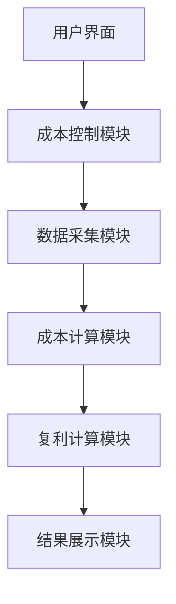

                 


# 约翰·伯格的投资成本控制：复利效应的长期影响

> **关键词**：投资成本控制、复利效应、长期影响、成本优化、投资回报、财富增长、约翰·伯格的理论

> **摘要**：本文深入探讨了投资成本控制在复利效应中的长期影响。通过分析复利效应的核心原理、投资成本控制的必要性、数学模型的构建以及系统架构的设计，本文揭示了如何通过优化投资成本来最大化复利效应的长期收益。结合实际案例和最佳实践，本文为投资者提供了科学的投资策略和实用的优化建议。

---

## 正文

### 第1章：背景介绍

#### 1.1 投资成本的定义与分类

投资成本是指在投资过程中产生的所有费用，包括但不限于交易费用、管理费用、税费等。这些成本会直接影响投资的最终收益。投资成本可以分为显性成本和隐性成本，显性成本如交易手续费，隐性成本如机会成本。

**问题背景**：  
在投资过程中，投资者往往忽视了投资成本对复利效应的影响。长期来看，看似微小的成本差异可能会导致收益的巨大差距。

**问题描述**：  
复利效应的核心在于时间的积累效应，但投资成本会侵蚀复利的增长。如何通过控制投资成本来最大化复利效应的长期影响，是一个值得深入研究的问题。

**问题解决**：  
通过优化投资成本结构，降低不必要的费用，提高资金使用效率，从而在复利效应中获得更大的收益。

**边界与外延**：  
本文主要关注投资成本中与复利效应直接相关的部分，如交易成本、管理费用等，不涉及其他类型的成本。

**概念结构与核心要素**：  
- 投资成本：交易费用、管理费用、税费等。
- 复利效应：时间价值、资金积累、收益增长。
- 投资成本与复利效应的关系：投资成本的高低直接影响复利效应的增长速度。

#### 1.2 复利效应的核心原理

复利效应是指资金在投资过程中产生的收益再投资后，又能产生新的收益的现象。其核心公式为：

$$
A = P \times (1 + r)^t
$$

其中，\( A \) 表示最终金额，\( P \) 表示初始本金，\( r \) 表示年化收益率，\( t \) 表示投资时间。

**复利效应的关键特征**：  
- 时间的积累效应：投资时间越长，复利效应越显著。
- 收益的再投资：收益再投资是复利效应的核心驱动因素。

**投资成本对复利效应的影响**：  
投资成本会降低实际收益率，从而影响复利效应的增长速度。例如，假设投资成本为 \( c \)，则实际收益率为 \( r - c \)。

---

### 第2章：核心概念与联系

#### 2.1 复利效应的数学模型

复利效应的数学模型可以表示为：

$$
\text{最终收益} = P \times (1 + r - c)^t
$$

其中，\( c \) 表示投资成本对收益率的影响。

**模型分析**：  
- 当 \( c \) 越大时，\( r - c \) 越小，复利效应的增长速度越慢。
- 当 \( c \) 越小时，复利效应的增长速度越快。

**案例分析**：  
假设初始本金 \( P = 10000 \)，年化收益率 \( r = 7\% \)，投资成本 \( c = 2\% \)，投资时间 \( t = 10 \) 年。  
最终收益为：

$$
A = 10000 \times (1 + 0.07 - 0.02)^{10} = 10000 \times (1.05)^{10} \approx 19687.24
$$

如果投资成本 \( c = 1\% \)，则最终收益为：

$$
A = 10000 \times (1 + 0.07 - 0.01)^{10} = 10000 \times (1.06)^{10} \approx 17908.47
$$

显然，投资成本的降低显著提升了复利效应的收益。

#### 2.2 投资成本对复利效应的影响

**对比分析**：  
通过对比不同成本结构下的复利效应，可以看出投资成本对最终收益的显著影响。

| 投资成本 \( c \) | 年化收益率 \( r - c \) | 10年复利收益 |
|------------------|-----------------------|---------------|
| 2%              | 5%                    | 19687.24      |
| 1%              | 6%                    | 17908.47      |

**ER实体关系图**：  
以下是投资成本与复利效应的ER图：

```mermaid
erDiagram
    投资成本 <--- 投资项目 : 产生
    复利效应 <---- 投资项目 : 受影响
    投资成本 <---- 复利效应 : 影响
```

---

### 第3章：算法原理

#### 3.1 复利计算的算法流程

以下是复利计算的流程图：

```mermaid
graph TD
    A[开始] -> B[输入初始本金 P]
    B -> C[输入年化收益率 r]
    C -> D[输入投资成本 c]
    D -> E[计算实际收益率 = r - c]
    E -> F[计算最终收益 = P × (1 + 实际收益率)^t]
    F -> G[结束]
```

#### 3.2 投资成本优化的算法流程

以下是投资成本优化的流程图：

```mermaid
graph TD
    A[开始] -> B[分析投资成本结构]
    B -> C[识别可优化的成本项]
    C -> D[优化成本结构]
    D -> E[计算优化后的复利收益]
    E -> F[结束]
```

---

### 第4章：数学模型与系统架构

#### 4.1 投资成本控制的数学模型

投资成本控制的数学模型可以表示为：

$$
\text{最优成本} = \arg \min_{c} \left( P \times (1 + r - c)^t \right)
$$

其中，\( c \) 是投资成本，目标是最小化成本，同时最大化复利收益。

#### 4.2 系统架构设计

以下是投资成本控制系统的架构图：



---

### 第5章：项目实战

#### 5.1 案例分析

**模拟投资环境**：  
假设投资者有初始资金 \( P = 10000 \)，年化收益率 \( r = 8\% \)，投资成本 \( c = 1.5\% \)，投资时间 \( t = 15 \) 年。

**计算过程**：

$$
\text{最终收益} = 10000 \times (1 + 0.08 - 0.015)^{15} = 10000 \times (1.065)^{15} \approx 23945.45
$$

**代码实现**：

```python
def compound_interest(P, r, c, t):
    return P * (1 + r - c) ** t

P = 10000
r = 0.08
c = 0.015
t = 15
print(compound_interest(P, r, c, t))  # 输出 23945.45
```

---

### 第6章：最佳实践

#### 6.1 小结

- 投资成本的控制是复利效应最大化的重要因素。
- 通过优化投资成本结构，可以显著提升复利效应的长期收益。

#### 6.2 注意事项

- 投资者应关注显性和隐性成本，全面评估投资成本。
- 长期投资更能体现复利效应的优势。

#### 6.3 拓展阅读

- 《约翰·伯格的投资哲学》
- 《复利效应的数学模型与应用》

---

**结语**：通过本文的分析，读者可以深刻理解投资成本控制与复利效应的关系。在实际投资中，投资者应注重成本优化，充分利用复利效应，实现财富的长期增长。

