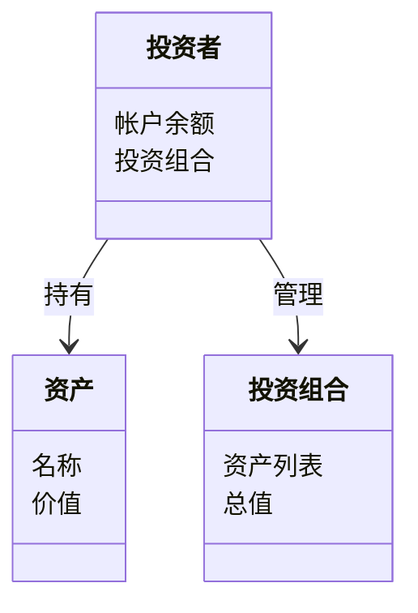
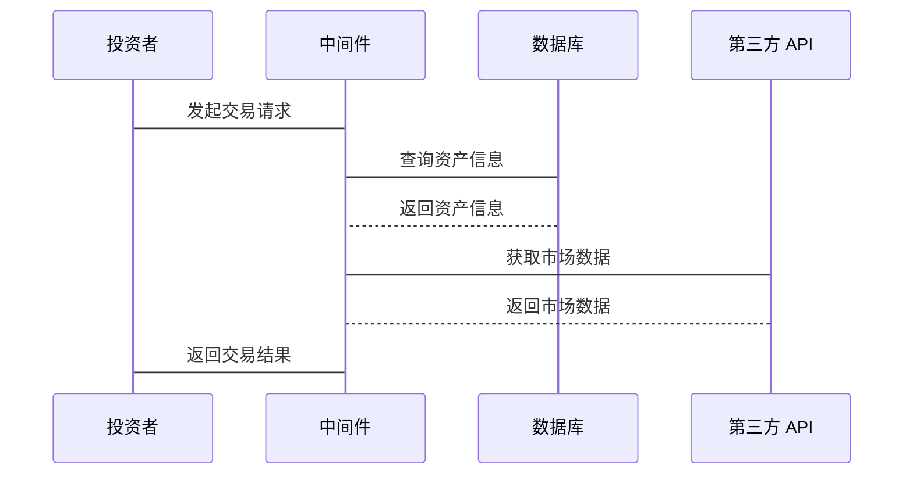

                 


# 约翰·伯格的投资成本控制：复利的力量

> **关键词**: 投资成本控制，复利，约翰·伯格，指数基金，投资策略，成本优化

> **摘要**: 本文深入探讨了约翰·伯格的投资成本控制策略，分析了复利在投资中的重要性，并结合实际案例和数学模型，详细讲解了如何通过成本优化和复利效应实现长期稳健的投资收益。文章从投资成本的构成、复利的数学原理、约翰·伯格的成本控制策略、投资组合优化、系统架构设计等多方面展开，为读者提供了全面的投资视角。

---

## 第1章: 投资成本控制的概述

### 1.1 投资的基本概念

#### 1.1.1 投资的定义与分类
投资是指将资金投入到某个项目或资产中，以期在未来获得更高的收益。根据投资对象的不同，可以将投资分为以下几类：
- **股票投资**: 购买公司股份，分享企业成长收益。
- **债券投资**: 购买政府或企业发行的债券，获取固定利息。
- **基金投资**: 通过购买基金份额，间接投资于多种资产。
- **房地产投资**: 投资于房地产市场，获取租金收入或资本增值。

#### 1.1.2 投资成本的定义
投资成本是指在投资过程中产生的所有费用，包括显性成本和隐性成本。显性成本是直接可见的费用，如交易手续费、管理费等；隐性成本则是间接的费用，如时间和精力的投入。

#### 1.1.3 投资成本控制的重要性
投资成本控制是实现投资收益最大化的核心要素。通过降低投资成本，可以显著提高投资回报率，尤其是在复利效应的作用下，成本的优化将产生长期的积极影响。

### 1.2 约翰·伯格的投资理念

#### 1.2.1 约翰·伯格的背景介绍
约翰·伯格（John Bogle）是投资界的重要人物，被誉为“指数基金之父”。他创立了 Vanguard 集团，并倡导低成本投资策略。

#### 1.2.2 约翰·伯格的投资哲学
约翰·伯格认为，长期投资和低成本是实现投资收益的关键。他主张通过分散投资降低风险，并避免频繁交易以减少成本。

#### 1.2.3 约翰·伯格的成本控制方法
伯格提出的核心成本控制方法包括：
1. 避免频繁交易，减少交易成本。
2. 选择低成本基金，降低管理费用。
3. 长期持有，最大化复利效应。

---

## 第2章: 投资成本的构成与影响

### 2.1 显性成本

#### 2.1.1 交易费用
交易费用是指在买卖资产时产生的手续费。频繁交易会显著增加交易费用，降低投资收益。

#### 2.1.2 管理费用
管理费用是基金或其他投资产品的管理人收取的费用。低成本基金的管理费用通常较低，有助于提高投资回报率。

#### 2.1.3 手续费
手续费包括开户费、赎回费等。这些费用在投资过程中虽然不高，但长期积累会影响收益。

### 2.2 隐性成本

#### 2.2.1 机会成本
机会成本是指将资金用于某一投资而放弃其他投资机会的成本。选择低成本投资策略可以降低机会成本，优化投资组合。

#### 2.2.2 心理成本
心理成本是指投资者在决策过程中因担忧风险而产生的心理压力。低成本投资策略通常更加稳健，有助于降低心理成本。

#### 2.2.3 时间成本
时间成本是指投资者在研究和管理投资组合上花费的时间。通过选择低成本投资策略，可以减少时间投入，提高效率。

---

## 第3章: 复利的力量

### 3.1 复利的定义与公式

#### 3.1.1 复利的数学模型
复利的数学公式为：
$$ A = P \times (1 + r)^n $$
其中：
- \( A \) 是投资的终值
- \( P \) 是初始投资本金
- \( r \) 是年化收益率
- \( n \) 是投资年数

#### 3.1.2 复利的计算公式
复利计算公式可以分解为以下步骤：
1. 计算每期的利息收入。
2. 将利息收入加到本金中，形成新的本金。
3. 重复上述步骤，直到达到投资期限。

#### 3.1.3 复利的计算实例
假设初始投资本金为 $10,000，年化收益率为 7%，投资期限为 10 年。
$$ A = 10000 \times (1 + 0.07)^{10} $$
计算结果为：
$$ A \approx 19674.43 $$

### 3.2 复利与投资的关系

#### 3.2.1 复利对投资收益的影响
复利效应能够使投资收益呈指数增长，尤其是在长期投资中，复利的威力更加明显。

#### 3.2.2 复利与投资成本的平衡
虽然复利能够放大投资收益，但过高的投资成本会削弱复利的效果。因此，成本控制是实现复利效应的重要前提。

#### 3.2.3 复利的长期效应
长期来看，复利的效应会显著放大投资收益。低成本投资策略能够进一步增强复利的长期效应。

---

## 第4章: 约翰·伯格的成本控制策略

### 4.1 长期投资策略

#### 4.1.1 长期投资的定义
长期投资是指将资金投入到某一资产或组合中，并持有较长时间的策略。

#### 4.1.2 长期投资的优势
- 避免频繁交易，减少交易成本。
- 充分利用复利效应，实现长期收益。

#### 4.1.3 长期投资的成本控制
- 选择低成本基金。
- 避免频繁赎回，降低交易费用。

### 4.2 指数基金投资

#### 4.2.1 指数基金的定义
指数基金是跟踪特定市场指数的基金，其收益与市场表现一致。

#### 4.2.2 指数基金的成本优势
指数基金的管理费用通常较低，适合低成本投资策略。

#### 4.2.3 指数基金的投资策略
- 定期定额投资，分散风险。
- 长期持有，充分利用复利效应。

---

## 第5章: 投资组合的成本优化

### 5.1 资产配置策略

#### 5.1.1 资产配置的定义
资产配置是指将资金分配到不同资产类别中，以分散风险并优化收益。

#### 5.1.2 资产配置的优势
- 分散风险，降低投资波动。
- 优化收益，充分利用不同资产的特性。

#### 5.1.3 资产配置的成本优化
- 选择低成本基金。
- 避免频繁调整资产配置。

### 5.2 分散投资

#### 5.2.1 分散投资的定义
分散投资是指将资金分配到多个资产或多个资产类别中，以降低风险。

#### 5.2.2 分散投资的优势
- 减少单一资产的风险。
- 优化投资组合的稳定性。

#### 5.2.3 分散投资的成本控制
- 避免过度分散，减少管理费用。
- 选择低成本分散投资工具。

---

## 第6章: 系统分析与架构设计方案

### 6.1 问题场景介绍
假设我们正在开发一个投资管理系统，需要实现投资成本控制和复利计算功能。

### 6.2 系统功能设计

#### 6.2.1 领域模型 mermaid 类图


#### 6.2.2 系统架构设计 mermaid 架构图


#### 6.2.3 系统接口设计
- 前端接口：投资者登录、查看投资组合、进行交易。
- 后端接口：处理交易请求、计算投资组合价值、更新数据库。

#### 6.2.4 系统交互 mermaid 序列图


---

## 第7章: 项目实战

### 7.1 环境安装
需要安装 Python、Jupyter Notebook 和相关金融分析库（如 pandas、numpy）。

### 7.2 系统核心实现源代码

#### 7.2.1 复利计算函数
```python
def compound_interest(principal, rate, years):
    return principal * (1 + rate) ** years
```

#### 7.2.2 成本优化函数
```python
def cost_optimization(principal, rate, years, fees):
    return principal * (1 + rate) ** years - fees
```

### 7.3 实际案例分析
以 $10,000 初始本金、7% 年化收益率、10 年投资期限为例，计算复利收益：
$$ A = 10000 \times (1 + 0.07)^{10} $$
结果为 $19674.43$。

---

## 第8章: 总结与展望

### 8.1 最佳实践 tips
- 长期投资，避免频繁交易。
- 选择低成本投资工具。
- 分散投资，降低风险。

### 8.2 小结
本文深入分析了约翰·伯格的投资成本控制策略，结合复利的数学模型，为投资者提供了低成本、高收益的投资方法。

### 8.3 注意事项
- 投资有风险，需谨慎决策。
- 定期审视投资组合，及时调整。

### 8.4 拓展阅读
推荐阅读约翰·伯格的《基金常识》和《投资策略的常识》。

---

通过本文的分析，读者可以全面理解投资成本控制的重要性，并掌握如何利用复利效应实现长期稳健的投资收益。

