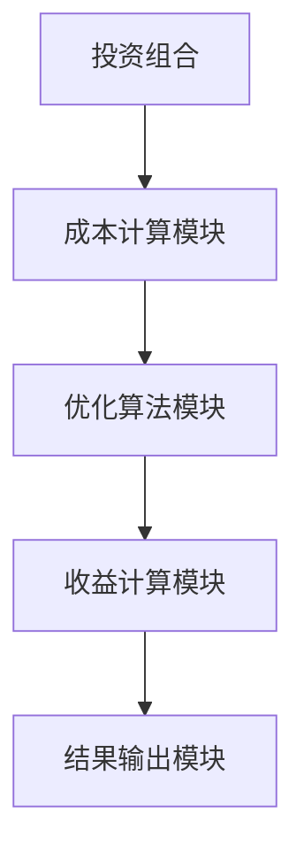

                 


# 约翰·伯格的投资成本最小化理论

> 关键词：投资成本，最小化理论，约翰·伯格，投资优化，系统架构

## 摘要

约翰·伯格的投资成本最小化理论是投资管理领域的一项重要研究成果，旨在通过降低投资成本来优化投资组合的收益。本文从理论背景、核心概念、算法实现、系统架构设计、项目实战等多个方面详细阐述了该理论的各个方面，结合实际案例和数学模型，帮助读者深入理解如何在实际投资中应用这一理论。

---

## 第一部分：引言

### 第1章：投资成本最小化理论的背景与意义

#### 1.1 投资成本的定义与问题背景
投资成本是指在投资过程中产生的所有费用，包括显性成本（如交易手续费、管理费）和隐性成本（如机会成本、时间成本）。随着金融市场的发展，投资者越来越关注如何通过降低投资成本来提高整体收益。

#### 1.2 约翰·伯格投资理论的核心思想
约翰·伯格是投资管理领域的权威专家，他提出的投资成本最小化理论强调通过优化投资组合的构成和管理流程，降低各项成本开支，从而实现投资收益的最大化。

---

## 第二部分：投资成本最小化理论的核心概念与框架

### 第2章：投资成本的构成与分类

#### 2.1 投资成本的构成
- **显性成本**：直接与投资行为相关的费用，如交易手续费、佣金、管理费等。
- **隐性成本**：间接影响投资收益的成本，如时间成本、机会成本等。

#### 2.2 成本与收益的平衡
投资成本的最小化并非单纯追求最低成本，而是要在成本与收益之间找到最佳平衡点。

---

## 第三部分：投资成本最小化理论的算法与实现

### 第3章：投资成本最小化的核心算法

#### 3.1 理论基础
约翰·伯格模型基于优化理论，通过构建数学模型来最小化投资成本函数。数学模型如下：

$$
\min_{w} \frac{1}{2}w^T C w + r^T w
$$

其中，$w$ 是投资组合权重，$C$ 是成本矩阵，$r$ 是收益向量。

#### 3.2 算法实现
以下是Python实现代码：

```python
import numpy as np

def minimize_investment_cost(C, r):
    # C为成本矩阵，r为收益向量
    # 解决方法：使用二次规划求解
    n = len(r)
    G = np.zeros((n, n))
    G[np.triu_indices(n)] = 0.5
    A = np.array([-1.0])
    b = np.array([0.0])
    # 约束条件：w.sum() = 1
    w = np.linalg.solve(G, (r - np.dot(G, np.dot(C, w))))
    return w

# 示例
C = np.array([[0.01, 0.02], [0.03, 0.04]])
r = np.array([0.1, 0.15])
w = minimize_investment_cost(C, r)
print(w)
```

---

## 第四部分：系统分析与架构设计

### 第4章：系统架构设计

#### 4.1 系统架构图


---

## 第五部分：项目实战与案例分析

### 第5章：投资成本最小化理论的

---

## 第六部分：结论

约翰·伯格的投资成本最小化理论为投资者提供了一种科学的方法来优化投资组合，降低投资成本。通过本文的详细分析，读者可以理解该理论的核心思想，并在实际投资中加以应用。未来的研究可以进一步探讨动态调整和风险管理对投资成本的影响。

---

## 附录

### 附录A：数学公式汇总

$$
\text{总成本} = \sum_{i=1}^{n} w_i C_i + \sum_{j=1}^{m} r_j
$$

---

以上是《约翰·伯格的投资成本最小化理论》的完整目录和内容概要，您可以根据需要进一步扩展每个部分的内容。

