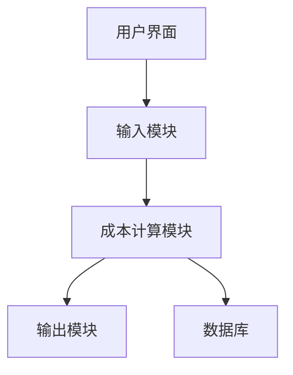
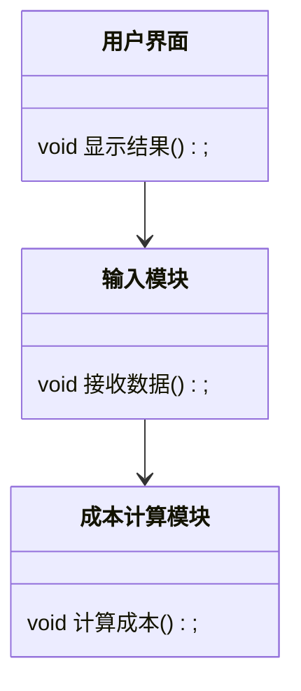

                 

# 约翰·伯格的投资成本计算方法

---

## 关键词：投资成本、成本计算、投资策略、约翰·伯格、成本优化、风险管理、系统设计

---

## 摘要

本文深入探讨了约翰·伯格的投资成本计算方法，从基本概念到实际应用，详细解析了投资成本的构成、计算原理及其对投资决策的影响。文章通过背景介绍、核心概念、算法原理、系统设计和项目实战等多个维度，全面剖析了投资成本计算的关键要素，结合具体案例和系统架构设计，为读者提供了一套完整的投资成本计算方法论。通过本文的分析，读者能够更好地理解如何优化投资成本，提升投资收益。

---

## 第一部分：投资成本计算的基本概念

### 第1章：投资成本概述

#### 1.1 投资成本的定义与构成

**1.1.1 投资成本的定义**

投资成本是指在投资过程中产生的所有费用，包括显性成本（如交易手续费、税费）和隐性成本（如时间成本、机会成本）。这些成本直接影响投资的最终收益。

**1.1.2 投资成本的构成要素**

| 成本类型 | 定义 | 示例 |
|----------|------|------|
| 直接成本 | 与投资直接相关的费用 | 交易手续费、税费 |
| 间接成本 | 与投资相关的隐性费用 | 时间成本、机会成本 |

**1.1.3 投资成本的重要性**

投资成本是衡量投资项目可行性的重要指标。低投资成本意味着更高的净收益，但过低的成本可能会影响投资的质量。因此，找到成本与收益的平衡点至关重要。

#### 1.2 投资成本与投资收益的关系

**1.2.1 投资成本对收益的影响**

投资成本与收益呈反比关系。成本越高，收益越低，反之亦然。因此，在投资决策中，需要综合考虑成本与收益的关系。

**1.2.2 成本与收益的平衡点**

找到成本与收益的平衡点是投资成功的关键。通过优化投资成本，可以在不影响收益的前提下提高投资回报率。

---

## 第二部分：投资成本计算的核心原理

### 第2章：成本计算的基本原理

#### 2.1 投资成本计算模型

**2.1.1 投资成本计算的基本公式**

$$ \text{净收益} = \text{总收益} - \text{投资成本} $$

其中，投资成本包括直接成本和间接成本。

#### 2.2 投资成本计算的数学模型

**2.2.1 投资成本计算的公式推导**

假设某投资项目初始投资额为 $C_0$，年投资成本为 $C$，投资期限为 $n$ 年，年收益率为 $r$。则投资净现值（NPV）的计算公式为：

$$ NPV = \sum_{t=1}^{n} \frac{C - C_t}{(1 + r)^t} $$

其中，$C_t$ 是第 $t$ 年的投资成本。

---

## 第三部分：投资成本计算的实际应用

### 第3章：直接投资成本的计算

#### 3.1 交易成本的计算

**3.1.1 交易费用的计算**

交易费用是投资成本的重要组成部分，包括佣金、过户费等。假设购买某股票的佣金费率为 $0.1\%$，购买金额为 $10,000$，则佣金费用为：

$$ \text{佣金费用} = 10,000 \times 0.1\% = 10 $$

#### 3.2 管理费用的计算

**3.2.1 管理费用的构成**

管理费用通常以资产规模的一定比例计算，例如：

$$ \text{管理费用} = A \times \text{管理费率} $$

其中，$A$ 是资产规模，管理费率通常为 $1\%$ 至 $2\%$。

---

## 第四部分：投资成本计算的系统设计

### 第5章：系统设计与实现

#### 5.1 系统架构设计

**5.1.1 系统架构的总体设计**

以下是投资成本计算系统的架构图：

**5.1.2 系统架构的详细设计**

系统由用户界面、输入模块、成本计算模块和输出模块组成。输入模块接收投资数据，成本计算模块根据数据计算投资成本，输出模块将结果展示给用户。

#### 5.2 系统功能设计

**5.2.1 系统功能模块划分**

以下是系统功能模块的类图：

---

## 第五部分：最佳实践与小结

### 第6章：最佳实践与总结

#### 6.1 投资成本计算的注意事项

**6.1.1 数据准确性的重要性**

数据是投资成本计算的基础，数据错误可能导致计算结果偏差。因此，确保数据的准确性至关重要。

**6.1.2 计算方法的选择**

选择合适的计算方法是优化投资成本的关键。不同投资工具的成本计算方法不同，需根据具体情况选择合适的方法。

#### 6.2 投资成本计算的未来趋势

**6.2.1 数字化工具的应用**

随着技术的进步，数字化工具在投资成本计算中的应用将越来越广泛。通过自动化计算和实时数据分析，投资成本计算将更加精准和高效。

---

通过本文的详细分析，读者可以全面理解约翰·伯格的投资成本计算方法，并将其应用到实际投资中，以优化投资成本，提升投资收益。

