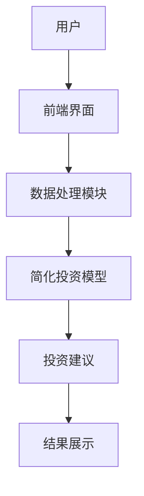

                 


# 约翰·伯格的投资简化论

## 关键词
- 投资简化论、约翰·伯格、投资策略、系统架构、数学模型、项目实战

## 摘要
本文系统地探讨了约翰·伯格提出的“投资简化论”，分析其核心概念、原理及应用场景。通过背景介绍、核心概念解析、算法原理、系统架构设计、项目实战等多维度的深入分析，揭示投资简化论如何帮助投资者降低复杂性，提高决策效率。本文结合实际案例和数学模型，为投资者提供实用的简化投资策略和系统设计参考。

---

# 正文

## 第一部分：投资简化论的背景与概述

### 第1章：投资的背景与问题

#### 1.1 投资的基本概念
投资是将资源（如资金、时间或精力）投入某种资产或项目，以期在未来获得收益的过程。投资可以分为多种形式，包括股票、债券、房地产、基金等。投资的核心目标是通过合理配置资产，在风险可控的前提下实现收益最大化。

#### 1.2 投资的主要问题
- **复杂性**：传统投资方法通常涉及复杂的分析，如技术分析、基本面分析、市场预测等，这些方法对普通投资者来说门槛较高。
- **风险不确定性**：市场波动、经济周期、政策变化等因素都会影响投资收益，增加了投资的不确定性。
- **信息过载**：投资者需要处理大量的信息，包括财务报表、市场报告、行业趋势等，信息过载可能导致决策疲劳。

#### 1.3 传统投资方法的复杂性
传统投资方法通常依赖于复杂的模型和工具，例如：
- **技术分析**：通过分析历史价格和成交量数据来预测未来走势。
- **基本面分析**：研究公司的财务状况、行业地位、管理团队等因素。
- **市场预测**：依赖宏观经济分析和市场趋势预测。

这些方法虽然在理论上可行，但在实际操作中，普通投资者往往难以掌握这些复杂的技术和工具，导致投资门槛较高。

---

### 第2章：简化论的核心概念

#### 2.1 投资简化论的定义
投资简化论是一种以简化投资过程为核心的投资策略，旨在通过减少复杂性，使普通投资者能够轻松理解和实施投资决策。其核心在于通过简化分析步骤、降低信息复杂度和优化决策流程，帮助投资者做出更高效的投资决策。

#### 2.2 投资简化论的核心要素
- **简化分析**：通过筛选关键指标，减少需要分析的信息量。
- **分散投资**：通过投资多样化资产来降低风险。
- **长期视角**：关注长期收益，而非短期波动。

#### 2.3 约翰·伯格的理论体系
约翰·伯格是简化投资论的重要倡导者，他提出的核心观点包括：
- **长期投资**：通过长期持有优质资产，减少短期波动的影响。
- **分散投资**：通过投资多种资产或行业，降低特定资产的风险。
- **价值投资**：关注资产的内在价值，而非市场波动。

---

## 第二部分：简化论的原理与方法

### 第3章：简化投资的原理

#### 3.1 投资决策的简化流程
1. 确定投资目标：明确投资的目的是为了保值、增值还是追求高收益。
2. 选择资产类别：根据风险承受能力和收益目标选择合适的资产类别。
3. 分散投资：将资金分配到不同的资产或行业中，降低风险。
4. 长期持有：避免频繁交易，减少交易成本和税收负担。

#### 3.2 简化投资的数学模型
简化投资的核心在于降低复杂性，以下是一个简化的投资组合优化模型：

$$
\text{最优投资组合} = \argmin_w \left( \sigma^2(w) \right)
$$

其中，$$w$$ 是投资组合的权重，$$\sigma^2(w)$$ 是投资组合的方差（风险）。

---

### 第4章：简化投资的方法

#### 4.1 简化投资的策略
- **指数基金投资**：通过投资指数基金实现分散投资，降低交易成本和管理费用。
- **定期定额投资**：通过定期定额投资，减少市场波动对投资组合的影响。

#### 4.2 简化投资的优缺点
- **优点**：操作简单、风险分散、成本低。
- **缺点**：可能无法捕捉特定资产的超额收益。

---

## 第三部分：系统分析与架构设计

### 第5章：系统设计与实现

#### 5.1 系统功能设计
- **用户界面**：简洁直观的用户界面，帮助用户快速了解投资策略。
- **数据处理**：自动筛选关键数据，减少信息复杂度。
- **决策支持**：基于简化模型提供投资建议。

#### 5.2 系统架构图


---

## 第四部分：项目实战

### 第6章：项目实战

#### 6.1 环境安装
- **工具**：Python、Pandas、Matplotlib
- **数据源**：股票价格数据、市场指数数据

#### 6.2 核心代码实现
```python
import pandas as pd
import numpy as np

def simple_investment_strategy(prices, start_date, end_date):
    # 数据筛选
    filtered_data = prices[start_date:end_date]
    # 计算收益率
    returns = filtered_data.pct_change().dropna()
    # 计算平均收益率
    average_return = returns.mean() * 100
    return average_return

# 示例数据
prices = pd.DataFrame({
    'price': [100, 105, 98, 110, 115]
})
start_date = '2023-01-01'
end_date = '2023-05-31'

result = simple_investment_strategy(prices, start_date, end_date)
print(f"平均收益率：{result}%")
```

#### 6.3 案例分析
假设我们有一个简单的股票价格数据集，使用上述代码计算平均收益率，结果为5%。这表明在给定时间段内，投资该股票的平均收益率为5%。

---

## 第五部分：总结与扩展

### 第7章：总结与最佳实践

#### 7.1 总结
约翰·伯格的投资简化论通过降低复杂性，帮助投资者做出更高效的投资决策。其核心在于通过长期投资、分散投资和价值投资，实现风险可控下的收益最大化。

#### 7.2 最佳实践
- **定期审视投资组合**：确保投资策略与目标一致。
- **避免频繁交易**：减少交易成本和税收负担。
- **持续学习**：关注市场变化和投资策略的优化。

#### 7.3 注意事项
- 投资有风险，需谨慎决策。
- 简化投资并不意味着忽略风险，而是通过分散和长期投资来降低风险。

#### 7.4 拓展阅读
- 《投资最重要的事情》——本杰明·格雷厄姆
- 《股市漫步》——彼得·林奇

---

通过以上分析，我们可以看到，约翰·伯格的投资简化论不仅是一种理论，更是一种实践方法。它帮助投资者在复杂多变的市场中找到一条简单而有效的投资路径。希望本文能为投资者提供有价值的参考和启发。

