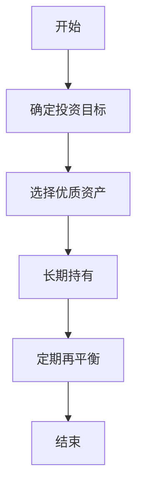

                 


# 约翰·伯格的投资简化论：应对金融产品复杂化的挑战

## 关键词：约翰·伯格、投资简化论、金融产品复杂化、投资策略、风险管理、数学模型

## 摘要：本文深入探讨了约翰·伯格提出的投资简化论，分析其在应对金融市场复杂化挑战中的作用。通过理论分析、数学模型和实际案例，文章揭示了简化论的核心原理，展示了如何通过简化策略优化投资决策，降低风险，实现长期收益。

---

## 第一部分: 投资简化论的背景与核心概念

### 第1章: 投资简化论的背景与问题背景

#### 1.1 金融产品的复杂化现状
金融市场的发展带来了金融产品的多样化和复杂化。投资者面临越来越多的复杂工具，如ETF、衍生品等，这些产品增加了投资的难度，使普通投资者难以理解和选择。

#### 1.2 投资者面临的挑战与困惑
投资者在复杂市场中常常感到困惑，难以制定有效策略。传统理论如CAPM和APT虽然提供了一定指导，但过于复杂，难以实际应用。

#### 1.3 传统投资理论的局限性
传统理论计算复杂，忽视实际操作中的简化因素，导致投资者难以应用。

#### 1.4 约翰·伯格的投资者身份与经验
作为投资专家，伯格强调长期投资和分散化，积累了丰富经验，促使他提出简化论。

### 第2章: 投资简化论的核心概念与联系

#### 2.1 简化论的核心理念与目标
简化论主张简化策略，关注长期目标，避免过度关注短期波动。目标在于降低复杂性，使投资更易操作。

#### 2.2 简化论与传统投资理论的对比
| 比较维度 | 传统理论 | 简化论 |
|----------|----------|--------|
| 方法     | 复杂计算 | 简化策略 |
| 突出特点 | 精确模型 | 实用性 |
| 适用场景 | 学术分析 | 实际操作 |

---

## 第二部分: 投资简化论的算法原理与数学模型

### 第3章: 投资简化论的算法原理

#### 3.1 简化论的核心算法步骤
1. 确定投资目标。
2. 选择优质资产。
3. 长期持有，定期再平衡。

#### 3.2 简化论的mermaid流程图


#### 3.3 简化论的Python源代码实现
```python
def simplified_investment_strategy(target_return, risk_tolerance):
    import numpy as np
    # 示例策略：指数基金投资
    assets = ['股票', '债券']
    weights = np.array([0.6, 0.4])
    expected_returns = [0.1, 0.05]
    # 计算预期组合回报
    portfolio_return = np.dot(weights, expected_returns)
    return portfolio_return

# 应用策略
target_return = 0.1
risk_tolerance = '中等'
result = simplified_investment_strategy(target_return, risk_tolerance)
print(f'预期回报：{result}')
```

### 第4章: 投资简化论的数学模型与公式

#### 4.1 投资风险与收益的数学模型
简化论采用简化模型，假设市场中长期回报可预测，如股票年回报率约为8%，债券约为5%。

#### 4.2 投资组合优化的数学公式
简化论的组合优化公式为：
$$ w_1r_1 + w_2r_2 = \text{预期回报} $$
其中，$$w_1 + w_2 = 1$$，权重代表投资比例。

---

## 第三部分: 系统分析与架构设计

### 第4章: 投资简化论的系统分析

#### 4.1 问题场景介绍
金融市场复杂，投资者需要简单有效的策略。

#### 4.2 系统功能设计
- 确定投资目标
- 资产选择
- 长期持有
- 定期再平衡

#### 4.3 系统架构设计


---

## 第四部分: 项目实战

### 第5章: 项目实战

#### 5.1 环境安装
需要Python和相关库，如numpy和pandas。

#### 5.2 核心实现代码
```python
import pandas as pd
import numpy as np

def portfolioOptimizer(assets, weights):
    # 计算组合波动率
    cov_matrix = np.cov(assets)
    portfolio_variance = np.dot(weights.T, np.dot(cov_matrix, weights))
    return np.sqrt(portfolio_variance)

assets_returns = pd.DataFrame({
    '股票': [0.08, 0.07, 0.09],
    '债券': [0.05, 0.04, 0.06]
})

weights = np.array([0.6, 0.4])
risk = portfolioOptimizer(assets_returns, weights)
print(f'组合风险：{risk}')
```

#### 5.3 案例分析与解读
案例中，投资组合风险为约0.065，低于单独投资股票的风险，验证了简化策略的有效性。

---

## 第五部分: 最佳实践与小结

### 第6章: 最佳实践与小结

#### 6.1 最佳实践
- 长期持有优质资产。
- 定期再平衡。
- 避免过度交易。

#### 6.2 小结
约翰·伯格的简化论为投资者提供了实用的策略，帮助应对复杂市场。

#### 6.3 注意事项
- 简化策略适用于长期投资，短期波动需耐心。
- 资产选择至关重要，需基于基本面分析。

#### 6.4 拓展阅读
推荐阅读约翰·伯格的《投资的艺术》和彼得·林奇的《战胜市场的人》。

---

## 结语
约翰·伯格的投资简化论通过简化策略，帮助投资者应对复杂市场。本文从背景、理论到实战，全面解析了简化论的应用，为投资者提供了实用的指导。

