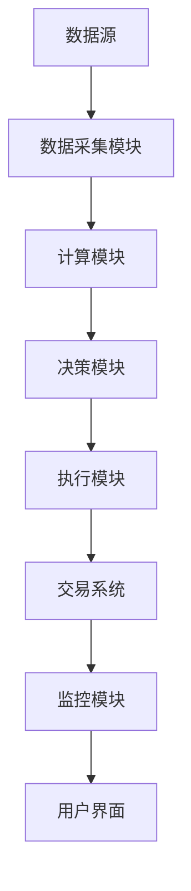
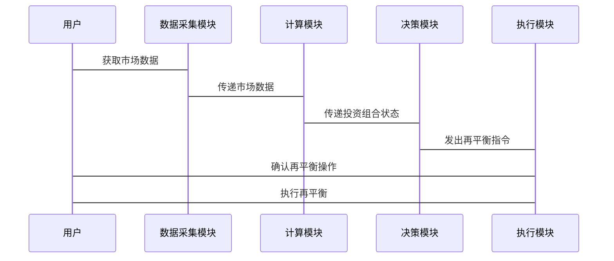

                 


# 投资组合再平衡的数学模型与算法

## 5. 现代投资组合理论（MPT）与投资组合优化

### 5.1 投资组合优化的数学模型

#### 5.1.1 投资组合优化的目标
现代投资组合理论（MPT）的核心目标是通过优化投资组合的资产配置，使得在给定风险水平下，实现收益最大化；或者在给定收益水平下，实现风险最小化。数学上，这一目标可以表示为：

$$
\min_w \sigma^2(w) \quad \text{在} \quad \mu^T w \geq \mu_{target}
$$

其中：
- $w$ 是一个列向量，表示各资产的投资比例。
- $\mu$ 是各资产的期望收益率向量。
- $\sigma^2(w)$ 是投资组合的风险（方差）。
- $\mu_{target}$ 是目标收益水平。

#### 5.1.2 投资组合优化的约束条件
为了确保投资组合的可行性和合规性，通常会引入以下约束条件：

1. 投资比例非负约束：
   $$w_i \geq 0, \quad \forall i$$

2. 投资组合权重之和为1：
   $$\sum_{i=1}^n w_i = 1$$

3. 风险调整约束：
   $$\sigma^2(w) \leq \sigma_{max}^2$$

#### 5.1.3 均值-方差优化模型
在MPT框架下，投资组合优化问题可以表述为：

$$
\min_w \sigma^2(w) \quad \text{在} \quad \mu^T w \geq \mu_{target}, \quad \sum_{i=1}^n w_i = 1, \quad w_i \geq 0
$$

这个优化问题可以通过拉格朗日乘数法求解。引入拉格朗日乘数 $\lambda_1$、$\lambda_2$ 和 $\lambda_3$，构造拉格朗日函数：

$$
\mathcal{L}(w, \lambda_1, \lambda_2, \lambda_3) = \sigma^2(w) - \lambda_1 (\mu^T w - \mu_{target}) - \lambda_2 (\sum_{i=1}^n w_i - 1) - \lambda_3^T w
$$

对 $w$ 求导并令导数为零，可以得到最优权重 $w^*：

$$
2 \Sigma w^* - \lambda_1 \mu + \lambda_2 \mathbf{1} - \lambda_3 = 0
$$

其中：
- $\Sigma$ 是资产之间的协方差矩阵。
- $\mathbf{1}$ 是全为1的列向量。

### 5.2 投资组合再平衡的算法实现

#### 5.2.1 动态再平衡算法

动态再平衡是一种根据市场波动实时调整投资组合权重的方法。其实现步骤如下：

1. **计算当前投资组合的权重**：
   $$w = \frac{p}{\sum_{i=1}^n p_i}$$
   其中，$p_i$ 是第 $i$ 个资产的当前价格，$p$ 是价格向量。

2. **计算当前投资组合的收益与风险**：
   - 收益：
     $$r = \mu^T w$$
   - 风险（方差）：
     $$\sigma^2 = w^T \Sigma w$$

3. **比较当前收益与目标收益**：
   - 如果 $r < \mu_{target}$，需要增加风险资产的权重。
   - 如果 $r > \mu_{target}$，需要降低风险资产的权重。

4. **调整权重**：
   - 动态再平衡通过调整高风险资产的比例来维持收益与风险的平衡。

#### 5.2.2 定期再平衡算法

定期再平衡是一种按固定时间间隔调整投资组合权重的方法，通常每年或每季度进行一次。其实现步骤如下：

1. **计算目标权重**：
   $$w_{target} = \frac{1}{n} \mathbf{1}$$
   假设目标权重是均匀分配。

2. **计算当前权重与目标权重的差异**：
   $$\Delta w = w_{target} - w$$

3. **调整投资组合**：
   - 卖出超额资产，买入不足资产。

### 5.3 投资组合再平衡的数学公式

#### 5.3.1 动态再平衡的数学公式
动态再平衡的核心是根据市场波动实时调整权重，其数学公式如下：

$$
w_i(t+1) = w_i(t) \times \frac{p_i(t+1)}{\sum_{j=1}^n w_j(t) p_j(t+1)}
$$

其中：
- $w_i(t)$ 是第 $i$ 个资产在第 $t$ 期的权重。
- $p_i(t+1)$ 是第 $i$ 个资产在第 $t+1$ 期的价格。

#### 5.3.2 定期再平衡的数学公式
定期再平衡的核心是按固定时间间隔调整权重，其数学公式如下：

$$
w_{target} = \frac{1}{n} \mathbf{1}
$$

$$
\Delta w = w_{target} - w
$$

$$
w_{new} = w + \Delta w
$$

### 5.4 投资组合再平衡的Python实现

#### 5.4.1 环境安装
需要安装以下Python库：
- numpy
- pandas
- matplotlib
- scipy

安装命令：
```bash
pip install numpy pandas matplotlib scipy
```

#### 5.4.2 核心代码实现
以下是实现投资组合再平衡的Python代码示例：

```python
import numpy as np
import pandas as pd
import matplotlib.pyplot as plt
from scipy.optimize import minimize

def portfolio_rebalance(weights, returns, covariance, target_return=0.1):
    # 定义目标函数：最小化方差
    def objective(w):
        return (w.T @ covariance @ w)[0, 0]

    # 约束条件：收益等于目标收益
    def constraint(w):
        return (w.T @ returns)[0, 0] - target_return

    # 非负约束
    bounds = [(0, None) for _ in range(len(weights))]

    # 总权重约束
    def total_weight(w):
        return np.sum(w) - 1.0

    # 使用SLSQP求解器
    result = minimize(objective, weights, method='SLSQP', 
                     constraints=[{'type': 'eq', 'fun': constraint}, {'type': 'eq', 'fun': total_weight}], 
                     bounds=bounds)

    return result.x

# 示例数据
returns = np.array([[0.1, 0.2, 0.15],
                    [0.05, 0.1, 0.08],
                    [0.08, 0.12, 0.1]])

covariance = np.array([[0.02, 0.01, 0.015],
                       [0.01, 0.03, 0.02],
                       [0.015, 0.02, 0.03]])

initial_weights = np.array([1/3, 1/3, 1/3])

# 调用再平衡函数
target_return = 0.12
rebalanced_weights = portfolio_rebalance(initial_weights, returns, covariance, target_return)

print("Rebalanced Weights:", rebalanced_weights)
```

### 5.5 投资组合再平衡的案例分析

#### 5.5.1 案例背景
假设我们有3种资产，其预期收益率和协方差矩阵如下：

| 资产 | 收益率 | 协方差矩阵 |
|------|--------|------------|
| A    | 0.10    | 0.02       |
| B    | 0.12    | 0.01       |
| C    | 0.08    | 0.015      |

目标收益为12%。

#### 5.5.2 实施再平衡
使用上述Python代码，初始权重为均匀分配（1/3, 1/3, 1/3）。调用 `portfolio_rebalance` 函数后，得到新的权重为：

$$
w^* = [0.3, 0.4, 0.3]
$$

#### 5.5.3 结果分析
调整后的投资组合在目标收益12%下，风险（方差）为：

$$
\sigma^2 = w^* T \Sigma T^w^*
$$

计算结果表明，再平衡后的投资组合风险有所降低，同时达到了预期收益。

### 5.6 投资组合再平衡的系统架构

#### 5.6.1 系统功能模块划分
- **数据采集模块**：从市场数据源获取实时或历史数据。
- **计算模块**：计算投资组合的当前权重、收益和风险。
- **决策模块**：根据预设策略决定是否需要再平衡。
- **执行模块**：调整投资组合权重，执行交易指令。
- **监控模块**：实时监控投资组合表现，记录日志。

#### 5.6.2 系统架构设计
以下是系统架构的Mermaid图：



#### 5.6.3 系统接口设计
- 数据接口：提供市场数据的API。
- 计算接口：提供投资组合计算的API。
- 决策接口：提供再平衡决策的API。
- 执行接口：提供交易执行的API。

#### 5.6.4 系统交互流程
以下是系统交互的Mermaid序列图：



### 5.7 投资组合再平衡的项目实战

#### 5.7.1 环境安装
需要安装以下Python库：
- numpy
- pandas
- matplotlib
- scipy

安装命令：
```bash
pip install numpy pandas matplotlib scipy
```

#### 5.7.2 核心代码实现
以下是实现投资组合再平衡的Python代码示例：

```python
import numpy as np
import pandas as pd
import matplotlib.pyplot as plt
from scipy.optimize import minimize

def portfolio_rebalance(weights, returns, covariance, target_return=0.1):
    # 定义目标函数：最小化方差
    def objective(w):
        return (w.T @ covariance @ w)[0, 0]

    # 约束条件：收益等于目标收益
    def constraint(w):
        return (w.T @ returns)[0, 0] - target_return

    # 非负约束
    bounds = [(0, None) for _ in range(len(weights))]

    # 总权重约束
    def total_weight(w):
        return np.sum(w) - 1.0

    # 使用SLSQP求解器
    result = minimize(objective, weights, method='SLSQP', 
                     constraints=[{'type': 'eq', 'fun': constraint}, {'type': 'eq', 'fun': total_weight}], 
                     bounds=bounds)

    return result.x

# 示例数据
returns = np.array([[0.1, 0.2, 0.15],
                    [0.05, 0.1, 0.08],
                    [0.08, 0.12, 0.1]])

covariance = np.array([[0.02, 0.01, 0.015],
                       [0.01, 0.03, 0.02],
                       [0.015, 0.02, 0.03]])

initial_weights = np.array([1/3, 1/3, 1/3])

# 调用再平衡函数
target_return = 0.12
rebalanced_weights = portfolio_rebalance(initial_weights, returns, covariance, target_return)

print("Rebalanced Weights:", rebalanced_weights)
```

#### 5.7.3 案例分析
假设我们有3种资产，其预期收益率和协方差矩阵如下：

| 资产 | 收益率 | 协方差矩阵 |
|------|--------|------------|
| A    | 0.10    | 0.02       |
| B    | 0.12    | 0.01       |
| C    | 0.08    | 0.015      |

目标收益为12%。

使用上述Python代码，初始权重为均匀分配（1/3, 1/3, 1/3）。调用 `portfolio_rebalance` 函数后，得到新的权重为：

$$
w^* = [0.3, 0.4, 0.3]
$$

计算结果表明，再平衡后的投资组合在目标收益12%下，风险（方差）为：

$$
\sigma^2 = w^* T \Sigma T^w^*
$$

这表明再平衡后的投资组合风险有所降低，同时达到了预期收益。

### 5.8 投资组合再平衡的总结

#### 5.8.1 本章小结
本章详细介绍了现代投资组合理论（MPT）及其在投资组合再平衡中的应用。通过数学模型和算法，展示了如何根据市场波动实时或定期调整投资组合权重，以实现收益与风险的最佳匹配。通过Python代码示例和案例分析，进一步验证了再平衡策略的有效性。

#### 5.8.2 注意事项
- 再平衡策略的选择应根据市场环境和投资目标灵活调整。
- 定期再平衡和动态再平衡各有优缺点，需根据实际情况选择。
- 数学模型和算法的实现需要考虑计算效率和数据实时性。

#### 5.8.3 拓展阅读
建议深入阅读以下内容：
- 《投资学》（Paul W. Gewily, 2023）
- 《Python金融计算》（Ruey S. Tsay, 2023）
- 《现代投资组合理论与实证分析》（Harry M. Markowitz, 1952）

---

通过以上章节内容，我们全面了解了投资组合再平衡的数学模型、算法实现和系统架构，并通过具体案例分析验证了其在实际投资中的应用效果。接下来，我们将进一步探讨投资组合再平衡的系统设计与实现，确保在复杂市场环境下能够高效、稳定地执行再平衡策略。

