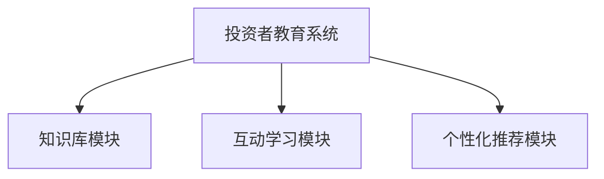

                 


# 约翰·伯格的投资者教育理念

> 关键词：投资者教育，约翰·伯格，投资理念，风险管理，投资策略，系统设计

> 摘要：本文深入探讨了约翰·伯格的投资者教育理念，分析了其核心概念、理论基础、实践策略以及系统实现。通过结合数学模型、算法实现和系统架构，详细阐述了投资者教育的重要性和具体实施方法。本文还通过实际案例分析和系统设计，展示了如何将伯格的理念应用于实际投资中。

---

## 第一部分: 引言

### 第1章: 约翰·伯格的投资者教育理念概述

#### 1.1 约翰·伯格的背景与投资理念
- 约翰·伯格是投资领域的传奇人物，他不仅是投资大师，也是投资者教育的倡导者。
- 伯格的理念强调长期投资、价值投资和风险管理。
- 投资者教育是伯格投资理念的核心，他认为教育是投资者成功的关键。

#### 1.2 投资者教育的核心概念
- 投资者教育的定义：通过系统化的方式，帮助投资者掌握投资知识、技能和方法。
- 投资者教育的目标：提高投资者的决策能力、风险管理能力和长期投资意识。
- 投资者教育的原则：知识性、实践性、个性化和持续性。

#### 1.3 本书的结构与内容安排
- 本书将从理论到实践，系统地讲解伯格的投资者教育理念。
- 内容涵盖投资心理学、风险管理、投资策略、系统设计等方面。

---

## 第二部分: 投资者教育的理论基础

### 第2章: 投资者教育的核心原理

#### 2.1 投资者的认知与行为分析
- 投资者的决策模式：理性与非理性的结合。
- 投资者心理偏差：过度自信、从众心理、损失厌恶等。
- 投资者情绪对决策的影响：情绪波动如何影响投资决策。

#### 2.2 投资者教育的理论框架
- 投资者教育的层次模型：知识层、心理层、行为层。
- 投资者教育的目标与路径：知识传递、心理调整、行为改变。
- 投资者教育的实施策略：个性化教育、案例教学、互动学习。

---

## 第三部分: 投资者教育的实践策略

### 第3章: 投资者教育的核心方法

#### 3.1 投资者教育的主要方法
- 知识传递法：通过书籍、课程等形式传递投资知识。
- 案例分析法：通过实际案例分析投资策略和风险。
- 互动体验法：通过模拟交易、投资游戏等方式增强投资者体验。

#### 3.2 投资者教育的内容体系
- 基础知识模块：投资原理、财务分析、市场分析。
- 投资策略模块：价值投资、长期投资、指数投资。
- 风险管理模块：风险评估、风险控制、风险管理工具。

---

## 第四部分: 投资者教育的系统架构与实现

### 第4章: 投资者教育的系统设计

#### 4.1 投资者教育系统的功能模块
- 知识库模块：存储和管理投资知识。
- 互动学习模块：提供互动学习功能。
- 个性化推荐模块：根据投资者需求推荐学习内容。

#### 4.2 投资者教育系统的架构图


#### 4.3 系统实现的技术选型
- 前端技术：React、Vue.js。
- 后端技术：Python（Django框架）、Node.js。
- 数据库设计：MySQL、MongoDB。

---

## 第五部分: 投资者教育的数学模型与算法实现

### 第5章: 投资者教育的数学模型

#### 5.1 投资者行为预测模型
- 模型假设：投资者行为受到心理、市场环境和知识水平的影响。
- 模型构建：基于概率论和统计学的方法，构建投资者行为预测模型。
- 模型验证：通过历史数据验证模型的准确性。

#### 5.2 投资组合优化模型
- Markowitz均值-方差模型：
$$\min_{w} \frac{1}{2}w^T \Sigma w$$
$$\text{subject to } \mathbf{w}^T \mathbf{1} = 1$$
- 风险调整后的投资组合优化：
$$\min_{w} \frac{1}{2}w^T \Sigma w - \lambda r_p$$

---

## 第六部分: 项目实战

### 第6章: 投资者教育系统的实现

#### 6.1 环境安装
- 安装Python和相关库（如numpy、pandas）。
- 安装前端框架（如Vue.js）。

#### 6.2 系统核心实现源代码
```python
import numpy as np
import pandas as pd

# 示例代码：计算投资组合的夏普比率
def calculate_sharpe_ratio(returns, risk_free_rate):
    # 计算超额收益
    excess_returns = returns - risk_free_rate
    # 计算夏普比率
    return np.mean(excess_returns) / np.std(excess_returns)

# 示例数据
returns = pd.Series([0.05, 0.03, 0.07, 0.02, 0.04])
risk_free_rate = 0.02

# 计算夏普比率
sharpe_ratio = calculate_sharpe_ratio(returns, risk_free_rate)
print("夏普比率:", sharpe_ratio)
```

---

## 第七部分: 总结

### 第7章: 小结与展望

#### 7.1 本章小结
- 本文系统地探讨了约翰·伯格的投资者教育理念。
- 从理论到实践，详细阐述了投资者教育的核心概念、方法和系统实现。

#### 7.2 投资者教育的注意事项
- 投资者教育需要结合实际市场环境和投资者需求。
- 需要不断更新和优化教育内容和方法。

#### 7.3 拓展阅读
- 建议读者阅读伯格的经典著作《投资最重要的事情》。
- 参考其他投资大师的教育理念，如巴菲特、彼得·林奇。

---

通过以上内容，我们详细分析了约翰·伯格的投资者教育理念，并结合实际案例和系统设计，展示了其理念的具体实施方法。希望本文能为投资者提供有价值的参考和启发。

