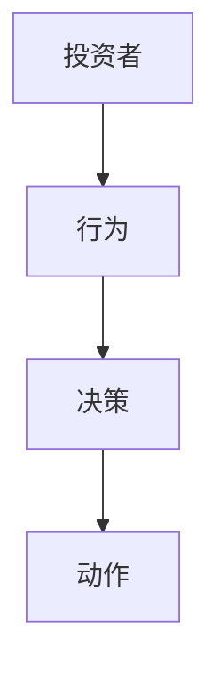
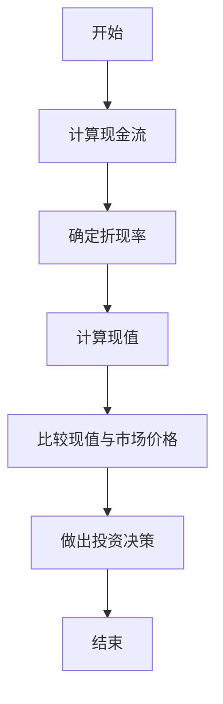

                 

# 约翰·伯格的投资者行为学观点

> 关键词：投资者行为学，约翰·伯格，价值投资，长期投资，安全边际

> 摘要：本文从约翰·伯格的投资者行为学观点出发，分析价值投资的核心理念，探讨长期投资与安全边际的重要性，结合数学模型和系统架构，提供深入的理论分析和实践指导。

---

## 第一部分: 投资者行为学的背景与基础

### 第1章: 投资者行为学的背景介绍

#### 1.1 投资者行为学的核心概念
- **问题背景**：现代金融市场复杂多变，投资者行为受到心理、环境等多因素影响。
- **问题描述**：分析投资者如何做出决策，理解其行为规律。
- **边界与外延**：涵盖个体与群体行为，涉及心理学、经济学等多个领域。
- **核心要素**：心理认知、决策过程、外部环境。

#### 1.2 约翰·伯格的生平与投资理念
- **生平简介**：伯格是指数基金之父，强调长期投资和价值投资。
- **投资哲学**：价值投资的核心是寻找内在价值，长期持有优质资产。
- **策略特点**：注重安全边际，避免短期波动，追求长期稳定收益。

### 第2章: 投资者行为学的核心概念与联系

#### 2.1 核心概念原理
- **价值投资**：基于内在价值，而非市场波动。
- **长期投资**：分散投资，降低风险，获取复利效应。
- **安全边际**：以合理价格买入优质资产，降低风险。

#### 2.2 核心概念属性对比
| 概念       | 价值投资 | 短期投资 | 风险投资 |
|------------|----------|----------|----------|
| 时间跨度   | 长期     | 短期     | 中长期   |
| 风险承受   | 低       | 高       | 中       |
| 投资策略   | 购买并持有| 短期交易  | 精选项目  |

#### 2.3 ER实体关系图

### 第3章: 价值投资的数学模型与算法原理

#### 3.1 投资者决策的数学模型
$$ V = \sum_{t=1}^{\infty} \frac{CF_t}{(1 + r)^t} $$
其中，\( V \) 是内在价值，\( CF_t \) 是第 \( t \) 年的现金流，\( r \) 是折现率。

#### 3.2 算法原理流程图

### 第4章: 系统分析与架构设计方案

#### 4.1 系统架构

## 第二部分: 项目实战与最佳实践

### 第5章: 项目实战分析

#### 5.1 模拟投资案例
分析伯格的投资策略在实际中的应用，计算内在价值，制定投资计划。

### 第6章: 最佳实践

#### 6.1 小结
总结价值投资的关键点，强调长期持有和安全边际的重要性。

#### 6.2 注意事项
提醒读者避免短期波动，保持纪律，定期审视投资组合。

#### 6.3 拓展阅读
推荐相关书籍和资源，深入理解投资者行为学。

---

通过以上结构，文章系统地介绍了约翰·伯格的投资者行为学观点，结合理论与实践，帮助读者理解并应用价值投资策略。

