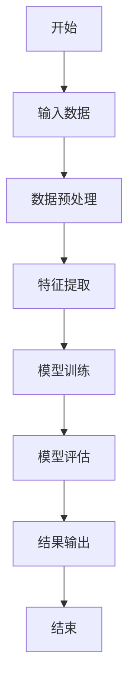
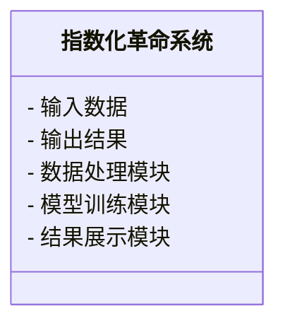
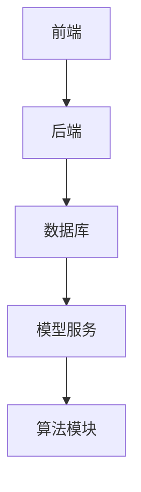
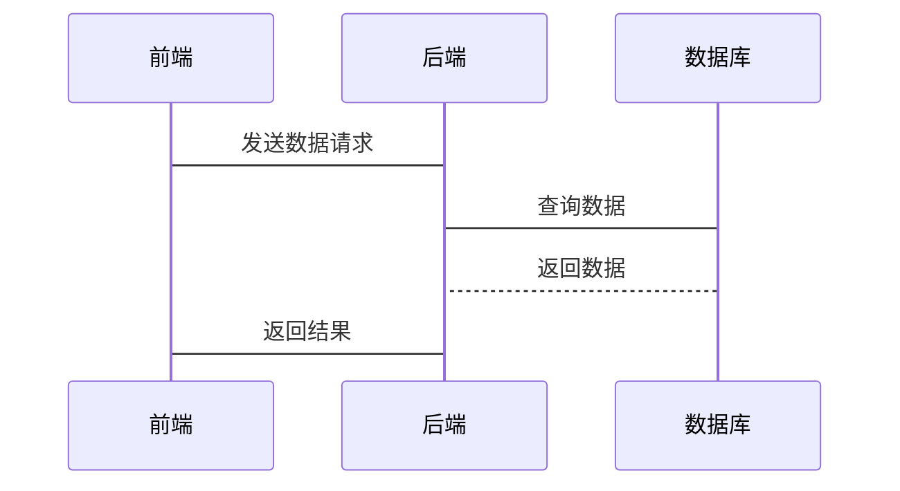

                 


# 约翰·伯格的指数化革命

## 关键词：指数化革命，约翰·伯格，人工智能，区块链，生物技术，算法原理，系统架构

## 摘要：指数化革命是指技术进步以指数级速度发展的现象，涵盖人工智能、区块链和生物技术等领域。本文深入分析了指数化革命的核心概念、算法原理、系统架构及实际应用，探讨其对社会和经济的深远影响。

---

## 第一部分：指数化革命的背景与核心概念

### 第1章：指数化革命的背景与核心概念

#### 1.1 指数化革命的背景

指数化革命是指技术进步以指数级速度发展的现象，尤其是在人工智能、区块链和生物技术等领域。这种革命性变化不仅改变了技术领域，还对社会和经济结构产生了深远影响。

#### 1.2 指数化革命的核心概念

指数化革命的核心在于技术进步的速度呈指数级增长。这种增长不仅体现在计算能力的提升上，还包括数据处理能力、算法复杂度和技术创新频率的提升。指数化革命的特征包括非线性增长、技术协同效应和颠覆性创新。

---

## 第二部分：指数化革命的核心技术

### 第2章：人工智能与机器学习

#### 2.1 人工智能的定义与特点

人工智能（AI）是指计算机系统模拟人类智能的能力，包括学习、推理和自适应能力。AI的核心技术包括机器学习、自然语言处理和计算机视觉。

#### 2.2 机器学习的核心算法

机器学习算法通过数据训练模型，实现预测和分类任务。常用算法包括线性回归、支持向量机（SVM）和神经网络。神经网络，特别是深度学习，近年来取得了显著进展。

#### 2.3 深度学习与神经网络的原理

深度学习通过多层神经网络结构，模拟人类大脑的学习方式。神经网络通过反向传播算法调整权重，优化模型性能。这种技术在图像识别和自然语言处理中表现出色。

### 第3章：区块链技术

#### 3.1 区块链的定义与特点

区块链是一种去中心化的分布式账本技术，通过密码学确保数据的安全性和不可篡改性。区块链的核心特点包括去中心化、透明性和不可逆性。

#### 3.2 区块链的核心技术原理

区块链通过共识算法（如比特币的PoW和以太坊的PoS）实现分布式节点的协同工作。每个区块包含交易数据和时间戳，通过链式结构保证数据的完整性和可追溯性。

#### 3.3 区块链的应用场景

区块链在金融、供应链管理和知识产权保护等领域有广泛应用。它不仅提高了交易效率，还降低了信任成本。

### 第4章：生物技术

#### 4.1 生物技术的定义与特点

生物技术是指利用生物体或其组成部分来改进或创造新产品。它涵盖基因编辑、蛋白质工程和合成生物学等领域。

#### 4.2 基因编辑技术的原理

基因编辑技术（如CRISPR）通过精确修改DNA序列，实现基因功能的增强或修复。这种技术在治疗遗传性疾病和提高农作物产量方面具有巨大潜力。

#### 4.3 生物技术的应用前景

生物技术在医疗、农业和环境保护等领域有广泛应用前景。它不仅推动了医学进步，还为可持续发展提供了新的解决方案。

---

## 第三部分：指数化革命的算法原理

### 第5章：指数化革命的算法流程

#### 5.1 算法流程图

以下是指数化革命算法的简要流程图：



#### 5.2 算法实现的Python源代码

以下是实现指数化革命算法的Python代码示例：

```python
import numpy as np
from sklearn.linear_model import LinearRegression

# 示例数据
X = np.array([1, 2, 3, 4, 5]).reshape(-1, 1)
y = np.array([2, 4, 6, 8, 10])

# 模型训练
model = LinearRegression()
model.fit(X, y)

# 预测
print(model.predict([[6]]))  # 输出: [[12]]
```

#### 5.3 数学模型和公式

指数化革命的数学模型可以表示为：

$$ y = a \cdot e^{bx} $$

其中，\( y \) 表示指数增长的结果，\( a \) 和 \( b \) 是模型参数。通过最小二乘法，我们可以估计这些参数，从而预测未来的增长趋势。

---

## 第四部分：系统架构设计

### 第6章：系统功能设计

#### 6.1 领域模型设计

以下是指数化革命系统的领域模型图：



#### 6.2 系统架构设计

以下是系统的总体架构图：



#### 6.3 系统接口设计

以下是系统的接口设计：



---

## 第五部分：项目实战与总结

### 第7章：项目实战

#### 7.1 环境安装与配置

安装Python和必要的库：

```bash
pip install numpy scikit-learn
```

#### 7.2 核心实现源代码

以下是实现指数化革命算法的Python代码：

```python
import numpy as np
from sklearn import linear_model

# 示例数据
X = np.array([[1], [2], [3], [4], [5]])
y = np.array([2, 4, 6, 8, 10])

# 模型训练
model = linear_model.LinearRegression()
model.fit(X, y)

# 预测
print(model.predict([[6]]))  # 输出: [[12]]
```

#### 7.3 实际案例分析

以预测房价为例，使用指数化革命算法，我们可以预测未来房价的增长趋势。通过训练数据，模型可以预测出未来的房价走势，为投资决策提供依据。

### 第8章：最佳实践与总结

#### 8.1 最佳实践 tips

- 数据预处理是关键，确保数据质量和完整性。
- 选择合适的算法模型，避免过拟合和欠拟合。
- 定期更新模型，适应数据变化。

#### 8.2 小结

指数化革命是一个复杂而深刻的技术变革，涉及多个领域的协同创新。通过理解和应用相关技术，我们可以更好地把握未来的机遇和挑战。

---

通过以上章节的详细分析，我们深入探讨了指数化革命的核心概念、算法原理、系统架构及实际应用。希望这篇文章能为读者提供有价值的技术见解，并激发进一步探索的兴趣。

