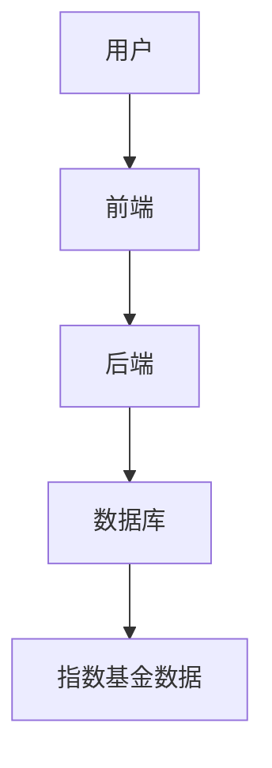
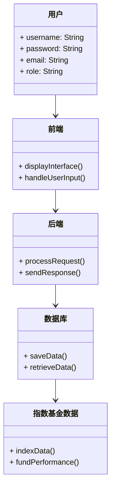

                 


# 约翰·伯格的指数基金投资理念

> 关键词：指数基金、被动投资、约翰·伯格、投资策略、风险管理

> 摘要：本文系统地介绍了约翰·伯格的指数基金投资理念，从指数基金的定义、起源到其核心概念、数学模型、系统架构和项目实战，全面分析了指数基金的投资策略、风险管理、成本控制以及实际应用。文章结合理论与实践，深入探讨了指数基金的优势与局限性，并提供了最佳实践和注意事项。

---

# 第1章: 指数基金的起源与发展

## 1.1 指数基金的定义与特点

### 1.1.1 指数基金的定义
指数基金是一种以特定市场指数为基准，按照指数成分股的构成比例进行投资的基金。其目标是复制或追踪指数的收益表现，而非主动寻求超额收益。

### 1.1.2 指数基金的核心特点
- **被动投资**：指数基金通过复制指数成分股的投资组合，避免主动选股的风险和成本。
- **分散化**：投资于多个成分股，降低个股风险。
- **低费用**：由于采用被动投资策略，管理费用较低。

### 1.1.3 指数基金与传统主动型基金的区别
- **投资策略**：指数基金采用被动策略，主动型基金采用主动策略。
- **费用结构**：指数基金费用较低，主动型基金费用较高。
- **风险**：指数基金风险分散，主动型基金风险集中。

## 1.2 约翰·伯格的贡献

### 1.2.1 约翰·伯格的生平简介
约翰·伯格（John C. Bogle）是指数基金之父， Vanguard 集团的创始人。他于1940年出生，1967年创立Vanguard，致力于提供低成本的指数基金。

### 1.2.2 约翰·伯格与指数基金的起源
1975年，伯格创立了第一只完全被动管理的指数基金——Vanguard指数基金，标志着指数基金时代的开始。

### 1.2.3 约翰·伯格的投资理念
伯格倡导被动投资，认为市场很难被预测，指数基金能够以最低的成本获得市场平均收益。

## 1.3 指数基金的优势与局限性

### 1.3.1 指数基金的优势
- **分散风险**：投资多个成分股，降低单一股票的风险。
- **低成本**：被动管理降低了管理费用和交易费用。
- **透明性**：投资组合清晰，易于理解和追踪。

### 1.3.2 指数基金的局限性
- **无法跑赢市场**：被动投资只能获得市场平均收益，无法超越市场。
- **市场风险**：指数基金无法避免系统性风险。
- **流动性风险**：在某些情况下，可能难以快速变现。

### 1.3.3 指数基金的适用场景
- **长期投资**：适合有长期投资需求的投资者。
- **风险厌恶型投资者**：适合不想承担过多风险的投资者。
- **低成本投资**：适合追求低费用的投资者。

---

# 第2章: 指数基金的核心概念与原理

## 2.1 指数基金的构建原理

### 2.1.1 指数基金的构建方法
指数基金的构建基于特定的市场指数，如标普500指数。构建方法包括完全复制指数或优化复制。

### 2.1.2 指数基金的跟踪误差
跟踪误差是指指数基金的实际收益与指数收益之间的差异，反映了基金的管理水平。

### 2.1.3 指数基金的流动性管理
流动性管理确保指数基金能够以合理的价格买卖，避免因流动性不足导致的额外损失。

## 2.2 指数基金的成本控制

### 2.2.1 指数基金的管理费用
管理费用是指数基金的主要成本之一，被动型指数基金的管理费用通常较低。

### 2.2.2 指数基金的交易成本
交易成本包括买卖股票的佣金和市场冲击成本，指数基金通过分散交易来降低交易成本。

### 2.2.3 指数基金的规模效应
规模效应指指数基金规模越大，分摊的固定成本越小，从而降低单位成本。

## 2.3 指数基金的风险管理

### 2.3.1 指数基金的市场风险
市场风险是指数基金无法避免的风险，与整体市场表现密切相关。

### 2.3.2 指数基金的流动性风险
流动性风险是指在市场波动较大时，难以以合理价格变现的风险。

### 2.3.3 指数基金的再平衡策略
再平衡策略是定期调整投资组合，以保持与指数成分股比例一致。

---

# 第3章: 指数基金的投资策略与数学模型

## 3.1 指数基金的投资策略

### 3.1.1 指数基金的被动投资策略
被动投资策略通过复制指数成分股的投资组合，获得市场平均收益。

### 3.1.2 指数基金的主动投资策略
在被动投资的基础上，结合少量主动管理，以捕捉市场机会。

### 3.1.3 指数基金的组合投资策略
通过组合不同指数基金，分散风险，提高收益。

## 3.2 指数基金的数学模型

### 3.2.1 指数基金的收益计算公式
$$ \text{收益} = \sum_{i=1}^{n} w_i \times r_i $$
其中，\( w_i \) 是成分股的权重，\( r_i \) 是成分股的收益率。

### 3.2.2 指数基金的风险评估模型
$$ \text{风险} = \sqrt{\sum_{i=1}^{n} w_i^2 \times \sigma_i^2} $$
其中，\( \sigma_i \) 是成分股的风险标准差。

### 3.2.3 指数基金的夏普比率
$$ \text{夏普比率} = \frac{\text{收益} - \text{无风险利率}}{\text{标准差}} $$

## 3.3 指数基金的优化算法

### 3.3.1 线性规划优化模型
通过线性规划优化指数基金的权重分配，以最小化跟踪误差。

### 3.3.2 非线性优化模型
考虑交易成本和流动性约束，构建非线性优化模型。

### 3.3.3 遗传算法在指数基金优化中的应用
使用遗传算法优化指数基金的成分股组合，提高收益并降低风险。

---

# 第4章: 指数基金的系统分析与架构设计

## 4.1 指数基金管理系统的需求分析

### 4.1.1 系统目标
构建一个能够实时跟踪指数基金表现、优化投资组合的管理系统。

### 4.1.2 系统功能需求
- 数据采集：获取市场指数和基金数据。
- 绩效分析：计算收益、风险和夏普比率。
- 再平衡管理：自动调整投资组合。

### 4.1.3 系统性能需求
- 高效计算：快速处理大量数据。
- 实时监控：实时跟踪市场变化。

## 4.2 指数基金管理系统的设计

### 4.2.1 系统架构设计


### 4.2.2 系统功能模块设计


---

# 第5章: 指数基金的项目实战

## 5.1 环境安装

### 5.1.1 安装Python
使用Python 3.8及以上版本，安装Anaconda或Miniconda。

### 5.1.2 安装依赖库
安装pandas、numpy、matplotlib等库：
```bash
pip install pandas numpy matplotlib
```

## 5.2 系统核心实现源代码

### 5.2.1 数据采集
```python
import pandas as pd
import numpy as np

# 从网络获取指数数据
data = pd.read_csv('index_data.csv')
```

### 5.2.2 收益计算
```python
# 计算指数收益
returns = data.pct_change().dropna()
```

### 5.2.3 风险评估
```python
# 计算风险（标准差）
risk = returns.std()
```

### 5.2.4 夏普比率计算
```python
# 计算夏普比率
rf = 0.02  # 无风险利率
sharp_ratio = (returns.mean() - rf) / returns.std()
```

## 5.3 实际案例分析

### 5.3.1 案例背景
以标普500指数为例，分析指数基金的收益和风险。

### 5.3.2 数据分析
```python
# 数据可视化
import matplotlib.pyplot as plt

plt.plot(data)
plt.xlabel('时间')
plt.ylabel('指数值')
plt.title('标普500指数走势')
plt.show()
```

### 5.3.3 优化策略
通过优化算法调整指数基金的成分股权重，降低跟踪误差。

---

# 第6章: 指数基金的最佳实践、小结与注意事项

## 6.1 最佳实践 tips

### 6.1.1 定期再平衡
定期调整投资组合，保持与指数成分股的比例一致。

### 6.1.2 长期投资
指数基金适合长期投资，避免频繁交易。

### 6.1.3 分散投资
通过投资多个指数基金，分散风险。

## 6.2 小结

约翰·伯格的指数基金投资理念强调被动投资和长期持有，通过分散化和低成本实现市场平均收益。指数基金适合大多数投资者，但需要结合个人风险承受能力和投资目标进行选择。

## 6.3 注意事项

- **市场波动**：指数基金无法避免市场波动带来的风险。
- **费用控制**：选择低成本的指数基金，降低长期费用累积。
- **税务考虑**：了解不同地区的税务政策，优化税务负担。

---

# 结语

约翰·伯格的指数基金投资理念为投资者提供了一种简单有效的投资方式。通过本文的系统分析和实战案例，读者可以更好地理解和应用指数基金的投资策略，实现长期稳健的收益。

