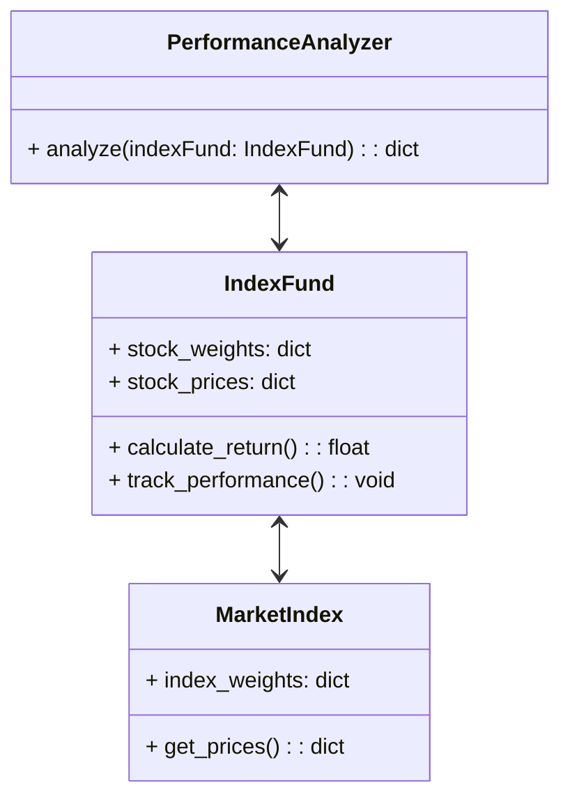
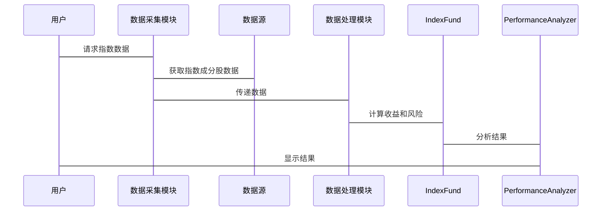

                 


# 约翰·伯格的指数基金投资理念

## 关键词：指数基金，被动投资，分散化，低成本，长期投资

## 摘要：指数基金作为一种以被动投资为核心的基金类型，通过分散化投资和低成本策略，为投资者提供了稳定且高效的长期投资选择。本文深入探讨了约翰·伯格的指数基金投资理念，包括其背后的数学模型、系统架构设计以及实际项目实现，为读者提供了全面的理解和实践指南。

---

# 第一部分：指数基金投资的背景与基础

## 第1章：指数基金的起源与约翰·伯格的贡献

### 1.1 指数基金的起源
#### 1.1.1 投资理论的演变
投资理论的发展经历了从基本面分析到量化分析的转变。20世纪初， Benjamin Graham 和 David Dodd 提出价值投资理念，强调深入分析企业的基本面。随后， Burton Malkiel 在《漫步华尔街》中提出随机漫步理论，为被动投资奠定了理论基础。20世纪70年代， John C. Bogle 创立 Vanguard，推出第一只指数基金，标志着被动投资的正式开启。

#### 1.1.2 约翰·伯格与Vanguard的创立
John C. Bogle 是指数基金的先驱，他在1975年创立了 Vanguard 集团，推出第一只完全复制标普500指数的指数基金——Vanguard 500 Index Fund。Vanguard 的经营理念是“为投资者提供低费用、高质量的被动投资工具”，这与传统的资产管理公司收取高昂管理费的做法形成了鲜明对比。

#### 1.1.3 指数基金的发展与影响
指数基金的出现改变了传统投资行业格局，使得普通投资者能够以低成本获得市场平均收益。截至2023年，全球指数基金管理的资产规模已经超过20万亿美元，成为投资领域的重要组成部分。

### 1.2 约翰·伯格的投资理念
#### 1.2.1 被动投资的核心思想
伯格认为，市场是有效的，主动管理很难跑赢市场指数。被动投资通过复制市场指数，避免了高昂的管理费用和人为的错误决策，能够为投资者提供更优的长期回报。

#### 1.2.2 分散化投资的重要性
指数基金通过持有市场上的所有或部分股票，实现充分的分散化，降低非系统性风险。即使是单只股票波动较大的情况下，指数基金的总体波动性也会显著降低。

#### 1.2.3 低成本投资的优势
传统主动管理基金的费用率通常在1-2%，而指数基金的费用率一般在0.1%-0.5%之间。长期来看，低费用能够显著提升投资收益。

### 1.3 指数基金与传统主动管理的对比
#### 1.3.1 主动投资的局限性
主动投资需要依赖基金经理的能力，但数据显示大部分主动型基金难以长期跑赢市场指数。此外，高昂的管理费用也侵蚀了投资者的收益。

#### 1.3.2 指数投资的优势
- **低成本**：指数基金的管理费用远低于主动型基金。
- **分散风险**：通过持有大量股票，降低单一股票的风险。
- **简单易行**：投资者无需选择个股或关注市场波动，只需长期持有即可获得市场平均收益。

#### 1.3.3 约翰·伯格的哲学思想
伯格强调投资的目的是为了实现财富的保值和增值，而不是追求短期收益。他认为，投资者应该关注长期目标，避免频繁交易和市场波动的干扰。

### 1.4 本章小结
本章通过介绍指数基金的起源和发展，详细阐述了约翰·伯格的投资理念。被动投资、分散化和低成本是指数基金的三大核心要素，这些要素共同构成了指数基金的独特优势。

---

## 第2章：指数基金的核心概念与原理

### 2.1 指数基金的定义与分类
#### 2.1.1 指数基金的定义
指数基金是一种以特定市场指数为标的，通过复制指数成分股的投资组合，以实现与指数相仿的收益。

#### 2.1.2 指数基金的分类
- **股票指数基金**：跟踪股票指数，如标普500指数。
- **债券指数基金**：跟踪债券指数，如巴克莱债券指数。
- **全球指数基金**：跟踪全球市场指数，如MSCI全球指数。

#### 2.1.3 指数基金与ETF的区别
ETF（交易所交易基金）是一种可以在交易所上市交易的指数基金，具有流动性高、交易灵活的特点。而传统指数基金通常以非交易方式运作，投资者按净值申购或赎回。

### 2.2 指数基金的核心原理
#### 2.2.1 被动投资的原理
被动投资的核心是复制市场指数，通过持有指数中的所有成分股，以获得与市场指数相仿的收益。

#### 2.2.2 分散化投资的数学模型
分散化投资通过持有多种资产或股票，降低非系统性风险。根据现代投资组合理论（MPT），分散化可以在不降低预期收益的情况下，降低投资组合的总体风险。

#### 2.2.3 低成本投资的经济学基础
长期来看，投资成本对投资收益的影响是复利效应的结果。低成本投资能够显著提升投资回报。

### 2.3 指数基金的风险与收益分析
#### 2.3.1 指数基金的风险特征
- **系统性风险**：指数基金无法避免市场整体波动带来的系统性风险。
- **流动性风险**：在极端情况下，指数基金可能面临流动性不足的风险。

#### 2.3.2 指数基金的长期收益表现
根据历史数据，指数基金的长期年化收益通常接近市场平均收益，扣除费用后的实际收益略低于市场平均收益。

#### 2.3.3 指数基金与市场波动的关系
指数基金的收益与市场波动密切相关，但通过分散化投资，可以降低个股波动对整体投资组合的影响。

### 2.4 本章小结
本章详细介绍了指数基金的定义、分类和核心原理，重点分析了分散化投资和低成本投资的优势，以及指数基金的风险与收益特征。

---

## 第3章：指数基金的数学模型与公式

### 3.1 指数基金的收益计算公式
#### 3.1.1 指数基金的收益计算方法
指数基金的收益可以通过以下公式计算：

$$
\text{基金收益} = \sum_{i=1}^{n} w_i \times r_i
$$

其中，\( w_i \) 是第 \( i \) 只股票的权重，\( r_i \) 是第 \( i \) 只股票的收益率。

#### 3.1.2 指数基金的年化收益计算
年化收益可以通过以下公式计算：

$$
\text{年化收益} = \left( \prod_{i=1}^{n} (1 + r_i) \right)^{\frac{1}{n}} - 1
$$

#### 3.1.3 指数基金的夏普比率计算
夏普比率衡量的是投资组合单位风险所获得的超额收益，公式为：

$$
\text{夏普比率} = \frac{\text{投资组合收益} - \text{无风险利率}}{\text{投资组合标准差}}
$$

### 3.2 指数基金的风险评估模型
#### 3.2.1 方差与标准差
方差衡量了投资收益的波动性，标准差是方差的平方根。指数基金的标准差可以通过以下公式计算：

$$
\sigma = \sqrt{\sum_{i=1}^{n} w_i^2 \times \sigma_i^2 + \sum_{i \neq j} w_i w_j \times \text{Cov}(r_i, r_j)}
$$

其中，\( \text{Cov}(r_i, r_j) \) 是第 \( i \) 只和第 \( j \) 只股票收益率的协方差。

---

## 第4章：指数基金的系统架构设计

### 4.1 问题场景介绍
为了实现指数基金的自动跟踪和管理，我们需要构建一个指数基金分析系统。该系统将从数据采集、计算分析到结果展示提供完整的解决方案。

### 4.2 系统功能设计
#### 4.2.1 领域模型（Mermaid类图）


#### 4.2.2 系统架构设计（Mermaid架构图）


#### 4.2.3 系统接口设计
- 数据接口：从数据源获取指数成分股的权重和价格。
- 计算接口：计算指数基金的收益和风险指标。
- 展示接口：将计算结果以图表形式展示。

#### 4.2.4 系统交互（Mermaid序列图）


### 4.3 本章小结
本章通过构建指数基金分析系统的架构图和交互流程图，详细描述了指数基金的系统实现过程，为后续的项目实战奠定了基础。

---

## 第5章：指数基金的项目实战

### 5.1 环境安装
为了实现指数基金的分析，我们需要安装以下环境：
- Python 3.8+
- pandas、numpy、matplotlib 等库

### 5.2 系统核心实现源代码
以下是一个简单的指数基金收益计算的Python代码示例：

```python
import pandas as pd
import numpy as np
import matplotlib.pyplot as plt

# 模拟指数成分股数据
components = ['AAPL', 'MSFT', 'GOOGL', 'AMZN']
weights = [0.3, 0.3, 0.2, 0.2]

# 获取历史股价数据
prices = pd.DataFrame({
    'AAPL': [150, 155, 160, 158],
    'MSFT': [100, 105, 110, 108],
    'GOOGL': [200, 205, 210, 207],
    'AMZN': [300, 310, 305, 308]
})

# 计算指数收益
index_return = sum(w * (p / p.shift(1) - 1) for w, p in zip(weights, prices.pct_change()))
print("指数收益:", index_return)

# 可视化展示
prices.plot()
plt.title('指数成分股价格走势')
plt.xlabel('时间')
plt.ylabel('股价')
plt.show()
```

### 5.3 代码应用解读与分析
上述代码实现了以下功能：
1. 模拟指数成分股数据。
2. 计算指数收益。
3. 可视化展示股价走势。

### 5.4 实际案例分析
以标普500指数为例，假设我们选择其中的5只股票构建一个简单的指数基金。通过上述代码，我们可以计算该指数基金的收益和风险，并与市场指数进行对比。

### 5.5 本章小结
本章通过实际案例展示了指数基金的实现过程，帮助读者理解指数基金的计算方法和应用。

---

## 第6章：指数基金投资的总结与展望

### 6.1 最佳实践 tips
- **长期投资**：避免频繁交易，坚持长期投资。
- **分散投资**：通过指数基金实现充分的分散化。
- **低成本选择**：选择费用率低的指数基金。

### 6.2 小结
指数基金作为一种被动投资工具，以其低成本、分散化和长期稳定的收益特点，成为广大投资者的首选。通过本文的分析，读者可以深入了解指数基金的投资理念和实现方法。

### 6.3 注意事项
- 投资者需要根据自身的风险承受能力和投资目标选择合适的指数基金。
- 定期调整投资组合，以适应市场变化。

### 6.4 拓展阅读
- 《The Intelligent Investor》——本杰明·格雷厄姆
- 《The Elements of Statistical Learning》—— Trevor Hastie, Robert Tibshirani, Jerome Friedman

---

通过以上目录和内容，我们系统地介绍了约翰·伯格的指数基金投资理念，从理论到实践，为读者提供了全面的指导。

