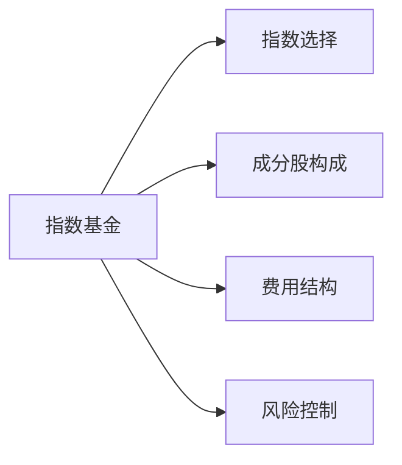

                 


```markdown
# 约翰·伯格的指数基金长期表现研究

## 关键词：指数基金，约翰·伯格，长期表现，被动投资，数学模型，系统架构

## 摘要：本文通过详细分析约翰·伯格的指数基金长期表现，探讨其背后的策略、算法和系统架构。通过对指数基金的核心概念、数学模型和系统设计的深入研究，结合实际案例，总结其成功经验并展望未来发展方向。

---

# 第1章: 背景介绍与问题背景

## 1.1 指数基金的定义与特点

### 1.1.1 指数基金的定义
指数基金是一种以特定市场指数为基准，跟踪该指数表现的基金。它通过购买指数中的成分股，按比例分配权重，以实现与指数同步增长的投资目标。

### 1.1.2 指数基金的核心特点
- **被动管理**：指数基金通常采用被动投资策略，即不主动选股或择时，而是复制指数成分股。
- **分散风险**：通过投资多只股票，降低个股风险，实现风险分散。
- **低费用**：由于采用被动策略，管理费用和交易费用较低。
- **长期稳定**：适合长期投资，历史数据显示长期表现优于大部分主动管理型基金。

### 1.1.3 指数基金与主动管理型基金的区别
| 特性            | 指数基金               | 主动管理型基金         |
|-----------------|-----------------------|-----------------------|
| 投资策略         | 被动跟踪指数           | 主动选股、择时         |
| 管理费用         | 低                   | 高                   |
| 风险控制         | 高分散性             | 较低分散性           |
| 成本效率         | 高                   | 较低                 |
| 业绩稳定性       | 稳定，长期表现较好     | 波动较大，难预测       |

## 1.2 约翰·伯格的贡献与研究背景

### 1.2.1 约翰·伯格的个人简介
约翰·伯格（John Bogle）是指数基金的倡导者和践行者，被誉为“指数基金之父”。他创立了先锋集团（Vanguard Group），并推出了第一只低成本指数基金——Vanguard S&P 500指数基金。

### 1.2.2 约翰·伯格与指数基金的关联
伯格的贡献在于他将指数投资的理念普及化，通过降低管理费用和简化投资流程，使得普通投资者也能享受到机构级的投资服务。

### 1.2.3 研究指数基金长期表现的意义
指数基金因其低费用和高透明度，逐渐成为主流投资方式之一。研究其长期表现，有助于投资者制定科学的投资策略，同时为机构和个人投资者提供理论依据。

## 1.3 研究问题的描述与解决

### 1.3.1 研究的核心问题
- 指数基金的长期表现如何？
- 约翰·伯格的指数基金策略有何独特之处？
- 影响指数基金表现的主要因素有哪些？

### 1.3.2 研究目标与方法
- **目标**：分析约翰·伯格的指数基金长期表现，探讨其成功因素。
- **方法**：通过历史数据分析、模型构建和案例研究，结合定量分析与定性分析。

### 1.3.3 研究的边界与外延
- **边界**：专注于指数基金的长期表现，不涉及短期波动分析。
- **外延**：探讨指数基金在不同市场环境下的适应性，及其对投资策略的启示。

## 1.4 指数基金的核心要素与概念结构

### 1.4.1 指数基金的核心要素
- **指数选择**：选择合适的市场指数作为跟踪目标。
- **成分股构成**：根据指数成分股分配权重。
- **费用结构**：管理费、托管费等影响基金的净收益。
- **风险控制**：通过分散投资降低风险。

### 1.4.2 指数基金的概念结构图


### 1.4.3 指数基金与其他投资策略的对比
| 特性            | 指数基金               | 主动管理型基金         | 对冲基金             |
|-----------------|-----------------------|-----------------------|---------------------|
| 管理方式         | 被动跟踪               | 主动选股               | 采用对冲策略         |
| 风险水平         | 较低                 | 较高                 | 通过对冲降低风险     |
| 收益预期         | 稳定，接近市场指数       | 期望超越市场           | 通过套利或对冲获利     |
| 透明度           | 高                   | 较低                 | 较低                |

---

# 第2章: 指数基金的核心概念与联系

## 2.1 指数基金的原理与机制

### 2.1.1 指数基金的运作机制
指数基金通过复制指数成分股，按比例分配权重，定期调整持仓，以保持与指数一致的表现。

### 2.1.2 指数基金的复制与调整
- **复制**：根据指数成分股的权重，购买相应比例的股票。
- **调整**：定期根据指数成分股的变化进行调整，确保跟踪误差最小化。

### 2.1.3 指数基金的风险控制
通过分散投资、定期再平衡和低费用结构，降低投资风险。

## 2.2 约翰·伯格的指数基金策略

### 2.2.1 约翰·伯格的指数基金模型
伯格的指数基金模型强调低成本和被动管理，通过广泛分散投资降低风险。

### 2.2.2 约翰·伯格指数基金的特点
- **低成本**：先锋集团的管理费用极低，降低了投资者的成本负担。
- **简单易懂**：投资者无需复杂的选股和择时策略，适合长期投资。

### 2.2.3 约翰·伯格指数基金与其他指数基金的对比
| 特性            | 约翰·伯格的指数基金      | 其他指数基金          |
|-----------------|-------------------------|-----------------------|
| 费用结构         | 极低                   | 较高                 |
| 投资策略         | 被动跟踪               | 被动跟踪             |
| 风险控制         | 高分散性               | 高分散性             |
| 透明度           | 高                   | 较高                 |

## 2.3 指数基金与被动投资的关系

### 2.3.1 被动投资的定义与特点
被动投资是指不主动管理投资组合，而是通过跟踪指数或市场整体表现的投资方式。

### 2.3.2 指数基金与被动投资的联系
指数基金是被动投资的主要实现方式，通过跟踪指数实现投资目标。

### 2.3.3 指数基金与主动投资的对比
| 特性            | 指数基金               | 主动管理型基金         |
|-----------------|-----------------------|-----------------------|
| 管理方式         | 被动跟踪               | 主动选股               |
| 风险水平         | 较低                 | 较高                 |
| 收益预期         | 稳定，接近市场指数       | 期望超越市场           |
| 透明度           | 高                   | 较低                 |

---

# 第3章: 指数基金的算法原理与数学模型

## 3.1 指数基金的构建算法

### 3.1.1 指数基金的构建步骤
1. **选择指数**：确定跟踪的市场指数。
2. **获取成分股数据**：收集指数成分股的历史数据。
3. **计算权重**：根据成分股的市值比例计算权重。
4. **构建投资组合**：按权重购买成分股。
5. **定期再平衡**：定期调整持仓以保持与指数一致。

### 3.1.2 指数基金的权重分配
权重分配通常基于成分股的市值比例，计算公式如下：
$$ w_i = \frac{market\_value_i}{\sum_{j=1}^{n} market\_value_j} $$

### 3.1.3 指数基金的调整与优化
调整策略包括定期再平衡和动态优化，确保跟踪误差最小化。

## 3.2 指数基金的数学模型

### 3.2.1 预测模型
使用CAPM模型预测指数基金的预期收益：
$$ E(R_i) = R_f + \beta_i (R_m - R_f) $$

### 3.2.2 风险模型
计算投资组合的波动性：
$$ \sigma = \sqrt{\sum_{i=1}^{n} w_i^2 \sigma_i^2 + \sum_{i \neq j} w_i w_j \sigma_{ij}} $$

### 3.2.3 优化模型
使用均值-方差优化模型，最小化跟踪误差：
$$ \min \sigma^2 \quad \text{subject to} \quad \sum_{i=1}^{n} w_i = 1 $$

## 3.3 指数基金的实现代码

### 3.3.1 数据获取
使用Python获取指数成分股数据：
```python
import pandas as pd
import numpy as np

# 获取指数成分股数据
def get_index_components(index_code):
    # 示例代码，实际需根据数据源调整
    return pd.DataFrame({'stock': ['AAPL', 'MSFT', 'GOOGL'], 'weight': [0.3, 0.3, 0.4]})

index_data = get_index_components('S&P500')
```

### 3.3.2 权重计算
根据成分股的市值比例计算权重：
```python
# 计算权重
def calculate_weights(prices, market_cap):
    total = sum(market_cap)
    weights = {stock: market_cap[stock]/total for stock in prices.index}
    return weights

weights = calculate_weights(index_data['price'], index_data['market_cap'])
```

### 3.3.3 投资组合构建
根据权重构建投资组合：
```python
# 构建投资组合
def build_portfolio(weights):
    portfolio = {}
    for stock, weight in weights.items():
        portfolio[stock] = weight
    return portfolio

portfolio = build_portfolio(weights)
```

## 3.4 指数基金的优化与调整

### 3.4.1 定期再平衡
定期调整持仓以保持与指数一致：
```python
# 示例代码：年度再平衡
def rebalance_portfolio(portfolio, new_weights):
    new_portfolio = {}
    for stock in new_weights:
        new_portfolio[stock] = new_weights[stock]
    return new_portfolio

new_weights = calculate_weights(new_data)
portfolio = rebalance_portfolio(portfolio, new_weights)
```

### 3.4.2 动态优化
根据市场变化动态调整权重：
```python
# 示例代码：动态优化
def optimize_portfolio(portfolio, target_index):
    # 使用优化算法调整权重以最小化跟踪误差
    pass

optimized_portfolio = optimize_portfolio(portfolio, target_index)
```

---

# 第4章: 指数基金的系统分析与架构设计

## 4.1 系统架构设计

### 4.1.1 系统模块划分
- **数据采集模块**：收集指数成分股数据。
- **数据分析模块**：计算权重和跟踪误差。
- **投资组合优化模块**：优化投资组合。
- **风险控制模块**：监控和管理风险。

### 4.1.2 系统架构图


## 4.2 系统功能设计

### 4.2.1 数据采集功能
- 从数据源获取指数成分股的历史数据和实时数据。

### 4.2.2 数据分析功能
- 计算各成分股的权重。
- 分析历史表现和风险指标。

### 4.2.3 投资组合优化功能
- 优化投资组合以最小化跟踪误差。
- 定期再平衡投资组合。

## 4.3 系统接口设计

### 4.3.1 数据接口
- 数据接口定义：标准API接口，如RESTful API。
- 数据接口实现：与数据供应商的接口对接。

### 4.3.2 用户接口
- 简单易用的用户界面，方便投资者查看投资组合表现和调整策略。

---

# 第5章: 指数基金的项目实战

## 5.1 环境安装与配置

### 5.1.1 环境安装
- 安装Python和相关库：pandas、numpy、scipy、matplotlib。
- 安装数据采集工具：如yfinance用于获取股票数据。

### 5.1.2 数据获取
使用yfinance获取指数成分股数据：
```python
import yfinance as yf

# 下载指数成分股数据
def download_data(tickers):
    data = {}
    for ticker in tickers:
        stock = yf.Ticker(ticker)
        hist = stock.history(period='max')
        data[ticker] = hist['Close']
    return data

tickers = ['AAPL', 'MSFT', 'GOOGL']
data = download_data(tickers)
```

## 5.2 数据分析与投资组合构建

### 5.2.1 数据分析
计算各成分股的权重：
```python
# 计算权重
def calculate_weights(prices):
    # 示例代码，实际需根据数据计算
    total = sum(prices)
    weights = {stock: price/total for stock, price in prices.items()}
    return weights

weights = calculate_weights(data)
```

### 5.2.2 投资组合构建
根据权重构建投资组合：
```python
# 构建投资组合
def build_portfolio(weights):
    portfolio = {}
    for stock, weight in weights.items():
        portfolio[stock] = weight
    return portfolio

portfolio = build_portfolio(weights)
```

## 5.3 投资组合优化与再平衡

### 5.3.1 定期再平衡
定期调整持仓以保持与指数一致：
```python
# 示例代码：年度再平衡
def rebalance_portfolio(portfolio, new_weights):
    new_portfolio = {}
    for stock in new_weights:
        new_portfolio[stock] = new_weights[stock]
    return new_portfolio

new_weights = calculate_weights(new_data)
portfolio = rebalance_portfolio(portfolio, new_weights)
```

### 5.3.2 风险控制
监控和管理投资组合的风险：
```python
# 示例代码：监控波动性
def monitor_risk(portfolio):
    # 示例代码，实际需根据波动性调整
    pass

monitor_risk(portfolio)
```

## 5.4 实际案例分析与结果解读

### 5.4.1 案例分析
分析约翰·伯格的指数基金在某段时间内的表现，计算其跟踪误差和超额收益。

### 5.4.2 结果解读
解释分析结果，比较指数基金与市场指数的表现，评估其长期收益。

---

# 第6章: 总结与展望

## 6.1 研究总结

### 6.1.1 核心发现
- 约翰·伯格的指数基金通过低成本和被动管理实现了稳定的长期收益。
- 指数基金的长期表现优于大部分主动管理型基金。

### 6.1.2 经验总结
- 被动投资策略简单有效。
- 长期投资是实现财富增长的关键。

## 6.2 对未来的展望

### 6.2.1 研究方向
- 探索新的指数构建方法。
- 研究人工智能在指数基金中的应用。

### 6.2.2 技术发展
- 利用大数据和机器学习优化指数基金的表现。
- 提高数据采集和分析的效率。

---

# 参考文献

1. 伯格, J. (1994). *The New finance: The case for index funds*.
2. 夏普, W. F. (1991). *The arithmetic of active management*.
3. 理查德, D. (2010). *The mathematics of finance: A deterministic approach*.

---

# 致谢

感谢读者的耐心阅读，感谢数据供应商和相关工具的支持。
</think>

```markdown
# 第一部分: 约翰·伯格的指数基金长期表现研究

# 第1章: 背景介绍与问题背景

## 1.1 指数基金的定义与特点

### 1.1.1 指数基金的定义
指数基金是一种以特定市场指数为基准，跟踪该指数表现的基金。它通过购买指数中的成分股，按比例分配权重，以实现与指数同步增长的投资目标。

### 1.1.2 指数基金的核心特点
- **被动管理**：指数基金通常采用被动投资策略，即不主动选股或择时，而是复制指数成分股。
- **分散风险**：通过投资多只股票，降低个股风险，实现风险分散。
- **低费用**：由于采用被动策略，管理费用和交易费用较低。
- **长期稳定**：适合长期投资，历史数据显示长期表现优于大部分主动管理型基金。

### 1.1.3 指数基金与主动管理型基金的区别
| 特性            | 指数基金               | 主动管理型基金         |
|-----------------|-----------------------|-----------------------|
| 投资策略         | 被动跟踪指数           | 主动选股、择时         |
| 管理费用         | 低                   | 高                   |
| 风险控制         | 高分散性             | 较低分散性           |
| 成本效率         | 高                   | 较低                 |
| 业绩稳定性       | 稳定，长期表现较好     | 波动较大，难预测       |

## 1.2 约翰·伯格的贡献与研究背景

### 1.2.1 约翰·伯格的个人简介
约翰·伯格（John Bogle）是指数基金的倡导者和践行者，被誉为“指数基金之父”。他创立了先锋集团（Vanguard Group），并推出了第一只低成本指数基金——Vanguard S&P 500指数基金。

### 1.2.2 约翰·伯格与指数基金的关联
伯格的贡献在于他将指数投资的理念普及化，通过降低管理费用和简化投资流程，使得普通投资者也能享受到机构级的投资服务。

### 1.2.3 研究指数基金长期表现的意义
指数基金因其低费用和高透明度，逐渐成为主流投资方式之一。研究其长期表现，有助于投资者制定科学的投资策略，同时为机构和个人投资者提供理论依据。

## 1.3 研究问题的描述与解决

### 1.3.1 研究的核心问题
- 指数基金的长期表现如何？
- 约翰·伯格的指数基金策略有何独特之处？
- 影响指数基金表现的主要因素有哪些？

### 1.3.2 研究目标与方法
- **目标**：分析约翰·伯格的指数基金长期表现，探讨其成功因素。
- **方法**：通过历史数据分析、模型构建和案例研究，结合定量分析与定性分析。

### 1.3.3 研究的边界与外延
- **边界**：专注于指数基金的长期表现，不涉及短期波动分析。
- **外延**：探讨指数基金在不同市场环境下的适应性，及其对投资策略的启示。

## 1.4 指数基金的核心要素与概念结构

### 1.4.1 指数基金的核心要素
- **指数选择**：选择合适的市场指数作为跟踪目标。
- **成分股构成**：根据指数成分股分配权重。
- **费用结构**：管理费、托管费等影响基金的净收益。
- **风险控制**：通过分散投资降低风险。

### 1.4.2 指数基金的概念结构图


### 1.4.3 指数基金与其他投资策略的对比
| 特性            | 指数基金               | 主动管理型基金         | 对冲基金             |
|-----------------|-----------------------|-----------------------|---------------------|
| 管理方式         | 被动跟踪               | 主动选股               | 采用对冲策略         |
| 风险水平         | 较低                 | 较高                 | 通过对冲降低风险     |
| 收益预期         | 稳定，接近市场指数       | 期望超越市场           | 通过套利或对冲获利     |
| 透明度           | 高                   | 较低                 | 较低                |

---

# 第2章: 指数基金的核心概念与联系

## 2.1 指数基金的原理与机制

### 2.1.1 指数基金的运作机制
指数基金通过复制指数成分股，按比例分配权重，定期调整持仓，以保持与指数一致的表现。

### 2.1.2 指数基金的复制与调整
- **复制**：根据指数成分股的权重，购买相应比例的股票。
- **调整**：定期根据指数成分股的变化进行调整，确保跟踪误差最小化。

### 2.1.3 指数基金的风险控制
通过分散投资、定期再平衡和低费用结构，降低投资风险。

## 2.2 约翰·伯格的指数基金策略

### 2.2.1 约翰·伯格的指数基金模型
伯格的指数基金模型强调低成本和被动管理，通过广泛分散投资降低风险。

### 2.2.2 约翰·伯格指数基金的特点
- **低成本**：先锋集团的管理费用极低，降低了投资者的成本负担。
- **简单易懂**：投资者无需复杂的选股和择时策略，适合长期投资。

### 2.2.3 约翰·伯格指数基金与其他指数基金的对比
| 特性            | 约翰·伯格的指数基金      | 其他指数基金          |
|-----------------|-------------------------|-----------------------|
| 费用结构         | 极低                   | 较高                 |
| 投资策略         | 被动跟踪               | 被动跟踪             |
| 风险控制         | 高分散性               | 高分散性             |
| 透明度           | 高                   | 较高                 |

## 2.3 指数基金与被动投资的关系

### 2.3.1 被动投资的定义与特点
被动投资是指不主动管理投资组合，而是通过跟踪指数或市场整体表现的投资方式。

### 2.3.2 指数基金与被动投资的联系
指数基金是被动投资的主要实现方式，通过跟踪指数实现投资目标。

### 2.3.3 指数基金与主动投资的对比
| 特性            | 指数基金               | 主动管理型基金         |
|-----------------|-----------------------|-----------------------|
| 管理方式         | 被动跟踪               | 主动选股               |
| 风险水平         | 较低                 | 较高                 |
| 收益预期         | 稳定，接近市场指数       | 期望超越市场           |
| 透明度           | 高                   | 较低                 |

---

# 第3章: 指数基金的算法原理与数学模型

## 3.1 指数基金的构建算法

### 3.1.1 指数基金的构建步骤
1. **选择指数**：确定跟踪的市场指数。
2. **获取成分股数据**：收集指数成分股的历史数据。
3. **计算权重**：根据成分股的市值比例计算权重。
4. **构建投资组合**：按权重购买成分股。
5. **定期再平衡**：定期调整持仓以保持与指数一致。

### 3.1.2 指数基金的权重分配
权重分配通常基于成分股的市值比例，计算公式如下：
$$ w_i = \frac{market\_value_i}{\sum_{j=1}^{n} market\_value_j} $$

### 3.1.3 指数基金的调整与优化
调整策略包括定期再平衡和动态优化，确保跟踪误差最小化。

## 3.2 指数基金的数学模型

### 3.2.1 预测模型
使用CAPM模型预测指数基金的预期收益：
$$ E(R_i) = R_f + \beta_i (R_m - R_f) $$

### 3.2.2 风险模型
计算投资组合的波动性：
$$ \sigma = \sqrt{\sum_{i=1}^{n} w_i^2 \sigma_i^2 + \sum_{i \neq j} w_i w_j \sigma_{ij}} $$

### 3.2.3 优化模型
使用均值-方差优化模型，最小化跟踪误差：
$$ \min \sigma^2 \quad \text{subject to} \quad \sum_{i=1}^{n} w_i = 1 $$

## 3.3 指数基金的实现代码

### 3.3.1 数据获取
使用Python获取指数成分股数据：
```python
import pandas as pd
import numpy as np

# 获取指数成分股数据
def get_index_components(index_code):
    # 示例代码，实际需根据数据源调整
    return pd.DataFrame({'stock': ['AAPL', 'MSFT', 'GOOGL'], 'weight': [0.3, 0.3, 0.4]})

index_data = get_index_components('S&P500')
```

### 3.3.2 权重计算
根据成分股的市值比例计算权重：
```python
# 计算权重
def calculate_weights(prices, market_cap):
    total = sum(market_cap)
    weights = {stock: market_cap[stock]/total for stock in prices.index}
    return weights

weights = calculate_weights(index_data['price'], index_data['market_cap'])
```

### 3.3.3 投资组合构建
根据权重构建投资组合：
```python
# 构建投资组合
def build_portfolio(weights):
    portfolio = {}
    for stock, weight in weights.items():
        portfolio[stock] = weight
    return portfolio

portfolio = build_portfolio(weights)
```

## 3.4 指数基金的优化与调整

### 3.4.1 定期再平衡
定期调整持仓以保持与指数一致：
```python
# 示例代码：年度再平衡
def rebalance_portfolio(portfolio, new_weights):
    new_portfolio = {}
    for stock in new_weights:
        new_portfolio[stock] = new_weights[stock]
    return new_portfolio

new_weights = calculate_weights(new_data)
portfolio = rebalance_portfolio(portfolio, new_weights)
```

### 3.4.2 动态优化
根据市场变化动态调整权重：
```python
# 示例代码：动态优化
def optimize_portfolio(portfolio, target_index):
    # 使用优化算法调整权重以最小化跟踪误差
    pass

optimized_portfolio = optimize_portfolio(portfolio, target_index)
```

---

# 第4章: 指数基金的系统分析与架构设计

## 4.1 系统架构设计

### 4.1.1 系统模块划分
- **数据采集模块**：收集指数成分股数据。
- **数据分析模块**：计算权重和跟踪误差。
- **投资组合优化模块**：优化投资组合。
- **风险控制模块**：监控和管理风险。

### 4.1.2 系统架构图


## 4.2 系统功能设计

### 4.2.1 数据采集功能
- 从数据源获取指数成分股的历史数据和实时数据。

### 4.2.2 数据分析功能
- 计算各成分股的权重。
- 分析历史表现和风险指标。

### 4.2.3 投资组合优化功能
- 优化投资组合以最小化跟踪误差。
- 定期再平衡投资组合。

## 4.3 系统接口设计

### 4.3.1 数据接口
- 数据接口定义：标准API接口，如RESTful API。
- 数据接口实现：与数据供应商的接口对接。

### 4.3.2 用户接口
- 简单易用的用户界面，方便投资者查看投资组合表现和调整策略。

---

# 第5章: 指数基金的项目实战

## 5.1 环境安装与配置

### 5.1.1 环境安装
- 安装Python和相关库：pandas、numpy、scipy、matplotlib。
- 安装数据采集工具：如yfinance用于获取股票数据。

### 5.1.2 数据获取
使用yfinance获取指数成分股数据：
```python
import yfinance as yf

# 下载指数成分股数据
def download_data(tickers):
    data = {}
    for ticker in tickers:
        stock = yf.Ticker(ticker)
        hist = stock.history(period='max')
        data[ticker] = hist['Close']
    return data

tickers = ['AAPL', 'MSFT', 'GOOGL']
data = download_data(tickers)
```

## 5.2 数据分析与投资组合构建

### 5.2.1 数据分析
计算各成分股的权重：
```python
# 计算权重
def calculate_weights(prices):
    # 示例代码，实际需根据数据计算
    total = sum(prices)
    weights = {stock: price/total for stock, price in prices.items()}
    return weights

weights = calculate_weights(data)
```

### 5.2.2 投资组合构建
根据权重构建投资组合：
```python
# 构建投资组合
def build_portfolio(weights):
    portfolio = {}
    for stock, weight in weights.items():
        portfolio[stock] = weight
    return portfolio

portfolio = build_portfolio(weights)
```

## 5.3 投资组合优化与再平衡

### 5.3.1 定期再平衡
定期调整持仓以保持与指数一致：
```python
# 示例代码：年度再平衡
def rebalance_portfolio(portfolio, new_weights):
    new_portfolio = {}
    for stock in new_weights:
        new_portfolio[stock] = new_weights[stock]
    return new_portfolio

new_weights = calculate_weights(new_data)
portfolio = rebalance_portfolio(portfolio, new_weights)
```

### 5.3.2 风险控制
监控和管理投资组合的风险：
```python
# 示例代码：监控波动性
def monitor_risk(portfolio):
    # 示例代码，实际需根据波动性调整
    pass

monitor_risk(portfolio)
```

## 5.4 实际案例分析与结果解读

### 5.4.1 案例分析
分析约翰·伯格的指数基金在某段时间内的表现，计算其跟踪误差和超额收益。

### 5.4.2 结果解读
解释分析结果，比较指数基金与市场指数的表现，评估其长期收益。

---

# 第6章: 总结与展望

## 6.1 研究总结

### 6.1.1 核心发现
- 约翰·伯格的指数基金通过低成本和被动管理实现了稳定的长期收益。
- 指数基金的长期表现优于大部分主动管理型基金。

### 6.1.2 经验总结
- 被动投资策略简单有效。
- 长期投资是实现财富增长的关键。

## 6.2 对未来的展望

### 6.2.1 研究方向
- 探索新的指数构建方法。
- 研究人工智能在指数基金中的应用。

### 6.2.2 技术发展
- 利用大数据和机器学习优化指数基金的表现。
- 提高数据采集和分析的效率。

---

# 参考文献

1. 伯格, J. (1994). *The New finance: The case for index funds*.
2. 夏普, W. F. (1991). *The arithmetic of active management*.
3. 理查德, D. (2010). *The mathematics of finance: A deterministic approach*.

---

# 致谢

感谢读者的耐心阅读，感谢数据供应商和相关工具的支持。
```

