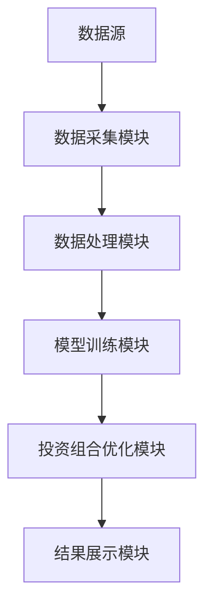
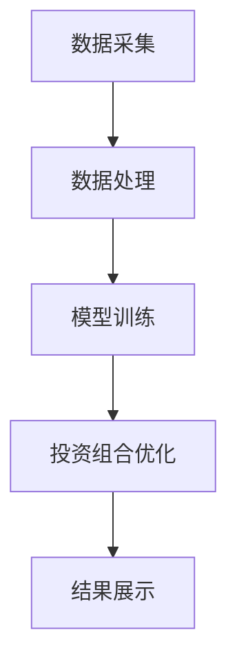

                 


# 约翰·伯格的指数投资策略遇上AI：效率的极致追求

> 关键词：指数投资策略，人工智能，机器学习，投资组合优化，量化投资

> 摘要：本文探讨了约翰·伯格的指数投资策略与人工智能技术的结合，分析了AI如何提升指数投资的效率和准确性。通过详细的技术分析和案例研究，本文展示了AI在投资组合优化、风险控制和市场预测中的应用，提出了结合两者的系统架构和算法设计，最终实现高效的投资策略。

---

## 第一章：指数投资策略的背景与核心概念

### 1.1 约翰·伯格与指数投资策略

#### 1.1.1 约翰·伯格的生平与投资理念
约翰·伯格是指数投资的倡导者，他提出的指数投资策略强调长期持有低成本的指数基金。伯格的投资理念基于市场的不可预测性和长期投资的稳定性，主张避免频繁交易和市场择时，从而降低交易成本和税务负担。

#### 1.1.2 指数投资策略的核心思想
指数投资策略的核心思想是通过投资市场指数（如标普500指数）来实现与市场同步增长，避免主动管理带来的高成本和低收益。伯格认为，长期来看，指数基金的平均收益会优于大多数主动管理型基金。

#### 1.1.3 指数投资策略的优缺点
- **优点**：分散风险、成本低、操作简单。
- **缺点**：缺乏灵活性，无法根据市场变化进行主动调整。

### 1.2 AI在金融领域的应用背景

#### 1.2.1 人工智能在金融领域的应用现状
人工智能技术在金融领域的应用日益广泛，尤其是在高频交易、风险评估、市场预测和客户画像等方面。AI通过处理海量数据，能够快速识别市场趋势和潜在风险。

#### 1.2.2 机器学习在投资分析中的作用
机器学习算法能够分析历史数据，发现传统方法难以察觉的模式和规律，从而为投资决策提供支持。例如，使用回归分析预测股票价格，或使用分类算法识别潜在的优质投资标的。

#### 1.2.3 AI在金融领域的未来发展趋势
随着计算能力的提升和数据量的增加，AI在金融领域的应用将更加深入，特别是在量化投资和风险管理方面。未来，AI将更多地应用于实时交易决策和个性化投资建议。

### 1.3 指数投资策略与AI的结合

#### 1.3.1 指数投资策略与AI的协同效应
通过结合指数投资策略和AI技术，可以在保持投资分散性的同时，利用AI优化投资组合和提高收益。

#### 1.3.2 AI如何优化指数投资策略
AI可以通过分析市场数据，优化指数基金的权重分配，降低组合风险。例如，使用聚类分析识别相关性较高的资产，并调整权重以降低波动性。

#### 1.3.3 指数投资策略与AI结合的案例分析
通过分析历史数据，AI可以优化指数基金的投资比例，从而在保持较低风险的同时，提高整体收益。

---

## 第二章：指数投资策略的核心算法与数学模型

### 2.1 指数投资策略的数学模型

#### 2.1.1 投资组合的数学表示
投资组合可以表示为一组资产的加权平均值，权重之和为1。数学公式如下：
$$ w_1x_1 + w_2x_2 + ... + w_nx_n $$
其中，$w_i$ 是资产 $i$ 的权重，$x_i$ 是资产 $i$ 的收益。

#### 2.1.2 风险与收益的数学关系
投资组合的预期收益与风险之间的关系可以通过现代投资组合理论（MPT）进行建模。MPT的目标是找到在给定风险水平下收益最大的组合，或者在给定收益下风险最小的组合。

#### 2.1.3 现代投资组合理论（MPT）的应用
MPT通过优化资产配置，实现风险和收益的最佳平衡。在指数投资中，MPT可以用于优化指数基金的权重分配。

### 2.2 AI算法在指数投资中的应用

#### 2.2.1 机器学习算法的基本原理
机器学习算法通过训练数据模型，识别数据中的模式和规律，从而进行预测和分类。

#### 2.2.2 常见的机器学习算法及其特点
- **线性回归**：用于预测连续型变量，如股票价格。
- **支持向量机（SVM）**：用于分类问题，如判断股票是否值得投资。
- **随机森林**：用于分类和回归问题，具有较强的鲁棒性。

#### 2.2.3 算法选择与优化的数学模型
选择合适的算法需要考虑数据的特征、问题类型以及计算资源。例如，对于时间序列数据，可能更适合使用ARIMA模型或LSTM网络。

---

## 第三章：系统架构与设计

### 3.1 系统架构设计

#### 3.1.1 系统模块划分
系统主要包括数据采集模块、数据处理模块、模型训练模块、投资组合优化模块和结果展示模块。

#### 3.1.2 数据流与系统交互
数据从外部源采集后，经过清洗和预处理，进入模型训练模块，生成优化的投资组合。

#### 3.1.3 系统架构的Mermaid图


### 3.2 数据处理与特征提取

#### 3.2.1 数据清洗与预处理
数据清洗包括处理缺失值、异常值和重复值。预处理包括标准化和归一化。

#### 3.2.2 特征选择与工程
特征选择通过筛选重要特征，减少维度，提高模型性能。特征工程则通过创建新特征，增强模型的表现。

#### 3.2.3 数据特征
特征包括历史收益率、波动率、相关系数等。

---

## 第四章：机器学习算法在指数投资中的应用

### 4.1 机器学习算法的选择与实现

#### 4.1.1 线性回归模型
线性回归用于预测股票价格，数学公式为：
$$ y = \beta_0 + \beta_1x + \epsilon $$
其中，$y$ 是预测目标，$x$ 是自变量，$\beta$ 是系数，$\epsilon$ 是误差项。

#### 4.1.2 支持向量机（SVM）模型
SVM用于分类问题，例如判断股票是否值得投资。

#### 4.1.3 随机森林模型
随机森林通过集成学习，提高模型的准确性和鲁棒性。

### 4.2 算法实现与优化

#### 4.2.1 Python代码实现
以下是线性回归的Python代码示例：
```python
import pandas as pd
import numpy as np
from sklearn.linear_model import LinearRegression

# 数据加载
data = pd.read_csv('data.csv')

# 特征和目标分离
X = data[['feature1', 'feature2']]
y = data['target']

# 模型训练
model = LinearRegression()
model.fit(X, y)

# 预测
predictions = model.predict(X)
```

#### 4.2.2 算法优化与调参
使用交叉验证和网格搜索优化模型参数，提高预测准确性。

---

## 第五章：系统架构与设计

### 5.1 系统架构设计

#### 5.1.1 系统模块划分
系统模块包括数据采集、数据处理、模型训练、投资组合优化和结果展示。

#### 5.1.2 系统架构图


### 5.2 接口设计与交互流程

#### 5.2.1 系统接口设计
系统接口包括数据接口和用户界面，数据接口用于获取市场数据，用户界面用于展示投资组合和交易指令。

#### 5.2.2 系统交互流程
用户输入投资目标，系统根据数据和模型生成优化的投资组合，用户查看结果并进行交易。

---

## 第六章：项目实战

### 6.1 项目环境配置

#### 6.1.1 安装必要的库
安装Python、Pandas、NumPy、Scikit-learn等库。

### 6.2 核心实现

#### 6.2.1 数据处理与特征提取
加载数据，清洗数据，提取特征。

#### 6.2.2 模型训练与优化
选择合适的算法，训练模型，优化参数。

#### 6.2.3 投资组合优化
根据模型输出，优化投资组合，生成交易指令。

### 6.3 项目小结

#### 6.3.1 实验结果分析
分析模型的准确性和投资组合的收益与风险。

#### 6.3.2 优化建议
根据实验结果，提出进一步优化的建议。

---

## 第七章：优化与扩展

### 7.1 模型优化与风险管理

#### 7.1.1 模型优化
使用更复杂的算法或集成学习方法，进一步提高模型的准确性。

#### 7.1.2 风险管理
引入风险控制机制，如止损和止盈，降低投资组合的风险。

### 7.2 系统扩展与应用

#### 7.2.1 动态再平衡
定期调整投资组合，以适应市场变化。

#### 7.2.2 多策略组合
结合多种投资策略，进一步提高收益和降低风险。

---

## 第八章：总结与展望

### 8.1 总结
本文探讨了约翰·伯格的指数投资策略与AI的结合，展示了AI在优化投资组合、提高收益和降低风险方面的潜力。

### 8.2 展望
未来，随着AI技术的不断发展，指数投资策略将更加智能化和个性化，为投资者带来更高的收益和更低的风险。

---

**关键词**：指数投资策略，人工智能，机器学习，投资组合优化，量化投资  
**摘要**：本文探讨了约翰·伯格的指数投资策略与人工智能技术的结合，分析了AI如何提升指数投资的效率和准确性。通过详细的技术分析和案例研究，本文展示了AI在投资组合优化、风险控制和市场预测中的应用，提出了结合两者的系统架构和算法设计，最终实现高效的投资策略。

